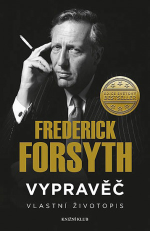
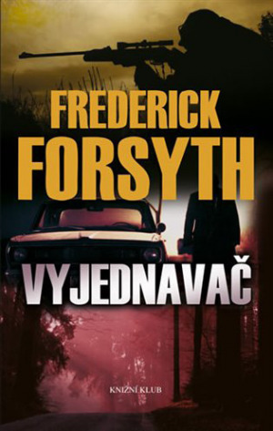
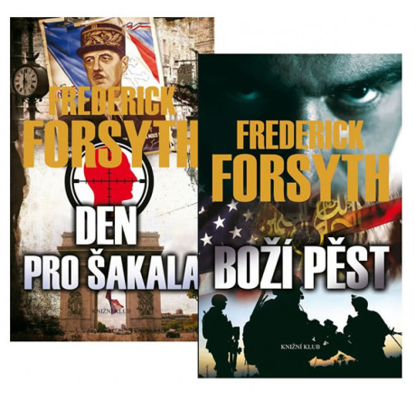

Jak lze již asi vytušit, nejedná se o Jarlaxla Baenre či Nicomo Coscu, ale o vojáky štěstěny, leckdy veterány druhé světové války, kteří se účastnili dekolonizačního procesu v Africe, ať už na té nebo oné straně, nezřídka na obou. Nicméně o jednom z nejúspěšnějších autorů bestsellerů lze napsat mnohem, mnohem víc, nejen nejčastěji citovanou část z jeho životopisu: „Během svého života jsem těsně unikl hněvu obchodníka se zbraněmi v Hamburku, za občanské války v Nigérii na mě střílel MiG a ocitl jsem se uprostřed krvavého převratu v Guineji-Bissau. Zatkla mě Stasi, postarali se o mě Izraelci, IRA mě přiměla ke spěšnému přesunu z Irska do Anglie a jistá přitažlivá agentka československé tajné policie – její počínání bylo zkrátka trochu intimnější. A to je jenom začátek...“ Opravdu začátek - mohl by zmínit ještě to, že v Paříži jej učily ruštinu princezny gruzínského rodu Diadiany, irský předseda vlády Charles Haughey, známý svými antibritskými postoji, se s ním objímal na zasedání vlády a vedl neformální jednání o zničení jaderného arzenálu Jihoafrické republiky před předáním moci Mandelovi.

V [sedmatřicátém Drakkaru](http://drakkar.sk/37/) vyšel, mimochodem velmi přínosný, Argonantův článek „Revize a kritika“, v němž se dočteme, tak jako i u jiných teoretiků literární tvorby, že autor by měl psát především o tom, co zná. Toto heslo naplňuje Forsyth dokonale. Většina jeho románů je o pracovnících zpravodajských služeb a sám byl řekněme externím spolupracovníkem Secret Intelligence Service, známé také jako MI6, britské zahraniční rozvědky. Svou roli kolegy Jamese Bonda popsal spolu s ostatními neméně zajímavými, byť známějšími, historkami ze svého života v knize _Vypravěč: vlastní životopis_.

Pokud se někdo, neznaje autorovy vypravěčské schopnosti, nad životopisem ušklíbl, udělal chybu. Nejen, že je zde osvětleno mnohé, co se promítá do jeho tvorby, ale jde i bez toho o historky nad jiné zajímavé a prokazující detailní porozumění pro lidskou duši, jehož nedostatek se Forsythovým knihám leckdy vyčítá, podle mého neoprávněně. Kniha začíná vzděláváním v Tonbridge, drsné chlapecké škole se silnou kriketovou tradicí náležející pod Eton (založena 1553), kde se zrodila nejen typicky anglická buldočí povaha, ale skrze pozorování Spitfireů startujících proti německým bombardérům též láska k létání. Přestože do kabiny této legendární druhoválečné stíhačky usedl až o mnoho desetiletí později, stal se nejmladším pilotem RAF na jiné stíhačce - jednomotorovém dvoutrupém stroji de Havilland Vampire. I v tom se odrážela obliba samoty, jež je podle jeho vlastních slov pro spisovatele během periody tvoření nezbytná. Psaní knih pak bylo pro Forsytha přirozeným vyústěním novinářské dráhy, na niž se dal proto, aby mu uhradila náklady na cestování po světě, jež chtěl od mala poznávat.

Mezitím stihl trávit části prázdnit ve Francii, konkrétně ve vesničce Lamaziere-Basse na západním úbočí Massive Central, kde definoval svůj vztah k Zemi galského kohouta, jež pro většinu Britů představuje tu část Evropy, která není nepřátelská. Zde by se nabízelo uvést, nechť si čtenář sám vybere, kam patří slovíčko „přímo“, ale zrovna Forsythův vztah k Francii, jež je určujícím snad pro všechny soudobé britské spisovatele, nebyl tak negativní jako třeba u Tolkiena. Několikrát taktéž vyměnil Francii za Německo, což mu stačilo na to, aby díky přirozenému talentu oba jazyky ovládl téměř jako rodilý mluvčí. Za studijního pobytu na Univerzitě v Granadě se pak v období krátkého mladického vzdoru stihl absolvovat kurz na toreadora, ale na rozdíl od Hemingwaye se tomuto tématu ve své tvorbě nevěnoval. Proti opravdovým býkům však nikdy nezápasil, neboť nedokázal zachovat dostatečný klid tváří v tvář útočícímu býkovi. Později však byl při obdobné konfrontaci s východoněmeckými pohraničníky úspěšnější, možná i díky tomuto cvičení. Ke zvířatům a přírodě vůbec však choval velkou úctu, jak vyplývá například z úžasné povídky Císař vyprávějící o lovu kapitálního marlina modrého, mečounovitou rybu zvanou též plachetník. Mimochodem, tato povídka je zároveň poctou knize Stařec a moře od výše uvedeného autora.

Po vojenské službě, v roce 1961 začal pracovat jako reportér pro agenturu Reuters a o čtyři roky později, když mu bylo 27 let, přešel do stáje BBC. Jednou z událostí, jež zpravodajsky pokrýval, byla série neúspěšných atentátů na prezidente Charlese de Gaulla, které připravovali Piedes noir (Černé nohy), bývalí důstojníci koloniální armády nespokojení s jeho politikou přiznání nezávislosti Alžíru. Důkladnost, s jakou zpracovával podklady pro tuto sérii reportáží, se stala základem pro jeho první plnohodnotný a nejslavnější román _Den pro Šakala_. Šakalem je neznámý nájemný vrah a jeho cílem nikdo jiný, než nejslavnější Francouz dvacátého století. Přestože se komisař Laval a spolu s ním i zbytek francouzského státního aparátu snaží odstřelovače najatého nespokojenými důstojníky, od nichž také unikla informace o připravovaném atentátu, zastavit, Šakal proniká stále blíž a blíž svému cíli, známému pohrdavým postojem k pokusům o násilné ukončení jeho života. Napětí a atmosféra, jež jsou od počátku, vlastně již od kultovní první věty: „V březnu v šest čtyřicet je v Paříži chladno a snad ještě chladněji, když má někdo zemřít před popravčí četou.“ na vysoké úrovni, se s přibývajícím dějem rozvíjejí a stupňují až do strhujícího finále, v němž záleží na každé vteřině a každém centimetru. Kniha vydaná v roce 1969 se již o 4 roky později šťastnou náhodou dočkala zdařilého zfilmování Fredem Zinnemanem s Edwardem Foxem a Michaelem Longsdalem v hlavních rolích. Zinneman letěl do Londýna se domluvit na zfilmování divadelní hry _Abélard a Heloisa_, avšak ta na poslední chvíli nebyla stažena z repertoáru a zoufalý producent mu předložil rukopis _Dne pro Šakala_. Slavný režisér nezaváhal. Naopak _Šakal_ Michaela Caton-Jonese z roku 1997 je pro mne nepříliš povedenou „vykrádačkou“ obou předloh, jíž nepomůže ani Bruce Willis. Za zmínku stojí, že kniha vyšla v Československu již v roce 1975, tedy v době, kdy Forsyth podle některých náznaků operoval proti zdejší rozvědce, jež na něj nasadila dokonce i labuť – půvabnou agentku s výcvikem v intimnostech.

Ještě předtím, než proměnil své poznatky z Francie v román o nejslavnějším literárním atentátníkovi, byl Forsyth redakcí vyslán do subsaharské Afriky, konkrétně do Nigerie, kde v červnu 1967 dlouhodobé neshody a problémy přiměly kmen Ibu (též Igbo) pod vedením charismatického a vzdělaného plukovníka Emeka Ojukwu vyhlásit samostatný stát Biafra. Přímé příčiny této revolty spočívaly ve vnitronigerijských etnických konfliktech a snaze federální vlády zbavit kmen Ibu vlivu nad ropnými nalezišti. Federální vláda s nemalou podporou Londýna ihned zahájila rázné ofenzivní operace s nemalým dopadem na civilní obyvatelstvo s cílem vzpouru urychleně ukončit. Forsyth byl jedním z mála reportérů, kteří se obtěžovali s tím, zajistit si pohled obou stran. Vypravil se přímo do Biafry a netvořil zprávy, tak jako většina ostatních, jen ze vzdáleného a pohodlného Lagosu. Snaha být „při tom“, psát o bojích přímo z bojiště, vedla k tomu, že byl Forsyth mnohými považován ze dalšího z řady žoldáků, jež se války na obou stranách účastnili. I přes maximální snahu o nestrannost nemohl Forsyth nezaznamenat, že britská politika je založena na informacích ovlivněných propagandou federální vlády, podle nichž nejrychlejší cestou k utrpení bylo rychlé vítězství Lagosu, což bylo ve zjevném rozporu s tím, co sám zaznamenával. Ostatně, oficiální nigerijské zdroje od počátku hlásaly, že vzpouru ukončí do dvou týdnů, trvala téměř půl třetího roku. Forsythovy reportáže napomohly získat pro Biafřany, ale též pro trpící nigerijské civilisty mezinárodní humanitární pomoc, avšak zároveň vedly ke ztrátě podpory londýnských redakcí. To ale nemohlo absolventem Tonbridge otřást a pokračoval jako reportér na volné noze. Rozchod s BBC byl poněkud dramatický a zahrnoval mj. vloupání do jeho bytu.

Z Biafry odletěl jedním z posledních letadel těsně před Vánoci 1969, ke zhroucení biaferského odporu došlo počátkem ledna 1970. V předchozím roce vydal (faktografickou) knížku Příběh Biafry, v té době byl rovněž kontaktován Secret Intelligence Service, jež na rozdíl od ministerstva zahraničí měla zájem o úplnější a přesnější zpravodajství, než poskytovalo lagoské ministerstvo informací. Tajná služba Jejího Veličenstva ale externí spolupracovníky nehonoruje a nezávislé články nevynášely mnoho peněz, neb většinu mediálního prostoru okupoval přeci jen závažnější konflikt ve Vietnamu. Forsyth se tak ocitl v Londýně, živý a zdravý, ačkoliv na jeho hlavu byla v Nigerii vypsána odměna, ale chudý, ba dokonce zadlužený. Proto za 35 dní v lednu a únoru 1970 napsal již zmíněný Den pro Šakala, přičemž Charles de Gaulle byl sice na penzi, ale stále živ. Napsat román se ukázalo jako ta snadnější část, prodat jej nakladatelům se ukázalo větším oříškem. Nebyl úspěšný až do září téhož roku, kdy náhodou potkal Harolda Harrise a vnutil mu stručnou synopsi své románové prvotiny. Štědrou smlouvu dostal, ale měla jeden háček – zněla na tři romány. Tak vznikl nejprve _Spis Odes­sa_, neb Har­ris byl židovského vyznání a tak dal přednost příběhu o lovu na bývalé nacisty a pak román _Žoldáci_.

Spis Odessa pojednává o s největší pravděpodobností fiktivní organizaci bývalých příslušník SS, kteří si pomáhají přežít v poválečném světě. Odborným konzultantem pro tuto knihu byl sám lord Russell z Liverpoolu britský žalobce v Norimberském procesu, a spolupráci neodmítl ani Simon Wiesenthal. Původně měl být ústřední postavou fiktivní esesácký vrah, ale nakonec nebyl důvod nevyužít skutečnou osobu, Řezníka z Rigy, hauptsturmführera Eduarda Roschmanna. Bývalých nacistů bylo tolik, že ti řadoví snad ani žádné zvláštní spolky nepotřebovaly. Postačila pasivita ve správnou chvíli a další vyšetřování uvízlo na mrtvém bodě. K této velmi impresivní knize, rovněž zfilmované, zbývá jen dodat, že ani postava Herr Taubera a její svědectví není, naneštěstí, fiktivní. I Spis Odesa byl zfilmován Ronaldem Nea­mem s Jonem Voigtem v hlavní roli, za zmínku však spíše stojí, že hudbu k němu složil Andrew Lloyd Weber. Film pak údajně přispěl k tomu, že byl Roschmann v Argentině odhalen, zatčen a na útěku zemřel na infarkt.

_Žoldáci_, v originále The Dogs of War, podle Shakespearových slov, vložených do úst duchu Julia Ceasara, pak zúročuje Forsythovy zkušenosti z Afriky tentokráte beletristickou formou. Ústřední zápletka je jednoduchá, ve fiktivní africké zemi je objeveno obří naleziště platiny, těžební společnost nechce platit současné vládě a tak si najme skupiny žoldáků, aby zajistili moc osobám s poněkud větší mírou porozumění. Převrat se uskuteční dle plánu, ale ukáže se, že někteří žoldáci mají vlastní agendu. A také svědomí. Této knize je leckdy vyčítána obsáhlá střední pasáž, která se do nejmenších podrobností zaobírá přípravou žoldáckého útoku. Ačkoliv je pravdou, že hlavní děj se oproti napínavému úvodu a veledramatickému závěru posouvá pomaleji, tak i popis logistické a taktické přípravy v podání Mistra vypravěče baví a udrží pozornost. Navíc má nesporné kouzlo pro všechny hráče her na hrdiny, kteří by si zvolili dobrodružství za doby studené války, ale mimo hlavní kolbiště. V minulosti měla kniha ještě jedno uplatnění. V roce 1975 ji použil Bob Denard při výcviku své jednotky žoldáků, jež mu pomohla získat Komorské ostrovy pod francouzskou kontrolu. O šest let později se o totéž pokusil Jihoafričan Mike Hoare na Seyschelách, ale neuspěl – na místo námořního výsadku zvolil vzdušnou cestu, což, jak Forsyth naznačuje, není pro daný účel vhodné, neboť námořní přeprava poskytuje čas a soukromí na důkladný výcvik a způsobuje menší dezorientaci, než seskok z nebe, který tak je vhodný jen pro ty nejlepší z nejlepších - elitní útvary řádných armád. Při své vrozené skromnosti Forsyth ale opomenul další podstatný detail – Seychely jsou součástí Britského společenství národů a proto se tam kniha Žoldáci prodávala stejně skvěle, jako ve všech ostatních státech Britského impéria, tudíž jí znali nejen útočníci, ale snad ještě lépe i obránci.

V lednu 1974 se pro nesouhlas s novou labouristickou vládou a zejména její daňovou politikou vydal do Španělska, a to i s manželkou, modelkou Carrie, jíž si vzal po krátké známosti předchozího roku na Gibraltaru, a později do Irska, kde byl jakožto autor _Dne pro Šakala_ požádán o zajištění bezpečnosti návštěvy Jana Pavla II. V Irsku se rovněž narodili oba jeho synové, ale zhoršující se bezpečnostní situace přiměla Forsythovy v roce 1980 k návratu do Londýna. V té době měl už na svém kontě další velmi úspěšný román _Ďáblova alternativa_, v němž se již dostal k tématu Studené války. Ještě předtím ale vydal sbírku povídek _Beze stop_ (obsahující již zmíněného Císaře) a krátký příběh z leteckého prostředí _Pastýř_, jež je vedle dokumentárního _Příběhu Biafry_ _a Fantoma Manhattanu_, pocty klasickému divadlu obecně a Fantomu Opery Gustava Lerouxe zvláště, jedním z mála výletů mimo špionážní svět, a jedinými delším než povídka. _Ďáblova alternativa_ přináší příběh o tom, jak akce ukrajinských separatistů namířená proti šéfovi KGB zkomplikuje situaci při probíhajících jednáních o odzbrojení. Situace dospěje ke zdánlivě neřešitelnému patu, vyhovět teroristům znamená třetí světovou válku, nevyhovět jim pak ekologickou katastrofu pro celou západní Evropu. V takovém případě zbývá jen jediná alternativa, ta ďáblova.

V roce 1984 se Forsyth vrátil k tématu hrozícího jaderného konfliktu v románu _Čtvrtý protokol_, jež se věnuje hrozbě použití kufříkové atomové bomby proti Londýnu s cílem posílit protiválečné hnutí a umožnit radikálnímu, tehdy prosovětskému, křídlu labouristů vyhrát volby. K tomu se připojuje otázka pátrání po posledním členovi tzv. Cambridgeské pětky, skupiny intelektuálů, jež před druhou světovou válkou zlákaly ideologické důvody pro spolupráci se Sovětským svazem, z nichž nejznámějším byl Kim Philby. Na pozadí tohoto příběhu se rozehrává neskutečně mnohovrstevnatá mocenská hra, v níž vyniká nenápadný sir Nigel Irvine, šéf britské rozvědky. Filmové zpracování této knihy stojí za zmínku především proto, že v roli agenta KGB vystupuje Pierce Brosnan, budoucí James Bond. Podobné téma má i _Vyjednavač_ z roku 1989, kdy skupina amerických zbrojařských magnátů připraví plán, jež má zmařit uzavření nové odzbrojovací dohody a jako návdavek vést ke konfliktu, jež by umožnil Spojeným státům ovládnout ropná pole na Středním Východě. Únos prezidentova syna skončí jeho vraždou provedenou zjevně sovětským zařízením. Vyjednavač, bývalý Zelený baret Quinn, se tak ocitá na seznamu podezřelých a prchaje před rozvědkami Západu i Východu musí odhalit skutečného vraha dříve, než svět dospěje k dalšímu krvavému konfliktu. To znamená vyslechnout některého z žoldáků najatých na tuto špinavou práci, jenže najít někoho z únosců živého se ukáže prakticky nemožným. Forsyth se tak loučí s tímto drsným, leč vzrušujícím světem, který i v reálném světě pozvolna zanikl, aby uvolnil místo neméně krvavému, ale především gentlemanství prostému věku žoldáků postsovětských.

Během psaní _Vyjednavače_ se Forsythovi rozpadlo manželství, sice v přátelském duchu, ale jeden negativní následek to přesto mělo, v důsledku toho klesla stratifikace jeho majetkových investic. Na to doplatil vzápětí, kdy zbankrotovala společnost spravující všechny jeho zbývající investice. Výsledkem byla kniha _Mistr klamu_, jež současně vznikala jako scénář pro televizní minisérii, o Samu McCreadym, šéfovi oddělení SIS pro dezinformace a psychologickou válku. První příběh z tohoto cyklu vypráví o sice náročné, ale v zásadě klasické operaci na převoz dokumentů z Východního Německa. Takovou operaci Forsyth ve prospěch SIS nejméně jednou osobně podnikl, i když na rozdíl od McCreadyho při ní nemusel nikoho zabít. Už druhá kapitola ale nabírá vyšších obrátek, neboť sovětské vojenské rozvědce GRU, schopnější, méně nápadné sestřence KGB, se podaří zasít nedůvěru mezi britské a americké zpravodajské služby. Následuje další, potenciálně autobiografická povídka, kdy se spisovatel shánějící informace o obchodních se zbraněmi vydává za potenciálního kupce libyjského kontrabandu. S jeho pomocí Královští člunaři (SBS, Special Boat Service, námořní obdoba slovutné Special Air Service) najdou a zajistí tu správnou loď vezoucí smrtící náklad do Irska. V posledním příběhu se musí McCready angažovat v procesu osamostatňování fiktivního karibského ostrůvku Barclay, o něž mají zájem dva bohatí političtí kandidáti – drogový kartel a kubánská tajná služba. Přestože Sam ve všech případech přímo vzorně uspěl, je v rámci opojení koncem Studené války propuštěn a odchází na odpočinek.

_Boží pěst_ se pak stává přechodem mezi érou Studené války a problémy postbipolárního světa. Předtím, než může proběhnout operace Pouštní bouře, musí být zlikvidován irácký arzenál zbraní hromadného ničení a zejména superdělo schopné využít suborbitálních drah k ostřelování jakýchkoliv cílů na Středním východě jadernými a možná i jinými zbraněmi. Ačkoliv patří _Boží pěst_ mezi nejdelší Forsythovy romány, jen dva roky po ní (v roce 1996) následovala _Ikona_. V ní se Forsythovo umění rozvinulo naplno a podle mého představuje absolutně nejlepší špionážní román a dost možná nejlepší jednosvazkovou (to aby se vešla vedle Pána prstenů) beletrii vůbec. Děj je zasazen do postsovětského Ruska, v němž se schyluje k volbám, jejichž favoritem je Igor Komarov, oblíbený politik slibující efektivní řešení problémů a lepší život pro všechny. Jako splátka za pivo věnované britskými vojáky neznámému kolegovi z Rudé Armády v roce 1945 se dostane Londýnu do rukou skutečný, přísně utajovaný, Komarovův politický program. A ten je děsivý. Zahrnuje monopolizaci politické moci, ovládnutí klíčových průmyslových podniků a znovuobnovení vlivu Moskvy v bývalých sovětských republikách a nejen v nich. Jestli je Vám to povědomé, tak vězte, že Komarov podle románu vstoupil na scénu v roce 1999, ve skutečném světě se tehdy stal premiérem Ruské federace jiný bývalý agent KGB, Vladimir Putin. Žel, sir Nigel Irvine je jen fiktivní postava a právě on rozehraje složitou hru, na jejímž konci je v Rusku opravdu lépe, ale bez páně Komarova.

Někteří _Ikoně_ vyčítají, že je závěr poněkud přemrštěný a ano, reinstalace cara se takovým může jevit, avšak v podmínkách, jak jsou na úvod Ikony podrobně popsány, dává takový postup smysl. Navíc, chcete-li věrohodně vyřešit vnitřní problémy Ruska, tak obvyklejší či umírněnější řešení nebudou fungovat, a to ani v románových rozměrech. Ke špionážním románům pak hra o vysoké sázky prostě patří. S Forsythem snese srovnání jen málo z těch nejlepších autorů thrillerů. Řemeslně nejblíže je mu Ken Follet, jenže ten utekl do prostředí historické fikce, s níž ostatně celou dobu koketoval. John le Carré má stejně jako Forsyth zkušenosti s prací tajných služeb, nebo to alespoň tvrdí, ale přes nezřídka výborné nápady Forsythových kvalit nedosahuje i proto, že se snaží svým románům dodat psychologický rozměr, což působí uměle a nedůvěryhodně. Agent, který by uprostřed přestřelky zvažoval vztah obecné a speciální morálky by zemřel. Zbývají tedy Američané, Robert Ludlum a Tom Clancy, oba na rozdíl od britských kolegů, již mrtví a stejně postižení i tím, že jejich jméno se stalo literární firmou. A shodně dopadnou i při srovnání uměřenosti. Tak namátkou Ludlum nechá unést papeže (_Cesta do Gandolfa_) či zbudovat kulisy Washingtonu pro šíleného ministra zahraničí ve snaze odvrátit jadernou válku (_Mozaika Parsifal_ – mimochodem, hlavní hrdinové pocházejí z Československa). Clancy proti tomu odpálí atomovou bombu na finále Superbowl v Denveru (_Nejhorší obavy_) a rozpoutá v devadesátých letech válku mezi Japonskem a Spojenými státy (_Čestný dluh_). Proti tomu je návrat potomka dynastie Romanovců vcelku uvěřitelný.

Po _Ikoně_ následovala sbírka delších povídek _Kvintet_, jež v papírové podobě vyšla dříve v češtině než v angličtině, romány _Mstitel, Afghánec, Kobra_ a _Seznam smrti_. A je ohlášen ještě další román, s pracovním názvem _Liška_. _Mstitel_ je druhou nejvýše oceňovanou Forsythovou knihou, nejen kvůli výborně napsanému hlavnímu hrdinovi Calvinu Dexterovi, ale především přímo geniální, byť v důsledku děsivou pointou. Ke cti mu slouží též nenásilné, ale o to uvěřitelnější a působivější upozorňování na hrůzy války. Oba dva špičkové romány by měly nést důrazné varování ministerstva zdravotnictví ohledně negativních dopadů na lidský spánek. V _Afghánci_ se vrací oblíbená dvojice Mikea a Terryho Martinových, jež zastavovala Hussajnovu Boží pěst, ale ani to nepomůže tomu, aby se vyrovnal špičkové kvalitě svých předchůdců, ovšem přeměna použití tankeru na zkapalněný zemní plyn jakožto základu pro obří palivo-vzduchovou bombu si uznání zaslouží. _Kobra_ se věnuje problematice pašování drog do Spojených států a Evropské unie, pročež se nevyhne srovnání s Clancyho Jasným nebezpečím. Nejděsivějším závěrem je pak skutečnost, že ani 11 let, jež odděluje tyto knihy, nezměnilo nic na naléhavosti tohoto problému. Obě dvě knihy se zdají naznačovat přeci jen slábnoucí schopnosti Mistra vypravěče, Kobra patrně více, přesto je i ona nadprůměrným thrillerem. _Seznam smrti_ dává na tyto obavy z větší části zapomenout, je sice přímočařejší, než nejlepší Forsythova díla, ale určitá surovost jen podtrhává vyznění celého příběhu. Chronologicky pak následuje Vypravěč, v němž není po jakékoliv autorské slabosti ani stopy, což ostatně komplikovalo i přípravu tohoto článku, neboť místo rychlého ověření některých faktů jsem se do knížky opakovaně začítal, ač jí mám již nejednou přečtenou.

Na stylu Mistra vypravěče je poznat, že byl nejprve novinářem nejlepšího britského ražení, jehož heslem bylo: „Novinář by se nikdy neměl přidat k establishmentu, ať jsou svody sebelákavější. Naším úkolem je volat mocné k zodpovědnosti, ne se s nimi spolčovat. Ve světě, který je stále posedlejší vlivem, penězi a slávou, musí žurnalista a spisovatel zachovávat odstup.“ O jeho ryzím charakteru nejlépe svědčí to, že v době, kdy britskou vládu ostře kritizoval pro nevhodný postoj k biaferské otázce, zároveň souhlasil s bezplatnou službou ve prospěch SIS často zahrnující situace, při nichž byl ohrožen na životě. Všechny jeho romány se vyznačují až pedantickou znalostí veškerých detailů, pro řádnou přípravu neváhal navštívit válkou zmítané Mogadišo, což byl jediný případ, kdy vzhledem k pokročilému věku pětasedmdesáti let využil služeb osobního srážce, pár let předtím navštívil Guineu-Bissau sám. Přesná znalost faktů se pak stala základem pro vyprávění napínavých příběhů zahrnujících uvěřitelné postavy na obou, přesněji však všech, stranách konfliktu vedoucích k úžasně vystavěným pointám, u nichž překvapení je jen jednou z mnoha vyvolaných emocí. Na rozdíl od Clancyho, jehož stěžejní dílo lze chápat jako kapitoly ze života Jacka Ryana, jež začíná jako syn jednoho z detektivů vyšetřujících vraždy drogových dealerů v románu Bez výčitek až po prezidenta Spojených států během války činy s Ruskem v _Medvědu a drakovi_, a ještě později jako otce hlavního hrdiny další románové série jiných autorů, má Forsyth více různých hlavních hrdinů, s odlišnými charaktery i osudy. Z nich nejzapamatováníhodnější je sir Nigel Irvine, šéf SIS a nejschopnější hráč této hry, jaký kdy spatřil stránky knih. Kdyby Británie měla blanický pantheon literárních hrdinů připravených vyrazit na pomoc v časech nejvyšší nouze, tak tento pán bude stratégem týmu zahrnujícího Robina Hooda, Jamese Bonda, Bigglese či Hermionu Grangerovou – velitelem by byl nejspíš sir Winston Churchill v podobě, v jaké vystupuje ve svých vlastních knihách. Forsythův svět je na jednu stranu drsný svět, v němž vítězí jen ti nejschopnější a smrt může potkat kohokoliv, na stranu druhou dobro vítězí v příjemně optimistickém množství případů.

Na závěr nelze nalézt nic lepšího, než samotná slova Mistra vypravěče ze závěru úvodu jeho životopisu:

> „Můj život byl požehnán mimořádným štěstím, pro které nemám vysvětlení. Vícekrát, než dokážu spočítat, mě příznivá náhoda dostala z ošemetné situace nebo mi zajistila výhodu. Na rozdíl od reptalů ve všech nedělních bulvárních plátcích jsem měl dva báječné rodiče a prožil jsem v kentských polích spokojené dětství. Splnil jsem si své rané sny o létání a cestování i ten pozdější o psaní. Díky tomu jsem získal dostatek materiálních prostředků k pohodlnému životu, přičemž jsem vlastně nikdy nic jiného nechtěl.
>
> Měl jsem dvě krásné manželky, vychoval dva dobré syny a těším se pevnému zdraví. Za toto vše jsem hluboce vděčný, třebaže nevím přesně, jakému osudu, štěstěně nebo božstvu. Asi bych se měl rozhodnout. Koneckonců, možná se s Ním brzy setkám.“
