Je ale třeba si uvědomit, že to bylo trochu složitější, než tato perspektiva nekonečného růstu. Římské umění stavět z malty a kamene už bylo vyspělé na samém počátku a dorazilo k nám až po té, co mělo za sebou stovky let vývoje. Soudruzi křesťané na Západě došli podstatně dál, a Češi je teprve někdy ve 12. století začali velmi opatrně dohánět.

Je dobré znát některé tyto významnější evropské stavby, zvláště pro případ, že potřebujete dát svému terénu trochu vzletu a potřebujete podstatně složitější struktury, než jsme viděli doposud.

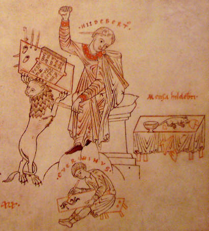

## VI. Svatý Jakub v Regensburgu

Pokud se rozhodnete vyrazit do světa v Argonantových stopách, potom je bavorské město Regensburg výhodný cíl. Představovalo centrum naší sousední země a v době vikingských nájezdů se tu dokonce ukrývalo sídlo celé Svaté říše. Navíc se městu nějakým divem vyhnulo druhoválečné bombardování. Takže je tu staveb v původním stavu celá řada – kamenný románský most, katedrála a hned několik dalších románských chrámů.

Nás bude ale nejvíce zajímat svatý Jakub, „skotský kostel“ čili [„Schottenkirche“](https://de.wikipedia.org/wiki/St._Jakob_(Regensburg)). Na iroskotské mise narazí asi každý, kdo nahlédne do staršího středověku. V Irsku a ve Skotsku totiž přežila zkázu římské říše velmi svébytná křesťanská kultura. Ta dorazila díky svatému Patrikovi v 5. století neuvěřitelnou zeměpisnou oklikou z Egypta přes Lerinské ostrovy na jihu Francie až do Irska, kde stačila ještě pobrat zbytky kultury Keltů. Překvapivě se rozšířila o něco dříve a rychleji v těch místech britských ostrovů, kam Římané nedorazili. Pád Říma se jí proto nijak nedotkl. Mezi 5. a 8. stoletím, kdy v Evropě všeobecně zarůstaly dávné římské silnice, města se rozpadala a civilizaci ničily nejrůznější nájezdy, to v Irsku a Skotsku naopak docela kvetlo. Místní mniši vytvářeli první typicky středověké kodexy, třeba slavnou [Knihu z Kellsu](https://en.wikipedia.org/wiki/Book_of_Kells). Z těchto výtvorů pochází výtvarný styl se spoustou zvířat, svatých mužů a zubatých ornamentů, který se zdánlivě bez souvislosti zjevuje i na našich nejstarších románských knihách. Třeba na [Strahovském evangeliáři](https://www.lidovky.cz/relax/zajimavosti/strahovska-knihovna-ma-kopii-vzacneho-evangeliare.A120328_163347_ln-zajimavosti_glu). Takových knih se u nás dochovalo několik. Zcela jistě se na nich vyučil i Hildebertus se svým pomocníkem, kterého při práci ukazuje proslulý [soudobý výjev](https://cs.wikipedia.org/wiki/Hildebert_a_Everwin). A nejen to, knižní výzdoba byla nedílně propojena i s výzdobou chrámů; to, co bylo možné malovat do knih, to se mohlo zjevit i na stěně chrámu, či dokonce jako kamenný reliéf. Argonantus jakožto písař knih a stavitel je tedy přímým pokračovatelem těchto iroskotských misionářů, kteří přinesli civilizaci do našeho okolí.

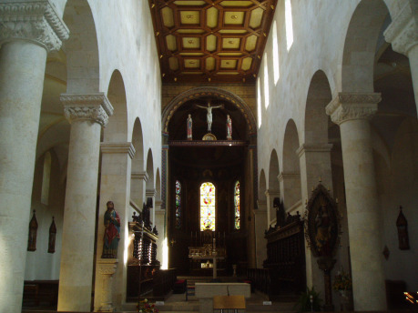

Kostel svatého Jakuba je trochu anachronismus, protože v Argonantově době 12. století se už svébytné umění iroskotů dávno rozpustilo v mnoha novějších vlivech. Přesto tu skotský ritus z nějakých důvodů stále fungoval a na vzhledu chrámu je to jasně patrné. To, co tu dnes spatříme, je Argonantovo 12. století v nejvyšším lesku.

Na první pohled je kostel svatého Jakuba podobnou stavbou, jako náš svatý Jiří. Oba jsou trojlodní baziliky s rovným trámovým stropem, se dvěma věžemi a trojitým samostatným chórem. Nenechme se mýlit tím, že na podobnou konstrukci narážíme podruhé v seriálu; sice to byl v Argonantově době běžný typ velkého chrámu, ale dnes se jich v takto solidním stavu dochovalo povážlivě málo. Pozornější pohled ukáže, že náš svatý Jiří je přece jen výtvor začínající civilizace, kdežto svatý Jakub je o dílo mnohem rozvinutějšího Západu. Kontrast, na který tak či onak naráží během života každý z nás.

Nejdrastičtěji je to patrné u hlavního vchodu, kde je k vidění původní kamenná výzdoba, dnes uctivě zakrytá do skleněného obalu. Něco takového v Čechách prostě neexistovalo. První známé sochy, daleko skromnější, souvisí se stavbou kostela v Záboří a vznikly po roce 1143. Ještě slavnější příklad je kostel svatého Jakuba v Jakubu u Kutné Hory.

Sochy na portále u Jakuba v Regensburgu nejsou starší než naše, ale rozsah a celkový plán je pro českého soudobého stavitele neuvěřitelný. Jako když vezmete úplně všechny známé románské české sochy a dáte je na jediné místo.

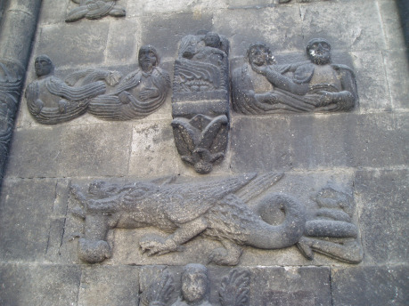

Pro Argonanta je tento chrám jeden z podstatných bodů, kam míří vývoj jeho postavy. Místo, kde se naučil otesávat kameny, nejjednodušší základ řemesla. A místo, kde také poprvé viděl, jak se vytvářejí sochy na chrámy a že nejsou jen samoúčelnou ozdobou, ale je to _kamenný jazyk mistrů_, který tomu všemu dává skrytý smysl. Objevuje, že středověká architektura chrámů se vlastně dá číst jako písmena. A věřím, že to může být objev i pro leckoho z vás; o tom se totiž ve škole neučí. Nejsou to jen tak sochy, umístěné na parádu, ale spousty analogií, vztahy mezi Písmem a Vesmírem, výraz přesvědčení, že __věci nejenom existují, ale také mají svůj smysl.__ Protože pokud je svět stvořen, potom se za tím vším musí skrývat systém a božský plán.

Lze tu poukázat na prvky úplně základní, patrné snad u všech složitějších výzdob. Vchod obestupují dvě části, levá a pravá, připomínající mohutné pilíře. Sloupy Jakin a Boaz, jak je popisuje mnohem pozdější zednářské učení; stály už v čele starověkého Šalamounova chrámu, a vlastně šlo o odvozeninu staroegyptských obelisků, které byly také dva. Tato polarita umožňuje odkazovat na Dobro a Zlo, Peklo a Ráj, případně Hříchy a Ctnosti.

Jiný rozšířený nápad je horizontální členění stěny do tří zón nad sebou. Zdeněk Horský, který mi to kdysi prozradil ve své převratné práci o Staroměstské mostecké věži, je nazývá odzdola zónou Měsíce, Slunce a Hvězd, protože to rozplétal od astronomické roviny výkladu. V zónách Měsíce najdeme obvykle ta nejzajímavější tajemství; týkají se noci, ženy, Panny Marie, pozemního života, měsíčních znamení a tedy i polních prací v příslušné části roku. V našem případě je v této zóně na svatém Jakubu k vidění ten drak, který Argonanta tolik zaujal.

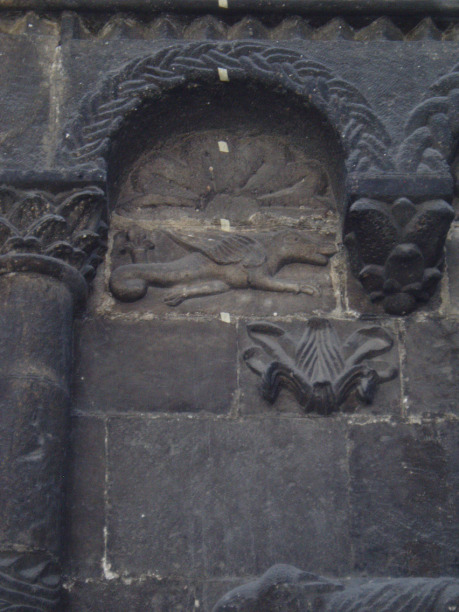

V zóně Sluneční bývají Králové, svět nebes. Je to zóna moci, nejvyššího lesku a slávy. Typicky tu také bývá světec, který má být chrámem oslaven, i sám Ježíš Kristus, často mezi čtyřmi evangelisty nebo apokalyptickými bytostmi.

Zóna Hvězd pak bývá věnována věčnosti, duši obecně a Svatému Duchu. V daném případě lze konstatovat, že je ve svatém Jakubu zjevně nedokončená; i zde se měly nejvyšší sloupky mezi výklenky proměnit v malé sochy.

Význam nesly i samotné výklenky a jejich počty. U svatého Jakuba je jich směrem vzhůru 3, 4, 5 na obou stranách, celkem přesně 24, číslo zjevně nenáhodné. Na portálech běžně nacházíme podobná čísla s odkazy na Písmo, jako 3, 7, 12, 36, 40, 60 nebo 72.

Bez povšimnutí bychom neměli nechat ani samotný portál, tvořící ustupující a zmenšující se oblouky, a u každého stupně symbolicky podepřený dvojicí zdobených sloupů se sochami. Úplně uprostřed všeho, na tympanonu, kde se s výzdobou obvykle začíná, je k vidění Svatá Trojice, jeden z nejoblíbenějších motivů. V našich malých českých poměrech musíme většinou vystačit i s tím samotným portálem, jak jsme viděli minule na ukázce z Poříčí nad Sázavou, složitější struktury po stranách v době románské ještě zcela chybí.

## VII. Svatý Philibert v Tournusu

V neplánovaném exkursu do [katedrály Notre Dame v Paříži](http://drakkar.sk/72/), kterou vyvolal požár, bylo vysvětleno, proč se stavitelé chrámů nejméně od 11. století pokoušeli nahradit rovný dřevěný strop kamennou klenbou. Narazili při tom na hromadu technických problémů, které řešili během sta let před příchodem prvních katedrál.

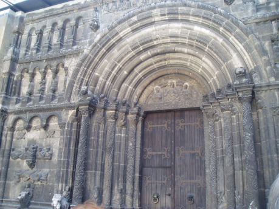

První a nejjednodušší nápad byl udělat zaklenutí hlavní lodi jako dlouhý půlkulatý tunel, valenou klenbou, převzatou z toho římského dědictví. Řadu podobných můžete objevit třeba v římském [Koloseu](https://www.smithsonianmag.com/history/secrets-of-the-colosseum-75827047/). To fungovalo výtečně u nejrůznějších dlouhých chodeb, kterými mohl projíždět třeba vůz s koňmi. Jenomže u velkého chrámu je potřeba ještě podstatně větší šířka prostoru a tato konstrukce vyvolává velikánské tlaky do stran. Další pokusy o zvětšování chrámu to dále zhoršují. Bylo by nutné se smířit s tím, že chrámy s valenou klenbou nepřesáhnou asi deset metrů šířky a nikdy nedosáhnou rozměrů těch trámových.

Druhý problém představují okna. Už o tom byla řeč u svatého Jiří. Půlválcovitá valená klenba tlačí rovnoměrně ve všech bodech boční stěny a je podstatně těžší, než trámy. Pokud do zdi pod klenbou uděláme větší otvor, snadno se to celé zhroutí. Podobná konstrukce znamená smířit se s tím, že chrám bude mít jen hodně malá bazilikální okna a velký prostor bude poněkud temný. Opět je na tom starší trámový systém lépe.

Svatý Philibert v Tournusu je ojedinělý chrám, kde to stavitel udělal obráceně, než bychom očekávali; zaklenul chrám řadou kolmých valených kleneb, jako kdyby postavil na stropě chrámu most. Vyřešil tím jak boční tlaky, které se vyruší sousedními oblouky, tak vlastně i okna, jejichž zvětšování tu nic nebrání. Výsledný interiér působí [naprosto fantasticky](https://www.patrimoine-histoire.fr/Patrimoine/Tournus/Tournus-Saint-Philibert.htm). Je to jedna z těch mnoha románských památek, pro kterou ve střední Evropě nemáme žádné srovnání; nepochopitelné je stáří, rozměry chrámu i řemeslná čistota provedení.

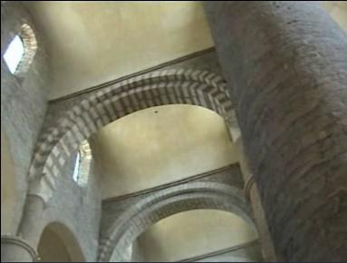

Neméně ohromující je i přísně pevnostní vzhled stavby zvenku. Tady je úplně zjevné, že klášter bylo možno bránit; vznikl tu pro nás překvapivý hybrid hradu a kláštera. Vzhledem ke stáří objektu jsou pro nás překvapením i kulaté věže, protože v 11. století u nás vlastně ještě žádné kamenné hrady neexistovaly.

Pokud se do tohoto úžasného místa někdy dostanete, určitě vystupte na románskou emporu. Je to vzácná příležitost, protože naprostá většina empor v jiných chrámech jsou nepřístupné. A také zajděte do dechberoucí krypty, kde najdete navíc i parádní studnu.

A konečně projděte i postranní stavby, kde jsou zbytky rajského dvora a kapitulní síně, nyní turistická prodejna. Na podlaze je pozoruhodný zvěrokruh, který odkazuje na souvislost polních prací a astrologických znamení. A možná i dalších cyklických procesů, o kterých vypráví mytologie. Tedy _kamenný jazyk mistrů_ v nejvyšším lesku, a to v hodně dávné době, nejspíš počátku 12. století. Někdy, kdy se Argonantus narodil a kdy v Čechách jasně převažovaly ještě ty časné misionářské chrámy, které jsme zkoumali minule.

Jako případný terén pro vypravěče jakéhokoli druhu je svatý Philibert k nezaplacení. Zjistíte nejspíše, že se v tomto neuvěřitelném dungeonu prostě musí odehrát nějaké dobrodružství. Pokud potřebujete další obrázky a plánky, najdete je třeba [zde](http://www.bourgogneromane.com/edifices/tournus.htm).

## VIII. Notre Dame v Beaune

Tento kostel nemá statut katedrály, protože tu biskup nikdy nesídlil. A asi by ho překonávaly mnohé jiné skvosty v Burgundsku, třeba podobná, větší a slavnější katedrála v [Autun](http://www.bourgogneromane.com/edifices/autun.htm). Nicméně víme, že kostel v Beaune navštívil Argonantus zřejmě i vícekrát. A pro českého návštěvníka jde opět o dost velkolepou stavbu, vzhledem ke stáří a provedení.

Kdyby Hildegarda ze [Ztracených žen](http://drakkar.sk/60/) ráčila zamířit svůj pohled vzhůru, všimla by si možná, že [kostel v Beaune](http://www.bourgogneromane.com/edifices/beaune.htm) představuje úplně jiné, specificky burgundské řešení problémů s klenbou. Jde sice o jednoduchou valenou klenbu, ale s lomeným obloukem, takže to přece jen velikost tlaků do stran vylepšuje. Interiér je díky popsaným potížím vybaven dost malými okny a poměrně temný. Přesně takto vypadá v okolí více chrámů, včetně toho úplně nejslavnějšího ve své době, Cluny. Tam dosáhla výška klenby úctyhodných 28 metrů a rozpětí bylo na samé hranici technických možností, takže to také v jedné fázi stavby spadlo a muselo se opravovat.

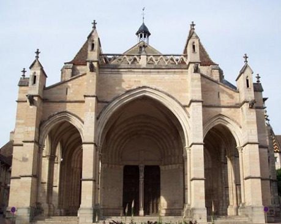

Hodně pěkný prvek je __centrální kupole__, místo, kde se protíná křížová loď s lodí hlavní. Křížové lodi neboli __transepty__ mívaly chrámy už v dobách dávných římských bazilik, i když byly jen naznačené a obvykle u konce stavby, která tím shora získala tvar T. Nápad nikdy úplně nezmizel, a vedle podélných chrámů, vzniklých z baziliky, existovaly po celou dobu i chrámy přísně centrální, odvozené od velkolepého římského [Pantheonu](https://cs.wikipedia.org/wiki/Pantheon). Jiný jejich slavný pravzor je [Hagia Sofia](https://cs.wikipedia.org/wiki/Hagia_Sofia), pro středověký svět nedostižný div stavební techniky.

Křížením dvou podélných chrámů vzniká centrální prvek nevyhnutelně také, a odtud je už jen krok k tomu, aby bylo toto úplně centrální pole chrámu zvláště zdůrazněno. Chrám v Beaune ukazuje, že se tak dělo už v románské době, a to dost velkolepým způsobem. Věž nad kupolí je vlastně jedinou věží kostela, a zároveň úplně nejvyšší stavbou v celém Beaune, orientační bod, který vás zdálky snadno upoutá.

Myšlenka hlavní a největší věže nad křížením přežila ještě hodně dlouho. Oblíbená je třeba u anglických katedrál. V [Salisbury](https://cs.wikipedia.org/wiki/Salisbury) vznikla ve 13. století podobná věž, která byla v té době úplně nejvyšší na světě. V [Beauvais](https://en.wikipedia.org/wiki/Beauvais_Cathedral), kde měla vzniknout nejvyšší katedrála ze všech, plánovali věž ještě větší, nicméně jim to při stavbě spadlo a chrám je dodnes nedokončený. Ukázalo se, že podobná konstrukce naráží na samotné hranice soudržnosti stavby z kamenných bloků a je u takových kolosálních rozměrů nebezpečná. Tento efekt si ostatně může každý vyzkoušet s kostkami lega – v malém to drží perfektně, ale s metrovou věží už je problém. Objev tohoto principu vedl k tomu, že většina gotických katedrál věž nad centrálním křížením postrádá a spokojí se s méně dramatickým zdůrazněním středu, třeba pomocí diamantové klenby. To už ale zabíháme zcela mimo Argonantovu dobu 12. století.

Kromě klenby stojí za povšimnutí i chrámová předsíň čili __nartex__, objekt předsunutý celému chrámu a v našich krajích se prakticky nevyskytující. V Burgundsku je oddělený do té míry, že za věžemi při pohledu zboku vidíte překvapivou mezeru; je to prakticky úplně samostatná stavba před chrámem. Nartex může být otevřený, jako je tomu právě v Beaune, jakési kryté pokračování náměstí, nebo může mít stěny kolem dokola a tím fakticky prodlužuje loď.

Stáří této stavby je podobné jako svatého Philiberta; vznikala někdy kolem roku 1130. V poměrech Burgundska představuje typický chrám ve větším městě, srovnatelném například s Prahou nebo s Regensburgem, u nás srovnatelný protějšek ve své době opět nemá žádný.

Mimo Burgundsko se tento pro nás zvláštní typ kostela rozšířil ještě v Portugalsku. Koho by mátla podivná geografie šíření, pak je vysvětlením to, že první vládci Portugalska na přelomu 11. a 12. století byli z Burgundska.

Co neuvidíme z chrámu vůbec, to jsou opravdu fantastické vinné sklepy, které začaly vznikat právě v souvislosti se stavbou chrámu ve 12. století a šířily se dál a dál. Ten úplně nejpůvodnější a nejkrásnější má vinařství [Jaffelin](https://www.maisonjaffelin.com/), kam vás vezmou v rámci prohlídky, a ještě vám k tomu nabídnou víno. Nejkolosálnější je potom z jiné strany navazující sklep firmy [Patriarche Pere et fils](https://www.patriarche.com/), který nepochybně vzbudí značnou pozornost milovníka dungeonů.

## IX. Fontenay

Katedrála je výtvor, patřící zejména k městu a do městské zástavby. V Argonantově době začínalo obojí; města i katedrály, a oboje spíš v daleké Francii, kde byla civilizace vyspělejší než někde ve střední Evropě. U nás byly k vidění jen daleko skromnější ukázky stejného vývoje.

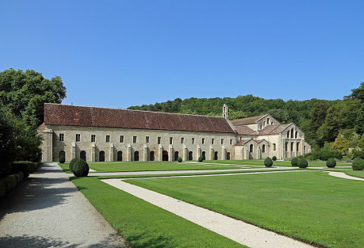

Před katedrálami a městy předcházely kláš­tery. Přesněji řečeno, soustavy klášterů. Doby průkopnických iroskotských misí, kdy kláš­ter představoval osamělý ostrov v lesních pustinách, už byly dávná minulost. Románský věk 12. století je dobou, kdy se se kláštery propojovaly. Na podobných principech jako dnes franšízy na způsob McDonaldu. Mniši z velkého mateřského kláštera založili další kláštery odvozené, které s tím původním spolupracovaly. Tak se z původních izolovaných misí stávaly stále složitější a rozvětvenější systémy; a v případě Burgundska přímo monstra. Na velmi malém prostoru, nedaleko od sebe, tu působila zřejmě tři vůbec největší ústřední sídla mnichů tehdejší Evropy.

Opravdu nejgigantičtější z nich bylo Cluny, které vládlo více než tisícovce benediktinských klášterů po celé Evropě – mimo jiné i naší větvi v Čechách. Chrám v Cluny je bezpečně největší románský chrám, jaký byl postaven; rozměry odpovídal svatému Petrovi v Římě a ještě je vylepšil o nartex, se kterým má chrám délku asi dodnes nepřekonaných 170 metrů. Nicméně dnes jsou z něj k vidění jen nepatrné zbytky jedné z křížových lodí, neb byl zbourán péčí francouzské revoluce. Původně to celé vypadalo [takto](https://cs.m.wikipedia.org/wiki/Soubor:Dehio_212_Cluny.jpg).

Kromě benediktinů vznikla ve 12. století i jejich konkurence. Nové řády, fungující s odlišnými pravidly a zvyklostmi. Asi nejslavnější z nich jsou cisterciáci, šedí mniši, založení Robertem z Molesme v Burgundsku, s mateřským klášterem v Citeaux. Za pár let po té se do jejich čela dostal svatý Bernard, ohnivý kazatel, propagátor křížových výprav, postava vpravdě nepřehlédnutelná. Byl jeden z prvních, kdo kladl v církvi důraz na prostotu, skromnost a kázeň; a patrno je to také na jeho klášterech, kde byla původně zakázána jakákoli výzdoba a nesměly tu být ani věže.

Opravdu exemplárním příkladem je od Citeaux nedaleké [Fontenay](https://cs.wikipedia.org/wiki/Kl%C3%A1%C5%A1ter_Fontenay), které se nám různými shodami okolností dochovalo v málem nedotčeném stavu. Kromě klenby v samotném chrámu, stejné jako v předchozím případě, tu leckde najdeme – třeba v kapitulní síni – nejprogresivnější řešení pro daný účel, __křížovou žebrovou klenbu__, kterou bychom rovnou mohli prohlásit za gotickou. Brání tomu pouze fakt, že tato klenba technicky předběhla o pár let i tu úplně první katedrálu v Saint Denis v Paříži (1140). A také to, že smyslem gotiky bylo vyrábět ohromná okna s barevnými __vitrajemi__. Jak správně tušíme, svatý Bernard ve Fontenay žádnou podobnou rozmařilost nepřipustil, takže chrám byl v jeho době nejspíš podobně strohý, jak ho vidíme dnes. Cílem nebylo postavit něco úžasně nového a obdivuhodného, ale něco technicky plně funkčního. Věřím, že tento pohled může být pro mnohé milovníky moderní architektury daleko srozumitelnější než některé sousední objekty.

Širokým polím s pravidelným křížovým rytmem je dobré věnovat značnou pozornost, protože časem zjistíme, že všechny novější cisterciácké chrámy jsou prakticky stejné. A to i když stojí třeba v dalekém [Žďáru na Sázavou](http://www.dedictvivysociny.cz/kultura/osobnosti-51/dila_umelcu-16/?id=1227) v Čechách a skrývají se pod druhotnými vrstvami barokních ozdob, otci Bernardovi zajisté velmi nemilých. Cisterciácký styl se prostě velmi snadno pozná. Pokud jsme už zašli k nám domů, určitě stojí za zmínku, že kromě Žďáru máme ještě Vyšší Brod, Osek u Duchcova, Sedlec u Kutné Hory nebo Tišnov, a tento řád se u nás měl náramně k světu už během Argonantova života.

Ve Fontenay je toho ovšem kromě chrámu k vidění daleko víc. Rajský dvůr s křížovou chodbou je možná kandidát na ten úplně nejnádhernější exemplář, jaký vůbec lze objevit, stylově neuvěřitelně perfektní. A pak tu máme plno hospodářských technických budov, jako třeba holubník nebo kovárnu s dodnes funkčním vodním kolem. Snad nikde není klášter s tak kompletním středověkým vybavením jako zde. Cisterciáci užívali plno technických novinek, a vděčíme jim za jejich systematické šíření do všemožných Evropských koutů. Vžitý mem o církvi bránící pokroku, v době cisterciáků a 12. století naprosto neplatil a bylo to přesně obráceně; jejich klášter působil pro svoje okolí v daném místě jako svébytné vědeckotechnické centrum. Něco jako dnešní universita nebo výzkumný ústav. Byly tu k vidění nejnovější řemeslné techniky, nejdůmyslnější způsoby pěstování obilí nebo chovu. A to vše díky té kombinaci trvalého kontaktu se světem a nejvyššího tehdy dostupného vzdělání.

## IX. Svatá Magdalena ve Vézelay

Pokud si chceme prohlédnout opak světa přísných šedých cisterciáků a zjistit, jak na tom byli hnědí benediktini po několika staletích vývoje, máme asi nejlepší příležitost ve třetím obřím burgundském klášteře, u svaté Magdaleny ve Vézelay. Sice i zde se během Velké revoluce trochu ničilo, ale to, co dnes na místě najdeme, je nevídané v jakémkoli srovnání. Vlastně neznám žádný úžasnější objekt románského slohu. Argonantův respekt k tomuto místu je absolutní. A jak jsem se vícekrát přesvědčil, magie místa funguje i na úplné [laiky a ateisty](https://majova.blog.idnes.cz/blog.aspx?c=688888).

Začne to už tím místem. Klášter je na vrchu kopce, viditelný zdálky a tím přitahuje pozornost. Byl osídlen již roku 860. Po následném vpádu Saracénů – byl stále ještě dost temný středověk – sem jeden mnich donesl ostatek Marie Magdaleny a roku 878 jí papež Jan VII. zasvětil první zdejší chrám. Jeho zbytek je k vidění dodnes v kryptě. Zanikl na začátku 10. století, vypálen pro změnu Normany.

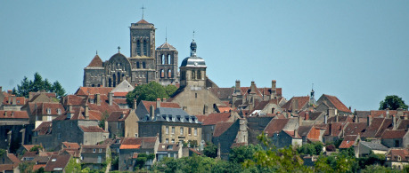

1037 byly slavně vystaveny ostatky Marie Magdaleny, a pouť k nim se stala hitem. Sláva Vézelay prudce rostla, a uprostřed módy ostatků v 11. století se navíc chrám stal nástupním prostorem pro jednu z cest do Compostelly. Kostel začal být příliš těsný a kolem kláštera vzniklo na středověké poměry docela slušně veliké osídlení s nejrůznějšími řemeslníky. Badatele ve středověku zaujme celá řada domů, prozrazujících nečekané stáří. Dojem v jarních měsících doplňují hustě kvetoucí a docela obrovské vistárie.

1096 byl položen základní kámen další verze chrámu opatem Artaudem. 1104 už byl chrám svěcen. Daně na stavbu byly ovšem moc vysoké, a lid opata Artauda zavraždil. Jeho opatrnější nástupce Renaud de Semur pokračoval ve stavbě, nicméně to skončilo opět katastrofou 21. 7. 1120, kdy chrám úplně shořel, včetně 1200 poutníků uvnitř. Z čehož je zřejmé, že měl chrám v této verzi stále rovný trámový strop, a zřejmě byl při požáru zavalen východ. Na událost naráží klenák, u kterého je nápis:

> SUM MODO FUMOSA, SED ERO POST HAEC SPECIOSA,

tedy něco jako „byla jsem zakouřená, ale teď jsem krásná.“ A jak už to tak ve středověku bývá, můžeme tuto myšlenku chápat v daleko rafinovanějších odstínech a významech, a celý chrám nám ji zrcadlí na mnoha místech.

Potom stavba pokračovala za opata Aubriho. Tato etapa mezi lety 1120 a 1130 je nejvýznamnější, protože vedla k dnešní podobě podstatné části chrámu. Vznikl největší doposud stojící klášterní chrám, překonaný snad jen chrámy ve Speyeru nebo v Toulouse, při čemž ty jsou s mnohem chudší výzdobou.

1132 se konala veliká sláva, Aubri byl papežem Innocencem II. povýšen na kardinála z Ostie, a byl inaugurován nový opat Ponce de Montboissier. Takže chrám byl asi téměř hotov, i když na výzdobě a dalších detailech práce pokračovaly dál.

Z další historie je dobré připomenout, že 31. 3. 1146 pod kopcem kázal Bernard z Clairvaux a začala tím Druhá křížová výprava.

1165 došlo k další nehodě, kdy se zřejmě zřítila část chóru. To byl zřejmě důvod, proč chórová část není původní, je gotická ze 13. století.

V červenci 1190 začala třetí křížová výprava a vojska Richarda Lví Srdce a Filipa Augusta vyrazila opět z Vézelay.

V 19. století Prosper Mérimé zachránil kostel a nařídil opravu, kterou provedl Violet le Duc jako jednu ze svých prvních akcí. Stalo se tak mezi 1840 a 1861.

Výsledný chrám, který můžeme obdivovat dnes, je převážně z té etapy 1120–1130, pravý románský sloh, zejména pokud jde o trojlodí a nartex. Jde o další odvozeninu svatého Petra v Římě, dnes už neexistující románské verze, vylepšenou o burgundský nartex vpředu.

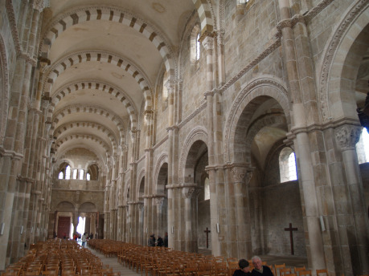

Půdorys kostela je jednoduchý, trojlodí má plných devět polí délky, pak je střední diamantové pole, a následují ještě tři rychlá pole chóru a závěr. Chrám zakončuje sedmihranný chór s jediným polem. Křížová loď vystupuje jen mírně, má jen dvě pole, a ve srovnání s extrémní délkou celého chrámu je dost nenápadná. Nartex je úměrně obrovský, má i přední stěnu, na rozdíl od otevřeného modelu, který jsme viděli v Beaune.

Konstrukce stěny kostela uvnitř přináší řadu zajímavostí. Je lehká, proti současně stavěné katerále v Autun vzdušná, dvojdílná, a lze tvrdit, že jejím klíčovým prvkem je světlo. Výsledek působí odlišným dojmem než daleko temnější Autun nebo Beaune. Jiný zajímavý detail jsou pilíře, sice v základu hranaté, ale přípory z nich vytvářejí svazek, který je typický pro pozdější katedrály.

A když vyjdeme ven, objevíme __vnější opěrný systém__, svérázné řešení problému bočního tlaku. Tohle Římané neznali vůbec, a zjevně to míří k vynálezu gotiky, který byl již nadohled. Úplně první oficiální gotický chrám v Saint Denis v Paříži byl budován od roku 1140.

Hlavním cílem těchto nápadů je klenba, která má výrazné __burgundské pasy__, pro zvýšení efektu výrazně černobílé, což nás vede zpět k tomu latinskému nápisu na tom klenáku.

Není tu typicky burgundský lomený oblouk, ale zato je klenba křížová. Tedy zase jiná varianta, ani Beaune, ani Tournus, ale něco mezi. V místních poměrech je to zvláštní nápad, odbočující k normanskému chápání klenby, která byla tehdy k vidění třeba v Caen. Také to samozřejmě připomíná Římany. René Huyghe se domnívá, že jde možná o reakci na nehodu v Cluny, kde se roku 1125 část klenby propadla. Staronový způsob zaklenutí se ukázal být velmi progresivní – horní pás oken je skutečně mimořádně veliký, a vzniká dokonce napínavá otázka, zda nebylo uvažováno o barevných vitrajích, protože pokud by nebyly okenní otvory zakryté, mohlo by to být velmi nepříjemné v zimních měsících. Jen burgundské pasy jsou unikát, který v dalším vývoji u křížové klenby zmizel.

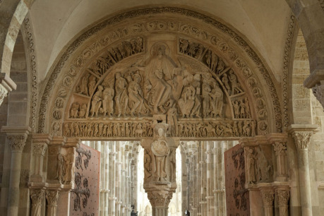

Věže kostela jsou zjevně nedokončené. Měly být celkem čtyři, dvě v čele a dvě podél chóru, ale provedeny byly jenom dvě jižní. Nejsou nijak mimořádné, zadní je navrchu zakončena vysloveně chartreským typem oken.

A to všechno je ničím proti bohatství [sochařské výzdoby](http://www.bourgogneromane.com/edifices/vezelay.htm). Pokud jsem v Regensburgu jásal nad velkolepě provedeným portálem, potom zde vede do nartexu portál rovnou trojitý, a to je celé ještě zopakováno v nartexu při vstupu do hlavní lodi.

Takže je tu vlastně portálů hned šest, a všechny přetékají nejrůznějšími reliéfy.

Ten vnější trojportál, kterými vstoupíte do nartexu, zobrazuje _Poslední soud_, a je bohužel prakticky zcela přepracován Violet le Ducem, takže na nějaká tajemná sdělení kamenného jazyka tu moc nelze spoléhat. Úplně jinak je to s portálem vnitřním, kterým vstoupíte z nartexu do chrámu, protože ten se nám dochoval v ryzí původní nádheře. Zobrazuje _Seslání Ducha svatého_, doplněné postranním _Dětstvím Kristovým_ a _Kristem na Golgotě_.

Ten střední nejdůležitější obraz s obrovitým Kristem uprostřed doplňují tabule okolo, kde jsou k vidění nejrůznější národy, kterým ten Kristus vládne. Některé jsou úplně fantastické.

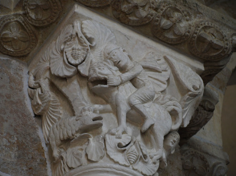

Za mne je úplně nejdůležitějších těch 30 kulatých medailonů. Fulcaneli nevěnoval tomuto objektu žádnou pozornost, takže to zbylo na mne; za roky studia jsem dokázal popsat jen tuto maličkou část vnitřního portálu. Byla to pro mne stejně průlomová práce, jako Argonantovo setkání s Vinařem na stejném místě.

V chrámu uvnitř potom máme zdobeny skoro všechny hlavice sloupů, což přináší dalších nepravděpodobných 96 výjevů. Je tu prostě kdeco; polní práce, výjevy z bible, draci. Zjistit, co všechno se tu lze o středověkém myšlení dozvědět, je práce pro armádu nadšenců na dlouhá léta. A až se nám to podaří, potom si teprve můžeme připít pohárem získaného vína, jak činí ten poslední muž na třicátém výjevu, odpovídajícím prosinci, kde se praví, že

> OMNIBUS IN MEMBRIS DESIGNAT IMAGO DECEMBRIS.
