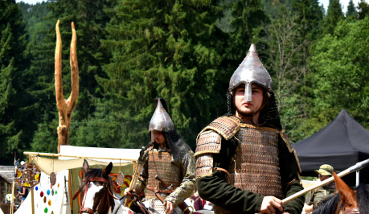
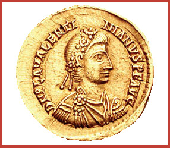
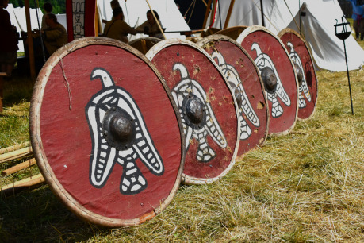

Pod jejich tlakem se hnuly národy, v důsledku čehož vzniknou v budoucnu mocné státy jako třeba říše Franků, která je mnohými považována za prototyp moderní Evropy. I my můžeme být Hunům za mnohé vděční. Našim slovanským předkům vydláždili cestu k osídlení povodí řek v srdci Evropy, našem dnešním domově. Pojďme se podívat, jak celá sto let dlouhá událost vlastně probíhala a jaká cesta vedla až k legendární bitvě na Katalaunských polích.

## Evropa na prahu nového věku

Než se dostaneme k samotné bitvě národů, ukážeme si blíže, jak vypadal starý kontinent za posledních dní Západořímské říše.

V poslední čtvrtině čtvrtého století se na scéně objevují noví silní hráči: Hunové. Jejich předkové kdysi děsili obyvatele Číny, kteří jim platili za zachování míru, a říše kočovníků se rozprostírala v širých dálavách východní Asie. Ale nic netrvá věčně a Hunové se museli pod vlivem vojenských porážek a klimatických změn vydat na dlouhou cestu za novým domovem. Naneštěstí pro tehdejší Evropany měla být oním novým domovem jejich odvěká vlast.

Do zorného pole pozdně antických autorů se dostali po překročení Donu, jenž byl považován za hranici mezi Asií a Evropou. Podle pověsti je měla přes bažiny okolo této řeky převést laň pronásledovaná lovci, o níž někteří soudili, že by mohla být avatarem stepních bohů.

Římský svět už několik nájezdníků poznal: Skyty na území dnešní Ukrajiny vystřídaly sarmatské kmeny, jako Jazygové nebo Alani. I přes svou krutost za Markomanských válek nedokázali v hrůze překonat Huny. I vzhled nově příchozích byl nezvyklý. Prameny je líčí jako bestie na dvou nohách rodící se, žijící a umírající v sedle, bez kapky civilizovanosti v krvi a s neuvěřitelně odpudivým obličejem s malýma očima. Nikdo také nevěděl, kam tyto pohany zařadit. Soudilo se, že jsou potomky gótských čarodějek, které obcovaly se zlými duchy v asijské stepi.

Brzo ale starosti o to, kam Huny vlastně zařadit, vystřídaly úplně jiné. Divocí jezdci totiž porazili sarmatské kmeny, část pohltili a část se pod jejich tlakem posunula daleko na západ. Další na řadě byli Gótové znesváření ve válce mezi sebou. Nejednotný lid čekal podobný osud. Nešťastní Germáni hledali ochranu na území Římské říše. Migrace, která v Evropě již nějakou dobu probíhala, se tak vystupňovala nad mez poklidnosti.

Není zde dost prostoru na popis veškerých pohybů kmenů, které následovaly po hunském vpádu, snad jen nastíním osudy těch, kteří proti sobě stanuli na poli v dnešní Champagni. Vizigóti se přesunuli na území Východořímské říše, kde jim císař dal zemi u Dunaje k obývání. Po velkém útlaku ze strany Římanů ale Gótové povstali a v bitvě u Adrianopole roku 378 pobili římské legie i s jejich nejvyšším velitelem: císařem východu. Po dalších letech se pod vedením krále Alaricha přesunuli do Itálie, kde vyplenili roku 410 Řím. Po smrti svého největšího krále národ na cestě odešel do dnešní jižní Francie.

Ostrogóti měli velkou říši a vedli válku se Slovany, když Hunové přišli. Jejich král Hermanarich neunesl porážku od nájezdníků, nalehl na meč a nechal svůj národ jeho osudu. Lid se vydal na cestu do daleké Panonie. Na čas nájezdům unikli, ale ani oni válce neutekli. Hunové přišli znovu a tentokrát si tyto Germány podmanili.

Alani se rozdělili na mnoho skupin. Někteří šli s Huny při jejich taženích, další odešli na západ s Vandaly a Svéby. Dostali se do Galie, kde se usadili severně od Vizigótů. Tam je také zastihla válka mezi Římany a Attilou.

Hunové zatím vytvořili novou říši, kde si byly národy rovny v boji i při dělení kořisti a kde kdokoli mohl jíst po boku jejich velekrále, pokud dokázal v boji, že si to zaslouží. Rozděleni mezi dva krále, jednoho na východě a druhého na západě, ale jednotní v nájezdech tak žili, dokud Attila nezabil svého bratra Bledu a nestal se tak vůdcem všech Hunů. Nejskvělejší hodina jejich evropské historie právě započala.

## Válka na východě ...

Obě části rozdělené Římské říše měly odlišný vztah k Hunům. Východ trpěl jejich častými nájezdy, z nichž se musel často vykupovat. Jen bohatství provincií východu udrželo rozpočet zatěžovaný válkami se sousedy společně s velkými dary pro vyslance nájezdníků. Později tak za Attilu platili jeho věrné. Vůdce mocné hordy si byl jist svou pozicí a vyslance vysílal často. A ti mu byli vděční, neboť tak pro ně zajistil zboží, jakému v celé hunské říši nebylo rovno.

Hunové po Konstantinopoli chtěli i takové věci, jako vydání renegátů z hordy, kteří utekli za Dunaj. Nejednalo se jen o jednotlivce (ke kterým se bohové stepi obraceli zády, když je Římané vydali jejich vlastním, a čekal je tak trest nejvyšší: propadnutí hrdlem), ale i o celé kmeny. Plnění těchto požadavků za strany Konstantinopole ale také nebylo ideální. Spousty uprchlíků našly nový domov v Thrákii sužované i přes občas placený tribut nájezdy a císař neplatil vždy svědomitě výpalné.

Z východu navíc na císaře v Konstantinopoli tlačil i jiný nepřítel. Ne sice tak divoký, ale v kombinaci s barbary na severu stejně nebezpečný: říše Sasánovců. Ctižádostivý rod zničil říši Parthů a na jejích základech vystavěl svou, která si dala za cíl vyrovnat se Persii za časů největších velkokrálů, jako byl Dáreios I. nebo Kýros Veliký. A to znamenalo jediné: vyhnat Aenovy potomky z Asie.

Dvě říše mezi sebou vedly dlouhé války, než přišli Hunové. Císařové potřebovali volné ruce pro válku se Sasánovci, platili proto Hunům daň z míru. A podobně jako Sasánovci sužovaní tzv. Bílými Huny odmítal snahy o ukončení sebevražedné války v jižním Přičernomoří …

## … a mír na západě

Na západě, kam se boží metla, jak se Hunům později říkalo, nehrnula, byla situace jiná. Vláda považovala za výhodnější jim platit, než aby s nimi vedla nákladnou a náročnou válku. Navíc nájezdníci udržovali germánské kmeny za Rýnem a Dunajem tak, jak si to Římané přáli: za mohutnými koryty řek a ve válce s jinými Římany na východě. A jako záruku míru byli ochotni nabídnout více než drahé látky, překrásné šperky a výtečné zbraně. Za mír dávali v šanc život synů mocných své říše.

Jedním z těch, kdo musel opustit rodinu a svým životem ručit za mír, byl i chlapec jménem Flavius Aetius. Vyrostl mezi Huny, znal jejich řeč i zvyky, dokonce se přátelil s jejich králi. A dobře si zapamatoval vše, co za nedobrovolného pobytu u svých budoucích nepřátel viděl. Jako by věděl, že se mu to jednoho dne bude velmi hodit …

… ale ten den stále nepřicházel. Když se vrátil ze stepí, dal se do služeb císaře Johanna. Ten bojoval s císařovnou vdovou Gallou Placidií, která se snažila zachovat trůn pro svého syna Valentiniana. Vzdorocísař Johann se rozhodl využít schopností svého podřízeného a vyslal Aetia k hunskému králi Roasovi, který tehdy vládl Hunům na západě, s prosbou o pomoc. A Aetius nezklamal.

Do Itálie se vrátil v čele šedesáti tisíc jezdců, jak nás informují dějepisci, roku 425. Pro svého vládce se ale vrátil pozdě. O něco dříve byl zajat vojsky císařovny, byla mu useknuta pravá ruka a poté, co byl v cirku ukázán lidu na oslu, byl i popraven. Aetius se octl v nezáviděníhodné situaci. Rozhodl se nebojovat s Gallou a dohodl se s ní, že obdrží vojenské funkce za to, že bez plenění území říše dostane Huny zpět do jejich sídel.

Aetius se ale nespokojil s tím, co dostal. Jeho kariéra byla naplněna vojenskými úspěchy, kterých dosáhl za pomoci svých hunských přátel, bojem o moc s ostatními vojevůdci a upevňováním vlastní pozice. Ale schopný generál nakonec dosáhl svého. Stal se faktickým velitelem západní poloviny kdysi mocné říše. V posledních letech se jí tak z jeho rukou dostalo alespoň malé obnovy a jemu zase titulu „Poslední Říman“.

## Stahující se mračna

Hunské plenění Thrákie nemohlo trvat věčně. Dříve či později musel přijít okamžik, kdy již v zemi nebude mít kdo obdělávat pole a bohatství se přesune z kamenných domů Římanů do dřevěných chat a plátěných stanů v Attilově říši.

Hunský velkokrál musel vymyslet, kam se horda pohne dál. Na jihu bylo zábranou moře a pevné hradby druhého Říma, Konstantinopole. Na východě byla nekonečná step neslibující velkou kořist. Na severu rostly staleté lesy, rozprostíraly se velké bažiny, tekly velké řeky a žili Slované, kteří Hunům nemohli dát nic, co by nájezdníci už neměli. Zbýval jen západ.

Rozhodnutí usnadnilo i údajné nalezení posvátného meče, který měl svému nositeli přinést vítězství ve všech bitvách. Těžko říct, jestli Attila našel opravdu nějaký artefakt dávnověku, nebo si nechal meč vyrobit a zázračně jej objevit. Každopádně využil staré pověsti národů euroasijskké stepi o božské zbrani, která učiní ze svého nositele neporazitelného válečníka. Horda se semkla ještě pevněji v očekávání nové kořisti. Zbývalo jen najít záminku, proč se na pochod vydat.

Jí se stala sestra císaře Valentiniana. Jmenovala se Honoria a protože Valentinianus mohl umřít bezdětný, měl se její manžel v takovém případě stát novým císařem na západě. To mladý Valentinianus nechtěl dopustit. Jejího milence nechal popravit a ji samotnou pak zavřel do domácího vězení. Honorii se ale podařilo poslat po eunuchovi, který ji měl hlídat, zprávu tomu správnému člověku: králi Hunů. Attilovi v ní slíbila, že mu bohatě zaplatí, pokud ji z vězení dostane.

Zato on si její zprávu vyložil jako nabídku ke sňatku. Valentinianovi řekl o její ruku a jako věno nechtěl nic menšího než celou Galii. Na rozdíl od jiných požadavků tento Římané odmítli splnit. O válce bylo rozhodnuto. Honoria ji mohla sledovat již jako žena bezvýznamného a oddaného člena senátu. Psalo se léto Páně 451.

Poslední Říman ale válku s Huny očekával. A celá léta dělal vše, aby se na záplavu jezdců připravil. Na severu s hunskou pomocí porazil Burgundy. Dal tak základ dvěma věcem: Písni o Nibelunzích a burgundské nenávisti k Hunům. Dále se postavil za jednoho z princů rýnských Franků. Za věrného spojence zaplatil tak, že druhý se uchýlil pod patronát Attily. Alany získal jen na oko. Od začátku byli Římany připraveni zradit. Aetius jako mistrný stratég dokázal tuto slabinu využít ve svůj prospěch. Ale patriciův mistrný tah teprve přijde. Sálští Frankové se také přidali k jeho armádě.

Společně s jádrem několika římských jednotek, které ale byly římské jen podle jména, to tvořilo už nějakou armádu. Ale ne dost velkou na to, aby se mohla postavit sběru národů od Rýna po Don valící se Germánií za světovládou. Ještě musel přesvědčit krále Vizigótů Thedoricha.

A to se mu podařilo. Theodorich, navzdory tomu, že byl příbuzný Alaricha, krále, který vyplenil Řím, velmi obdivoval římskou kulturu. A právě přes ni se podařilo Aetiovi získat tak důležitého spojence. Římský filozof Avitus byl patriciovým přítelem, stejně jako přítelem gótského krále. Přes něj Aetius stupňoval tlak, až nakonec Theodorich svolil k válce. Temná mračna nad říší římskou trochu rozehnal vítr.
