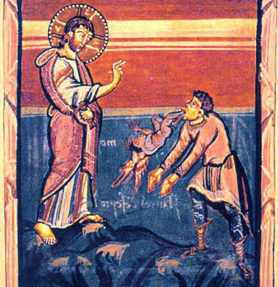

V Bibli ([Marek 5](http://cz.bibleserver.com/text/CEP/Marek5%2C9)) se píše o muži posedlém zlými duchy. Když se Ježíš démona zeptá na jeho jméno, démon odpoví: „Mé jméno je Legie, protože nás je mnoho.“ Následně Ježíš démona vykáže do obrovského stáda vepřů a posedlý dobytek se hromadně vrhne do moře, kde se utopí. Tím prameny hovořící o Legii více méně končí.

_Pseudomonarchia Daemonum_ ani _Ars Goe­tia_ Legii ve svém katalogu démonů neuvádí. Nebo alespoň ne přímo. U každého z démonických papalášů ovšem uvádí, kolika legiím démonů velí. Například Focalor má pod kontrolou 3 legie, zatímco Beleth velí rovnou 85 legiím.

Legie se skládá z tisíců nižších démonů, jejichž moc je nepodstatná, a pokud vůbec nějaké jméno mají, nemá smysl ho znát. Když se stanou Legií, jejich moc se sčítá a vůle se spojuje do jediné entity. K vytvoření Legie je zřejmě potřeba zásah nějaké vyšší inteligence a pravděpodobně se nejedná o snadný proces. To bude zřejmě důvod, proč i ti nejmocnější démoni mají pod kontrolou nejvýš desítky Legií.

## Evokace

Evokace probíhá podobně jako v případě jiných démonů nebo duchů. Mág zpravidla vytvoří ochranný kruh, který ho chrání před tím, co vyvolal. Ať už je to bytost, kterou si vyvolat přál, či nikoliv. Zaklínáním jmény různých vyšších bytostí pak vyvolaného démona přinutí aby vykonal to, co po něm žádá. Je-li toho ovšem démon schopen.

Často nejdůležitější fází evokace je zjištění pravého jména vyvolaného démona, protože to mágovi dává indicii, jestli je démon vůbec schopen jeho přání vyplnit a na co si při jednání s ním dát pozor. V našem případě bude však nejpravdivější odpověď na tuto otázku „Legie“.

Jak plyne z předchozího, Legie je mnoho démonů a i Legií je mnoho. Co Legie dokáže, jak se zjevuje nebo způsoby, jakými lze ovládnout, se liší podle povahy démonů, kteří Legii tvoří a které může mág jen těžko odhadovat. Různé Legie se tak od sebe značně liší a jejich jméno je stále Legie. I při cíleném vyvolávání Legie není žádná jistota, že se podařilo vyvolat stejnou Legii jako dřív. To vše mágovi, který by se o vyvolání Legie pokusil, značně komplikuje práci, a lze tak s pravděpodobností hraničící s jistotou předpokládat, že to nedopadne dobře.

## Invokace

Invokace se od evokace liší tím, že duch není vyvolán kamsi do prostoru, ale přímo do těla mága, nebo média. Přestože se schopnosti Legií velmi liší, jejich společnou vlastností je schopnost ovládat těla živých tvorů. Kdo by se tedy o invokaci Legie pokusil, nezíská démonického otroka, ale stane se démonovou loutkou. Pokud je evokace Legie špatný nápad, invokace je nevýslovná hloupost.

## Legie

Vlastnosti vyber z nabízených možností dle libosti, hodem kostkou, nebo je doplň, jak potřebuješ. Vlastnosti by se měly určovat při každém vyvolání Legie, protože tu samou Legii jako minule se podaří vyvolat jen čirou náhodou.

### Pravá forma

V jaké podobě se Legie zjevuje během evokace a když opustí posedlé tělo. Ve své pravé formě se může pohybovat a ovlivňovat své okolí způsobem, jaký z dané formy vyplývá. Vyber možnost, nebo hoď 3k6:

> 3\. Hoď dvakrát znovu a výsledek bude kombinace těchto forem 
> 4\. Klubko hadů 
> 5\. Stádo prasat 
> 6\. Spousta černých koťat 
> 7\. Hejno bílých myší 
> 8\. Hemžící se hromada červů 
> 9\. Mračno komárů 
> 10\. Vosí roj 
> 11\. Mraveniště 
> 12\. Listí vířící ve větru 
> 13\. Krvavý déšť 
> 14\. Tančící jiskry 
> 15\. Smečka pekelných psů 
> 16\. Hejno světélkujících medůz vznášejících se vzduchem 
> 17\. Hejno malých hrochů s netopýřími křídly 
> 18\. Legie šotků různých tvarů, barev i velikostí 

### Schopnosti

Legie dokáže vstupovat do těl živých tvorů, skrývat se v nich a přímo je ovládat. Legie může ovládat i více tvorů současně. Klidně stovky, možná i tisíce. Čím víc ale Legie tříští své síly, tím slabší je její vliv. Ovládat člověka je také náročnější než ovládat třeba švába. Samotný vstup do jiného tvora je pro Legii velmi náročný, a bude tak přestupovat spíš jen výjimečně a z nutnosti. Když Legie opouští posedlé tělo (ať už proto, že chce vstoupit do jiného těla, původní tělo umírá, nebo už Legii překáží), zjevuje se ve své pravé formě.

Mág může Legii rovněž přikázat, aby udělala něco, co dokáže z povahy své pravé formy, nebo prostřednictvím tvora či tvorů, které posedne. Další schopnosti Legie mohou být různé a mág by si měl být jistý, že právě vyvolaná Legie dokáže to, co od ní žádá:

1. Odhalit tajemství – Legie dokáže zjistit a sdělit mágovi něco, co ví někdo jiný a nechce to prozradit.
1. Najít ukrytý předmět – Legie sdělí mágovi, kde se nachází to, co hledá.
1. Léčit nebo způsobovat nemoci – Legie způsobí nebo vyléčí chorobu, u koho mág určí.
1. Pokřivit čas – Legie způsobí, že čas pro nějakou osobu nebo věc plyne výrazně rychleji nebo pomaleji, dle mágova přání.
1. Nezranitelnost – tvora, kterého Legie posedne, prakticky nelze zabít. Jakékoliv zranění se okamžitě zacelí, Legii to pouze mírně vyčerpává. Daleko méně, než kdyby měla posednout jiného tvora.
1. Požírání duší – Legie pohlcuje duše tvorů, které posedne. I když opustí jejich tělo, duši si bere s sebou. Legie se tak stává postupem času stále silnější, i když je to velmi pomalý proces.

### Nebezpečí

Během evokace se může spousta věcí pokazit. Mág poleví v koncentraci, dožaduje se příliš dlouho splnění úkolu, který tento démon vykonat nemůže, nebo použije v zaklínání jméno bytosti, která je nepřítelem démona, kterému Legie slouží, a přitom není mocnější. Nebo dojde k porušení ochranného kruhu a démon se chopí příležitosti. Nebezpečí skýtají i nezdařené pokusy o vymítání Legie nebo úspěšná snaha překazit naplnění jejího úkolu.

V takových případech se Legie stává ne­ovladatelnou a začíná se chovat některým z následujících způsobů:

1. Legie zmizí, ale upozorní na mága svého pána. Pozornost vyššího démona může znamenat jak příležitost, tak problém. Jestli bylo těžké poradit si s Legií, její pán bude teprve tvrdý oříšek.
1. Legie se přestane zajímat o mágovo zaklínání a najde si nejbližšího člověka (nechráněného ochranným kruhem) a posedne ho.
1. Legie se ve své pravé formě rozptýlí do okolí a začne se usidlovat v různých zde žijících drobných živočiších. Posedlá havěť pak bude pronásledovat mága, nebo škodit v okolí. Zbavit se Legie v této podobě je zvlášť obtížné, protože obývá mnoho drobných tvorů rozptýlených všude možně.
1. Začnou se zjevovat další Legie, obklíčí mága a pokusí se rozbít ochranný kruh. Pokud se jim to podaří, posednou mága. Mágovo tělo přítomnost několika Legií nemůže vydržet příliš dlouho, o mysli nemluvě.
1. Legie ve své pravé formě začne ničit okolí. Způsob, jakým to dělá, se odvíjí od její formy a schopností. Pokud je mág chráněn ochranným kruhem, nemůže na něj, ale pro požár, padající strop a další světská nebezpečí kruh nepředstavuje překážku. Jakmile bude kruh narušen, Legie se zaměří na mága.
1. Legie se roztříští, duchové, co jí tvořili, se rozutečou všude možně. Tato Legie přestává existovat. Působením duchů se v širém okolí začnou dít nevysvětlitelné věci a vzhledem k jejich počtu se možná nikdy nepodaří je všechny zneškodnit. V neposlední řadě se pán rozprášené legie bude zlobit a toho, kdo je za to zodpovědný, bude do konce života sužovat děsivými nočními můrami.
