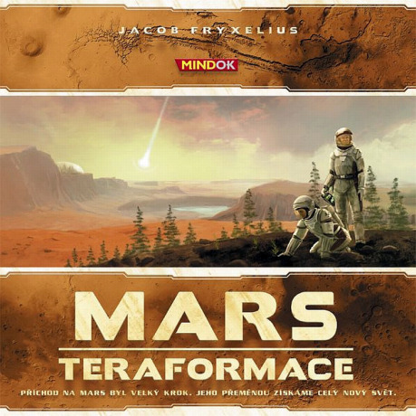
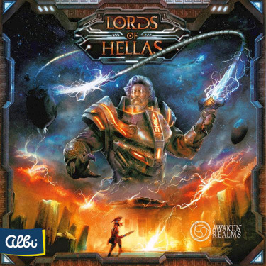
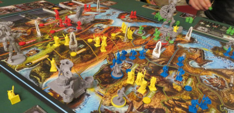
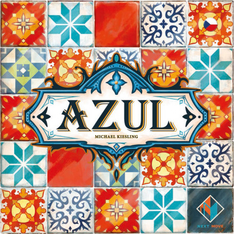
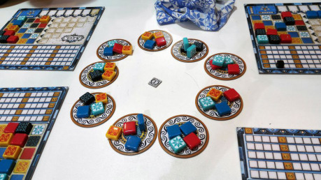

## Mars: Teraformace

> __Rok vydání:__ 2016
>
> __Autor:__ Jacob Fryxelius a bratři
>
> __Počet hráčů:__ 1–5
>
> __Herní doba:__ 2–3 hodiny

Mars: Teraformace je jednou z nejvíce oceňovaných her roku 2016 a od svého vydání se již dočkala řady rozšíření. Hra nás zavede na planetu Mars, která je detailně vykreslena na velkém herním plánu, tedy žádné kartičky nebo jiné abstrakce. Každý hráč představuje jednu z korporací, které soutěží o to, kdo si při teraformačním procesu Marsu vydobude nejvíce prestiže (tzv. teraformační rating).

Mars: Teraformace má neobvykle úzké pro­pojení mechanik s fikcí, takže se během partie skutečně můžete vžít do šéfů megafirem kolonizujících planetu. Všechny mechaniky i komponenty zde dávají smysl a nic nepůsobí jako uměle naroubované na herní model. Hlavním prostředkem k dosažení cíle je vytvoření stabilní atmosféry, příjemného klimatu a vodních ploch (oceánů) – přesně jak byste to ve hře o teraformaci čekali. Pro jednoduchost je plán rozdělen na šestiúhelníková pole, která můžete obsazovat městy, zelení, oceány, případně dalšími speciálními objekty. Motorem hry jsou karty se speciálními akcemi, které dávají hráčům široké možnosti kombinování.

Vítěze na konci partie určují vítězné body (již zmíněný teraformační rating), které můžete získávat několika různými způsoby průběžně i na konci hry. Mezihráčská interakce spočívá v podstatě jen ve vzájemném konkurenčním boji o místo na planetě, která však poskytuje dost prostoru na to, aby se i ten s nejméně ostrými lokty mohl smysluplně uchytit.

Mars: Teraformace je precizně zpracovanou deskovkou, které se dá po herní stránce máloco vytknout. Obávám se však, že za obrovský úspěch vděčí spíš slabé konkurenci než vlastní výjimečnosti, neboť ve srovnání se staršími budovatelskými legendami typu Agricola nepřináší nic převratného. Grafické zpracování i provedení komponent je dle ohlasů poměrně kontroverzní. Z mého pohledu grafika a ilustrace slouží dobře, i když by mohla být uhlazenější. Provedení kostiček zdrojů není úplně šťastné, protože kostičky jsou malé, hladké, lehce kloužou po stole i po podlaze, a i když vypadají hezky, tak lakovaná povrchová úprava je náchylná k otlučení. Kdo však má rád velkolepé budování a vesmírnou tématiku, tomu můžu Mars: Teraformace doporučit.

> __Hodnocení:__ 3/5

## Lords of Hellas

> __Rok vydání:__ 2017
>
> __Autor:__ Adam Kwapiński
>
> __Počet hráčů:__ 1–4
>
> __Herní doba:__ 2 hodiny

Lord of Hellas je hra s příběhem, který se nejspíš bude odehrávat stále častěji. Jako projekt byla financována přes Kickstarter a vzbudila takový ohlas, že se ji rozhodlo vydat i české nakladatelství Albi. Autor Adam Kwapiński není žádný nováček a herní design ani prezentaci na KS nepodcenil. Kromě základní hry u nás vydané Albi je na mezinárodním trhu k dostání několik rozšíření, kterými se zde ovšem zabývat nebudu.

Notoricky známé téma starořeckých hrdinů, bohů a monster autor okořenil prvky sci-fi. Nenechte se však zmást tím, že Herakles vypadá jako bijec z Warhammeru 40k. Jedná se jen o vizuální cool faktor a žádné vyzbrojování hrdinů plazmakanóny a rotomeči v herních mechanikách nenajdete. Ačkoli grafické zpracování nemusí vyhovovat každému, je bezesporu bohaté a rozložená hra na stole vypadá impozantně (hlavně v závěrečné fázi, kdy už jsou postavené monumenty bohů).

Ačkoli se Lords of Hellas díky množství hezkých figurek tváří jako hardcore wargame, ve skutečnosti jsou bojové mechaniky poměrně abstrahované a srozumitelné i běžným hráčům. Kromě boje, který je řešen na dvou mimoběžných úrovních (hrdinové proti monstrům, armády proti sobě navzájem), je ve hře přítomna i ekonomika, a to v podobě obsazování měst, budování chrámů a monumentů bohů.

Zatímco většina euroher sází při určování vítěze na vítězné body, a většina wargames na eliminaci soupeře, jdou Lords of Hellas střední cestou vítězných podmínek. Zvítězit můžete díky územní převaze, zabíjení monster, ovládnutí chrámů nebo stavbě monumentů. Čím více způsobů budete kombinovat, tím více vyčerpáte své síly a začnete zaostávat. Naopak když se vydáte jen jedinou cestou, upoutáte zákonitě pozornost soupeřů, kteří se vám budou snažit vítězství překazit.

Hra obsahuje opravdu velké množství komponent, ale není tak složitá, jak na první pohled vypadá. Navíc pravidla jsou napsaná tak, že můžete začít hrát už v průběhu jejich studia a dočíst je za běhu. To usnadňuje první hru začátečníkům, ale komplikuje zpětné dohledávání řešení nejasných situací. Obecně se dá říct, že na takto rozsáhlou hru jsou pravidla napsána dost úsporně a rezignují na podrobné vysvětlování každé otázky, která může vyvstat.

Lords of Hellas bych rozhodně doporučil těm hráčům, kteří hledají akční bojovou strategii, ale nechtějí investovat čas a peníze do plnokrevných wargames.

> __Hodnocení:__ 4/5

## Azul

> __Rok vydání:__ 2017
>
> __Autor:__ Michael Kiesling
>
> __Počet hráčů:__ 2–4
>
> __Herní doba:__ 30 minut

Abstraktním deskovkám se obecně vyhýbám, neboť u nich postrádám příběh, který je pro mě u her důležitý. V případě Azulu jsem však udělal výjimku a rozhodně nelituji. Absenci příběhu Azul do značné míry kompenzuje estetickým prožitkem, svým vkusným grafickým provedením totiž skutečně vyčnívá z moře stereotypů a kýče deskových her.

Ve hře Azul je vaším úkolem sestavit vzor z barevných kamenů (obložit dlaždicemi zdi v paláci v Evoře) tak, aby vám to v souladu s pravidly přineslo co nejvyšší bodový zisk. Abstraktní hry mají obvykle oproti klasickým deskovkám výhodu v rychle a snadno vysvětlitelných pravidlech. Ani Azul není výjimkou, hodí se proto na setkání se svátečními hráči, kteří už po pěti minutách vysvětlování usínají nebo sahají po svých smartphonech.

Snadno pochopitelná pravidla ovšem neznamenají triviální hru. Azul má dostatečnou hloubku na to, aby zaujal i zkušené hráče, a nechybí v něm mezihráčská interakce. Protože hráči vybírají možnosti (kameny) ze společné zásoby, je zde možnost vhodným výběrem překazit soupeři plány a tím mu uškodit. Další rovinu interakce představuje možnost vybírat z kamenů, které soupeři před vámi zahodili. Jako většina abstraktních her je však i tato postavena na principu „kdo vidí na více tahů dopředu“; rozhodně zde nehledejte možnost více cest k vítězství. Přesto však Azul netrpí tím, že by byl vítěz znám už několik tahů před koncem. I poslední tahy totiž běžně přináší zisky, které zvrátí situaci.

Pro mě je Azul důkazem, že i abstraktní hra může poskytnout nevšední zážitek. Nedoporučil bych ji snad jen do skupin s notorickými přepočítávači, kteří nad každým tahem kalkulují deset minut a tím znechutí své spoluhráče.

> __Hodnocení:__ 3/5
