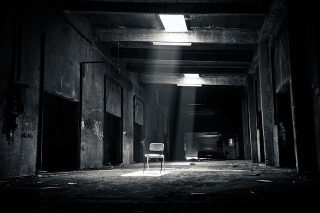
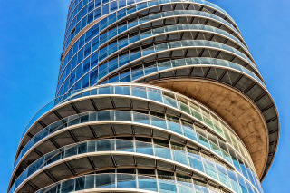

Odhliadnuc od klišé, architektúra ponúka samostatnú výpovednú hodnotu, ktorá je v rámci žánru a aj RPG málo rozvinutá. Samozrejme, elfovia bývajú na stromoch, trpaslíci pod zemou a rovnako ako každý aspekt tejto sub-kultúry má už nejaké jasné stereotypy, ktoré fungujú.

Architektúra však vie priniesť veľmi veľa do celkovej atmosféry príbehu. Ak sa prenesieme cez architektúru v zmysle „akej farby je múr a odkiaľ sa do toho lezie?“ a zameriame sa na architektúru ako priestor, či skôr priestor poznačený stavebným zásahom.

Tým myslím to, že architektúra nemusí byť len magická veža zo slonoviny, ale aj most vydlabaný do kmeňa padnutého stromu. Oba tieto priestory ponúkajú úplne inú atmosféru a emóciu, pretože vytvárajú iný priestor.

Samotný priestor prezentuje výpovednú hodnotu, ktorá zďaleka nemusí byť iba kulisou, ale môže vytvoriť atmosféru, ktorá sa hráčov dotkne a ostane s nimi. Samozrejme, je jednoduchšie pustiť melancholickú hudbu, ako vytvoriť fiktívny architektonický sloh, odprezentovať ho hráčom a potom im z neho dať skúšku.

Architektonický priestor a architektúra ako disciplína však vychádzajú z rovnakých princípov – jazyka, ktorý na nás vplýva prostredníctvom okolia. Podobne ako by bolo veľmi ťažké nazvať hudbu Spice Girls melancholickou, by bolo ťažké vytvoriť pompéznosť v priestore o veľkosti štandardného záchoda.

Vytvoriť v hráčoch pocit pompéznosti nemusí byť o definovaní architektonického štýlu, skôr o vytvorení priestoru ako takého, bez zbytočnej komplexnosti, či detailov. Stačí sa zhrnúť tých zopár charakteristík, ktoré tvoria priestor v našich hlavách pompéznym. Napríklad chodba chrámu, ktorá je úzka, ale disproporčne vysoká a po celej ploche pokrytá kamennými reliéfmi s precíznymi detailami.

## Interpretácia architektúry

Tento priestorový jazyk dokáže byť rovnako variabilný, ako vyššie spomínaná hudba. Dokáže navodiť stiesnenosť, majestát, melanchóliu a celkovo dokáže hráčom vytvoriť priestor, ktorý by sa im v hlavách za iných okolností neobjavil.

Dôvod, prečo sú tieto imaginative priestory iba kulisou, či bočnou poznámkou pre samotný príbeh je aj ten, že priestorový jazyk vnímame rovnako podprahovo ako hudbu. Pieseň znie veselo, ale málokto strávi čas tým, aby analyzoval tempo, tóninu, či farbu zvuku. Priestor pôsobí na ľudí veľmi podobne. Najznámejším príkladom je asi Pruitt-Igoe public housing od architekta Minoru Yamasakiho – jeho komplex bytov bol tak úsporný a efektívny, že nevytvoril dostatok verejného priestoru na to, aby sa ľudia spoznali a ostali iba anonymnými susedmi, ktorí si nedôverujú. Nebudem zachádzať do hĺbkovej analýzy, ale výsledkom bol nárast vandalizmu, nelegálnych činností a napokon zbúranie celého komplexu. Ťažko si predstaviť, že sa niekto pomedzi rozbíjanie susedových okien zamyslel nad tým, že je stavba príliš sterilná a pravidelná a rozbité okno jej vlastne dodáva osobnosť.

Aj imaginatívny priestor dokáže mať silný, dlho trvajúci účinok na psychiku, našťastie nie taký, aby ovplyvnil správanie človeka. Navyše, pri jeho vytváraní máte (tak, ako zvykol žartovať Terry Prattchet vo svojich knihách) neobmedzený rozpočet na špeciálne efekty.

Jazyk priestoru vie prehovárať cez najmenšie detaily. Každý fanúšik žánru si dokáže predstaviť typický fantasy hostinec. Jeho použitie je svojím spôsobom klišé, preto je to väčšinou iba odrazovom mostíkom, check-pointom a nemá veľký význam. A potom je tu Weeping Widow Inn z Icewind Dale 2, kde okolo ohniska spali psi. Bol to malý a zdanlivo zbytočný detail, ktorý však mne osobne umocnil pocit pohodlia tak, že si túto drobnosť pamätám aj 15 rokov po tom, ako som Icewind Dale 2 hral.

Práve prostredníctvom jazyka, ktorým prehovára priestor môže byť tento hostinec miestom, na ktoré sa hráči budú vo svojich hlavách radi vracať.

## Fantastická architektúra

Fantastický priestor, či fantastická architektúra je určitým spôsobom žáner sám o sebe. Napíšte niekedy do Pinterestu „fantasy landscape“ a počet výsledkov a miest, kam by ste sa hneď nasťahovali je obrovský.

Asi najpoužívanejším motívom, či emóciou týchto priestorov je údiv. Tieto priestory často porušujú zákony logiky aj fyziky a práve preto sú príťažlivé a pútavé. Práve tento aspekt je kľúčom k vytváraniu fantastickej architektúry a fantastických priestorov v rámci RPG.

Sú to priestory, ktoré ľudia nikdy nevideli a nepredstavovali si. Vytvoriť ich je však jednoduchšie, ako sa zdá.

Priestor je len to, čo sa v ňom nachádza, to čo vieme ako jeho okupant vnímať. Steny, strop, podlaha, svetlo, veci okolo, iné zmyslové vnemy (vôňa, zvuk a podobne) a samozrejme pozorovateľ. Pre vytvorenie fantastického architektonického priestoru stačí, aby iba jedna z týchto vecí bola v nečakanom vzťahu, k tým ostatným – stĺpy, ktoré sú príliš veľké voči pozorovateľovi; chodba, ktorá má miesto jednej steny výhľad do kaňona a podobne.

Vytvoriť v rámci RPG pre hráčov fantastický priestor dokáže mať nečakaný efekt. Ako ľudia si automaticky a prirodzene vytvárame vzťah k priestoru na základe zmyslov takmer okamžite. Ste možno iba jeden krok od vytvorenia fantastickej architektúry, ktorú si budete pamätať ešte 15 rokov po tom, ako ste ju nikdy nenavštívili.
