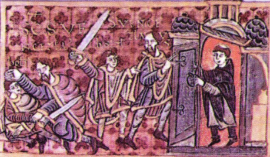
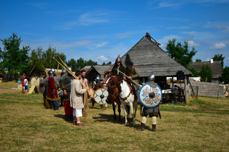
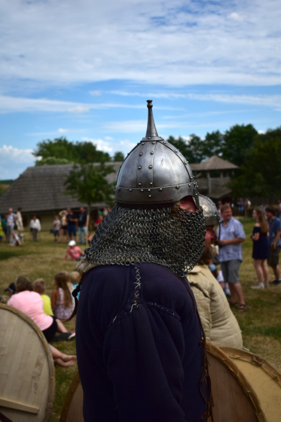

Po staletí se vykládaly události ranních hodin 28. září roku 935 hlavně ze strany Václava. Mučedník byl zabit bratrem, kterého k činu hodného zavržení dohnal sám Ďábel. Jenže celá věc není tak jednoduchá. Češi ale nejprve museli projít dlouhou cestu dějinami, než se spor mezi dvěma knížaty o směr, jakým se bude politika země ubírat, rozhodl u ohrady kolem kostela na Boleslavi.

A na tu cestu se teď podíváme. Její začátek je bezmála čtyřicet let před chladným ránem, které si dnešním dnem připomínáme a podobnou cestou si procházela celá Evropa. Jeden věk končil, jiný začínal a nic už potom nebylo, jako dřív. Začneme ale u nás, v zemi mezi horami, kde velmoži právě rokují, na kterou stranu se přidat…

## Léto Páně 895, Řezno

Dvě knížata ze země za horami s podivnými jmény Spytihněv a Vítězslav se rozhodla. Rok po smrti Svatopluka, vládce Velké Moravy, se dva zástupci Čechů, kmene, který byl Moravě dlouho poplatný, rozhodli poddat Bavorům, mocnému kmeni ve Východofrancké říši.

Ke všemu je vedla naděje, že ze situace, kdy ve Veligradu vládne mladý kníže Mojmír, toho jména druhý, mající problémy se svým bratrem Svatoplukem a Maďary, novými silnými hráči na evropské politické scéně, něco získají. Ať již to byla krytá záda pro jejich další výboje, nebo byly daně odváděné do zahraničí menší, muselo to stát za risk, který mohl při troše smůly znamenat konec Přemyslovského rodu, kdyby Mojmír své problémy vyřešil a rozhodl se pomstít.

Ale to se nikdy nestalo.

## 896–921, střední Evropa

Mojmírova říše se totiž rozpadla. Kmen po kmeni se oddělil a začal dělat vlastní politiku. Částečně za to mohli Maďaři, částečně odstředivé tendence podrobených kmenů. Po Moravě přišla na řadu stát východních Franků, kterou sužovali ugrofinští nájezdníci po další léta. Slované na východních hranicích říše ale syny Arpáda přivítali, vždyť jim pomohli proti starému nepříteli.

Moravané se tak účastní nájezdů do Itálie, Frankové nemají silného panovníka, který by říši postavil zase na nohy, Bavoři se snaží získat vedoucí pozici v říši a ze severu nepřestávají útočit Dánové.

A uprostřed toho chaosu stojí česká knížata, která si snaží upevnit pozici, jak to jen jde. Sňatkem Vratislava s Drahomírou si zajistí spojence na severní hranici, protože Drahomíra pocházela z knížecího rodu Havolanů, kmene sídlícího v místech, kde se dnes rozkládá Berlín.

Přemyslovci ale myslí i na vlastní obranu: budují hradiště na hranicích svého území a stezkách, na něž dosadí méně důležité členy rodu. Jednoho dne se budou hodit Boleslavovi, až se vzepře císaři, ale ten čas teprve přijde. Každopádně snad díky poloze a krytým zádům z bavorské strany se středočeskému rodu daří a stává se mocnějším a mocnějším.

## 921–929, Čechy

Roku 915 umírá Spytihněv a na místo knížete nastupuje jeho bratr Vratislav. Nemáme moc zpráv, co se dělo za jeho vlády, z pozdějšího vývoje se ale můžeme domnívat, že už v té době docházelo ke sporům mezi jeho matkou a manželkou, tedy Ludmilou a Drahomírou. Obě nejspíš sdílely strach ze Sasů, jen se lišily v tom, jak jim čelit. Drahomíra byla možná pro orientaci na Bavorsko, které mohlo mladý přemyslovský stát zaštítit proti expanzi saských knížat, Ludmila mohla být pro placení tributu. Nebo to bylo naopak, jak poukazuje budoucí vývoj.

Jistě to ale nevíme. Motivaci Drahomíry teoreticky můžeme usuzovat z pozdějšího jednání Boleslava, ale stojíme na opravdu tenkém ledě. Nechme tedy toho a podívejme se raději na fakta.

Roku Páně 921 umírá Vratislav. Podle pramenů mu je 33 let a nemá dědice, který by mohl ihned přejmout vládu. Sněm českých vladyků se tak možná usnesl, že než Václav dospěje, vládu na sebe převezme Drahomíra. Pod podmínkou, že se o děti zesnulého postará Ludmila.

Je poměrně divné, že by se o děti neměla starat jejich matka a její povinnosti převzala z vůle lidu jejich babička, zbožná žena, která z nich jistě nemohla vychovat bojovníky a knížata. Snad je to tedy jen legendistický výmysl, ovšem podporovaný všemi legendami.

Drahomíře se patrně nelíbilo, že Ludmila dostala na výchovu její syny, a už vůbec ne, že Ludmila měla stále své vlastní lidi, tedy družinu zabíječů, a tedy moc. Rozhodla se proto pro politický nástroj starý jako lidstvo samo: vraždu.

Ludmila se uchýlila na hradiště podél stezky do Bavor, čímž si vytvořila únikovou cestu pro případ, že by se z horké země pod nohama v Drahomířině knížectví stala neúnosná situace. Spolehla se na ochranu vlastních lidí, ale netušila, že se dva z nich obrátí proti ní.

Jmenovali se Tuna a Gomon. Už jenom podle zvuku těch slov se dá poznat, že nebyli z Čech, nejvíce podporovaná teorie tvrdí, že se jednalo o dva vikingy, jiní se kloní k maďarskému či bulharskému původu. Pokud legendy zachovaly poslední slova Ludmily správně, pak dokonce dříve sloužili v její družině.

Jedné zářijové noci tito dva zabijáci se svými muži přijeli na Tetín, kde Ludmila sídlila, hlídka u brány je pustila do hradiště, když vysvětlili, že mají důležité poslání přímo z Prahy. Dostali se až k paláci. Jejich družina se postavila okolo ohrady, která oddělovala sídlo kněžny od zbytku hradiště a Tuna s Gomonem vtrhli do samotné budovy.

Ludmila k nim vedla nejprve dlouhou řeč, osudu ale neunikla. Uškrtili ji šátkem. Stále se ještě psal rok 921.

Roku 924, nebo 925, se Václav konečně dostává na trůn. Informují nás o tom legendy, jelikož jedním z jeho prvních činů bylo převezení ostatků jeho babičky. Drahomíru odstavil úplně od moci, když ji poslal z Prahy pryč, snad na Budeč. Vládl pak sám, ale o jeho vládě nemáme moc zpráv. Patrně pokračoval v politice budování přemyslovského knížectví.

Až roku 929 se dozvídáme něco konkrétního. Po zimním tažení na Havolany se německý král Jindřich Ptáčník stočil se svým vojskem do Čech, kde se rozhodl Václava donutit platit tribut. Útok proběhl někdy na jaře, kdy už roztál sníh v průsmycích, kterými muselo saské vojsko projít do Václavova knížectví. Kníže a nikdo v Čechách útok nečekal.

Václav byl v obtížné situaci. Neznáme sice, jaký měl vztah s jinými mocnými muži v Čechách, ale na jejich pomoc se jistě nemohl spolehnout. Družina byla nejspíš rozdělena, protože každý trávil zimu na svém dvorci a Václav měl jen málo mužů k ruce. Proti velkému saskému vojsku se nemělo smysl zbytečně bránit. Jindřich určil, kolik toho mají Češi každý rok do říše odvést a jejich knížete považoval za důležitého muže ve svém království, ne-li za svého přítele. Václav vlastně získal více, než ztratil.

Takový stav trval až do podzimu roku 935.

## 28. září 935, Stará Boleslav

Je pondělní ráno, Václavova družina na hradišti jeho bratra vyspává kocovinu po včerejší hostině a jejich kníže se jde podle svého zvyku pomodlit. Na sobě má jistě kožešinu, která jej chrání před zimou a za několik málo okamžiků bude jednou z věcí, které rozhodnou o jeho životě a smrti. Za plotem, který odděluje kostel od paláce a zbytku hradiště, potkává Václav svého bratra Boleslava. Místo přátelského pozdravu jej pochválí za to, že mu předešlého dne dobře posloužil.

Už nedostane příležitost osudovou chybu napravit.

Boleslav jej musí nenávidět. Ani ne tak za to, že platí tribut (což ale jistě svou roli sehrálo), spíš za to, jak se k němu bratr chová. Václav totiž vyžaduje, aby žil v jeho blízkosti, Prahu smí opustit jen tehdy, když mu to starší bratr dovolí.

Mladší z Vratislavových synů zakřičí jen, že nyní poslouží Václavovi jinak, vytasí meč a sekne. Kníže má ale štěstí. Úder se sveze po jeho šubě, kterou se chrání před mrazem. V boji o život se rozhodne pro risk: navalí se na bratra, chytí čepel meče do ruky a zbraň Boleslavovi vytrhne. Získal tak zbraň za cenu nepěkně poraněné ruky. Mladší z bratrů začíná křičet o pomoc.

Václav se už už napřahuje, když se na prostranství dostávají první Boleslavovi lidé. Václav chápe, že z této situace se živý nedostane a snaží se dobrat jeden trumf. Je jím nedaleký kostel a tradice jasně říká, že kdo se ve svěcených zdech ukryje, toho chrání Bůh. Nebo alespoň potrestá vrahy.

Plán je jasný. Schová se za pevnými dveřmi a počká, než se probere jeho družina. Ta se pak pro svého pána probojuje. Jde o rychlost. A právě ta Václavovi chyběla. Ke kostelním dveřím nestihne doběhnout a umírá pod ranami Boleslavových družiníků.

## Dohra

Jsme na konci příběhu. Kníže je mrtev, Čechy získaly svého Romula a Rema a cesta ke státu započala. Boleslav odmítne platit tribut, pobije Václavovy věrné a po 14 letech skončí válka mezi ním a Otou přátelstvím mezi oběma panovníky a stát, jehož hranice určí vydrží do dnes. Zazvonil zvonec a sáze o Václavovi je konec. Ale je to skutečně tak?

Ještě zbývá dořešit jedna důležitá otázka: Co se v Boleslavi 28. září vlastně stalo?

Jak jako stalo? Zemřel tam Václav, když ho pobodali Boleslavovi lidé.

Ne. Nebo vlastně ano. Tak prosté to bylo. Ale proč? Proč vytáhl Boleslav meč?

Dopřejme nejprve slyšení legendám. Boleslava posedl Ďábel, setkal se se svými věrnými, naplánovali vraždu a celý podlý plán provedli.

Jsem veskrze pozitivista. Nevím, jestli je nějaký Ďábel, ale myslím, že pán Pekla za vraždu nemůže. Kdyby Boleslavovi namluvil, že je to nutné, celá akce by vypadala dost jinak. Boleslavovi muži by čekali kolem svého pána s meči a Václav by neměl šanci se jakkoli bránit. Rozhodně by to nedošlo tak daleko, že by Boleslavův život byl v nebezpečí.

Ne. Boleslav jistě Václava pozval na svůj hrad, kde měla být slavnost (nebo se Václav pozval sám) a vražda byla jen náhodným vzplanutím. Boleslav musel mít něco v sobě ze včerejška, proto nabraly věci takový spád.

Nebo vraždu plánoval, ale ne na ráno. Třeba Václava chtěl zabít jinak. Třeba měl v hlavě jiný plán. Třeba se s ním chtěl místo toho usmířit. Ale to se my už nikdy nedozvíme. Důležité je, jak rychle na nastálou situaci zareagoval. Jen málokterý z bratrových družiníků uviděl toho dne zapadat Slunce a jen málokteří jeho věrní se dožili války s Otou. Jejich smrt uvolnila Boleslavovi ruce k vytvoření státu. Nebylo to poprvé, co Češi ukázali světu, co v nás je, ale nyní se čin našich předků zapsal do dějin většími písmeny, než kdy dřív. A tak začala cesta, po níž jdeme i o tisíc let později.

Ale to už je jiný příběh.
