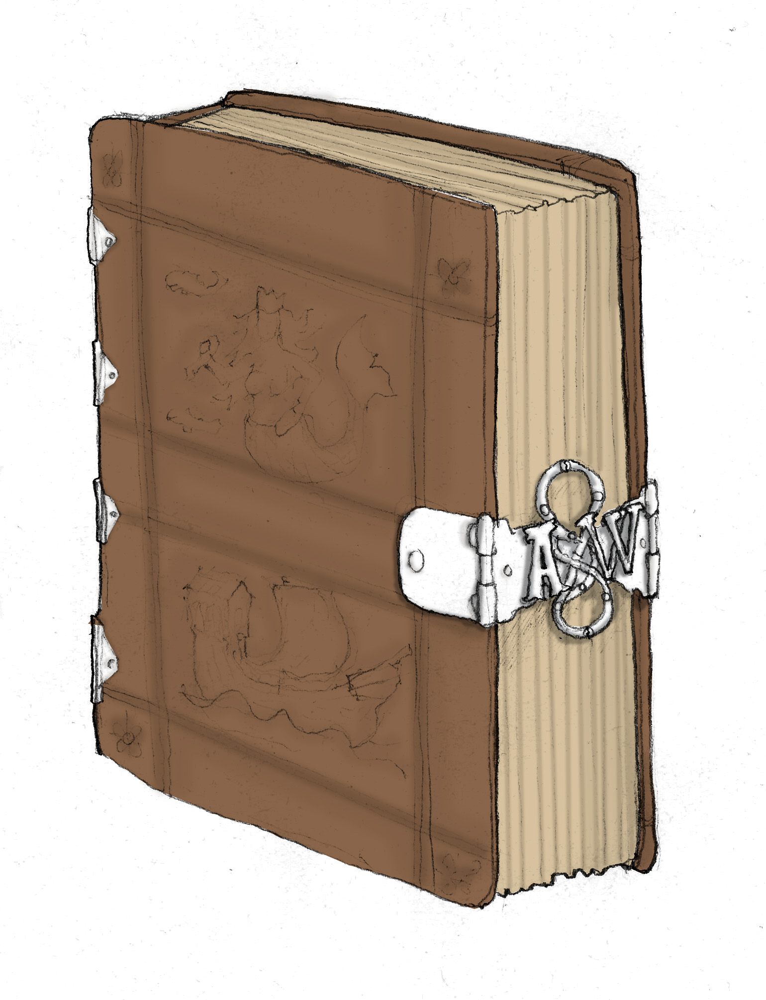

Tento článek má sloužit jako pomůcka pro hraní ve světě Ravnburghu. Obsahuje návody na tvorbu jmen postav čtyř největších národů, které se ve světě vyskytuje a jejichž příslušníci se ve městě mohou objevit. Často se jim říká „čtyři civilizované národy" a jejich jazyky se považují za jediné, kterými by lidé měli mluvit. Ostatní národy a jazyky jsou vnímané jako „barbarské". 

Jsou to **obyvatelé království Arlatu** (ve kterých se Ravnburgh nachází) a mezi něž patří většina obyvatel města, **poddaní Lvího císařství** na západě, **jižané** z městských států Ligy a **purpuřané** z padlé Purpurové říše na východě. Menší národy, jezdci z Východu, Zaskapuřané ze Žhnoucích pouští, zlobři z ledových fjordů, horští skřeti z pohoří Vhre a další, mají svá vlastní jména a pravidla pojmenovávání, která se nezřídka často liší. 

> Všechny čtyři národy používají kombinaci **křestního jména** a **příjmení** (rodinného jména). Mezi obyvateli Ligy se objevila móda používání druhého křestního jména a odsud se šíří dál, mimo městské státy ale stále ještě není nijak běžná.

---------------------------------------------

### Arlatští (obyvatelé severních království) 

Obyvatelé severních království Arlat (ve kterých se nachází Ravnburgh) spolu mluví **_arlatštinou_**. Pro tu v našem světě používáme **češtinu**. Jména obyvatel říše jsou anglická (z období renesance). 

#### Příklady mužských jmen: 

Adrian, Allen, Ambrose, Avery, Bartholomew, Benedict, Cuthbert, Filbert, Fulke, Geoffrey, Gerard, Giles, Hugh, Humphrey, Isaac, Jerome, Lancelot, Miles, Nathaniel, Oliver, Oswyn, Piers, Ralph, Reynold, Rowland, Simon, Solomon, Valentine, Walter 

#### Příklady ženských jmen: 

Agnes, Alice, Audrey, Avis, Blanche, Bridget, Cecily, Clara, Clemence, Constance, Dorothy, Emma, Fortune, Frideswide, Frances, Grace, Isolde, Joyce, Josian, Lettice, Maud, Marion, Marjorie, Margery, Millicent, Parnell, Thomasin, Wilmot, Winifred 

#### Příklady příjmení: 

Albyn, Alfraye, Ardalle,Ballard, Barnes, Bartelot, Bernewelt, Bownell, Brystowe, Bushbury, Callthorp, Cavell, Chatwyn, Chetwoode, Clitherow, Crane, Darley, Delamere, Edgerley, Ertham, Faylare, Fenton, Fowler, Gavell, Glenham, Greenway, Harbird, Henshawe, Inwood, Killigrew, Leeche, Lockton, Marsham, Mereworth, Narbridge, Norwood, Osborne, Peckham, Pownder, Rawson, Rykeworth, Sanburne, Selwyn, Sparrow, Swetenham, Thorne, Tyrell, Vaughan, Verney, Waldegrave, Willys, Yerde 

#### Šlechtická jména: 

Šlechtici používají před jménem titul ‚sir' pro muže a ‚lady' pro ženy a za jménem uvádí svůj přesný titul (s&nbsp;číslováním, kolikátý držitel tohoto titulu je). V běžné řeči se pak často oslovení zkracuje jen na titul a křestní jméno (‚sir Thomas') nebo příjmení (‚Eaterby'). 

#### Příklady jmen: 

> _Thomas Eaterby_ 
Kupec Thomas je z kupecké rodiny Easterbyů (známých podél celého pobřeží pro prodej kvalitní medoviny).

> _lady Philippa Warde, 3\. hraběnka z Whitsfieldu_ 
Phillipa je šlechtična z rodiny Warde a je třetí držitelkou titulu hraběte/hraběnky na Whitsfieldu. 

---------------------------------------------

### Císařští (_sujets de l'Empire_ (poddaní císařství)) 

Obyvatelé Lvího císařství na západě se používá **_leonaise_**, jazykem, který v našem světě reprezentujeme **francouzštinou**.  

#### Příklady mužských jmen: 

Acelin, Arnoul, Bertran,Conrrat, Estienne, Eudes, Gaultier, Garnier, Geoffroi, Gilet, Gidie, Guarin, Guiscard, Hervé, Huet, Jaquet, Jourdain, Junien, Luquin, Mahiet, Noel, Olivier, Onfroi, Oudin, Pierrey, Perrin, Rogier, Rolin, Thevenin, Vauquelin, Ysambart 

#### Příklady ženských jmen: 

Aalis, Alienor, Aimeé, Bastienne, Berthaude, Bietrix, Blanche, Cateline, Colaye, Estienette, Genevieve, Gervaise, Guillemette, Honnorée, Isabeau, Jehenne, Marion, Melisende, Odette, Perinne, Ragonde, Robine, Souveraine, Thierrie, Victoire, Vivien 

#### Příklady příjmení: 

Aleaume, Arrode, Aujouarre, Bailli, Balenier, Becquet, Boutellievre, Cadiot, Compere, Cordier, Dartois, Dubois, Edeline, Evrard, Ferrebourc, Fleuriot, Fournée, Genevois, Girart, Guichon, Haincelin, Hicquet, Charron, Jourdier, Lasset, Levasque, Marcadé, Merles, Nepveu, Niquart, Omfrpoy, Oudart, Pannier, Pontin, Quarré, Quillon, Raimboust, Ruisseau, Seraine, Tenaillot, Tireverge, Vaillant, Verderonne, Widerue 

#### Šlechtická jména: 

Císařská šlechta používá před jménem jeden z následujících přídomků -- pokud jde o bojující šlechtice (rytíře), pak používají titul _chevalier_ (pro muže) a _chevaleresse_ (pro ženy). Nižší šlechta využívá titul _écuyer/écueresse_ (v překladu doslova ‚štítonoš'). Existuje ještě titul _bâtard/bâtarde_ pro legitimizované levobočky šlechticů (nemohou nic zdědit, ale smí sloužit v družině své rodiny). 

Šlechtická příjmení vždy doprovází ‚lis' před jménem. Označuje odkud rodina původně pochází. Pokud je původní sídlo rodu stále v jeho držení, předpona je ‚lis-á-lis'. Hodnost a léna se uvádějí za jmény. 

#### Příklady jmen: 

> _chevaleresse Adélaïde lis Villequier_  
Rytířka Adélaïde pochází z rodu lis Villequier, sama ale nespravuje žádná léna. 

> _chevalier Blaise lis-á-lis Channeau, comté de Channeau et Ivoire_  
Urozený rytíř z rodu lis Channeau je hrabětem v domovském sídle své rodiny Channeau a také v hrabství Ivoire. 

> _chevalier Jehan Castadour_  
Rytíř Castadour byl sice pasován na rytíře, není ale z urozeného rodu a ani nespravuje žádné léno.  

---------------------------------------------

### Jižané z Ligy 

Obyvatelé městských států Ligy (největší mezi nimi Darnaj, Maele, Cadena, Onnam, Hirsin a Garsen) mluví jazykem zvaným **_saperiano_**, který v našem světě reprezentujeme **italštinou**.  

#### Příklady mužských jmen: 

Adelchi, Altero, Agnolo, Andreucio, Balduccio, Benasuto, Bonfante, Borso, Calvo, Cataldo, Cosmael, Donato, Elmuccio, Ercole, Facino, Galeazzo, Geragio, Grifonetto, Inghiramo, Isnard, Larione, Marsilio, Mazzeo, Morgante, Nastagio, Oderisi, Pangratio, Rambaldo, Salvi, Tedesco, Vituccio, Zorzi 

#### Příklady ženských jmen: 

Adaleta, Alasia, Ardita, Armilia, Belcolore, Bellacara, Brianda, Cali, Cilia, Corsa, Dovizia, Engelrada, Eufemia, Felice, Foscarina, Galiana, Giletta, Imeldina, Junipera, Lagia, Lioanrda, Maralda, Massaria, Mea, Menta, Nencia, Nera, Onesta, Orsetta, Piruza, Richelda, Rugiada, Sibilia, Tedesca, Tessina, Viridis 

#### Příklady příjmení: 

Arcimboldo, Arzento, Barbanetti, Bellirigo, Bronzino, Caranfa, Contarini, Crivelli, Fontane, Foscari, Gonzaga, Gritti, Loredan, Macenigo, Malatesta, Maragoni, Mirisa, Morata, Rizo, Rosso, se'Clinse, se'Crivelli, se'Barbari, sei Mesuredor, sei Viggo, Spalda, Toffanio, Viuo 

#### Šlechtická jména: 

Příjmení šlechticů se vyznačují přítomností předpony **se'** nebo **sei** před ním.Šlechtic nebo šlechtična se označují oslovaním _‚cavaliere/dama'_ před jménem a šlechtickým titulem za jménem. 

#### Příklady jmen: 

> _Onesto Inoffio Tadio_  
Onesto z rodiny Tadiů má dvojici křestních jmen (jak je módní ve státech Ligy) -- Onesto a Inoffio. Obě používá zpravidla najednou a jen úzcí přátelé mu říkají jedním z nich.  

> _dama Solavita Tullia se'Gritti, baronesa di Feanza_  
Šlechtična Solavita Tullia z rodiny se'Gritti je baronkou ve Feanze. 

---------------------------------------------

### Purpuřané (_pōrphyrîoi_ ) 

Purpuřané (obyvatelé padlé Purpurové říše a jejích nástupnických států -- Vadjaraku a tartasského despotátu) spolu mluví jazykem zvaným **_porphyrika_**, pro jehož reprezentaci v našem světě používáme **řečtinu**. 

#### Příklady mužských jmen: 

Aniketos, Andronikos, Apasios, Callinicus, Dositheos, Eumathios, Evaristus, Kallinikos, Katarodon, Kostas, Maro, Melitas, Menas, Nicetos, Nikotrios, Photios, Staurikos, Terbelis, Theoleptos, Vahan, Zygobenos 

#### Příklady ženských jmen: 

Aelia, Berenike, Danelis, Eirene, Erythro, Eudokia, Eulogia, Galla, Gemma, Hypomone, Kale, Loukia, Metrodora, Styliane, Verina, Zampea, Zoë 

#### Příklady příjmení: 

Příjmení končí na ‚-us', ‚-as', ‚-os' nebo ‚-es' pokud je jeho nositelem muž a ‚-a' nebo ‚-ina', pokud žena (muž tak bude například Menas Asidenus, žena Hypaia Asidena). Pokud se mluví o celé rodině, přidává koncovka ‚-oi' (rodina Asidenoi nebo Garidasoi). 

Amenas, Agryrus, Balsamon, Besarrion, Cephalas, Ciunnamus, Dandalo, eirenikus, Exazenus, Garidas, Heraclonas, Iasitas, Kalamodios, Kalekas, Kamytzes, Lascaris, Mangaphas, Mouzalon, Nepos, Opsaras, Palamas, Petzeas, Prodromos, Rizocopus, Servopoulos, Sphrantzes, Trytheus, Tzetzes, Xphias, Zonaras 

#### Šlechtická jména: 

V Purpurové říši, dokud existovala, neexistovala aristokracie jako taková. Všechny úřady byly jmenované, nikoli dědičné. Existovala nicméně skupina nejvýznamnějších rodin, které vlastnily rozsáhlé pozemky v rámci říše a většina úřadů byla obsazována jejich členy. Ti jsou známi jako _patrikioi_ (mužské označení je _patrikios_ , ženské _patrikia_ ) a užívají čestné oslovení _hypertimos_ (‚více než ctihodný'), podle nějž je možné je poznat. Jinak se před nebo za jméno dávají názvy úřadů, které daná osoba nosí. Vyjmenovávají se vždy všechny, nikoli jen nejvyšší - Purpuřané si dávají záležet na obřadnosti a přesnosti. Jakékoli zkrácení nebo nesprávné vyjmenování titulů se považuje za urážku.  

Nástupnické státy Purpurové říše jsou příliš slabé na udržení původních systémů správcovství a začaly udělovat území podobné lénům na západě - ty se jmenují _archōntia_ a titul správce takového území je _archōn_ (stejně jako _patrikioi_ užívá čestné oslovení _hypertimos_ ). Každý _archōn_ vybírá daně na svém území, za což si může díl nechat a je povinen postavit oddíl na obranu země (jaké a jak vyzbrojené je přesně zaznamenáno ve statutech). První _archōntie_ se udělovaly doživotně a po smrti _archōntů_ se buď přerozdělily nebo udělily někomu jinému. Postupně se ale čím dál víc udělují dědičně, čímž vzniká nová vrstva šlechty. Ten, který drží více _archōntií_ nebo drží rozsáhlá, případně strategicky důležitá území se označuje jako _disarchōn_ (dvojitý _archōn_ ) nebo _megas archōn_ (velký _archōn_ ). 

#### Příklady jmen: 

> _hypertimos Garidas Lascaris, spatharios kai kentarchos_  
Podle čestného oslovení a absence titulu _archōna_ je jasné, že jde o _patrikia_ , příslušníka jedné z mocných magnátských rodin bývalé říše. Byl-li by zároveň _archōnem_ , jeho čestné oslovení by bylo _dishypertimos_ (‚dvojnásob víc než ctihodný'). Garidas je také _spatharios_ („nositel meče", jeden z tělesných strážců vladaře) a _kentarchos_ (velitel _kentarchie_ , oddílu o 100 mužích). 

> _magistrissa Thecla Photia_  
_Magistrissa/Magistros_ je čestný úřad dvora a jeden z nejvyšších takových úřadů. Ti, kteří jej zastávají, jsou poradci vládce. U císařského dvora bylo zpravidla 12 držitelů titulu, dnešní nástupnické státy jich mají obvykle jen 3-4, což znamená, že _magistrissa_ Photia je vlivná osoba (navzdory tomu, že nepatří mezi _patrikioi_ ). 

---------------------------------------------

### Závěr 
Doufáme, že vám jména budou ku pomoci při hraní vašich vlastních her, ať již pro svět Ravnburgu nebo jakoukoli jinou vaši hru! Příjemné hraní!
