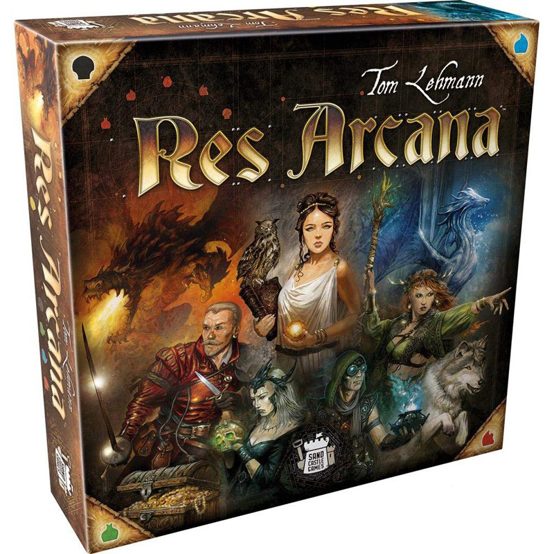
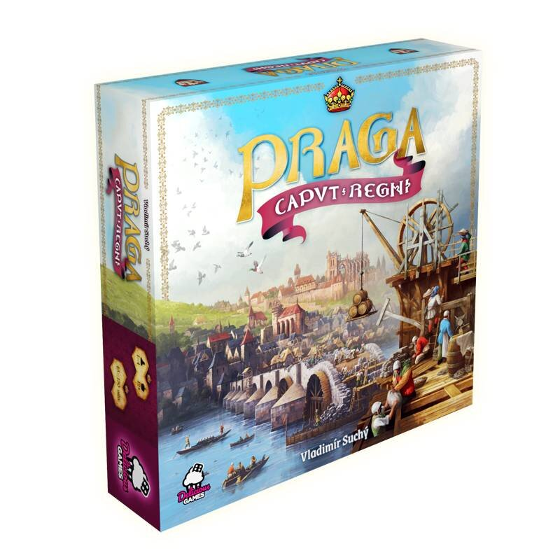

V tomto Drakkaru vám přinášíme recenzi na dvojici deskových her.

------------------

## Res Arcana 

> _Autor:_ Tom Lehmann 
> _Rok vydání:_ 2019  
> _Stručná charakteristika:_ 2--4 hráči, 25--50 minut, eurohra, karetní, fantasy, draft karet, management zdrojů 

Tom Lehmann je zkušený autor, který se proslavil především karetní peckou `Dobyvatelé vesmíru (Race for the Galaxy)`, která vyšla v roce 2007, dočkala se několika rozšíření a je hojně hraná dodnes. 

V kartovce `Res Arcana` vás zavede do fantasy světa, kde v roli mága soupeříte se svými protivníky o to, kdo jako první dosáhne pomyslného vrcholu moci, reprezentovaného ve hře ziskem 10 vítězných bodů. Jedná se o svižnou strategickou eurohru, takže rozhodně nečekejte hluboký ponor do příběhu. Nepříliš hluboko pod líbivým fantasy hávem se skrývá robustní matematický model. 

Ve skutečnosti jde o to, postavit co nejrychleji kombinaci karet (artefaktů), která vám umožní vygenerovat co nejvíce surovin (zde zvaných esence). Ty potom použijete na nákup hodnotnějších karet (monumentů a kouzelných lokací), jež vám zajistí bodový zisk. 

Kromě karet samotných jsou součástí hry už jen žetony představující esence, žádnou desku ani figurky nečekejte. Karty samy o sobě jsou hezky a přehledně zpracované, a přes ikonografickou jednoduchost nabízejí velice rozmanité kombinace efektů. Kromě prosté pravidelné „produkce" esencí můžete prostřednictvím artefaktů obětovat jiné artefakty z ruky nebo ze stolu, měnit druhy esencí, střádat esence na artefaktech či kouzelných místech. Takže vymýšlení nejlepší strategie, jak maximalizovat zisk, dá vašemu mozku zabrat. Kromě „běžných" artefaktů jako Kámen mudrců, Strom života nebo Obětní dýka, jsou k dispozici i karty označené jako tvorové (např. Mořská panna) a draci (např. Ohnivý drak). Ty mají další využití v návaznosti na kouzelná místa, přičemž draci navíc dokážou útočit na soupeře a mají vlastní bodovou hodnotu. 

Útoky prostřednictvím draků přinášejí do hry interakci, které se obvykle v eurohrách nedostává. Možnost přímo uškodit soupeři je pak ještě vzácnější, protože mnozí hráči euroher těžce nesou, když je jim ubližováno, a takovou hru zavrhnou kvůli frustraci. Od Toma Lehmanna byl tedy poněkud odvážný počin, když tento princip do hry zahrnul. Nutno ovšem podotknout, že dračí útoky v Res Arcana nemají šanci protivníka úplně zdevastovat, jedná se spíše o takové lehké okusování. Kromě toho hra nabízí bezpočet možností, jak se proti útokům chránit. 

Partie hry `Res Arcana` je strukturována do kol (rounds), během nichž se hráči střídají v tazích, dokud všichni neohlásí _pas_ . Ve svém tahu můžete vyložit kartu, koupit monument či kouzelné místo, nebo využít schopnost již vložené karty. Při tom se zhusta využívá princip _tapnutí_ karet, proslavený hrou Magic the Gathering, takže si snadno udržíte přehled nad svou rozrůstající se „továrnou na esence". Obvykle hra trvá pět kol, během nichž hráči dosáhnou (nebo přesáhnou) cílových 10 bodů a tím ukončí hru. Aktuální kolo se obvykle dohrává. Některé karty ovšem dávají možnost hru zavřít ihned (pokud je splněna podmínka 10 bodů alespoň u 1 hráče) a tím soupeře překvapit a překazit mu plány. Takových prvků, které do závěru hry přidávají drama, je v Res Arcana více. Například žeton začínajícího hráče má samotný hodnotu 1 bodu a putuje k tomu hráči, který jako první ohlásil _pas_ . To platí i na konci hry, tedy hráč, který je v závěrečném kole nejdříve hotov, má výhodu 1 bodu. 

`Res Arcana` si brzy po vydání získala zaslouženou popularitu. Tom Lehmann ví, co dělá, takže ve svém výtvoru naservíroval hráčům všechno, co mají rádi: Atraktivní téma, dobře otestovaný a vyvážený systém, přiměřenou míru interakce, chytré mechaniky zajišťující, že hra bude gradovat do napínavého finále, rychlé střídání hráčů a svižný průběh, takže nečekáte dlouhé minuty, až si ostatní vyřeší své tahy. 

Profesionální gamedesign je korunován profesionálním provedením. Obrázky jsou krásné a není jim co vytknout, ikonografie je přehledná a karty se díky ní obejdou s minimem textu. Zde stojí za to srovnat `Res Arcana` s již zmíněným autorovým legendárním dílem `Race for the Galaxy`. U něj totiž došlo k tomu, že kvůli složité ikonografii, a ne tak lákavému tématu, si hra získávala popularitu obtížněji, a na našem trhu dokonce propadla. Uvidíme, jak se bude dařit české lokalizaci Res Arcana, kterou v těchto dnech uvádí Blackfire. 

Přestože se jedná o karetní hru, je faktor náhody nepříliš podstatný. V balíčku, se kterým hrajete, je poměrně malý počet karet (artefaktů). Takže v průběhu hry máte možnost, pokud využijete příslušné mechaniky, dostat do hry jakoukoli z nich. Pro ty, kdo chtějí omezit náhodu i v počátečním rozdělení balíčků, je k dispozici varianta draft. Celkově malý počet karet zároveň znamená, že po odehrání několika (desítek) partií už se hra stává repetitivní. Dá se tedy očekávat, že rozšíření `Res Arcana` budou stejně úspěšná, jako hra samotná, a že jich bude hodně... 

### Shrnutí

> _Plusy:_ Krásné a funkční provedení, možnost interakce, skvěle vyladěný systém, napínavá gradace 

> _Minusy:_ Slabší atmosféra, po nějaké době repetitivní 

> _Celkem:_ 90 % 

------------------------

## Praga Caput Regni 

> _Autor:_ Vladimír Suchý  
> _Rok vydání:_ 2020  
> _Stručná charakteristika:_ 2--4 hráči, 45--90 minut, eurohra, budovatelská, volba akcí, point salad\* 

`Praga Caput Regni` je na první pohled velkolepou hrou. Bohatě ilustrovaná herní deska měří 56 × 84 cm, a neméně ohromující je množství a rozmanitost komponentů. Mezi nimi vynikají trojrozměrné kartonové „skládačky" představující Karlův most, katedrálu sv. Víta a Hladovou zeď. Už na první pohled je jasné, že hra je poctou slavné éře Prahy za krále Karla IV., a to i kdyby vám význam latinského názvu hry nebyl zřejmý. Hráči představují majitele stavebních hutí, které se podílejí na budování Prahy. 

Po několika zahráních musím říct, že `Praga Caput Regni` poněkud klame tělem. Při rozbalování krabice si říkáte, že to bude nesmírně komplexní hra na mnoho hodin, jakmile si ale přečtete pravidla, zjistíte, že vše je zřejmé, logické, a nakonec i docela snadné. Po pár zahráních dostanete herní partii (ve dvou) pod padesát minut a bude vám to utíkat jako voda. Objem a náplň krabice zkrátka neodpovídá skutečné náročnosti hry. Jestli je to dobře nebo špatně, ať si rozhodne každý sám. Za sebe ovšem musím přiznat, že čas potřebný na přípravu a úklid vzhledem k čisté herní době mi připadá neadekvátní. Na konci partie hra vyloženě křičí „zahraj si mě ještě jednou, když už mě máš rozloženou". 

Těžištěm herních mechanik je „akční kolo", točna umístěná přímo na plánu, pomocí které volíte, jakou akci budete v aktuálním tahu provádět. Můžete těžit zlato a kámen, stavět hradby a budovy, vylepšovat technologie nebo postupovat po Královské cestě. Většina akcí vás stojí nějaké zdroje, proto musíte plánovat aspoň pár akcí dopředu, abyste si je včas zajistili. V `Praga Caput Regni` se používají dvě klasické suroviny (zlato a kámen) a dvě poněkud netradiční -- vejce a gotická okna (zlatá a stříbrná). Ano, čtete správně. Vejce využijete při postupu po Královské cestě, která na rozdíl od té skutečné končí na Karlově mostě (hle oslí můstek k vejcím). Zlatá a stříbrná okna se hodí pro zahrání bonusové akci, nebo pro zvýšení hráčova podílu na stavbě Katedrály či Hladové zdi. 

Vítězné body získáváte ve hře takřka v každém tahu, vyjma úplného začátku hry, kdy máte ještě málo zdrojů a vylepšení. Zisky v průběhu rostou v souladu s tím, jak optimalizujete svou stavební huť. Příkladem může být těžba zlata: Čím více zlatých dolů vlastníte, tím více bonusových bodů získáte při akci „těžba zlata", přičemž další vítězné body je možné získat vylepšením technologie těžby. 

Hra je pozoruhodně vyvážená a nutí vás do provádění všech typů dostupných akcí. Nenajdete zde zcela odlišné vítězné strategie, jak tomu bývá v jiných hrách. Pokud byste se zde rozhodli, že zkusíte hrát „přes budovy" nebo „přes technologie", tak záhy zjistíte, že zůstáváte daleko za ostatními hráči, kteří kombinují více cest. V tom je podle mého názoru hlavní slabina hry. Po několika zahráních zjistíte, že nemá cenu žádné velké strategické plánování, ale stačí přemýšlet dva tři tahy dopředu. Vždy, když jste na ředě, provedete akci, která vám dá v tu chvíli nejvyšší bodový zisk. Hra samozřejmě obsahuje i závěrečnou bodovací fázi, která může zamíchat s pořadím hráčů, ale opět je to natolik vybalancovaná záležitost týkající se všech aspektů hry, že její vliv není zásadní. Je velmi těžké ostatní soupeře „překvapit" pečlivě připravenou strategií a v dramatickém finále urvat vítězství. 

`Praga Caput Regni` obsahuje množství variabilních komponentů i volitelných modifikací, které mají zajistit, aby každá partie byla trochu jiná. Je jich ale tolik, a jsou mezi sebou natolik vyvážené, že se kýžený efekt nedostavuje. Ať už použijete jakoukoli kombinaci rozložení, budou vám s odstupem připadat všechny odehrané hry velmi podobné. 

Grafické zpracování musím pochválit. Přestože na začátku se může zdát příliš nepřehledné, rychle si na ně zvyknete a orientujete se bez problémů. Autoři vsadili možná trochu odvážně na styl napodobující středověké ilustrace, a výsledek je podle mě velice zdařilý. Rozložená hra se všemi komponenty se dá s nadsázkou označit za umělecké dílo. Esteticky založení hráči, stejně jako milovníci středověké Prahy, si můžou k hodnocení přidat 20&nbsp;%. 

### Shrnutí

>_Plusy:_ Velkolepé (nejen) grafické zpracování 

>_Minusy:_ Repetitivní navzdory modifikacím, postrádá napětí ve finále, bez interakce 

> _Celkem:_ 50 % 

\* _Point salad: Herní princip, v jehož rámci hráči získávají vítězné body za rozmanité akce, obvykle po troškách a v průběhu celé herní partie._
