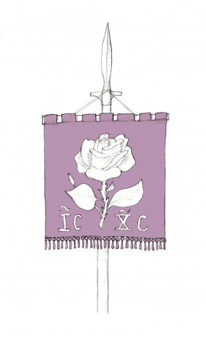
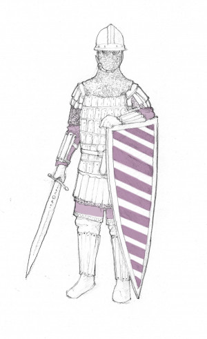
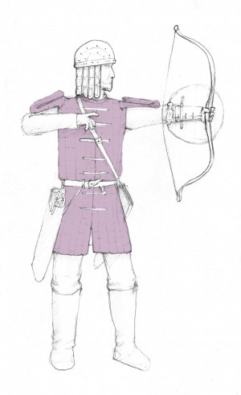
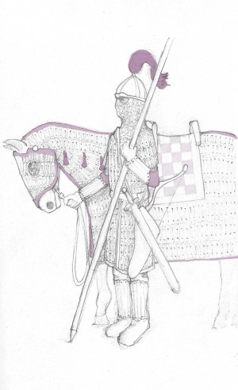
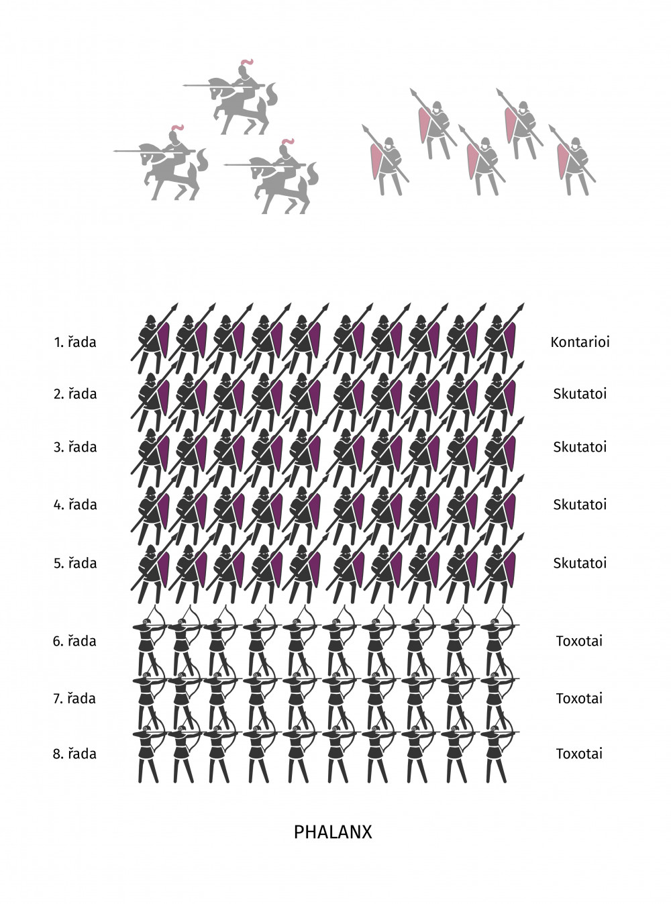
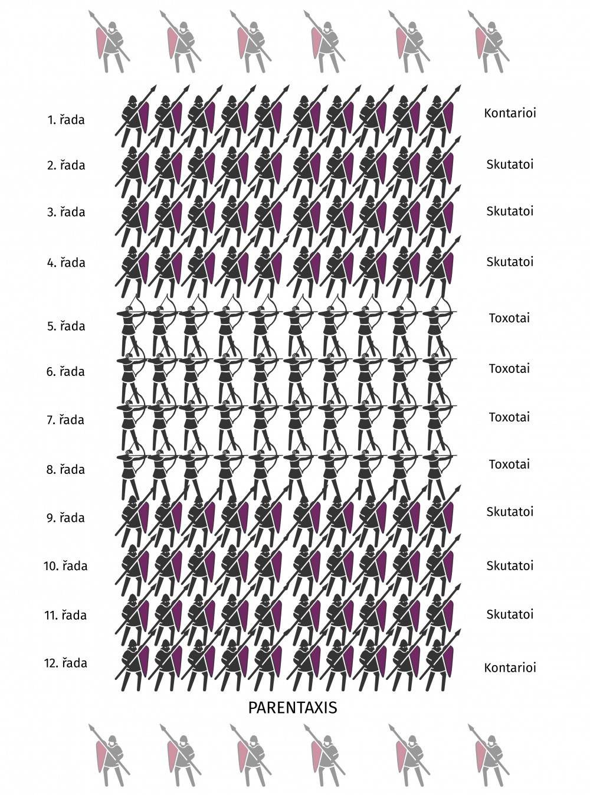
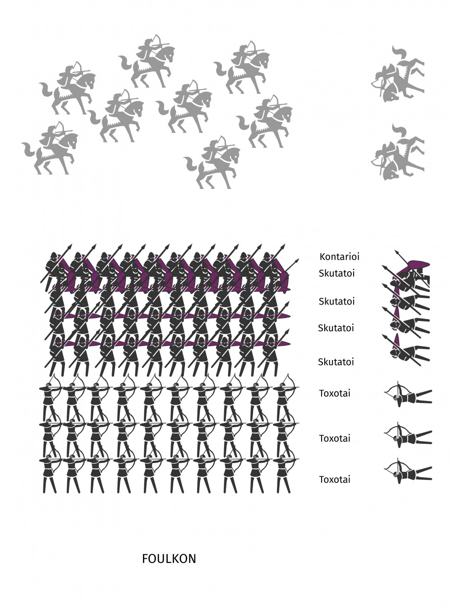
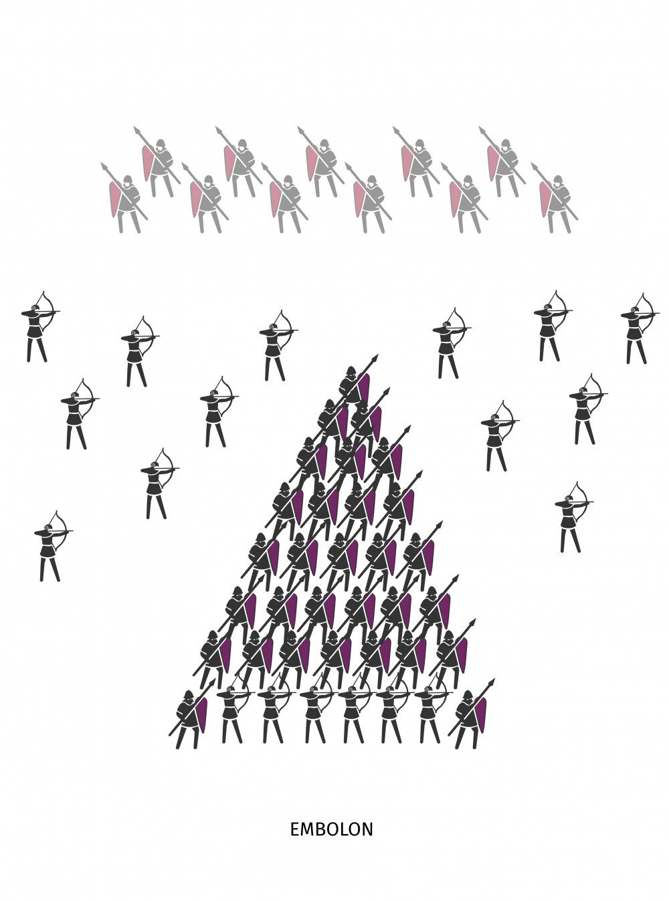

Na východ od severních království Arlatu (kde leží Ravnburgh) se nacházela _Basileía tōn Porphyríōn_, známá v obecné řeči jako Purpurová říše. Byl to mocný a rozlehlý stát, který dlouho bohatl z kontroly dálkového obchodu s exotickými zeměmi daleko za branami Kani-kara. Před 112 lety, v Roce padajících hvězd, bylo hlavní město Purpurové říše dobyto a poslední _basileos_ zahynul v jeho troskách. Většinu území pro sebe uchvátili jezdci z Východu a vytvořili si zde vlastní státy. Po mocné říši zůstaly dva nástupnické státy kontrolující jen zlomek původní území říše – Tartasský despotát a Vadjarak.

## _Porphyrioś Stratós_ (Purpurové vojsko)

Zatímco vojska království Arlatu, států Ligy a Lvího císařství jsou založená na podobných principech a jsou si vzájemně podobná (popis takových vojsk lze najít v článku [v Drakkaru 76](https://drakkar.sk/76/ravnburgh-valecnictvi-rane-renesance.html)), vojsko padlé Purpurové říše mělo úplně nezávislou tradici. Purpuřané dlouho bojovali s Jezdci z Východu a jejich lehkou jízdou a jízdními lučištníky, stejně jako klanům Zaskapuru. Svářili se ale i se svými západními sousedy. Purpuřanské vojko před dvěma století dokonce obléhalo Ravnburgh. Zdi města tehdy nicméně neprorazili a odtáhli s nepořízenou. Tehdejší válka skončila nerozhodně a Purpuřané zase odtáhli.

Ozbrojená síla Purpurové říše byla opřena o tři různé druhy vojsk:

### Thematické armády

Základem a největší částí vojka byly _thematické_ armády. _Thema_ byl zároveň název provincie a zároveň jednotky o síle deseti tisíc mužů (deseti _chiliarchií_, viz níže), kterou tato provincie stavěla do pole a živila. _Strategos_ byl zároveň administrativním správcem celé provincie a zároveň vojenským velitelem _thematu_ v případě války.

Vojáci _thematických_ armád, nazývaní _stratiotoi_, byli profesionální vojáci, kteří v dobách míru obdělávali státní vojenskou půdu, která jim byla propůjčena. Z té nemuseli odvádět daně a dostávali i plat vojáka. Museli se také zavázat, že i jejich potomci budou sloužit ve vojsku. _Stratiotoi_ tak představovali profesionální třídu vojáků-rolníků, kteří zastávali vojenské povinnosti, zatímco od běžných obyvatel se nikdy neočekávalo, že budou bojovat proti útočníkům. Vojenské tradice a zkušenosti se v rámci _thematických_ armád předávaly z otce na syna. V případě ztrát se noví vojáci pro oddíly verbovali v rámci _themy_ (provincie).

### Tagmata

_Thematické_ armády, které byly svolány pro případ válečného tažení nebo nebezpečí, doplňují menší profesionální jednotky zvané _tagmata_. Ty byly menší (zpravidla o síle tisíc mužů), byly stále ve zbrani a v případě války tvořily jádro armády. V míru byly rozmístěny u hranic a ohrožených míst, kde sloužily jako „požárníci“, aby hasili krize a bojovaly proti nájezdníkům. Měly také vyšší podíl důstojníků než běžné jednotky, protože sloužily jako výcvikové oddíly pro mladší důstojníky. Ti po službě u _tagmatu_ mohli s bojovými zkušenostmi udělat rychlou kariéru v provinciích a zastávat vysoké hodnosti v rámci _thematických_ armád. Elitní jednotky, které strážily hlavní město a fungovaly jako tělesná stráž _basilea_ byly také označovány jako _tagmata_. Velitelem _tagmatu_ byl _domestikos_.

### Hetaireia (žoldnéři)

Jako _hetaireia_ byli označováni žoldnéři z ciziny, kteří doplňovali purpurové armády. Většinou šlo o specialisty, kteří vojsku poskytovali schopnosti, které sami nedokázalo poskytnout. Purpurové vojsko zpravidla doprovázeli jízdní lučištníci rekrutování mezi zaskaurskými kočovníky nebo východními stepními kmeny, v posledním století před pádem říše najímala mezi státy Ligy také pikenýry, střelce a těžkou rytířskou jízdu.

## Druhy vojáků

Purpurová říše nasazovala do boje různé druhy vojáků. Mezi nejčastěji zastoupené patří následující:

### Pěchota

#### _Skutatoi_ („štítonoši“)

Tvořili většinu _stratiotoi_ (vojáků _thematických_ armád) a většinu pěchoty říše. Protože často bojovali proti kočovníkům a jízdním lučištníkům, byli velice dobře chráněni před šípy. Nosili kvalitní brnění a chránili se velkými mandlovými štíty. Na hlavě měli _krános_ (přilbici) s kroužkovým závěsem, který jim chránil tváře a krk. Na těle nosili čtyři vrstvy brnění – na těle _kremesmata_ (těžká textilní košile po kolena), na ní _lōrikion_ (kroužková košile), přes ni _vamvakion_ (vycpávané brnění) a nahoře _klivanion_ (šupinový kyrys) doplněný o _pteruges_ (pruhy kůže chránící ramena a holeně).

Jejich hlavní zbraní byl _kontarion_ (dlouhé koupí, asi 2,4 metrů dlouhé) a chránili se velkým mandlovým štítem zvaným _skouton_. Ten chránil většinu těla a díky protáhlému tvaru i nohu, která byla zapřená vpřed. Každá jednotka měla _skouton_ stejných barev. U pasu měli _skutatoi_ jako zbraň zblízka _spathion_ (dlouhý oboubřitý meč, asi 70-80 cm dlouhý) nebo _paramerion_ (jednobřitá šavle, kterou Purpuřané převzali od kočovných jezdců).

Někteří pěšáci používali obouruční zbraň s dlouhou jednobřitou rovnou nebo jemně zakroucenou čepelí, zvanou _rhompaia_. Jílec měl asi 50 cm a čepel byla dlouhá mezi 60-80 cm. Tyto meče nosila tělesná stráž _basliea_ přes pravé rameno a byly výrazem jeho autority.

#### _Kontarioi_ („kopiníci“)

Byli vyzbrojeni a vystrojeni stejně jako ostatní _skutotai_, ale byli zvlášť vybráni mezi nimi a byli to nejsilnější a nejurostlejší mezi nimi. Stáli v prvních řadách a jejich _kontarion_ byl větší a silnější (až 4 metry dlouhý). V případě nájezdu nepřátelské jízdy nebo útoku byli ti, kdo přijímali nepřátelský úder a rozdávali první rány.

#### _Toxotai_ („lučištníci“)

Pěší lučištníci byli skvěle vycvičení v užívání kompozitních luků, a zatímco _skutatoi_ drželi linii a chránili řady za nimi štíty, _toxotai_ posílali šíp za šípem proti nepřátelským řadám. Na rozdíl od kočovných jízdních lučištníků, kteří dávali přednost mrakům šípů, kterými zasypávali nepřátele, _toxotai_ byli trénováni v přesnosti a cílených zásazích, kterými sráželi nepřátelské jezdce z koní. Nosili lehké přilbice, _vamvakion_ (vycpávaná brnění), kompozitní luk jako hlavní zbraň a _spathion_ jako záložní zbraň pro boj zblízka. Občas také používali _thyreos_, malý kruhový štítek.

### Jezdci

#### _Kataphraktoi_ („obrnění“)

Byli to obávaní a těžce obrnění jezdci, kteří symbolizovali sílu Purpurové říše. Nosili těžká brnění jako _skutatoi_, ale ještě důkladnější. Byli chráněni nejlepším brněním, které mohla říše vytvořit, a i jejich koně byli chráněni těžkým šupinovým brněním. Na hlavě nosili kónickou přilbici s koňským ohonem nabarveným v barvách své jednotky. Stejnou barvu měl i plášť a vrstvy látky v brnění.

Měli stejný kompozitní luk jako _toxotai_ a byli experti v jeho používání. Používali ho jako hlavní zbraň do chvíle, než zaútočili na nepřítele. Stříleli ze sedel celou dobu, zatímco útočili proti nepříteli ve snaze oslabit jeho řady. Útočili cvalem (nikoli tryskem jako západní rytíři) a několik desítek metrů před cílem odložili luky a chopili se kopí (jejich _kontarion_ byly kratší a tenčí než ty, které používala pěchota a v případě potřeby se daly hodit jako oštěp). Pří útoku drželi kopí oběma rukama, aby mu předali dostatečnou energii i při nižší rychlosti koní. Pro boj zblízka používali _spathion_, _paramerion_ nebo celoželezný palcát s těžkou hlavicí k drcení přilbic a brnění zvaný _matzoukion_. Občas nosili na levé paži připevněný _thyreos_, aby měli obě ruce volné pro střelbu z luku nebo útok kopím. Na nohách nosili vysoké jezdecké boty, do kterých zasunovali kopí, aby si uvolnili ruce v případě, že potřebovali střílet z luku.

Jejich největší devízou byla schopnost upravit svoje taktiky podle nepřátel proti kterým bojovali, bojovat různými zbraněmi a způsoby a tím pádem se postavit široké škále protivníků.

#### _Koursores_ („nájezdníci“)

Druh lehké jízdy, která po ztrátě východních území říše tvořila většinu jezdeckých sil, které stavěly do pole _thematické_ armády (zatímco většina _kataphraktoi_ byla součástí tagmat). Jejich koně neměli brnění, aby neomezovali mobilitu jízdy. Jezdci nosili prošívanice, kroužkové košile nebo šupinové kyrysy a byli ozbrojeni luky, vrhacími oštěpy a _parameriony_ nebo palcáty. Většinou byli využíváni pro průzkum, pronásledování protivníka, rychlé nájezdy a plenění území nepřítele. V bitvě často znepokojovali nepřátele střelbou, nájezdy, předstíranými ústupy a lákáním nepřátel do léček, stejně jako v případě útoku posílení klínu _kataphraktoi_ v druhé linii.

Jezdci se stejnou výzbrojí a účelem na bojišti (často sami bývalí _koursores_ nebo kočovníci) jsou na západě známí jako _étrangers_ a bývají najímáni jako žoldnéři.

#### _Hippo-toxotai_ („jízdní lučištníci“)

Jízdní lučištníky bez brnění verbovaly především východní _themata_, ale po jejich postupné ztrátě při úpadku Purpurové říše je stále více nahrazovali najatí _hetaireiai_ z řad kočovných kmenů. Zpravidla neměli žádnou zbroj a jejich koně nebyli chráněni brněním. Za bitevní čárou měli nezřídka několik náhradních koní s plnými toulci, které měnili, aby dokázali být stále v pohybu a vysílat mraky šípů proti nepřátelům.

## Organizace jednotek

Základní pěší jednotkou je _chiliarchia_ („tisícovka“), kterou tvoří 650 _skutatoi_ a mezi nimi _kontarioi_ a 350 _toxotai_. Velitelem je _chiliarchos_. _Chiliarchia_ se dělí na deset _kentarchií_ po sto mužích, kterým velí _kentarchos_.

Pěchota uměla rychle zaujmout čtyři hlavní formace:

- _phalanx_ – Formace osm řad hluboká. Formovala se proti nepřátelské pěchotě nebo nájezdu nepřátelské jízdy. V první linii stáli _kontarioi_, druhou až pátou řadu tvořili _skutatoi_ a za nimi další tři řady _toxotai_.

{:.map}

-   _parentaxis_ – V případě, že vojsko bylo v ohrožení ze všech stran. Vepředu a vzadu stály 4 řady _skutatoi_ a chráněny mezi nimi byly 4 řady _toxotai_. Pěchota tak byla stejně chráněna proti útoku zepředu i zezadu a lukostřelci mohli střílet na obě strany. Boky jednotky chránila zpravidla vlastní jízda.

{:.map}

-   _foulkon_ – Těsná formace určená proti silné palbě nepřítele. Jednotka při ní srazila štíty k sobě a zadní řady vytvořily „střechu“ nad vojáky vepředu. Tím vznikla solidní ochrana před nepřátelskými šípy a projektily.

{:.map}

- _embolon_ („klín“) – Tuto formaci zaujala pěchota v případě, že měla prorazit řady protivníka. Zpravidla se pro ni sestavilo několik _chiliarchií_ dohromady, které vytvořily mohutný klín. _Kontarioi_ byli v první řadě, za nimi _skutatoi_. _Toxotai_ buď postupovali za nimi a pálili šípy přes jejich hlavy nebo opustili formaci a rozptýleně před postupujícím klínem stříleli šípy, aby oslabili místo, kam měl klín udeřit.

{:.map}

Základní jednotkou jízdy je _arithmos_ o síle 300 mužů. Velitelem této jednotky je _kōmes_. Tvoří ji 6 _allaghia_ (každá o síle 50 mužů), kterým velí _pentekontarchos_. Každou _allaghia_ pak tvoří 5 _dekarchií_ (které velí _dekarchos_).

## Taktika armády

Rozhodující zbraní Purpurové říše byla její jízda, a především její symboličtí _kataphraktoi_. Pěchota ale byla neméně důležitá, Za normálních okolností sloužila jako pevná zeď, o kterou se jízda mohla opřít. Za řadami pěšáků se jízda mohla znovu zformovat v případě porážky, mohla doplnit vystřílené šípy a zchvácené koně za čerstvé. Jízda se zpravidla rozmístila po stranách řad pěchoty a za nimi. Purpuřanští generálové dávali přednost obchvatům a útokům na boky přednost před čelními nájezdy, které prováděli západní rytíři. Díky propracované logistice dokázaly purpuřanské armády vydržet dlouho v poli a mohly si dovolit oslabovat protivníka, lákat jej do léček, oslabit několika nočními útoky, nebo jej naopak nalákat hluboko do svého území, kde jim dojde jídlo a pití. _Kataphraktoi_, _toxotai_ a _hippo-toxotai_ zasypávali protivníka přesnými salvami šípů a teprve ve chvíli, kdy v řadách protivníka objevila slabina, vyrazili vpřed a prolomili slabá místa s kopími v ruce.

V případě, že purpuřanská armáda čelila protivníkovi se silnou těžkou jízdou (jako jsou rytíři ze Lvího císařství), jízda se zformovala za řadami pěchoty, která postupovala první. Pěšáci se pokusili oslabit nepřátelské pozice a vytvořit průlom, který pak využili _kataphraktoi_. Ukázalo se, že nájezd západních rytířů dokáže zcela rozvrátit řady _kataúhraktoi_, kteří jim nedokázali vzdorovat. Taktika purpuřanského vojska tak byla nedat nepřátelům možnost k bitvě, kde by mohli nasadit rytíře pro takový nájezd. Oproti vojsku Purpurové říše byli západní rytíři nedisciplinovaní, nejednotní, opomíjeli průzkum, logistiku a na noc neopevňovali své tábory. Purpuřanští generálové se tak snažili napadat je v nočních bitvách, opotřebovat je, narušit jejich zásobování a zničit je, aniž by dostali příležitost bojovat po svém.

Purpurová říše byla dlouhá století v defenzívě proti přesile nepřátel, naučila se proto opatrnosti ve válce. Generálové purpurového vojska nehledali slávu v bitvě, ale naopak se ji vyhýbali, kde to bylo jen možné. Šetřili své skromné síly a nasadili je jen do bitev, které si sami vybrali a ve kterých měli drtivou převahu. Vojsko dávalo důraz na průzkum a získávání přesných informací o nepříteli, aby generál mohl zvítězit za co nejmenších ztrát. V co největší míře využívalo na západní standardy „nečestného boje“ - úskoků, přepadů ze zálohy, vražd generálů, předstíraných ústupů, které lákají pronásledovatele do léčky a dalších. Na polní bitvu bylo nahlíženo jako na riziko, kterému bylo lepší se vyhnout, dokud to šlo.

## Vojska nástupnických států Purpurové říše

Purpurová říše dokázala postavit do pole mohutné armády a po dlouhou dobu odolávala útokům ze všech stran. Postupem času ale série katastrof, občanských válek, neschopných _basileů_ a zesílení vnějšího tlaku vedly ke kolapsu říše. Dnes po ní zůstaly dva nástupnické státy, které pokračují v tradici Purpurové říše, ale jen se zlomkem její síly, nadále ohrožovány Jezdci z východu, kteří si vytvořili vlastní státy na troskách a bývalých územích říše.

Vojska nástupnických států Purpurové říše mají k dispozici mnohem méně mužů a bojují především proti jezdcům z východu. Na rozdíl od široké škály protivníků, kterým čelila Purpurová říše se tak začali specializovat na boj proti nim. Stalo se proto běžnou praxí ozbrojit i _skutatoi_ luky. V bitvě položí svá kopí před sebe a střílí kompozitními luky jako _toxotai_. V případě, že se přiblíží nepřátelská jízda na dosah nebo se objeví pěchota, odloží luky a zvednou svá kopí, aby vytvořili opět zeď štítů, zatímco _toxotai_ za nimi pokračují ve střelbě. _Kontarioi_ nezřídka zanikají jako odlišná část vojska a _skutatoi_ s luky a kopími nastupují i v první řadě.

### Tartasský despotát

_Stát na březích Vnitřního moře, který se udržel na pobřeží a dnes bohatne díky strategické poloze na křižovatce cest na Dálný východ a Hluboký jih. Státy Maelské ligy tu mají silné zastoupení a mají vlastní čtvrtě a kotviště v tartasských přístavech. Jazyk Ligy je tu slyšet téměř stejně tak často jako porphyrika (jazyk padlé Purpurové říše). Bez podpory z Arlatu a Ligy by Tartas dávno padl, proto tu mají obchodní domy ze západu velké slovo. Dnes se despotát sestává ze tří menších území – hlavní tartasské pobřeží (s přístavy Nyssea, Dolcyra, Attaleium a Sebastimon), ostrov Zaphyrium a exkláva kolem přístavu Chiliat._

Tartas bývalo _thema_ říše a přes ztrátu části území se podařilo zdejší _thema_ udržet. Při ústupu ze zkázy Purpurové říše zde útočiště našli také _Athanatoi_ („Nesmrtelní“), elitní _tagma_, které sloužilo za starých dob jako tělesná stráž _basileů_. V současné dobře bojují za tartasského despotu, ale zároveň si zachovávají věrnost staré říši a jejich _domestikos_ má vlastní záměry a plány, které se ne vždy shodují se zájmy despotátu.

Jedno oslabené _thema_ bylo ale příliš málo na to, aby despota udržel zbytek svého území. Tartas proto začal udělovat území podobné lénům na západě. Ty se jmenují _archōntia_ a titul správce takového území je _archōn_. Každý _archōn_ vybírá daně na svém území, za což si může díl nechat a je povinen postavit oddíl na obranu země (jaké a jak vyzbrojené je přesně zaznamenáno ve statutech). První _archōntie_ se udělovaly doživotně a po smrti _archōntů_ se buď přerozdělily nebo udělily někomu jinému. Postupně se ale čím dál víc udělují dědičně, čímž vznikla nová vrstva šlechty.

Tartasský despotát je také spojencem států Ligy, kterým dovolil, aby si v jejich přístavech zřídily své čtvrti a kotviště. V případě, že jsou jejich zájmy ohroženy, pochodují oddíly a žoldnéři Ligy po boku tartasských _stratiotoi_ a oddílů _archōnů._

### Vadjarak (Vadjarský exarchát)

_Chudý horský stát, který ovládá průsmyky přes hory mezi královstvími Arlatu a východem. Z jihovýchodu rozlehlé stepi (jasně zelené na jaře, tóny červenohnědé v létě) naráží do zasněžených velehor Vadjaraku. Stojí v cestě jezdců z východu směrem na západ, a proto dostává nějakou pomoc ze západu – občas peníze, občas žoldnéře. Většinou ale příliš málo a příliš pozdě. Na většinu hrozeb jsou sami._

Současné území Vadjaraku dodávalo vojáky do dvou _thematických_ armád, ale po pádu říše se tu _thematický_ systém zhroutil. Přišli o většinu území v rovinách a zůstaly jim jen chudé horské průsmyky a políčka, která pro sebe uchvátili místní pánové. Opevněná města, opevněné kláštery a malé vesnice v nedostupných místech se musely bránit samy za sebe. Většina osad má vlastní posádky a místní pánové si drží vlastní družiny těžké jízdy a pěchoty, kterým se říká _oikeioi_ („ti z domácnosti“). S nimi posilují obranu v případě velkého nepřátelského útoku nebo plení území, které je nyní pod nadvládou jezdců z Východu.

Dvěma z _tagmat_ Purpurové říše, _Hikanatoi_ („Schopní“) a _Dikanikitai_ („Ti s dřevěnou holí“), se podařilo ustoupit na území Vadjaraku. Obě jednotky byly téměř zničeny, ale podařilo se jejich stavy doplnit a udržet. Obě stále existují v původní podobě. Sídlí v hlavním městě Neokastra a jsou dnes v zásadě osobním vojskem vadjarského exarchy (vládce Vadjaraku). Oběma jsou dnes zpravidla známy pod společným jménem _tágmatoi tōn Vadjarōn_ („vajdarská _tagmata_“).
