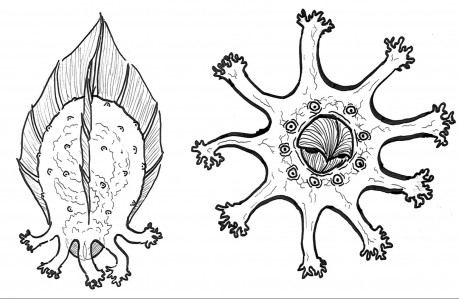

Planeta je kopcovitá s hustými lesy, často složených z gigantických mimozemských sekvojí. V nížinách jsou vlhké mokřady porostlé vysokou trávou a zakryté hustou mlhou. Na obloze září modrá hvězda, Damballa Wedo, kterou planeta obíhá a má týdenní denní/noční cyklus. V noční fázi se planeta nádherně rozzáří, jelikož zdejší fauna i flora během dlouhé noci hodně spoléhá na bioluminiscenci. Planeta je vyhlášená svou dravou megafaunou, té se ale budeme věnovat jindy. Nyní si probereme ty “menší” druhy.

> #### Planeta ATTISOU
> Typ: pozemský - džungle  
> Atmosféra: dýchatelná  
> Průměrná teplota: 27°C  
> Gravitace: 0,42G  
> Průměr: 9,500km  
> Vzdálenost od hvězdy: 10 AU  
> Orbitální perioda: 11,534 dní

> #### DAMBALLA WEDO / TYP “A” Modrý Trpaslík
> Teplota: 8200K  
> Průměr: 1,114,144km

> Korektury: Julie “Isiolia” Krausová  
> Obálka: MidJourney AI  
> Černobílé ilustrace zvířat: Julius “kin” Karajos

> Každé zvíře má uvedené statistiky pro Mothership 1e.

__Poznámka autora:__ Často využívám ke své tvorbě náš vlastní svět, který je neskutečně fascinující. A tento text není výjimkou. Všechna zvířata zde jsou inspirována reálně existujícími zvířaty (se zapůjčenými vlastnostmi jiných). Proto je u každého zvířete dole napsán název původní druhu, kdyby Vás zajímalo, odkud beru nápady. :)

## Obří Obrněný Krabopod

_Ingens Cancearmis_

> Váha: 600 - 1500 kg  
> Délka/Výška: 2,5 - 4 metru

I když tento přerostlý zástupce čeledi stejnonožců může vypadat děsivě, má naštěstí dosti krotkou povahu. Je to totiž převážně mrchožrout, jehož ostré a silné čelisti dokáží rozebrat i mrtvou megafaunu této planety, a tak zde slouží jako důležitý článek zdejšího ekosystému. Čelist, kterou má na spodku svého těla, dokáže lehce přeštípnout strom vejpůl. Na předním páru končetin má ostré řezáky, kterými si pomáhá při otevírání obrněné kořisti. A svá záda má chráněná pevným chitinovým krunýřem pokrytým bodáky, což většinu megafauny odradí.

To je jeho největší výhodou, protože není moc rychlý, a když je převrácen na záda, má vážné problémy. Navíc jeho maso je vyhlášená pochoutka a je plné živin. Ale rozevřený Krabopod velmi výrazně páchne a je tedy silným lákadlem pro jiné predátory nebo mrchožrouty v okolí.

Krabopodi dokáží lovit ve smečkách, ale nejsou nijak organizování. Spíš se nechávají na pokoji, než aby společně kooperovali.

### MOSH statistiky

Boj: 35, Intuice: 25, Životy: 20(4), Zbroj(AP): 5 (nezničitelná)  

#### Útoky:

- Přední čepele:  2k10[+] zranění.
- Náraz 1k10 zranění a sražení na zem.
- Čelisti  1 Život. Pouze na cíle na zemi.

### Jak je potkáte? d10 tabulka

- 1 - 5 - 1d5 Krabopodů se neúnavně pohybuje krajinou a hledá kořist
- 6 - 9 - 1d5 Krabopodů hoduje na velkém úlovku
- 0 - 1 Krabopod převalený na záda a neschopný pohybu

Reálná inspirace: Giant Isopod

## Zářící Nebeská Oliheň

*Caelolligo Lucemors*

> Váha: 200 gramů (většina je zobák)  
> Délka/Výška: 30 cm

Nebeská Oliheň je zvláštní tvor trávicí převážnou část svého života vysoko ve vzduchu.

Na zem se podívá jen během lovu a kladení vajec. K pohybu na zemi používá svá chápavá chapadla, ale rychlost to není nijak zázračná, chapadla slouží spíš pro pomalé přesouvání na ulovené kořisti či hledání místa pro hnízdo, které zahrabává do písku.

I když je svým vzhledem velmi blízká olihním, sama o sobě se do vody nikdy nepodívá.

Nebeská Oliheň je predátor, jenž k lovu využívá několika svých zvláštností.  

První a velmi zásadní je schopnost produkovat helium uvnitř svého těla, čímž se může nafouknout jako balón a vznést se do vzduchu.

Zde jí do karet hraje další zvláštnost - její kompletně průhledné tělo (až na zobák).  
Vznáší se tedy vysoko ve vzduchu prakticky neviditelná a pozoruje zemi pod sebou, dokud se v jejím zorném poli neobjeví nějaká kořist.  
Poté začne rychle vypouštět nashromážděné helium a koriguje svůj volný pád pomocí malých otvorů po celém povrchu těla, které taktéž dokáží vypouštět malé a prudké gejzíry hélia, a čtyř směrových ploutví.  

Svým extrémně tvrdým zobákem buď kořist rovnou zabije či ji přinejmenším omráčí, načež se začne krmit.

A v této fázi se dostáváme k poslední skládačce jejího jména.  

Zářící se jí říká proto, že její trávicí trakt má bioluminiscenční vlastnost. Když je tedy nakrmená, celý se rozzáří. V tu chvíli Olihně zase stoupají do vzduchu, aby mohly trávit v bezpečí.  
A jelikož se často nacházejí ve větších smečkách, na obloze to vytváří na pohled úchvatné různobarevné obrazce a kreace.

### MOSH statistiky

Boj: 85 (volný pád) / 15 (na zemi), Intuice: 20 Životy: 5(1)

#### Útok:

- Volný pád zobákem 1k5 Životů. Záchrana na Tělo, pokud neúspěch tak omráčení na 1k10 hodin. Tento útok může provést jen jedno a musí být před ním ve vzduchu.
- Zobák 1 Zranění.

### Jak je potkáte? k10 tabulka

- 1 - na zemi zahrabávající vejce
- 2 - 3 - na zemi, krmící se
- 4 - 6 - zrovna loví, kryjte se!
- 7 - 8 - čekají na obloze na kořist
- 9 - 0 - tráví kořist na obloze, nádherně ji osvětlili

Reálná inspirace: Enypniates

## Poletující Smrťohled

*Similans Conspimors*

> Váha: 100-150 gramů  
> Délka/Výška: 8-16 cm

Tahle drobounká všežravá chlupatá opička by byla až nechutně roztomilá, nebýt jejího děsivého obličeje, který jí vysloužil její rozkošné jméno.

Tyto opice žijí prakticky jen v korunách mohutných stromů pokrývajících většinu planety. Tam si staví hnízda, pomocí letových blán přeskakují v nízké gravitaci i velmi značné vzdálenosti mezi stromy. Žijí v menších skupinách do 40 jedinců, které vždy vede alfa samec.

Smrťohledové jsou poměrně inteligentní a vykazují na zvěř nadměrné emoční cítění, které se často zvrhává až do extrémů:

- opičky jsou velmi sociální a pokud jsou ponechány svému osudu osamoceny (například při ztrátě tlupy či vyhnání z ní), propadají těžkým depresím a smutku, které mohou skončit až sebevraždou opičky. Často volí i velmi brutální způsob, jako například rozmlátit si hlavu o kmen.
- jsou velmi teritoriální; pokud cizí tlupa vstoupí na jejich území a nezdekuje se při prvním varování, většinou se strhne krutý souboj. Po zabití nepřítele (většinou je pohltí totální zuřivý berserk a nepřestanou, dokud není jejich oponent mrtvý) to ale neskončí, jejich touha po odplatě je až příliš silná. A tak se často vydají zjistit, kde je sídlo jejich oponenta, a tam vyvraždí zbytek jeho tlupy, ať už se jedná o dospělé, samičky či dokonce mláďata.

Smrťohledové používají pro komunikaci zvláštní směsici skřeků a štěbetání a jsou dost zvědavé, i když svou opatrnost nikdy neztrácí. Perfektně vidí ve tmě a jsou vhodné pro ochočení. Jen si jejich majitel musí dávat pozor, aby je nadměrně nenaštval (například aby jim nedával tresty, kdy jim zamezí přístup k jídlu či svobodě - mohly by jej zákeřně napadnout a klidně mu například v noci vydrápat oči), nebo je nesmí nechat dlouho samotné s pocitem opuštění (abyste se po delší výpravě na cizí planetu nevrátili a vaše opička si během té doby ze smutku, že o Vás přišla, nerozmlátila hlavu o ovládací panel Vaší lodi).

### MOSH statistiky

Boj: 25, Intuice: 55, Životy: 10(1)

#### Útok:

- Drápy a tesáky: 1k5 zranění[-].
- Tlupa: Samy o sobě nejsou tak nebezpečné, ale v tlupě dokáží sundat i úctyhodnou kořist.

Za každou opičku navíc přidej +5 Boj a +5(0) Životů a +1 ke zranění.

### Jak je potkáte? k10 tabulka

- 1 - 3 - 4k10 Smrťohledů, kteří přeskakují a plachtí ze stromu na strom. Možná jdou sbírat jídlo, možná před něčím utíkají.
- 4 - 6 - 4k10 Smrťohledů Vás pozoruje se štěbetáním ze stromů. Jsou zvědaví, možná se Vám pokusí něco ukrást, možná Vám něco přinesou.
- 7 - 9 - 8k10 Smrťohledů bojujících mezi sebou na život a na smrt.
- 0 - Šílený projev emocí (zuřivost, smutek, deprese, násilí, ...)

Reálná inspirace: Tarsius monkey

## Mokřadový žáboryb

*Palus Bufoscis*

> Váha: 1500-2500 kg  
> Délka: 3-6 m

Žáboryb se vyvinul z ryby, která byla tak obrovská a těžká, že se většinu času plavila při dně, až se její přední ploutve vyvinuli v mohutné packy. Ty začala využívat i k vytažení se na břeh, a zde se naučila vyčkávat schovaná ve vysoké trávě, než se nějaké jiné zvíře vydalo napít.

Jedním prudkým pohybem jej za pomocí svých silných pacek a svého kostěného rohu na lebce omráčí. Poté si svůj úlovek dotáhne pod vodu, kde jej v klidu pozře.

Jsou to velmi agresivní tvorové s tvrdými keratinovými šupinami a dobrou kamufláží.

Tvor je to ale naštěstí velmi pomalý, a proto je jeho prakticky jedinou strategií vyčkávat skrytý na svou kořist, než se k němu přiblíží. K tomu využívá i speciální výrůstek na rohu, který dokáže zářit podobně jako bioluminescentní flora, která roste v okolí jezer, což láká jiné tvory.

### MOSH statistiky

Boj: 75 (překvapivý útok) / 40 (normálně), Intuice: 20, Životy: 15 (3), Zbroj: 3 (nezničitelná)

#### Útoky:

- Úder rohem: Záchrana na Tělo[-] jinak Omráčení na 1d10 minut.
- Tlama a pařáty: 4k10 zranění.
- Skrytí a vyčkávání: Před svým prvním útokem se vážně dobře skrývá. Je možné jej objevit jen čistou náhodou a/nebo důkladným a aktivním hledáním.

### Jak je potkáte? k10 tabulka

- 1 - akorát ulovil kořist a táhne ji zpět do vody
- 2 - 9 - vyčkává skrytý na svou kořist
- 0 - zrovna vylézá ven z vody a hledá místo, kde se schová

Reálná inspirace: Red-lipped Batfish

## Dravý Lepočerv

*Vermigluto Barbaro*

> Váha: 50-100 kg  
> Délka: 10-20 metrů
  
Velmi nebezpečný predátor s unikátním způsobem lovu. Jako svá loviště využívá nížiny s vysokou trávou, kde se se svou výškou může lehce schovat. Tam se pomalu, ale neúnavně pohybuje, dokud nenarazí na potencionální kořist. Ta by mu s jeho rychlostí ale jistě utekla, a tak se vztyčí nad trávu a ze svých dvou ústních papil vystřelí proud rychle tuhnoucí směsi, která jeho cíl doslova přilepí k zemi a znemožní se mu pohybovat.

Pak už k ní jen zlehka přijde, vykousne jí do těla otvor svými ostrými kruhovými ústy a vpravý jí do těla chemikálii, která postupně rozpouští její vnitřnosti, aby je mohl červ vysát.

Překvapivě jsou tito červi poměrně sociální tvorové a shlukují se do až deseti-členných smeček, které vždy vede samice. Ta je největší, stravuje se jako první a nejčastěji odpočívá v hnízdě, zatímco samci se vydávají na průzkum, lov a ochranu teritoria.

Tělo mají pokryté chitinovými šupinami po celé délce, vpředu dvě chápavé antény a dvě ústní papily. Jejich ústa jsou kruhová s ostrými tesáky schopnými vykousat díru do plechu a mohou z nich vysunout dutý jazyk, kterým vpravují do těla kořisti tekutinu, jenž je zevnitř rozpustí. Pohybují se pomalým, skoro až hypnotický pohybem, což jim společně s jejich maskováním a vysokou trávou poskytuje velmi dobré krytí. Na nožičkách mají spoustu zpětných drápů, které jim dovolují šplhat i po kolmém povrchu.

### MOSH statistiky

Samec: Boj: 55, Intuice: 40 Životy: 10(1), Zbroj: 3  
Samice: Boj: 45, Intuice: 50 Životy: 15(1), Zbroj: 3

#### Útoky:

- Lepivý výstřik: bez zranění. Záchrana na Rychlost, pokud neuspějete, nemůžete se hýbat. Záchrana ns Sílu[-] aby jsi se dokázal uvolnit sám.
- Čelisti: 1k10 zranění.

### Jak je potkáte? k10 tabulka

- 1 - 3 - 1d10[-] Lepočervů prozkoumává okolí a hledá kořist
- 4 - 6 - 1d10[-] Lepočervů akorát bojuje s kořistí, stříkají na ni lepivou směs
- 7 - 9 - 1d10[-] Lepočervů hoduje na kořisti
- 0 - Lepočerví samice a jeden samec jako její ochranka stráží hnízdo

Reálná inspirace: Velvet Worm
