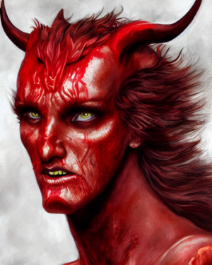
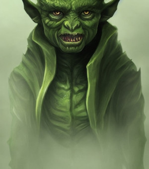
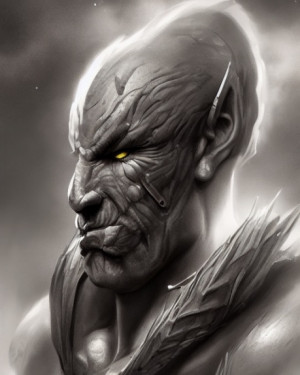
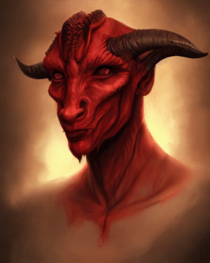
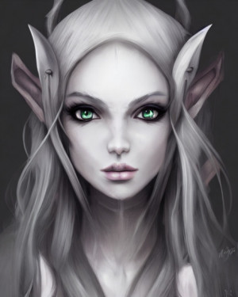
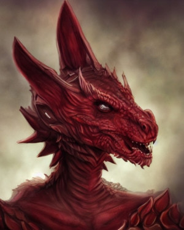
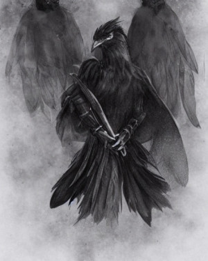
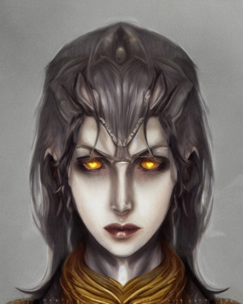
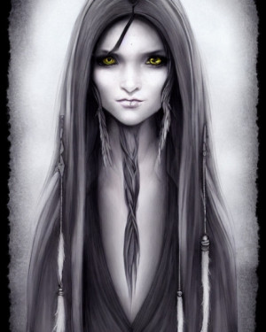

Po asi roce práce a s trochou inspirace z anglického systému Dungeons&Dragons i svého okolí byly tyto rasy na světě. Nyní se s Vámi o tyto rasy chci podělit, aby i další mohli čerpat inspiraci z mé práce a snad i aby se tyto rasy dostaly  k dalším hráčům a nadšencům. I když jsou napsané především pro systém Dračí Hlídky, mělo by být možné je relativně snadno přepracovat i do dalších systémů.

## Temné rasy

_Některé rasy jsou považované za civilizované. Ne všechny. Některé jsou zavržené. Žijí na kraji společnosti, nebo ve svých malých komunitách. Mají jiné zvyky, jiné obyčeje, jiné způsoby. Většina „civilizovaných“ ras je nemá moc ráda, protože jejich temné kořeny berou jako dost dobrý důvod pro diskriminaci těchto podivných stvoření. Většinou je na ně svalena vina a občas se nějaký fanatik pokusí jejich počty snížit. To samozřejmě způsobuje, že jsou nedůvěřivý, a často vrací co jim bylo provedeno. Tato vzájemná nedůvěra jen zhoršuje vztahy těchto ras ke společnosti._

## Společná schopnost všech těchto ras: Oči do stínů

_Život plný nebezpečí a útisku často donutil tyto rasy skrývat se přes den a pohybovat se ve stínech. Jejich oči se tomu dokázaly přizpůsobit a navykli si šeru a špatnému osvětlení._

Oči těchto ras jsou mnohem víc přizpůsobeny do stínů. Ovšem ani jejich oči nevidí v úplné tmě. V matném světle vidí bez jakýchkoliv postihů . Stejně tak například v noci, jestli svítí hvězdy a měsíc, nebo pokud jsou někde kde není přímé světlo. Vidění ve tmě není dokonalé. Jeho dosah je 30 sáhů. Nevidí barvy, pouze odstíny šedivé. Také vidění detailů je mnohem náročnější, a z tohoto důvodu se může obtížnost dovedností, které je vyžadují, jako například čtení a psaní, zvýšit.

Tato schopnost však také sebou přináší některé nevýhody. První z nich se projeví pokud se dívají směrem ke umělému zdroji světla, jako například lucerna či pochodeň, z oblasti kam daný zdroj vrhá jasné světlo. V takové situaci mají postih -3 k ověřování Postřehu zrakem (například když sedí u stolu na kterém je položen velký svícen, pokud drží v ruce pochodeň, lucernu či zapálený Plamenný meč).

Druhou nevýhodou je, že pokud jsou oslepeni nějakým světelným efektem či zábleskem, oslepení trvá dvakrát takovou dobu.

Pokud jsou někde, kde je úplná temnota bez žádného zdroje světla, nevidí nic stejně jako ostatní rasy.

## Tiefling

Modrá až rudá kůže se šupinami, ocas, rohy, to vše odděluje tieflingy od jejich vzdálených příbuzných, lidí. Vznikly někdy dávno, pomocí temných rituálů a krve démona, která na ně uvrhla nezlomitelné a dědičné prokletí, které může za jejich zdeformovaný vzhled. I když si to mnoho myslí, tento rituál je neučinil o nic víc zlými v mysli. To až generace zavržení a opovrhování. Občas se také stane, že se kletba skrývá neaktivní v několika generací a pak se najednou narodí lidským rodičům démonicky vypadající dítě. Pro strach z toho, že kletba ovlivnila víc než jen jejich vzhled tyto děti končí na ulicích, nechány na pospas smrti. Nikdo neví, kolik tieflingů bylo takto nalezeno a adoptováno ostatními tieflingy, ale je jisté že všichni zanevřeli na své rodiče a nevyhledávají je. Tyto problémy však rozhodně zpevnili jejich charakter a tak se i přes odpor společnosti stávají výbornými hraničáři, kouzelníky či kleriky.

Tieflingové mluví dvěma jazyky. Obecnou řečí a Pekelnou. Pekelnou řeč také užívají démoni a různí uživatelé temné magie pro sesílání kouzel.

Malé komunity tieflingů najdete v každé chudinské čtvrti, avšak jsou i tací co to dotáhli daleko a mají honosné domy. Obecně však nestaví svá vlastní města. Také není žádné krajiny, která by pro ně byla přirozeným domovem, protože nikam nepatří.

### Rodová zvláštní schopnost: Odolnost proti ohni

_Krev démona a šupiny na těle udělali víc, než jen změnili jejich vzhled. Díky ní získali kůži, která dokáže odolat plamenům a ochránit je před nimi. Ani tato schopnost je ale někdy před zhoubným žárem nezachrání._

Kdykoliv Tiefling utrpí zranění od ohně, hodí si na Výdrž(ODO) x zranění které má utrpět. Pokud uspěje, zranění neutrpí.

## Goblin

Malé a nahrbené postavy, dlouhé ruce, nazelenalá nebo nažloutlá kůže, dlouhé uši, žluté oči, ostré zuby, to vše patří k typickému vzhledu goblinů. Většina z nich žije v tlupách a často jsou pro dobrodruhy spíše potíží než potěšením. Někteří z nich se však nějak dovedou začlenit do společnosti. Pak se většinou skrývají v těch nejnižších třídách, neboť většina autorit jejich svobodu vidí jen jako čekání do doby než provedou cokoliv za co je půjde zatknout. Proto mají velmi často sklony stát se zloději, ale jsou i skvělými válečníky a hraničáři.

Goblini mluví dvěma jazyky, goblinštinou a obecnou řečí.

Většina goblinů kteří se stanou dobrodruhy jsou buď vyděděnci nebo přímo zločinci ve světě goblinů. Vyhnáni ze svých skupin pro zradu či pro ukázání milosti slabším, což je u goblinů projev největší neschopnosti. I přes nepříjemného chování společnosti mohou být dobří, ale častěji v nich jejich výchova a geny zvítězí. Pak se potloukají mezi zákonem a vězením. Z uvedeného je jasné že tito goblini obvykle nemají komunitu kam by se mohli vrátit.

### Rodová zvláštní schopnost: Gobliní výcvik

_Goblini jsou zvyklí na nespravedlivý boj. Často se musí vypořádat se soupeřem který je násobně vyšší než oni. Pro tento účel se proto od malička cvičí v boji s větším soupeřem._

Kdykoliv Goblin útočí v boji tváří v tvář na soupeře který je aspoň o jednu velikostní třídu větší, jeho útočné číslo se zvětší o 2.

## Skřeti

Skřeti, či orkové jsou velcí, osvalení, našedivělí a nepříjemní. Stejně jako goblini jsou považováni za ničitele a nositele chaosu. Také jsou považování za hloupé a nekultivované, což je paradoxně daleko od pravdy. I oni se spíž snaží neupozornit na sebe, ale na rozdíl od goblinů jsou často najímaní na levnou a nebezpečnou fyzickou práci. Někteří zlomí stereotyp a stanou se z nich členové společnosti a uznávaní občané. Mezi dobrodruhy mají pověst skvělých válečníků, ale i mimo boj jsou často společníky k nezaplacení.

Skřeti mluví dvěma jazyky, goblinštinou a obecnou řečí.

Stejně jako příbuzní, většina dobrodruhů z toho rodu buď byla vyhnána za zbabělost, podlost, slabost, pacifismus nebo protože nikdo jiný z jejich kmene nepřežil. Mají občas malinkaté komunity v městech civilizace, ale většinou je to každý za sebe.

### Rodová zvláštní schopnost: Zrození k boji

_Skřeti jsou zrození, vychování a připravení k boji. A díky tomu boj vždy očekávají a dokáží rychle reagovat když k němu dojde._

Skřeti mají vždy **Výhodu(+5)** k hodu na iniciativu.

## Kobold

Koboldi mají žluté či zlaté oči, slabý a dlouhý ocas, čtyři prsty s drápy, silné nohy s třemi prsty a jedním zakrnělým, tělo pokryté rezavými šupinkami a malé růžky na hlavě. Občas mají šupiny i jiné barvy. Většinou, pokud se vydali na cestu dobrodruhů, jsou vyhnanci z kmene za zklamání jejich dračího boha, či jiný zločin proti skupině. Někteří proto jejich bohy zavrhnou, jiní se je pokusí ve vyhnanství udobřit. Nicméně narazit na kobolda ve vyhnanství je vzácné a mnozí dobrodruzi, kteří někoho ztratili na pastech koboldů, se rozhodnou na nich mstít. Ti, kterým se podaří uniknout těmto nástrahám se stávají ceněnými zloději, alchymisty i hraničáři.

Koboldi umí lámaně obecnou řečí s výraznými sykavkami a koboldštinou.

Protože je to tak vzácní, většina autorit ani neví co s nimi a nemají žádné místo ve společnosti, protože jich není dost aby se nějaké stalo standardem. A tak si každý z nich musí najít vlastní místo ve světě.

Koboldi mají také zajímavý vztah s svými souvěrci drakorozenými. Na jednu stranu z nich mají respekt a mnoho kolonii koboldů je jimi vedeno, na druhou stranu koboldi rádi ověří zda je daný jedinec hoden svého požehnání a testují jejich bojové schopnosti. Stejně tak někteří drakorození považují koboldy za sobě rovné a jiné za podřízené sluhy kteří jim nesahají ni po kotníky. Každý z nich má trochu jiný přístup.

### Rodová zvláštní schopnost: Zuřivost

_Koboldi jsou zvyklí bojovat v skupinách. Jejich taktiky jsou zasypat nepřítele najednou a ubít společně. I když už nejsou se svou tlupou, tyhle tendence v nich stále převažují. A koboldi jsou stále schopni využít svých dovedností._

Pokud útočíš tváří v tvář na někoho kdo byl již napaden, někdo na něj zaútočil od konce tvého předchozího tahu, můžeš aktivovat tuto schopnost. Také se ale můžeš rozhodnout útočit normálně, je to jen na tobě. Díky této schopnosti dostáváš **Výhodu(+5)** na útok. Zároveň ale dostaneš **Nevýhodu(-5)** ke svým hodům na obranu na toto kolo.

## Stínoví elfové

Stínoví elfové jsou příbuzní elfů, kteří se od nich však oddělili už před dlouhou dobou. Nyní jsou dost odlišní. Mají tmavou až fialovou kůži a bez výjimky bílé vlasy. Žijí v temných lesích a jeskyních, a mnohem radši než sluneční zář mají měsíční svit a stíny stromů. Žijí ve vlastních, izolovaných království a zřídka kdy je opouští. Tento život je učinil odolnější, i když za cenu menší inteligence. Stále však vynikají v povolání jako hraničář, kouzelník či kněz.

Stínový elfové mluví svým jazykem, jazykem stínů, který je na bázi jejich zvláštního sluchu a proto ostatní rasy často ani nepostřehnou že jde o jazyk a obecnou řečí. Kromě toho ti z nich, kteří jsou aspoň trochu vzdělaní v oboru cizích jazyků mluví elfským jazykem, který je blíže popsán u lesních elfů.

Stínový elfové na které narazíme mimo jejich království jsou povětšinou vyhnanci, ať za zločiny spáchané v minulosti, či za projevení soucitu kterým jejich společnost opovrhuje. Někteří jsou pak uprchlíci kteří preferovali život vyhnance před životem ve svém rodném kraji.

Obyčejní elfové, či elfové slunce jak jim říkají, je přijímají do svých společností i když vždy zdůrazňují že jsou jiní. Toto zacházení a také fakt, že již od malička bývají vychováni k nedůvěře vůči ostatním rasám často působí že jsou uzavření, nevěřícní, asociální a málo kdy se snaží zkutečně zapojit do společnosti. Díky tomu, že jsou to většinou vyhnanci, netvoří vlastní společenství a buď tráví čas v samotě a nebo se přidruží k slunečním elfům.

### Rodová zvláštní schopnost: soví sluch

_Temní elfové si často žijí mezi stíny a úplnou tmou. Proto se naučili nespoléhat jen na své oči, ale také na svůj sluch. Díky tomu jsou jejich uši schopné zachytit zvuky pro ostatní neslyšitelné._

Temní elfové mají +2 k všem akcím vyžadujícím dobrý sluch. Tato schopnost jim také umožňuje rozumět řeči temných elfů, která je pro ostatní jen nesrozumitelné mumlání.

## Drakorození

Vypadají velice podobně jako malý draci. Šupinatá kůže různých barev, hlava jako drak a hlavně jejich dech. Drakorození jsou rasa obklopená záhadou. Civilizované rasy tvrdí, že se jedná o výsledek temných rituálů s dračí krví. Kobolti a oni sami se však považují za něco víc. Za vyvolené draků, aby vedli jejich boj v tomto světě. Nikoliv za prokleté, ale za požehnané jejich mocí. Toto také definuje jejich životy. Stávají se nejčastěji válečníky či knězi kteří šíří víru v draky.

Drakorození umí obecnou s velice zvláštní výslovností písmen „r“ a „ř“. Většina z nich umí i koboldštinou, kterou nazývají jazykem draků.

Drakorození cestují světem a hledají cíl, který pro ně praví draci přichystali. Ať se jedná o službu jim, sbíráním pokladů pro ně či životem dobrodružství, většina z nich dělá co může aby své stvořitele nezklamala. Samozřejmě i mezi nimi se najdou odpadlíci od této víry, ale většinou zemřou v ohni jiných drakorozených či v koboltích spárech.

Vztah koboldů a drakorozených je složitý. Na jednu stranu od nich mají respekt a mnoho kolonii koboldů je jimi vedeno, na druhou stranu koboldi rádi ověří zda je daný jedinec hoden svého požehnání a testují jejich bojové schopnosti. Stejně tak někteří drakorození považují koboldy za sobě rovné a jiné za podřízené sluhy kteří jim nesahají ni po kotníky. Každý z nich má trochu jiný přístup.

### Rodová zvláštní schopnost: Dračí dech

_Podobně jako draci mají i drakorození schopnost vydechovat oheň, ale v mnohem menší míře. Drakorození jsou na tento dar velmi hrdí, neboť je to jasný a nesporný znak jejich podobnosti s draky._

Tato schopnost ti umožňuje jako okamžitou akci vychrlit jednou za kolo na nepřítele, či nějaký objekt oheň. Oheň zasáhne asi jeden sáh čtvereční a vzdálenost na kterou ho dokážeš chrlit je šest sáhů. To znamená že si vybereš místo které je od tebe vzdáleno šest sáhů a vše co je do vzdálenosti jeden sáh od toho bodu je ovlivněno. Oheň ovšem nejde chrlit přes nějakou překážku která je stejné nebo větší velikostní kategorie jako jsi ty sám. Všichni zasažení tvorové utrpí popálení za 1k6 životů. Všechny předměty které lze snadno zapálit také vzplanou.

Tuto schopnost můžeš použít tolikrát denně, kolik je tvoje oprava za odolnost(nejméně jednou) a musíš mít nerušený spánek než jí můžeš použít znova (pro tento spánek platí stejná pravidla jako pro kouzelníkův spánek před meditací). Při tvorbě postavy si můžeš zvolit jakou barvu bude plamen mít, ale na jeho efektu to nic nemění.

Drakorození nejsou vůči svému ohni odolní o pokud by jsi byl svým vlastním plamenem zasažen, utrpíš zranění jako všichni ostatní.

## Kenku

Havraní lid, tak jim říkají. Jejich vzhled tomu odpovídá. Zobák, tmavé peří, ptačí nohy a podivně krákoravá řeč. Vypadají jako humanoidní vrány. Jednou z jejich překvapivých vlastností, je jejich velice nízká váha. Je dána tím, že i když už neumí lítat, jejich kosti jsou stále duté jako kosti ptáků. Často se zahalují do tmavých plášťů a je z nich vidět jen jejich zobák.

Kdysi dávno hrdý národ, plný poznání, vědění a vyspělosti. Pak se ale prohřešili proti nejmocnějším bohům, když se pokusili vytvořit jim rovného. Tak je sněm bohů potrestal. Přišli o možnost létat, jejich oči se zakalili, nehodny světla a nucené zůstat ve stínu. Jejich civilizace byla zničena a nikdo již neví kde byla a co vše s jejím pádem bylo ztraceno. Jen přítomnost těchto tvorů v ulicích stále připomíná její pád. Živí se jak to jde a snaží se akorát přežít do dalšího dne. Jen vzácně některý z nich dostane na nějaký vyšší post, kvůli jejich vzhledu a špatné pověsti.

Kenku umí havraním jazykem a obecnou. Jejich hlasové ústrojí, ale není na obecnou řeč dobře stavěno a tak mají krákoravý a až podivný hlas. Je velice těžké nepoznat že na vás mluví právě kenku, ale někteří z nich se tréninkem dokážou této vady zbavit. Většina se prostě smířila s tím, že si z nich za jejich has utahují.

Kolem kenku panuje stigma zlodějů, podvodníků a proto nejsou dobře přijímaní. Většinou žijí v nejchudší vrstvě a nebojí se překročit všechny meze aby přežili. Proto často končí jako zloději i když jsou z nich i schopní kouzelníci nebo klerici.

### Rodová zvláštní schopnost: Havraní jazyk

_I když kenku přišli dávno o možnost létat, stále se havranům dost podobají. Proto stále ovládají havraní jazyk a často ho používají jako způsob komunikace mezi sebou a svými havraními společníky, které mnozí z nich chovají. Stejně tak si pomocí něj často předávají tajné zprávy kterým ostatní nemůžou rozumět._

Kenku dokáží mluvit s havrany, stejně jako to dokáže kouzelníkův přítel havran. Rozdíl je, že s nimi mohou takto mluvit přímo a bez prostředníka.

Tomuto jazyku kromě kenku rozumí pouze jiní havrani a není možné se ho naučit nebo mu porozumět s dovedností cizí jazyky. Důvodem pro to je velice odlišné hlasové ústrojí mezi lidmi a havrany, kterému se to kenku podobá.

## Yuan-ti

Yuan-ti vypadají skoro jako lidé. Pouze v oblasti ramen a kolenou mají pozůstatek nazelenalých šupin hadů. Zbytek jejich kůže je dost rohovitý a připomíná hadí šupiny. Nejvíc je však jejich původ vidět v obličeji. Jejich nos je malý, jejich oči zelené až žluté a jazyk mají jako hadi rozdvojený. I povahu mají hadí. Většina z nich je zákeřná, zrádná, plíživá a jsou velice dobří lháři a manipulátoři. Kvůli tomu je okolo nich stigma zrádců, se kterými ti, které tyto vlastnosti nemají, musí bojovat.

Yuan-ti jsou pozůstalí z dávného impéria Hadích lidí. Ti se kdysi vyvinuli z Ještěrů, a utvořili jednu z prvních civilizací. Časem však jejich rozdělenost a neschopnost přizpůsobit se novým podmínkám vedla k jejich postupnému zániku. Někteří z nich se však přizpůsobit dokázali. Stali se součástí nových civilizací, civilizací lidí. Jejich krev se smísila s krví lidí, a vznikla rasa Yuan-ti. Jejich dávní předci již vymřeli, protože přírodní podmínky se změnili tak moc, že nepřežili. Yuan-ti ale měli v sobě dost lidské přizpůsobivosti aby přežili. A tak vznikl nový národ, bez domova, území, či místa v tomto šíleném světě.

Yuan-ti mluví obecnou a jazykem ještěrů. Mají velmi protáhlé sykavky.

Yuan-ti nemají vlastní zemi a proto žijí v městech lidí. Kvůli svému vzhledu a povaze jsou často zavrhovaní. Většina lidí jim nevěří a proto je pro ně těžké dostat se na vyšší pozice ve společnosti. Často místo toho skončí v kriminálních organizacích, nebo v laboratoří alchymistů.

### Rodová zvláštní schopnost: Hadí odolnost

_Díky svým hadím předkům jsou těla Yuan-ti zvyklá na jedy. Díky tomu, že jim byli vystaveny po generace jsou proti nim odolní mnohem víc než ostatní rasy._

Nebezpečnost všech jedů je pro tebe poloviční. To znamená, že pokud se staneš alchymistou a získáš schopnost odolnost proti jedům, všechny jedy pro tebe budou mít čtvrtinovou nebezpečnost. Zaokrouhlujte se vždy nahoru.

## Padlý Aasimary

Když bohové stvořili Aasimary, rozhodli se jim dát svobodnou vůli. Bylo to rozhodnutí, které zajisté přineslo mnoho dobra. Ale samozřejmě, dřív či později se objevili někteří, kteří se od boha kterému měli sloužit odvrátili a opustili své povinnosti vůči němu. Za to je božská přítomnost, které je do té doby všude pronásledovala opustila. Je to nepříjemný pocit. Provází ho amnésie, zapomínání a dokonce i výpadky paměti na celé týdny, ba dokonce i měsíce. Jejich vlasy ztmavnou a jejich oči se zakalí, nehodny světla které kdysi tak ctili. Příjemná božská přítomnost se ztratí a zbude jen zoufalá prázdnota.

Někteří z toho zešílí. Někteří temnotu v sobě posílí a jiní si najdou jiného boha aby tuto prázdnotu zaplnili. Pak jsou ti, co se pokouší udobřit se se svým původním bohem. Někteří pro ně vykonají hrdinské výpravy. Pár z nich uspěje a původní bůh, či bůh nový, v nich obnoví světlo a stanou se opět čím byli před Pádem. Není jich mnoho. Stane se to vzácně a je to práce na roky, ba desetiletí. Většina se prostě naučí žít s tím, jak na tom jsou. Další zemřou při snaze udobřit se se svým bohem.

Přátelský vzhled Aasimary je nahrazen prázdnotou, která z nich vyřazuje. Stín který mají na duši je všudypřítomný. Někteří je zavrhují a mají je za zrádce, zločince. Jiní k nim cítí soucit. Jejich osobnost je poznamenaná tím, čím si prošli. Někteří jsou zlomení, někteří jsou posílení, někteří kompletně změněni svým pádem. Záleží na jednotlivci, jak to vezme.

Padlý Aasimary mluví obecnou řečí.

Padlý Aasimary nemají své místo a pořád cestují. Většina z nich pokračuje v povolání co dělali před pádem. Většina kleriků si však musí hledat nového boha a nebo začít v novém oboru. Aasimary k nim projevují chlad, jako k odpadlíkům, ale neútočí na ně. Ví, že bohové je potrestali dost.

### Rodová zvláštní schopnost: Stín na duši

_Opuštěni bohem, naučili se vlivu bohů odolávat. Využít pocit prázdnoty jako štít, který pohltí jakékoliv další zranění které jim jiný bůh bude chtít způsobit._

Pokud jsi terčem klerikovi prosby, můžeš se rozhodnout bránit se vlivu daného boha. V tom případě zvýší obtížnost dané prosby o svoji opravu za charisma + svůj stupeň vůle. Pokud kouzlo má víc cílů, nebo je plošné, můžeš zvýšit jeho obtížnost jen o svou opravu za charisma. Pokud klerik se pokusí na tebe seslat prosbu, ty se rozhodneš bránit a klerik neuspěje, budeš vědět o jakou prosbu se pokoušel.

{:style="width:1000px"}
| Rasa | Velikost | Výška | Váha | Pohyblivost | Schopnost | SIL | OBR | ODO | INT | CHAR |
| --- |
| Tiefling | B | 150-210 cl | 45-110 lb | 30+OBR | Odolnost proti ohni | 6 | 6 | 6 | 8 | 9 | 
| Goblin | A | 55-75 cl | 15-30 lb | 20+OBR | Gobliní výcvik | 6 | 12 | 6 | 5 | 4 | 
| Skřet | B | 160-220 cl | 90- 140 lb | 30+OBR | Zrození k boji | 9 | 6 | 8 | 5 | 7 | 
| Kobolt | A | 80-120 cl | 20-50 lb | 20+OBR | Zuřivost | 5 | 9 | 7 | 7 | 7 | 
| Temný elf | B | 160-180 cl | 45-70 lb | 30+OBR | Soví uší | 6 | 7 | 6 | 9 | 9 | 
| Drakorozený | B | 140-200 cl | 65-110 lb | 30+OBR | Dračí dech | 9 | 7 | 6 | 6 | 7 | 
| Yuan-ti | B | 150-210 cl | 45-90 lb | 30+OBR | Hadí odolnost | 6 | 6 | 7 | 9 | 8 | 
| Padlý Aasimar | B | 170-220 cl | 60-110 lb | 30+0BR | Stín na duši | 6 | 5 | 5 | 8 | 11 | 
| Kenku | B | 140-180 cl | 20-50 lb | 30+OBR | Havraní jazyk | 7 | 9 | 5 | 8 | 7 |

> Použité ilustrace byly vytvořeny pomocí starryai.com
