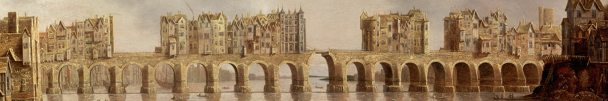
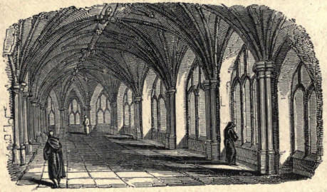

Je to obytný most plný krámků a obchodů a také jediné místo v blízkosti Ravnburghu, kde se dá suchou nohou překročit řeka Blythe, která odděluje Staré a Nové město. Budovy jsou z obou stran tak nahuštěné na sobě, že je možné projít úzkou cestou do poloviny mostu a neuvědomit si, že je člověk už nad řekou.

## Historie

„_Wain_“ je stará forma „_wagon_“, tedy vozu, „_fleet_“ pak „_river/creek_“, tedy řeka/říčka. Samo jméno tedy označuje „místo, kde řeka dá překročit na vozech“. V místě u ústí řeky Blythe vznikl kdysi dřevěný most a městečko Wainfleet vyrostlo u něj a bohatlo z cla za překročení řeky, která je jinak rychlá a není tolik míst, kde ji lze překonat. Starý dřevěný most byl zničen a shořel během Věku sváru po pádu æsské říše a jeho ohořelé trosky lze stále občas při nízké hladině vody zahlédnout na dně. O století později pak arlatský velekrál Robert II. Heywood nařídil vybudování nového kamenného mostu, aby urychlil přesun svých armád dál na západ. Ten byl vybudován asi sto metrů od starého zničeného mostu a byl jedním z faktorů, které umožnily vybudování Nového města ravnburského, protože umožnily snadno přepravovat materiál mezi oběma břehy bez použití lodic a člunů.

Téměř okamžitě poté, co byl most dokončen, začaly na obou stranách mostu vyrůstat budovy a postupně vznikl úzký průchod jen asi 3,5 metrů široký (místy širší, místy užší), kterým musí projít doprava oběma směry mezi oběma břehy.

{:.map}

## Podoba mostu

Most je dlouhý 309 metrů a tvoří jej 18 úzkých klenebních oblouků, s pilíři ukotvenými na pilotech do říčního dna. Protože jilmové piloty musely být ukotveny na místech, kde bylo podloží řeky únosné, vzdálenosti mezi piloty (a tím rozpětí oblouků) nejsou stejnoměrné, ale liší se od sebe.

Most je téměř v ústí moře a musí se vyrovnávat s přílivem a odlivem, který zvedá a snižuje hladinu a zrychluje a zpomaluje směr toku. Masivní pilíře mostu omezily prostor, kterým může voda téct o zhruba sedmdesát procent a tato překážka způsobila rozdíl hladin na obou jeho stranách (při odlivu může činit až skoro dva metry). Mezi pilíři voda proudí a přepadá z vyšší strany na druhou a tato voda je zrádná a náročná na proplutí. Loďaři mají přezdívky pro každý oblouk (jako „Pomalý Tom“, „Štístko“, „Suchý mrzout“ a „Žrout Will“ (protože žere lidi)) a každý z nich má trochu jiné plavební podmínky za různých okolností. Tyto umělé peřeje je obtížné překonat a mnoho lidí při pokusu o to zahynulo.

Na mostě stojí okolo 160 budov (bývalo jich až ke dvěma stům, ale mnohé byly spojeny a rozšířeny), které jsou tři až šest pater vysoké, občas se „sklepy“ (ve skutečnosti patry) podvěšenými pod úrovní mostu. V přízemí domů jsou obchody, nad nimi síně, kuchyně, sklady a podkroví. Domy jsou často výrazně širší než most sám a přesahují na obou stranách jen s malými podporami. Na mostě bydlí nečekaně mnoho lidí a nájmy jsou nejvyšší při obou stranách mostu (vyšší pak na straně Starého města).

Uprostřed mostu stojí na větším mostním člunu Chrám Malých bohů a zdejší mniši (známí jako „Bratrstvo mostu“) v pestrobarevných rouších prochází mostem v procesích za zvuku zvonků a vůně kadidel, zatímco nad nimi vlají zářivě barevné monstrance a pentle, aby si naklonili menší božstva a ta pak chránila Wainfleetský most. Budova sama je asi 6 metrů široká a 18 metrů dlouhá, vysunutá z mostu je po směru proudu řeky (tedy směrem k zálivu). Má dvě patra, přičemž vstup do Horní kaple je přímo z mostu, Dolní kaple je posazena přímo na pilíři mostu na úrovni vody a lze se do ní dostat dvojicí točitých schodišť (jedno zvenku, jedno zevnitř). Ve výklencích jsou sošky bůžků a menších božstev, před kterými hoří vonné tyčinky a svíce a do misek se sem dávají dary a obětiny.

Druhý chrám na mostě stojí na půlnoční straně a jde o malou kapli, která je zvenku ukryta v měšťanském domě, který ji pohltil a obestavěl. Je nenápadná a není nijak označená, většinou se člověk musí zeptat místních, které dveře otevřít. Uvnitř se ve svitu nesčetných svící leskne modla bohyně Éidné Bělostné pěny, bohyně řek a moří, v podobě černé labutě vytvořené z ryzího zlata. Všichni zloději, kteří se ji kdy pokusili ukrást, vešli do kaple, ale nikdy už nevyšli a nikdo je víc nespatřil. Slehla se po nich země i voda.

Na mostě jsou také dva padací mosty, které jsou známé jako „Střední most“ a „Brána zrádců“. Střední most je zhruba uprostřed celého mostu, tam kde je řeka nejhlubší, a jeho zdvižení umožňuje za přílivu proplutí větších kog a vysokých lodí dál proti proudu řeky. Naproti tomu Brána zrádců je padací most a masivní opevněná věž na jižní straně mostu (směrem k Novému městu), která chránila město z jihu a nad kterou jsou na bodcích umístěny pro výstrahu hlavy popravených zločinců z Ravnburghu. Ty tu hnijí měsíce, nebo i roky a pak jsou bez pohřbu nebo obřadu hozeny do řeky.

Oba padací mosty slouží jako životně důležité obranné body pro chvíle, kdy je město Ravnburgh ohroženo. Častokrát byly zdviženy, aby zabránily povstáním nebo bránily obyvatele před útokem.

### Pramice

Most je jako jediné místo, kde lze řeku překročit s vozem, prakticky neustále ucpaný hustou dopravou. Přestože není dlouhý, často trvá hodinu nebo i více jej překročit. Proto většina obyvatel Ravnburghu používá k přepravě mezi břehy (a často také mezi místy na stejné straně zálivu) rychlé pramice. Jsou to veslice s klinkerovou obšívkou, dlouhé okolo 7 metrů a široké 1,4 metru a mohou přepravit až pět lidí. Ovládají je dva veslaři, případně jeden se zkrácenými vesly. Člunaři musí znát pozici všech schůdků a žebříků na obou březích zálivu a také fáze přílivu a odlivu, ve kterých jsou přístupné a kdy jsou pod vodou, aby mohli dopravit cestující na určené místo co nejrychleji a nejlépe. Na vodě řeky a zálivu jsou jich stovky a nabízí nejrychlejší možnost přepravy ve městě.

## Obchod

Na mostě je mnoho krámů, krámků, obchodů a obchůdků, které tu prodávají svoje zboží. Společné mají to, že se většinou jedná o prodej zboží, které se kupuje jen příležitostně a pro které zákazníci nezřídka zamíří i z větší dálky. Na mostě lze najít galanterníky (kteří prodávají širokou škálu zboží, od hřebenů a peněženek, po oděvy a klobouky, stejně jako od brýlí po pergameny a papír), kožišníky a rukavičníky (kromě rukavic vyrábějí i další kožené zboží), prodejce knih, prodejce hedvábí, nožíře (prodávají nože, příbory, ostré nástroje a občas i zbraně), mečíře (vyrábějí meče a další zbraně), zlatníky a klenotníky.

Ač se to nezdá, protože ravnburská zástavba prorostla do Wainfleetu a dnes už se laickým okem nedají odhadnout jejich vzájemné hranice, jde o samostatné město s vlastními městskými právy a pravidly. Zdejší radní jsou vyhlášení tím, že jim jde jen o obchod a zisk. Proto je na mostě povolené prodávat mnoho předmětů, které jsou v Ravnburghu zakázané nebo hlídané. Na mostě jsou alchymistické krámky, prodejny s čarodějnými pomůckami nebo obchody s omamnými jedy. Pokud je něco vzácné, případně zakázané… na Wainfleetském mostě to pravděpodobně najdete.

Na bezpečnost tu dohlíží stráž složená výhradně z velkých a výhružně vypadajících zlobrů ve wainfleetské livreji (erbem města je stříbrný most na červeném pozadí, na kterém sedí dvojice ravnburských havranů), kteří mají nepěknou pověst, podle které zabíjí a žerou provinilce proti městskému řádu. Jde zřejmě jen o povídačky, ale pravdou je, že přestože na mostě není vynucováno mnoho pravidel (v zásadě pouze _„plať nájem načas, odváděj daně a nedělej potíže“_), s těmi, kteří je poruší, nemá stráž příliš slitování.

## Jaké jsou novinky, cizinče?

Některé z nich mohou zaslechnout na mostě od prodejců nebo kupců z daleka.

> „_Slyšeli jste ty zprávy z jihu z penbrockého panství? Údajně tam paní Blanche dosadila nového správce, nějakého sira Nathaniela Hargeva. Rodina, co tam tomu vládla předtím, zmizela a ten kraj je teď po válce temný a plný kouzel a čar. Tfuj, tfuj. Moc nadějí tomu správci teda nedávám.“_

> „_Pod městem v opuštěných dolech mají prý krysy nového krále. Prý po letech bojů jsou opět krysy sjednocené. V ulicích města prý viděli krysu velkou jako vlkodav s bronzovou korunou na hlavě, která vedla krysy do boje a roztrhala dva lovecké psy, než se ta havěť zase stáhla do podzemí a odtáhla si s sebou mršiny těch zabitých. Množí se taky lidi a děti pokousaní krysami. Temné časy se blíží, to vám povídám.“_

> „_Viděli jste tu pirátskou loď před řetězem? Dnes ráno se mlha nad mořem rozplynula a byla tam. Ohromná koga s černou přední plachtou, na které se šklebí ohromný pirátský kraken ve zlatě, které se leskne na slunci. Jakmile je posádka zpozorovala, chystala se flotila vyplout a potopit je, ale piráti poslali člun do města pod vlajkou příměří. A pak se vše uklidnilo. Všichni se tváří, že ta koga tam prostě není. Ale oni tam jen stojí, na dohled od řetězu. A ani se nepohnou.“_

> „_Slyšeli jste, že Kohouti vzali Saltwood? Lord Walter Rowlett v noci zdolal se svými muži zdi hradu a otevřeli brány. Jeho synovec, sir George, který hrad držel jménem paní Blanche, byl zcela překvapen a zajat. Zbytek posádky se podle všeho vzdal a spolehl se na milost lorda Rowletta. Ten starý lotr je nechal všechny pověsit a jako posledního nechal setnout vlastního synovce. Je to tak, sir George Rowlett je po smrti. Slyšel jsem to od chlapíka, který byl u toho. Prý strýce na popravčích prknech proklel. A co bude teď? Starý Rowlett tvrdí, že jde jen o vyřizování rodinných sporů, ale jsem si docela jistý, že paní Blanche nenechá dobytí hradu Kohouty bez odpovědi. Dejte na má slova.“_

## Když-tu-náhle!

Postavy procházejí přes Wainfleetský most, když tu náhle…

-   … se úzkou ulicí mezi domy žene rozzuřený gryf! Kolem krku má řetěz, který zřejmě vytrhl, když se jej někdo snažil prodat. V Ravnburghu by taková monstra nesměla do města, ve Wainfleetu jsou ale věci jinak, a když někdo touží po divokém gryfovi jako mazlíčkovi, stačí mu jen peníze. Dokud se gryf neutrhne, samozřejmě. Nemá dost místa na to, aby vzlétl, tak se řítí přímo na postavy a zanechává za sebou zkázu. Mají jen pár úderů srdce, než bude u nich!
-   … do jedné z postav hrubě vrazí vysoký hrubián a obviní ji z útoku. Hrubiánovi přátelé se blíží, aby jej podpořili nadávkami a případně pěstmi a celá situace vypadá jako záměrná provokace. Kdo má na postavy spadeno, ale už o něm chvíli neslyšely?
-   … z okna domu, kolem kterého procházejí, začnou pršet barevné plameny a jiskry a s hvízdáním explodovat všude kolem nich. Lidé se kryjí všude možně. Kouzlo, které se nepodařilo? Nebo explodující ohňostroj?
-   … jim zastoupí cestu dvojice mohutných zlobrů s palicemi v rukách a další odřízne cestu zezadu. Vůdce si potěžká svou palici vyrobenou z ráhna lodice: „Byli jste varováni, abyste sem už nechodili. Když neumíte poslouchat, nepotřebujete uši.“ V jediném zbývajícím oku se mu zableskne zlý záblesk a vyrazí k nim. Zřejmě si postavy s někým spletli!
-   … se veškerá doprava na mostě zastavila. Podle všeho se někde před postavami setkala dvě procesí mnichů a kněžích a dohadují se, kdo z nich je důležitější a může projít jako první. Podle lidí, kteří stojí okolo vás, taková věc může trvat celý den. Nemůžete teď ani tam ani zpět.
-   … před postavami vypukne vřava! Dvojice vyvolávačů dvou různých galanterníků přes ulici se poprala o to, kdo nabízí zboží levněji. Lidé zepředu se snaží dostat pryč z vřavy, lidé zezadu se tlačí, aby se podívali na pořádnou rvačku, a postavy jsou mezi nimi!
-   … jedny ze dveří se potichu otevřou a za nimi ve stínu stojí dívka, která si dá prst na ústa a pak postavám rychle kývne, aby šli dovnitř za ní. Je oblečena jako šlechtična a na obličeji má podlitiny, jako by ji někdo uhodil. Její gestikulace se stává naléhavější, jak je zve dovnitř. Co udělají?
-   … do jedné z postav vrazí muž s prázdným a zoufalým pohledem, vtiskne jí beze slova do dlaně balíček zabalený v plátně, přejde k zábradlí mostu, překoná je a se šplouchnutím zmizí ve vodě pod mostem, aby se už nevynořil. Proudy pod mostem jsou silné a neodpouští.

## Využití ve hře

Most může být využit jako nová zajímavá čtvrť města, ve které se dají zažít jiné příhody a dobrodružství, může jít o malé dobrodružství, nebo jen o místo, kde sehnat vzácné a zakázané předměty, které jsou jinde nedostupné.

## Závěr

Pokud vás zaujal svět Ravnburghu, další materiály pro něj najdete tady.

[https://rpgforum.cz/forum/viewtopic.php?t=15608](https://rpgforum.cz/forum/viewtopic.php?t=15608)
