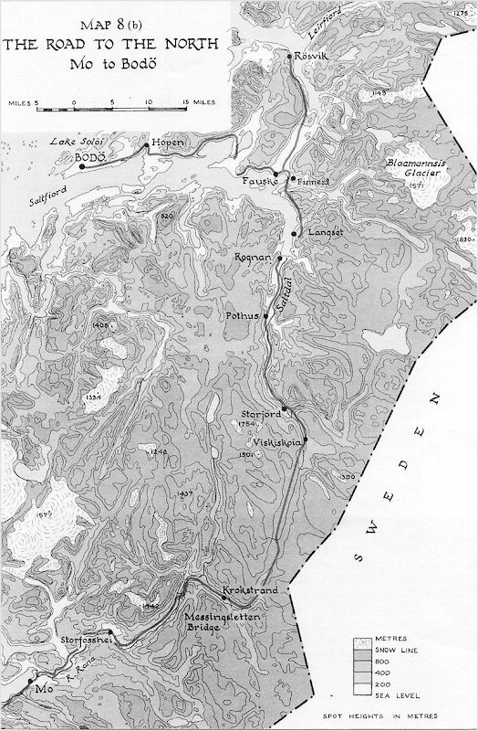

Chcú ho oslobodiť z jeho pút a využiť v boji proti postupujúcim spojencom, a na ochranu cesty do Narviku, po ktorej prúdi do Nemecka kvalitná švédska železná ruda. Vyslali vás, členov [5. (nórskej) čaty 10. komanda](https://en.wikipedia.org/wiki/No._10_%28Inter-Allied%29_Commando#No._5_%28Norwegian%29_Troop), aby ste zistili, aká [nacistická zbraň](https://en.wikipedia.org/wiki/Wunderwaffe) alebo plán sa skrýva za meno Hvíturlogi, Biely plameň. Máte informácie, že v oblasti operuje aj niekoľko členov [1. nezávislej nórskej roty](https://en.wikipedia.org/wiki/Norwegian_Independent_Company_1), s ktorými SOE pred niekoľkými dňami stratilo spojenie.

## Postavy

{:.sticky}

Všetci členovia komanda majú bojový nôž Fairbarn Sykes, bajonet vz. 1907, [dymový granát](https://en.wikipedia.org/wiki/No_77_grenade), tri [granáty](https://en.wikipedia.org/wiki/Mills_bomb), pištoľ [Browning FN-Inglis](https://en.wikipedia.org/wiki/Browning_Hi-Power), ruksak, lyže, zimné maskovanie, zimné oblečenie, zapaľovač, jedno na niekoľko dní, vojenskú lopatku, hygienické potreby, spacák, celtu, cepín, mačky, skoby, lano, fľašu na vodu, kompas plus špeciálne vybavenie.

Vyberte si svoje postavy. Jeden z hráčov musí byť kapitán.

- Kaptein (kapitán) ROLF HAUGE, [Sterling SMG](https://en.wikipedia.org/wiki/Sterling_submachine_gun), [mapa](https://www.ibiblio.org/hyperwar/UN/UK/UK-NWE-Norway/maps/UK-NWE-Norway-8b.jpg), ďalekohľad, denník.

### ALPHA tím

- Løytnant (poručík) ALF KRISTIAN SOLBU, [odstreľovačka Lee Enfield No. 4 Mk I(T)](https://en.wikipedia.org/wiki/Lee%2525E2%252580%252593Enfield#Sniper_rifles), garota, ghillie, mapa, ďalekohľad
- Korpral (desiatnik) IVAR MARIUS HAGA, pyrotechnik, 4x [Lewes bomb](https://en.wikipedia.org/wiki/Lewes_bomb), taška s pyrotechnickými nástrojmi, zápalná šnúra
- Menig (vojak) OLA CHRISTOPHERSEN,  [Le Lisle karabína](https://en.wikipedia.org/wiki/De_Lisle_Carbine)
- Menig (vojak) PETER EMIL HOPEN,  [Le Lisle karabína](https://en.wikipedia.org/wiki/De_Lisle_Carbine)
- Menig (vojak) LARS HOVSTAD,  [odstreľovačka Lee Enfield No. 4 Mk I(T)](https://en.wikipedia.org/wiki/Lee%2525E2%252580%252593Enfield#Sniper_rifles), garota, ghillie, mapa, ďalekohľad

### BRAVO tím

- Fenrik (práporčík) GABRIEL SMITH, [Sterling SMG](https://en.wikipedia.org/wiki/Sterling_submachine_gun), medik, lekárska taška, fľaša whisky, fajka.
- Korpral (desiatnik) OLAV BJØRNDALEN, [Sterling SMG](https://en.wikipedia.org/wiki/Sterling_submachine_gun), sekera
- Menig (vojak) LEIF LUDVIK LARSEN,  [odstreľovačka Lee Enfield No. 4 Mk I(T)](https://en.wikipedia.org/wiki/Lee%2525E2%252580%252593Enfield#Sniper_rifles), garota, ghillie, mapa, ďalekohľad
- Menig (vojak) BERNT MYRVAG,  [2” mínomet](https://en.wikipedia.org/wiki/Two-inch_mortar), 6 granátov
- Menig (vojak) SVERRE RØSLAND, 3 dymové granáty, 9 výbušných

## Misia

__PRVÁ SCÉNA:__ Nórska ponorka [HNoMS Ula](https://en.wikipedia.org/wiki/HNoMS_Ula_%281943%29) vás doviezla na pobrežie neďaleko od nórskeho mestečka Mo. Bližšie k ľadovcu to nebolo možné kvôli nemeckým hliadkujúcim ponorkám. Námorníci vás člnom prevezú na pláž v malom fjorde severne od Mo, poprajú veľa šťastia, a zmiznú aj s ponorkou, ako keby žiadna vo fjorde nikdy nebola.

### Rozkazy

1. Prejsť na ľadovec Blaamannsis a zistiť, čo tam robia nacistickí mystici, vo Fauske nadviazať spojenie s miestnym kontaktom, čo bude komando sprevádzať na ľadovec
2. Získať informácie a prípadne zničiť tajné zbrane
3. Zistiť, čo sa stalo s komandom 1. Nezávislej nórskej roty.

## Cesta z Mo do Fauske

Takto v zime je jediná možnosť dostať sa do Fauske po ceste, cez zasnežené hory je to prakticky nemožné. Cesta sa točí pomedzi hory a má takmer 180km. V tejto oblasti je podľa informácií niekoľko väzenských táborov, hlavne pre sovietskych vojnových zajatcov a nórskych partizánov. Vstupy do miest a dedín z každej strany stráži malý oddiel asi 10 nemeckých vojakov, majú vybudované závory, šikany a na každej strane cesty palpost z vriec s pieskom.

#### Mo
Po Bodø druhé najväčšie mestečko v okrese Nordland, 3000 obyvateľov, zväčša baníkov a lodiarov. V prístave často kotví [PA1 Arquebuse](https://en.wikipedia.org/wiki/Flower-class_corvette), nemecká hliadková loď. V Mo je pomerne silná nemecká posádka, 90 Gebirgsjäger z [2. horskej divízie](https://en.wikipedia.org/wiki/2nd_Mountain_Division_(Wehrmacht)) štandardne vyzbrojených puškami [Gewehr 41](https://en.wikipedia.org/wiki/Gewehr_41), samopalmi [MP40](https://en.wikipedia.org/wiki/MP_40), pištoľami [Walther P38](https://en.wikipedia.org/wiki/Walther_P38) a [ručnými granátmi](https://en.wikipedia.org/w/index.php?title%253DStielhandgranate%2526useskin%253Dvector#Model_1943).

#### Storfosshei
Malá dedinka, 250 obyvateľov. Je tu železná baňa a veľký väzenský tábor pre asi 500 zajatcov, a posádka 120 nemeckých vojakov.

#### Krokstrand
Malá usadlosť, len pár budov a malý hostinec. 24 vojakov stárži most. Na každej strane sú zaparkované dve polopásové obrnené [vozidlá](https://en.wikipedia.org/wiki/Sd.Kfz._250) s guľometom MG34 na streche. Veliteľské vozidlo je rozpoznateľné podľa dlhej antény.

#### Viskiskoia
Malý most cez dravú ľadovcovú riečku s perejami, stráži ho 10 vojakov, cez cestu je závora a pri ceste z každej strany strážny zrub.

#### Storjord
Malá dedina, pôvodní obyvatelia boli vyhnaní. Nemecká posádka asi 60 vojakov sa usadila v domoch a krčme, strážia pracovný tábor s asi 300 väzňami, ktorí ťažia štrk a piesok. Pred krčmou parkuje jedno polopásové obrnené vozidlo s anténou, a 4 motorky [BMW R75](https://en.wikipedia.org/wiki/BMW_R75), dve z nich majú sajdkáry. V Storjorde sa na hlavnú cestu napája cesta zo Švédska.

#### Pothus
Rovnaká malá dedinka, ako Storjord, s menším táborom pre asi 100 väzňov a posádkou 20 vojakov.

#### Rognan
Malé mestečko na juho fjordu Saltfjord, 900 obyvateľov. Je tu veľká nemecká posádka, 300 vojakov, ktorí sa striedajú v strážení pracovného tábora Both, 2km východne od mestečka. 600 väzňov stavia [blodveien](https://en.wikipedia.org/wiki/Blood_Road), krvavú cestu - novú cestu a železničnú trať. Pravidelne sa tu na trase Bodo-Fauske-Rognan zastaví hladková loď [PA2 Halleberde](https://en.wikipedia.org/wiki/German_patrol_boat_PA_2). V mestečku je aj [letisko](https://en.wikipedia.org/wiki/Rognan_Airport), čo nedávno postavila Luftwaffe. Na letisku sú dve prieskumné [Henschel HS 126](https://en.wikipedia.org/wiki/Henschel_Hs_126).

#### Langsed, Finneid
Zvyšky vypálených dedín, z domov ostali len ohorené ruiny a v Langsed múry vypáleného kostola.

#### Fauske
Malá rybárska dedina, cez ktorú prechádza železnica smerom na sever. Asi 300 obyvateľov a malá posádka 30 Gebirgsjäger. Na pláži západne od Fauske možno vidieť vrak [dopravného lietadla](https://en.wikipedia.org/wiki/Dornier_Do_26).

## Stretnutia

Pri pohybe po ceste môžu hráči zažiť rôzne stretnutia. Medzi mestami hoď k6, ak padne 6, 2k6 určí stretnutie:

{:start="2"}
2. Skupinka 1k6 slabo oblečených väzňov, ušli z tábora
3. Čata 2k6 Gebirgsjäger s 3 vlčiakmi, hľadajú väzňov
4. Hustá rojnica vojakov prehľadáva cestu a široké okolie
5. Pochodujúca skupina asi 50 väzňov, 20 vojakov sprievod
6. Mobilná hliadka, 6 vojakov na [Sd.Kfz. 250](https://en.wikipedia.org/wiki/Sd.Kfz._250)
7. Konvoj 1k6 [nákladných áut](https://en.wikipedia.org/wiki/Mercedes-Benz_L3000), doprovod 2x Sd.Kfz. 250
8. Vojenský posol s pobočníkom na [motorke](https://en.wikipedia.org/wiki/BMW_R75) so sajdkou
9. Oddiel 2k6 nórskych lovcov židov, členov [Hirden](https://en.wikipedia.org/wiki/Hirden?wprov%253Dsfla1)
10. Oddiel 36 [panzergrenadierov](https://en.wikipedia.org/wiki/Panzergrenadier?wprov%253Dsfla1) na 3 [obrnených vozidlách](https://en.wikipedia.org/wiki/Sd.Kfz._251?wprov%253Dsfla1)
11. Ostreľovač s puškou [Gewehr 43](https://en.wikipedia.org/wiki/Gewehr_43), ghillie a [Kongsberg Colt](https://en.wikipedia.org/wiki/Kongsberg_Colt)
12. Čata 6 [Waffen SS](https://en.wikipedia.org/wiki/Waffen-SS) sprevádzajúci 1 mystika - adepta

## Nástrahy prírody

Zimná príroda v Nórsku je krutá a nevyspytateľná. Hoď 2k6, prvé číslo je počasie, ktoré postavy čaká, druhé číslo je počet dní, koľko bude dané počasie trvať. Pri pohybe na zasnežených svahoch je každú scénu šanca 1 zo 6, že spadne lavína.

1. __Slnečno:__ Modrá obloha, dobrá viditeľnosť, chladno 
2. __Krutý mráz:__ Extrémny mráz, postavy vonku rýchlo zamrznú 
3. __Sneženie:__ Sťažuje až znemožňuje orientáciu a pohyb 
4. __Hmla:__ Nulová viditeľnosť, zvuky sa nesú doďaleka 
5. __Odmäk:__ Ťažký kašovitý sneh, lokálne povodne 
6. __Búrka:__ Silný vietor, sneženie, nulová viditeľnosť 

Keď sa postavy  dostanú niekde do okolia Krokstrandu, v noci uvidia krvavo červenú polárnu žiaru. Nasledujúceho dňa sa do krajiny rozliala hmla, zima, smrť a beštie zo škandinávskych povestí. Odteraz sa v tabuľke počasia zmenia "slnečno" a "odmäk" na "hmla". Mystici zmasakrovali niekoľko desiatok väzňov, ale na oslobodenie draka to nestačilo.

## Ľadovec blaamannsis

V údolí na západnej strane ľadovca je staré vikingské pohrebisko s niekoľkými [hrobkami v tvare lode](https://en.wikipedia.org/wiki/Stone_ship). Kamenná flotila stráži vstup do jaskyne, v ktorej je na silnom žriedle moci spútaný obrovský snežný drak Hvíturlogi. V zadnej časti jaskyne sú telá 50 obetovaných väzňov. Malá skupina mystikov vedených majstrom Heinrichom von Schattenberg táborí pri ústí jaskyne. Sú dobre vyzbrojení, von Schattenberg vládne mágiou Zimy, Temnoty, Mysle a Ochrany.

<!-- wikipedia preview -->

