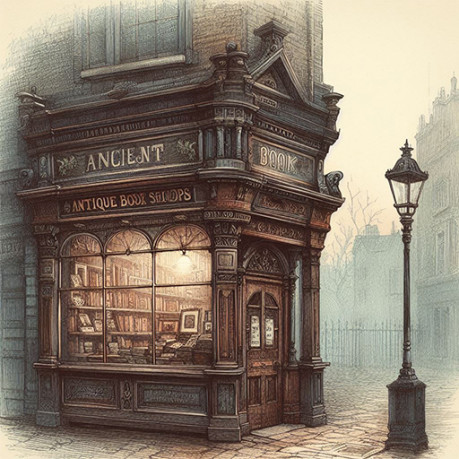
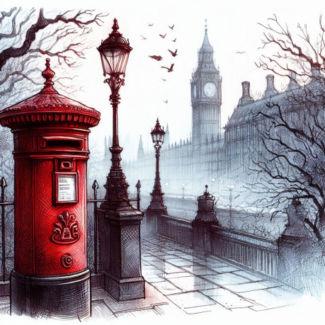

> ## Předmluva vydavatele
>
> Vážený čtenáři, právě v ruce držíte první sešit druhé kapitoly z posledního vydání nepostradatelného Montgomery‘s Manual od Amelie Montgomery, věnující se branám do Faerie v Anglii, Walesu a Skotsku se zvláštním zaměřením na Londýn. Celé svázané dílo je možné zakoupit u dobrých knihkupců.
>
> _Gideon Longworth, vydavatel a nakladatel_

## Kapitola 2: Nejznámější brány do Faerie

Brány uvedené v této kapitole patří mezi nejznámější a nejpoužívanější. Přesto průchod přes ně do Faerie nemusí být bezproblémový, levný, nebo rychlý. I tak však mohu cestovatelům tyto brány vřele doporučit a to především pro jejich bezpečnost.

### Antikvariát „U Bílé sovy“

Nedaleko Britského muzea na Bedford Square se nachází malý a ve výloze ničím nápadný antikvariát. Na ceduli na dveřích má napsáno zavřeno a nikdo se tomu ani moc nediví. Výloha je zaprášená a neudržovaná. Přesto mohu čtenářům návštěvu tohoto londýnského obchůdku doporučit. Tedy především pro ty čtenáře, kteří chtějí využít zvláštních služeb, které poskytuje majitel tohoto antikvariátu Samuel Herzl. Již dopředu musím říct, že Mr. Herzl je velmi vzdělaný a moudrý muž, zároveň je velmi vhodné zmínit, že se o svoji moudrost nedělí jen tak s někým a cizím většinou pouze zopakuje, že má zavřeno. Je proto nejprve nutné předat zprávu přes společného známého, že za ním přijdete.

Mr. Herzl velmi miluje své knihy, a pokud by snad nějakého čtenáře napadlo, že by si u něj mohl nějakou knihu koupit, tak předpokládám, že odejde s prázdnou. Pokud by však čtenář chtěl Samuelu Herzlovi nějakou zajímavou knihu přinést, tak bude mít mnohem větší úspěch. V oblibě má především první vydání, či vzácné a staré knihy. To je nakonec i způsob, jak využít bránu do Faerie, kterou má zmíněný židovský bibliofil ve vlastnictví.

Jde o velmi starou knihu neznámého původu a čistě technicky se tedy o bránu nejedná. Přesto jde o velmi solidní a bezpečný způsob průchodu do Faerie. Pro případné zájemce lze tedy zjednodušeně uvést, že v případě, že Mr. Herzl obdrží pro něj zajímavou knihu, zapíše do zmíněného artefaktu, který má v držení, tedy do uvedené knihy, skutečnost, že zájemce se ocitl na určeném místě ve Faerii. Toto se obratem promění ve skutečnost. Realita bývá občas složitější. Zaprvé Samuel Herzl je velmi zvídavý muž, a tak se postav velmi sáhodlouze vyptává proč a kam chtějí cestovat a také zjišťuje informace k jejich osobám. Snad to potřebuje do magické knihy zapsat. Těžko říct, nebo je to jeho způsob získávání cenných informací. Zápis do knihy musí být přesný a není možné jiného výkladu, stejně tak nesmí dojít k zapsání chybné informace. Vzhledem k moci, kterou artefakt skrývá, by mohly být následky nedozírné.

### Finsbury Circus

Tento nejstarší londýnský park, založený v roce 1606 za vlády Karla I., desítky let před hrůzovládou Olivera Cromwella, je nejpoužívanější branou pro poutníky z národa Sídhe. Skutečnost, že park svým půdorysem připomíná přírodní kruhové svatyně, nebude náhoda, přesto přesný původ brány znám není. Samotná brána se nachází v podivně propleteném mohutném hlohovém keři, nacházejícím se v samém středu parku. Brána do Faerie vede do lesa nedaleko pevnosti Eacharna Oisiana, tedy do Údolí bříz. Z rozhodnutí pána tohoto léna je průchod branou volný, nestřežený, ale nebývá výjimkou, že se u brány na straně Faerie pohybují zajímavé osoby, či bytosti, které jsou zvědavé, kdo ze země lidí přijde.

Brána, kterou používají Sídhe, se nachází v hlohovém keři, která se otevře poté, co se postavíte na plochý kámen poblíž keře a pronesete originální báseň dostatečné kvality. Není zřejmé, jaký genius loci rozhoduje o tom, zda je báseň dost dobrá, proto, aby se brána a otevřel a vy jste mohli projít do země skřítků. Snad nějaká prastará dryáda, milující poezii, či duch zemřelého básníka z dávných časů? Ze zkušenosti mohu říct, že úspěšné bývají především melancholické, romantické básně, ale pozor na kýčovité fráze.

Případů, kdy se nepodařilo bránu otevřít je víc než dost, neúspěšní recitátoři jsou pak především neelfského původu. Neboť Sídhe mají poezii po staletí v krvi a jsou s ní nerozlučně spjati. Naštěstí po otevření brány může projít více cestovatelů najednou. Délka otevření brány je zřejmě úměrná délce přednesené básně. Sama mohu říct, že průchod touto branou je velmi atmosférický, v keři nejprve začne chřestit a větve keře se začnou hýbat a rozevřou se do průchodu ve tvaru dveří. Z otvoru se valí mlha, která vás zcela obklopí a přízračné světlo prosvítající mezi větvemi keře vás zcela oslní.

### Poštovní schránka v Needy street

Již na začátku musím říct, že název této brány je vlastně vtip, kteří ne všichni mimo-londýnští cestovatelé chápou. Žádná Needy street totiž v Londýně není. Brána, kterou tvoří klasická červená poštovní schránka, se nenachází na stálém místě, ale její místo se různě mění. Tomu, kdo ji potřebuje, se ji podaří najít, pouze ve chvíli, kdy doopravdy potřebuje. Aby se mu schránka otevřela a on skrz její dvířka prolez do její kopie ve Faerii je potřeba, aby napsal dopis, ve kterém vysvětlí naléhavost situace. Dopis adresovaný do schránky v Needy street (Nuzná, ale Potřebná ulice – pozn. překladatele), jako odesílatele označí sebe se svojí adresou, tento dopis poté vhodí do kouzelné schránky. Během okamžiku se mu otevřou dvířka v její spodní části. Samotný průlez schránkou může být pro některé rozměrnější cestovatele trochu nepohodlný. Větší problém však bývá schránku najít. Zoufalými cestovateli byla již nalezena snad ve všech částech Londýna, a ač se tedy jedná o „všeobecně“ známý způsob průchodu do země skřítků, není příliš využívaná. V případě, že dopis není upřímný, nebo cestovatel není dostatečně zoufalý a do Faerie úplně nutně nepotřebuje, poštovní schránka zůstane neotevřená. Pokusy o její násilné otevření zatím vždy skončily neúspěchem, přičemž je zřejmé, že schránka je chráněná nějakým ochranným kouzlem, které má ve zvyku energii úderů obrátit proti jejich původci.

Asi největším zádrhelem je skutečnost, že schránka není možné na první pohled odlišit od ostatních poštovních schránek. Často se tak stává, že zoufalým (dle pravidel brány, ne dost zoufalým) cestovatelům přicházejí dopisy s vlastními srdceryvnými dopisy, které jim jako odesílatelům vrací, v rámci běžných služeb, Royal Mail, poté, co byly vhozeny do zcela běžných, nekouzelných schránek. V minulosti bylo schránku najít jednodušší, neboť poblíž ní bývá k nalezení nápis „Needy st.“. Bohužel v poslední době si mládež z kouzelnických rodin zvykla tento nápis věšet i k naprosto běžným schránkám a tak je hledání o to obtížnější. Vinu si mezi sebou přehazují studenti kouzelnických kolejí, jak z Oxfordu, tak z Cambridge. Viník se podle mě však již nikdy nevypátrá.

V závěru jen doplním, že brána vede do Jezerního města, nacházejícího se u Labutího jezera, které bylo jako věno získáno Pánem Údolí bříz. (pozn. vydavatele: O Jezerním městě více v naší publikaci Průvodce po zemi skřítků – Faerie známá i neznámá, sepsané bratry Ravensdaly, nyní v novém doplněném vydání).
