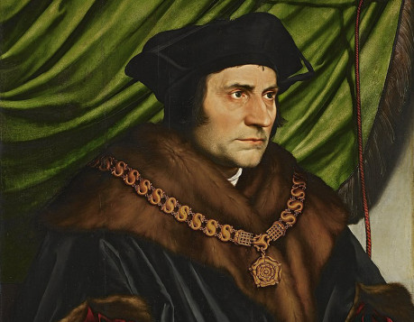
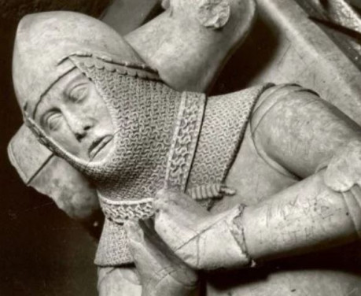
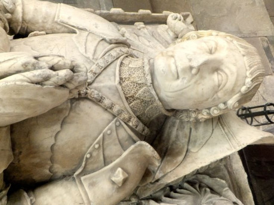

Je to kovový (zpravidla zlatý nebo stříbrný) řetěz, který se nosí jako odznak úřadu nebo označení věrnosti některému panovníkovi nebo některé ze soupeřících stran konfliktu. Velice oblíbené a běžné se staly během zápasu o dunfordské panství, kde jsou nošeny velkou částí rytířů a panstva. Je to způsob přihlášení se k jedné ze stran a prohlášení, za čím nositel stojí, jaké názory zastává a pro koho se vyjádřil.

  
Livrejové řetězy si občas nechají vytvořit sami šlechtici nebo nositelé, zpravidla je ale uděluje suverén jako odměnu za prokázané služby a věrnost. Nosí je nejen muži, ale i ženy (v lehčích verzích, aby se daly snadněji nosit). Nositelky něžnějšího pohlaví jsou nejčastěji přímo zapojeny do chodu domácnosti (dvorní dámy) nebo se aktivně zapojují do práce panovníka (diplomatky, rytířky). Livrejový řetěz je známkou ocenění této práce a zároveň umožňuje zmíněné dámě, aby se přihlásila k příslušnosti k zmíněnému šlechtici nebo straně. Občas jsou udělovány i příslušnicím významných rodů, které jsou podporovateli suveréna, jako ocenění rodu a snahu získat jejich přízeň.
  
Livrejový řetěz příslušné strany otevírá mnohé dveře, protože symbolizuje, že jeho nositel má důvěru toho, kdo jej udělil. Proto se řetězy občas také padělají a špioni nebo vrazi občas nosí řetězy druhé strany jako způsob, jak se dostat do přízně svého cíle. Nosit livrejový řetěz, který ale nebyl udělen, je považováno za zneužití důvěry a je trestáno podle obecného práva čtyřiceti ranami bičem, vsazením do klády (uvázáním k pranýři) na tři dny a uřezáním levého ucha. Pokud by stejná osoba byla přichycena při stejném prohřešku podruhé, zhoupne se v oprátce.
  
## Panství dunfordské
Nošení livrejových řetězů je tu velice oblíbené a běžné jako jedna z možností vyjádření příslušnosti k oběma znesvářeným stranám konfliktu o panství (Lišek a Kohoutů).
  
Příslušníci strany Lišek a příznivci paní Blanche nosí livrejové řetězy s liškami (lišky ve skoku se střídají s liškami v kroku), které vyjadřují, jak si původně urážlivou přezdívku věrní této strany vzali za svou. Na livrejovém řetězu, které používá strana Kohoutů, se střídají emblémy kohouta (rodová figura z erbu pana Morveta) a písmeno M (jako Morvet, rodové jméno pána).

## Rytířské límce

Běžné řetězy plní svou roli označení věrnosti a příslušnosti, jsou vznosné a jasně viditelné, ale rozhodně se nenosí pro bitvu. Jsou volné a v bitvě by zavazely, navíc by ani nevydržely úder nepřátelským mečem nebo sekerou. Namísto toho se do boje nosí verze v podobě límce, kdy je řetěz mnohem kratší, aby nezavazel a těsně obepínal brnění. Často je také upevněn na koženém řemenu, který mu dodává pevnost i v případě zásahu. Vzhledem k tomu, že se očekávají zásahy, je občas pouze pozlacen/postříbřen a je ve skutečnosti vyroben z pevnějších materiálů, jako je železo.
  
Další druh límce tvoří pouze řemen, který vepředu spíná emblém příslušné strany nebo panovníka a případně je doplněn zlatým nápisem na kůži samotné (jméno rodu, heslo nebo bojový pokřik). Ty jsou časté pro níže postavené šlechtice a rytíře, kteří si nemohou dovolit pořídit si řetězů více pro různé příležitosti.
  
## Městský řetěz
Kromě rytířů nosí livrejové řetězy i purkmistři a rychtáři (představitelé měst a vesnic). Nošení těchto řetězů se vyvinulo ze staršího obyčeje, podle kterého úředníci, kteří měli právo na vlastní úřední pečeť, nosili pečetidlo na krku na řetězu jako odznak svého úřadu.
  
V současné době se osobní pečeti přestaly nosit a pouze představitelé měst a vesnic dostávají výsadu nosit pečeť úřadu na krku na livrejovém řetězu, který jsou propůjčen panovníkem nebo vrchností vlastnící dané město či vesnici. Livrejové řetězy purkmistrů a rychtářů jsou méně zdobené a často jen stříbrné (nebo v případě vesnic i jen železné), ale stále plné roli odznaku úřadu a věrnosti vládci, který jej propůjčil.
  
## Řetězy rytířských řádů

Kromě označení věrnosti feudálnímu pánovi se livrejové řetězy používají také, aby označily příslušnost k některému z rytířských řádů. Jejich členové nosí řetězy různých podob a druhů, většinou s emblémem řádu nošeném vprostřed řetězu na hrudi. Řetěz je členovi darován patronem řádu při jeho vstupu, vzhledem k exkluzivitě rytířských řádů jsou většinou ze zlata a nezřídka jsou také vykládány drahými kameny. Pokud je některý šlechtic zároveň členem rytířského řádu a chce ukázat příslušnost k panovníkovi, většinou nosí livrejový řetěz panovníka a na hrudi na něj má připevněný odznak řádu.
  
Jeden z nejznámějších rytířských řádů, Řád křišťálového kalicha, používá zlatý řetěz, na kterém se střídají lvi a lilie a vepředu na něm visí kalich vyřezaný z horského křišťálu. Sir Ian Holmes, jeden z rytířů paní Blanche, je zároveň členem Řádu křišťálového kalicha a jako takový, nosí kolem krku řetěz s liškami a na hrudi na něm zavěšený přívěšek v podobě křišťálového kalicha, čímž zobrazuje svoji věrnost oběma těmto frakcím.
  
## Livrejové řetězy v Ravnburghu
V Ravnburghu se objevují poměrně často řetězy jak Lišek, tak Kohoutů, jsou tu ale i další hráči. Rod Lochbearerů má vlastní livrejové řetězy, které přetrvaly z dob jejich největší slávy a které nosí jim přímo podřízení drobní zemané a rytíři. Stal se ale také symbolem loajalistů, kteří si přejí návrat vlády Lochbearerů ve městě. Mají podobu opakujících se havranů, kteří křídly drží korunu probodnutou mečem (emblém rodu). Hansa, která nyní drží vládu ve městě, začala s rostoucí politickou mocí livrejové řetězy používat také a uděluje je věrným, kteří prokázali loajalitu a užitečnost obchodnímu spolku. Dostávají je kupříkladu šlechtici a konšelé měst, která jsou součástí hansy. Jejich livrejové řetězy většinou spojují emblém hansy (zlatá váha) a erbu města. V Ravnburgu nosí představitelé hansy řetězy zobrazující trojici havranů na kruhovém disku, střídané se zlatou obchodní váhou.
  
Jelikož v současné době je spor Lišek a Kohoutů v politických sférách na prvních příčkách důležitosti, začaly řetězy, symbolizující vnitřní politický rozkol města, odrážet i tento větší konflikt. Většina členů města, kteří jsou do válek o dědictví zapojeni, začala na městské řetězy věšet odznaky obou stran (lišku v případě, že stojí na straně paní Blanche a kohouta nebo písmeno M v případě, že podporují pana Morveta). Přestože se ale Lochbearové vyslovili pro Kohouty a Hansa pro Lišky, ne všichni jejich následovníci tak učinili.
  
Kupříkladu pan Thomas Rowlett podporuje stranu Lochbearerů a nosí jejich livrejový řetěz, ale nedávným sňatkem (jeho syn a dědic si vzal příbuznou paní Blanche) se jeho rod postavil za Lišky v širším konfliktu. Podle zvyklostí nemůže bojovat proti tak blízké rodině a je ctí povinován naopak bojovat za paní Blanche proti všem jejím nepřátelům, kromě svého vlastního lenního pána. Na rozdíl od svých spolustraníků ve městě tak nosí na lochbearerském řetězu namísto písmene M zavěšený emblém lišky. Není jediný, takových případů je víc na obou stranách.
  
Ve městě jsou poměrně často k vidění také livrejové řetězy vévodů z Rotelandu, kteří se snaží zůstat v obou konfliktech neutrální (nakolik se jim to daří, je jiná věc) a jejich řetězy kombinují vyobrazení ryby (erb rodu Fevershamů) a arlatského gryfa.
  
## Využití ve hře
Livrejový řetěz je dobrý a viditelný detail pro cizí postavy, protože se jeho nošením hlásí k některé z frakcí. Postavy tak mohou ihned jednoduše odhadnout, čím se nositeli zavděčí, čemu se v konverzaci vyhnout a jak by reagoval ještě předtím, než jej osloví. Nošení řetězu je v zásadě velké vyjádření _„tady jsem, pro tohle stojím a jestli máš s tím problém, pojď mi to říct do očí!“_. Pro postavu tak může být stejně snadno velkou pomocí, jako i ohromným magnetem na potíže, který každému protivníkovi jeho strany říká, že právě on je jejich nepřítelem.
  
Livrejový řetěz se svou výrazností může velmi jednoduše stát hybatelem příběhu.
  
-   Kupříkladu doprovod rytíře hrdě stojícího na straně Lišek přes město ovládané stranou Kohoutů se může rychle zvrhnout v šarvátku, pokud postavy nevynaloží nemalé úsilí, aby donutily svůj urozený doprovod řetěz během průchodu ukrýt. Hodně štěstí s tím, mimochodem. Rytíři jsou hrdí a paličatí.
-   Pokud postavy v okolí veřejně podpořily snahy či nároky Kohoutů, při pohledu na rychtářův řetěz s liškami jim bude rychle jasné, že toto vyjednávání zdaleka nebude tak snadné, jak si myslely.
-   Naopak z druhého soudku, dědička, stojící na straně Kohoutů, která potřebuje uniknout z města, může poslat sluhu s žádostí o pomoc právě rytíři v družině, jen protože zahlédla jeho livrejový řetěz označující jeho příslušnost ke stejné straně.

Podobné situace tak můžou oživit vaše hraní a přinést do něj zajímavé zápletky a napětí.
  
A pokud je ve vaší družině postava rytíře či šlechtice, livrejový řetěz může být pro něj odměnou za věrnost svému pánu, splnění několika důležitých úkolů, nebo za vyznamenání se v důležité bitvě, kde postava rozhodla svou odvahou den. Předání livrejového řetězu by mělo být jedinečným zážitkem, srovnatelné důležitostí s pasováním na rytíře, protože nošením řetězu ukazuje, že se prokázal jako schopný a má důvěru svého lenního pána. Řetěz mu může otevřít spoustu dveří, ačkoliv musí mít na paměti, že spoustu jich rovněž nevyhnutelně zavře.
  
## Závěr
Pokud vás zaujal svět Ravnburghu, další materiály pro něj najdete tady.
[https://rpgforum.cz/forum/viewtopic.php?t=15608](https://rpgforum.cz/forum/viewtopic.php?t=15608)
