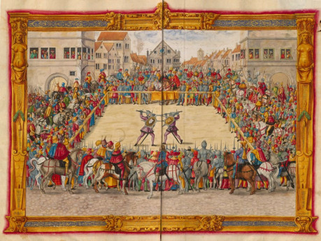
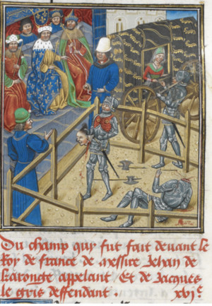

Soudní souboje jsou v Ravnburghu už poněkud zastaralé, ale stále přípustné a občas užívané nástroje, jak určit vinu nebo nevinu v případě vážných případů, kde chybí svědkové a důkazy nejsou průkazné. Souboje jsou mezi dvěma bojovníky, obviněným a obviňujícím, a vedou se na smrt. Věří se, že bohové nenechají prohrát nevinného, přikloní se na jeho stranu a dopomohou mu k vítězství.

Podle logiky souboje jeden z bojovníků musí být vinen a podle stejné logiky musí druhý být nevinen. Na začátku souboje je vina a nevina skryta, ale je odhalena na konci souboje. Oba bojovníci budou bojovat, ale jen jeden z nich bude žít. Jen jeden opustí místo souboje, očištěn soudem bohů, druhý bude poražen a zabit a jeho mrtvé tělo bude důkazem jeho viny přede všemi.

## Soud

Právní řád uvádí sedm zločinů natolik vážných, že soudní souboj je přípustným průkazním prostředkem v případě absence svědků. Těmi jsou vražda, zrada, kacířství, opuštění lenního pána/paní, únos, podvod a znásilnění. Urození využívají soudní souboj také jako způsob řešení urážek na cti mezi sebou.

Pravidla určují, že musí být splněno několik podmínek k tomu, aby byl umožněn:

- musí být jisté, že zločin se skutečně stal
- musí jít o jeden ze sedmi závažných zločinů
- obžalovaný musí být široce podezříván ze zločinu
- všechny ostatní prostředky dokazování byly vyčerpány a jediným zbylým prostředkem k usvědčení je nechat rozhodnout bohy v souboji

Soudní soubo jako nástroj obhajoby není vždy obžalovanému k dispozici. Pokud byl obžalovaný lapen _mainour_ (při činu), pokud se pokusil v průběhu soudního řízení uniknout z vězení, nebo jsou důkazy tak silné, že je nelze odmítnout, není soudní souboj obžalovanému umožněn.

Pokud obžalovaný vznese výzvu k soudnímu souboji a jeho žalobcem je žena, stařec nebo stařena (nad 60 let věku), nezletilý, chromý nebo slepý, mohou tito odmítnout výzvu nebo za sebe postavit do boje zastánce. Stejně tak smí odmítnout výzvu i kněží a šlechta. V případě, že je výzva zákonně odmítnuta (smí být odmítnuta), o případu rozhodne porota.

Zastánce by se měl přihlásit dobrovolně a najatí zastánci jsou technicky nelegální, ale používají se poměrně běžně. Pokud je žalobcem stát (královský úředník), pak za něj do boje často nastupuje zastánce v podobě vězně ze žaláře, který má za pět vítězství v soubojích slíbené prominutí trestu.

Pokud slabší strana (žena, kněz, stařec a podobně) nevyužijí svého práva odmítnout výzvu, pak bude v souboji jejich protivník nějakým způsobem znevýhodněn. Buď nedostane brnění, nebo nebude mít jednu ruku za zády, nebo bude mít k noze připevněn řetězem těžký kámen.

## Představení svitků a vyvolání

Souboj začíná, když se oba bojovníci dostaví na určené místo v určený čas. Oba se představí a předají soudci svitky, které dopředu připravili právníci. Na nich jsou shrnuty důvody pro souboj a stanoviska obou stran.

Pokud se jeden z bojovníků nedostaví ani poté, co byl v určený čas třikrát vyvolán, jeho protivník symbolicky provede dvě bodnutí a dva seky proti vzduchu a počítá se, jakoby v souboji zvítězil. Bohové rozhodli v jeho prospěch a bojovník, který se nedostavil, je vinen a bude oběšen, pokud bude dopaden.

## Přísahy

Po předání svitků musí oba bojovníci vstoupit mezi šraňky na vyhrazené bojiště a pronést tři slavnostní přísahy, ve kterých strdí, že pravda je na jejich straně a spravedlnost je při nich. Šraňky jsou za nimi uzavřeny a nesmí je už bez souboje opustit.

První přísaha je pronesena, zatímco se bojovníci dotýkají zrcadla, aby jejich přísaha zněla ozvěnou v síních Zrcadlového dvora a bohové ji slyšeli.

Před pronesením druhé přísahy bojovníci pokleknou proti sobě, tváří tvář jeden proti druhému, aby naznačili svůj antagonismus a s rukou stále na zrcadle přísahá, že mluví pravdu a pokud lže, nechť jeho duše nedojde do Irkelly, ale sežerou ji strašlivé stvůry, které zásvětí hlídají.

Při třetí přísaze, stále klečící proti sobě, oba bojovníci si podají levou ruku (užití levé, nikoli pravé ruky, naznačuje nepřátelskou, nikoli přátelskou přísahu) a pronesou předepsaná slova. Maršálek, který dohlíží na souboj, a je rozhodčím vítězství a prohry, pak sevře jejich spojené dlaně ve svých a tím oba bojovníky a sebe spojí v souboji a rituálu. Žádný z nich nesmí opustit šranky, dokud jeden z bojovníků nezemře a nerozhodne se tím o vině nebo nevině.

## Bojiště

Zpravidla se jedná o prostor vymezený prostor na náměstí nebo návrší za městem, aby mohli být přítomni svědkové z řad obyvatel. Bojišťěm je rovný čtverec 18 na 18 metrů, ohrazený šraňkami nebo jinými zábranami.

## Zbraně

Obě strany bojují stejnými zbraněmi a jsou stejně oděny, aby se zajistily rovné podmínky pro bojující. Šlechtici bojují v sedle v plné zbroji s kopími (a po jejich zlomeni sáhnou po záložních zbraních) a neurození bojují opěšale buď meči nebo palcáty, ruce mají chráněné koženými rukavicemi, v levé ruce mají štít a mohou mít kožené brnění. Jejich hlavy musí být odhalené a bojuje se bez bot. Přes sebe mají bojující přehozený rudý varkoč z lehkého hedvábí zvaného _cendal_, které označuje účastníky soudního souboje před bohy.

## Souboj

Boj začíná zpravidla v poledne a musí být rozhodnut před západem slunce, jinak bude za vítěze prohlášen obžalovaný. Pokud byl obžalovaný poražen, ale je stále naživu, je na maršálkovi, aby dokonal vůli bohů a poraženého dorazil. Žalobce může během boje uznat svou porážku a vykřiknout _„Cravanté!“_ (_„Jsem poražen!“_). S tím vzdá svou při, ale protože se snažil nespravedlivě obvinit nevinného, bude potupen, musí uhradit škody obžalovanému a bude vyhnán a prohlášen za psance.

## Závěr

Pokud vás zaujal svět Ravnburghu, další materiály pro něj najdete tady.

[https://rpgforum.cz/forum/viewtopic.php?t=15608](https://rpgforum.cz/forum/viewtopic.php?t=15608)
