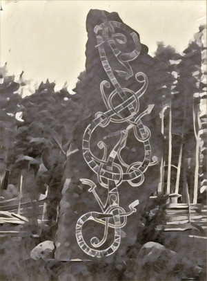

Mágia Niflheimu sa dá praktizovať tromi spôsobmi:

- `Galdr` - krátke zaklínadlá s okamžitým účinkom
- `Blót` - rituál, vyžaduje prípravu a krv obete, vykonať rituál trvá oveľa dlhšie, ako krátke zaklínadlo, ale čarodej vie pomocou rituálu zoslať mocné zaklínadlá
- `Rúnasmíði` - mágia rún, podobná rituálu, umožňuje čarodejovi spútať magické sily pomocou rún do predmetov, zbraní, amuletov, stojacich kameňov alebo tetovaní.

## Kto sa s ohňom zahráva, popáli sa

Praktizovanie mágie je mimo ľudských schopností. Ak sa o to pokúsiš:

- Vezmi si zelenú kocku Šialenstva, _praktizovaním mágie riskuješ svoju príčetnosť_.
- Vezmi si kocku, _ak ti tvoje povolanie alebo vedomosti dávajú nejakú výhodu_.

Hoď si na Šialenstvo vždy, keď sa pokúsiš o praktizovanie mágie, vrátane opakovaných hodov.

Ak je číslo na kocke vyššie, ako tvoje súčasné Šialenstvo, pripočítaj k Šialenstvu 1 a opíš viditeľné krvavé známky použitia mágie - krvácajúce oči, nos alebo uši, čerstvo zahojené rany sa ti otvoria a krvácajú, na tele sa ti objavili modriny.

## Nástrahy mágie

Praktizovanie mágie sa vždy spája s rizikom. Čím mocnejšie zaklínadlo, tým väčší risk:

- `Malá zmena` (1) - jeden objekt alebo tvor v dosahu ruky, alebo s krátkodobým účinkom (okamžite, alebo do konca scény)
- `Mierna zmena` (2) - niekoľko (~5) predmetov alebo tvorov v dosahu ruky, jeden predmet vzdialený niekoľko metrov, alebo s krátkym účinkom (do najbližšieho východu alebo západu slnka)
- `Veľká zmena` (3) - tucet (~12) predmetov alebo tvorov na dosah ruky, niekoľko predmetov alebo tvorov vzdialených desiatky metrov, alebo dlhší efekt (do splnu alebo novu mesiaca)

Vezmi jednu, dve alebo tri čierne Tieňové kocky, v závislosti od rozsahu záklínadla. Čierne kocky tvoria prekážku, proti ktorej hádžeš.

Ak zlyháš, Skald (Strážca) opíše, ako si zlyhal.

## Lokiho oko

Každá 1, čo ti padne na čiernych Tieňových kockách, sa ti vypomstí, aj keď pri zaklínaní uspeješ.

Uveď do hry nejakú komplikáciu alebo zlé znamenie. Vyber si, aké:

- Účinok zaklínadla je menší, alebo kratší
- Pritiahneš pozornosť beštie z Niflheimu
- Všimnú si ťa (a možno aj na teba zaútočia poverčiví ľudia, čo sa boja mágie)
- Niečo sa pokazí alebo zničí
- Niekomu ublížia
- Cítiš sa slabý, chorý, alebo zmätený
- Hustá hmla zahalí scénu
- Neprirodzene sa ochladí a zotmie
- Na oblohe sa zjaví neprirodzený kŕdeľ vrán
- Počuješ zavíjať vlky alebo psy
- Zbadáš niečo príšerné

## Magické rituály

Blót alebo Rúnasmíði ti umožnia použiť silnejšiu mágiu, ale ich vykonanie trvá dlhšie, a stojí ťa viac krvi. Oba rituály, Blót aj Rúnasmíði vyžadujú 3 hody kockami. Prvý hod sú _prípravy_, druhý sú _obetovanie_, tretí _zaklínanie_.

Aby si úspešne vykonal rituál, musíš uspieť vo všetkých troch hodoch. Ak niekto rituál preruší, rituál sa nepodarí vykonať.

Oba rituály, Blót aj Rúnasmíði, ti umožnia zoslať deväťkrát silnejšie zaklínadlo, ako Galdr.

Podobne ako pri zaklínadlách, urob hod na Šialenstvo po každej fáze rituálu. Každý, kto ti s rituálom pomáha, tiež musí hádzať na Šialenstvo.

Hodom na Šialenstvo sa môžeš vyhnúť, ak tvoj vyšetrovateľ obetuje iných tvorov:

- `Malý rituál` - zajac, sliepka alebo dieťa
- `Stredný rituál` - ovca, koza alebo žena
- `Veľký rituál` - kôň, býk alebo urastený muž

## Zvládnutie mágie

Ľudia dokážu zvládnuť mágiu Niflheimu len v obmedzenej miere, maximálne tri sféry mágie. Beštie z Niflheimu dokážu zvládnuť aj viac sfér mágie.

Ľudský čarodej, seiðr, sa nazýva adeptom po zvládnutí jednej sféry, tovaryšom po zvládnutí druhej, a majstrom po zvládnutí tretej sféry.

## Deväť sfér mágie

- `Uzdravenie` - vieš uzdraviť seba alebo iného chorého, vyčerpaného alebo zraneného tvora dotykom ruky.
- `Prírodné živly` - dokážeš privolať dážď, utíšiť búrku, alebo nájsť zdroj vody.
- `Presvedčivosť` - dokážeš manipulovať s ľuďmi, aby urobili to, čo od nich chceš.
- `Jasnozrivosť` - dokážeš vidieť veci vzdialené v čase aj priestore. Čím viac sú vzdialené, tým menej detailov vidíš.
- `Ochrana` - dokážeš ochrániť pred zranením, chorobou, nešťastím alebo mágiou.
- `Oheň` - dokážeš vyčarovať alebo manipulovať ohňom. Oheň ťa nepopáli.
- `Chlad` - dokážeš vyčarovať alebo manipulovať chladom. Chlad ťa nepopáli.
- `Temnota` - dokážeš vyvolať alebo manipulovať s temnotou a tieňmi, ukryť sa v tieňoch, alebo cestovať Niflheimom medzi miestami moci, ak poznáš ich polohu a unikátny runový vzor - galdrastafir.
- `Smrť` - dokážeš hovoriť s mŕtvymi, povolať draugrov na pomoc, otráviť, alebo zabiť dotykom.

## Zdroje moci

Zober si extra čiernu Tieňovú kocku do svojho banku kociek, ak čaruješ na mieste moci, alebo počas dní moci.

### Miesta moci

- `Kamene moci:` Menhir (stojaci kameň), Cromlech (kamenný kruh), rad stojacich kameňov
- `Posvätné miesta:` Hørg (kamenný oltár), ochranný strom
- `Pohrebiská:` Cairn (pohrebná mohyla), Dolmen (kamenný stôl), Steinskip (kamenná loď)

### Dni moci

- `miðsumar` a `yule` - letný a zimný slnovrat
- `austr` a `álfarblót` - jarná a jesenná rovnodennosť
- `fullt tungl` a `nýtt tungl` - spln a nov
- `sólmyrkvi` a `tunglmyrkvi` - zatmenie slnka a mesiaca

## Staršia krv

Tvoj vyšetrovateľ zdedil staršiu krv Niflheimu. Vyber si beštiu z Niflheimu a jednu jej schopnosť. Keď používaš túto schopnosť, namiesto bielej kocky si zober čiernu Tieňovú kocku.

### Troll

- Obrovská sila
- Zúrivosť Berserka (urob všetky hody na Šialenstvo až na konci scény)
- Nočný zrak

### Álf

- Krása Álfov
- Plášť z tieňov (ľudia ťa nevida, ale zvieratá a kamery áno)
- Očarujúca hudba
- Magický remeselník

### Hamrammr

- Meňavec - vyber si jedno zviera, na ktoré sa vieš zmeniť: medveď vlk, jeleň, los, diviak, kôň, líška, rys, orol, havran alebo sova.
- Zvieracie zmysly
- Šiesty zmysel

### Valkýra

- Uzdravenie
- Bojové reflexy
- Pútnik v hmle
- Reč havranov
