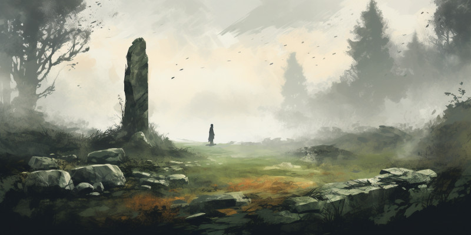
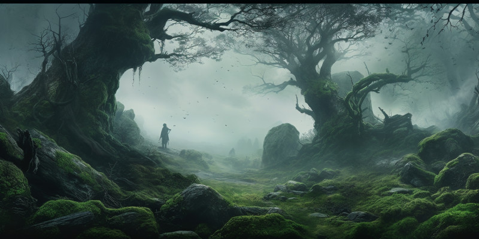

Ptáte se, proč devět? Devítka byla v severských legendách posvátné číslo. Proto měli jejich legendy devět světů napojených na Yggdrasil, hostiny trvaly devět dní a bohům bylo obětováno devět obětí. A Odin sám visel na větvích Yggdrasilu po devět nocí… Pokud vám ale chybí to desáté setkání, aby to sedělo na k10, nechte se inspirovat a přijďte s jedním sami! Nebo hoďte dvakrát z těchto devíti a zkombinujte je dohromady. ;-)

{:.map}

## 1/Trpasličí kovář a Bronzový dub

Uprostřed mýtiny, obklopené ochrannými runovými menhiry, stojí Bronzový dub. Jeho dřevo i listí má vzhled a vlastnosti nejlepšího bronzu, který navíc dorůstá. Před stromem je trpasličí kovadlina a výheň, a zapálený trpasličí runový kovář. Vytváří ty nejlepší šupinové zbroje z listů stromu, hlavice šípů i dýky z toho samého a dlouhé zbraně z jeho větví. Je ochotný něco směnit, pokud jej návštěvníci bohatě pohostí a zanechají mu dostatek alkoholu a jídla, aby se mohl věnovat své práci bez přerušení. Pokud chtějí magickou zbraň či zbroj, musí mu přinést kvalitní trpasličí kovářské vybavení (různě velká a tvarovaná kladiva či kleště z oceli, aby byli pevnější než jeho bronzové). Mění kus za kus.

## 2/Borůvkové pole

V zlomeném kořeni obřího stromu si udělal svou chalupu moudrý, ale zákeřný troll. Na jedné straně domku je obří borůvkové pole z keříků vysokých po pás, a některé z borůvek mají velikost lidské hlavy. Troll je uvnitř chalupy změněný jako stará nemocná paní, skrytá pod hromadou dek a kůží (aby nebyl vidět jeho oslí ocas, který se nezměnil společně s iluzí), a žádá cestovatele o pomoc s tím, aby jí přinesli tu největší borůvku, co dokážou najít, aby si mohla udělat léčivý čaj. Přičemž jim slíbí, že se s nimi podělí. Pravdou je, že v borůvčí číhá a loví zlý had, dlouhý jako tři vozy, a troll se tam sám bojí. A v největší borůvce v hadově borůvčí se neskrývají léčivé schopnosti, ale semínko velké jako pěst, které je drahou černou perlou. Ta má moc posílit jakýkoliv magický věštící rituál.

## 3/ Hlava matky a Oltář mrtvých dětí

Částečně mumifikovaná hlava obryně na přírodním oltáři vytvořeném z masivního plochého balvanu, porostlého mechem a trním, a zdobeným krutými kresbami, symboly a obětinami. Uvnitř hlavy sídlí desítka Mylingů, což jsou duše zavražděných dětí. Ty zabijí toho, o koho jejich matku požádáte a necháte jí a jejím dětem dar, který musí být pokřivenou dětskou hračkou (například panenka sešitá z mrtvol veverek). Mylingové svůj cíl zabijí tak, že na něj postupně naskáčou a stáhnou jej do země, kde ho pohřbí a udusí. Pokud se ale cíly jejich hněvu podaří dostat se s Mylingy na zádech někam na svatou půdu a pohřbí je tam, tak se nejen zachrání, ale i jim dopřeje konečně klidný odpočinek. A oni mu prozradí jméno toho, kdo je poslal.

## 4/Ledové lesní doupě

Les před Vámi je pokryt tenkou vrstvou námrazy a čerstvého sněhu, místo listí jsou na stromech rampouchy, a studánka je zamrzlá i s rybami. Tohle je sídlo mladého ledového draka, který si zde udělal své dočasné doupě. Je ještě dítě, a stejně tak je i zvědavý, ale i krutý. Umí ovládat zimu, může nechat jezírko zmrznout a zase zamrznout pod svými cíly, úderem ocasu na ně vrhat rampouchy ze stromů a rozvířit sníh tak, že nic neuvidí. Ale jak je mladý, je možné jej zaujmout i drobnými cetkami, sliby a přísahami či informacemi o okolí, kde může získat více vědomostí, bohatství či jídla.

## 5/Zahrada spícího zemského obra

Trávou, stromy a keři pokrytý kopec ve tvaru sedícího muže… protože je to zemský obr. Usnul zde před stovkou let a odpočívá zde a sbírá sílu. Můžete si na něj v klidu vylézt a utrhnout si ovoce ze stromu či keřů (která jsou velmi lahodná a povzbuzující jak na těle, tak na mysli), ale nedej bože, pokud byste něco na něm poškodili. Obzvlášť lákavý je na něm rostoucí nesmírně vzácný Stříbrný aelfjilm. Jeho dřevo je prý pevnější než jakákoliv známá ocel, ale přitom je tak lehké, že plave.

## 6/Kostěná knihovna magie

Nacházíte se na prastarém bojišti, které je poseté zbytky koster jak lidí, tak trollů i jejich rezavějícími zbraněmi. Prakticky vše je pokryté runami nesoucími informace o magii smrti. Každý, kdo zde stráví dostatek času a zvládá manipulovat vichry magie, se dokáže naučit, jak mluvit s mrtvými, jak věštit pomocí jejich kostí a další podobná kouzla. Ale je vystaven taktéž velkému nebezpečí. Bojiště obývá démon Zmaru. Přebývá zde jako píseň ve větru, myšlenka v prázdných lebkách a stín v mlze, která se zde věčně převaluje u země. Když zde strávíte moc času, otráví Vaši mysl a nejprve přestanete cítit empatii s jakoukoliv lidskou bytostí a jejím životem, a nakonec si přestanete vážit i svého vlastního života a nabudete pocity nedůležitosti a zbytečnosti.

## 7/Výzva Bohům

Statný muž, celý ve zbroji, se štítem a mečem stojí v kruhu zdobených menhirů a vyřvává nadávky na bohy. Proč mu vzali celou osadu a jeho rodinu, když byl na výpravě? Proč, když přišel zpět domů s bohatstvím, aby zabezpečil svou rodinu, našel všechny mrtvé? Nádává, vyzývá a proklíná všechny bohy co zná. Chce, aby přišli a vysvětlili mu to a zaplatili. Dožaduje se spravedlivého boje a také se mu jej brzo dostane, tak jak právo říká.

## 8/Osm mrtvých bratrů

Domek na okraji jezera, jenž je částečně pokryté kusy ledu, i kdyby to nemělo odpovídat ročnímu období. Domek má rozlámaná okna i dveře, a uvnitř se nachází hromada mrtvých lidí, modrých a ledově studených na dotek. Podle zranění zemřeli na spáry šelem i údery zbraní. Všichni jsou to muži a jsou si velmi podobní. Celkově jich je devět, ale jeden z nich ještě dýchá. Jmenuje se Freyur, který zabil Vargrima z jarlovi rodiny a proto se šel ukrýt, aby nestrhl jarlův hněv na celý jeho rod. Jeho osm bratrů se ale vydalo s ním. Jarlovy synové s jednotkou berserkerů je našli, přepadli a všechny v noci pobili. Jenom on zázrakem přežil. Jeho bratři začnou zanedlouho vstávat z mrtvých, žádajíc si pomstu, že oni zaplatili za jeho zločin. A pokud se jarlovo synové dozví, že přežil, půjdou po něm. Pomůžete mu, nebo jej ponecháte jeho trestu?

## 9/Čarodějnice a kamení 

Na zemi leží svázaná krásná, statná žena s roubíkem v puse. Kolem ní je skupina mužů válečníků, kteří ji mlátí dlouhými holemi a hází na ni z dálky kamení. Je to čarodějnice, která proklela bratra jednoho z nich, a oni ji takto hodlají zabít. Neplatí na ní žádné kovové zbraně, proto zvolili tento způsob. Taktéž je to pro ní trest, chětjí aby trpěla. A navíc se bojí k ní přiblížit a dotknout se jí. Jelikož ten, který ji svázal, je opodál změněný v krávu, jejíž mléko i maso jsou otrávené (ale to ještě nikdo neví).

{:.map}

