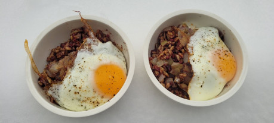

Zlobři z Ledových fjordů daleko na půlnoci jsou známí pro oblibu v „krvavých klobásách“, kterým se v severních královstvích říká „zlobří klobásy“. Jsou podobné Blutwurstům našeho světa (střívka jsou naplněna krví, špekem, škvarky, mletým masem a kořením… mezi lidmi se používá především vepřové, mezi zlobry je lepší se neptat) a přidávají se do jídel, nebo se jen přikrajují k chlebu nebo jí i jen samostatně.

Taková zlobří klobása se používá i ve vydatném zimním jídle, který můžete najít v krčmách a na talířích Ravnburghu nebo středověkého světa (kde byly podobné jelita a Blutwursty také populární).

Nejde o historicky zaznamenaný recept, protože středověké recepty nezaznamenávaly prosté jídlo, které jedli vesničané nebo lidé v hospodách), Je ale natolik „autentický“, jak jen může být. Je „možné“, že byste takové jídlo doopravdy našli ve středověkém hostinci nebo na stole sedláka. Víme, že ve středověku byly k dispozici všechny ingredience, které jsou v receptu použity a víme také, že se v realitě skutečně používaly.

### Ingredience (pro 2 porce)

-   2 střední cibule (nasekané na kostky)
-   trocha sádla
-   1 Blutwurst (nasekaný na drobné kousky) nebo jelito
-   125 g krup
-   2 vejce
-   Sůl na dochucení

Množství ingrediencí nemusí být přesné. Berte tento recept jen jako inspiraci, ne přesný návod. Pokud máte rádi vejce, udělejte si ke kroupám dvě nebo tři. Máte nějaké čerstvé bylinky, které nejsou historicky přesné (protože v zimě nerostly)? Nevadí, klidně je přidejte! Záleží jen na vás, jak si recept pro sebe upravíte!

### Postup přípravy

1.  Na pánvi rozpalte trochu sádla.
2.  Přidejte cibuli nasekanou na kostky a osmažte ji do zlatova.
3.  Přidejte nakrájený Blutwurst (nebo prejt z jelita) a osmažte a promíchejte s
4.  Po straně si uvařte kroupy. Kroupy propláchněte pod studenou vodou. Vložte kroupy do hrnce s vroucí, mírně osolenou vodou (v poměru 1:2). Vařte na mírném plameni, dokud se většina vody neodpaří, a kroupy nejsou na skus (12-15 minut, případně podle návodu, pokud jsou koupené v obchodě). Sceďte zbylou vodu a kroupy jsou hotové.
5.  Přidejte kroupy na pánev a vše dobře promíchejte, pak dejte do misek.
6.  Na pánvi (můžete na druhé pánvi dělat souběžně, nebo misky přikryjte udělejte na stejné pánvi) si udělejte usmažte vejce jako volské oko na troše sádla. Na troše sádla usmažte vejce, dokud nebude bílek tuhý, ale žloutek stále tekutý (osolte).
7.  Vejce přidejte na misku a můžete podávat! Dobrou chuť!

### Závěr

Pokud si kroupy na zlobří způsob vyzkoušíte (ať už jako autentické zimní jídlo na příští herní sezení nebo jen tak), určitě nám dejte vědět a pošlete fotku! _Dobrou chuť!_
