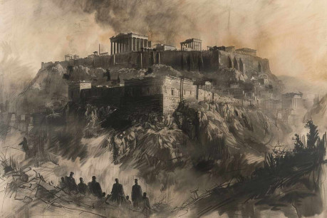

Mesto vyslalo do Atén posla so žiadosťou o pomoc, no zhromaždiť flotilu, ktorá by prerazila blokádu potrvá dlho, obzvlášť v časoch politickej nestability.

Archón Themistocles berie veci do vlastných rúk a investuje do malej výpravy dobrovoľníkov, ktorí musia nepozorovane preniknúť do mesta a udržať ho kým neprídu posily z atén.

# Status quo

Výpravou je poverená najskúsenejšia, najvhodnejšia, alebo najznámejšia postava. Je jej pridelený rýchly triconter Selenia so skúseným kubernetom a hrstkou námorníkov.

V dobe príchodu posla sa do Miletu dostáva záškodník a prináša so sebou mor. Kým postavy dorazia, epidémia sa už bude šíriť. Momentálne sa tu nachádza jeden nakazený v terminálnej fáze Histiaeus ho však drží vo svojej pivnici, 2d6 pacientov bojuje v akútnom stave, všetci v podhradí a 5d6 je v prvotných fázach nákazy, z toho d6 v akropoli. Začínajú sa šíriť chýry o epidémií behavky v podhradí.

Miletus je touto dobou obliehané už asi mesiac a peržania aj obyvatelia začínajú vnímať rutinu. Opevnená akropola každý deň odoláva útokom a ľudia vo vonkajšom meste, ktorí sa do akropoly nedostali slúžia peržanom ako otroci. Peržania stále očakávajú, že keď zlomia vedenie mesta celé sa stane poslušnou súčasťou ich ríše, preto je nejaké príliš brutálne správanie skôr ojedinelé. Naopak vojaci si už zvykli podmaneným národom ukazovať veľkodušnosť svojho impéria.

# Cesta

Cesta z Attiky do Miletu trvá rýchlou monérou asi týždeň, celkovo má 20 hexov (cca 300km). Postavy pri tom cestujú väčšinu dňa a preplávajú tri hexy za deň. Kyklády poslytujú množstvo ostrovov, kde je možné vždy na konci dňa zakotviť a prespať. Každý deň si hoď na tabuľku náhodných udalostí.

1.  Hermés dohliada na loď a vedie ju rýchlosťou blesku, ak sa rozhodnú veslovať celý deň, preplávajú o hex viac. Únava sa však prejaví normálne
2.  Zeus s poseidonom priviedli loď do veľkej búrky, je to skúška jej posádky. Ak sa im podarí udržať loď pod kontrolou dostanú sa o dva hexy bližšie. V opačnom prípade stroskotajú na blízkom ostrove, poškodenie bude možné opraviť asi za jeden deň práce.
3.  Dionýzos postavy zakotvili na ostrove slasti. Je obývaný trinástimi krásnymi sestrami, ktoré nepoznajú jazyk grékov, no majú sladké víno a otvorenú náruč. Každých 6 hodín si hádž na morálku ako v boji, keď jednotka uspeje môže odplávať, ak niekto neuspeje môžu na neho počkať, nechať ho tam alebo ho odniesť násilím. Po návšteve ostrova budú všetci spokojní a plní síl.
4.  Apolónove svetlo vedie loď vpred. Hviezdy intenzívne svietia na cestu a spln mesiaca osvetľuje loď i more. Je možné plaviť sa aj nocou.
5.  Artemis loď objaví ostrov plný zveri. Ak sa tu však loď nezastaví, alebo neurobí obeť pre Artemis, časť posádky sa otrávi a stratia tým jeden hex.
6.  Ares priviedol loď do bitky. Priamo k Selénií pláva perzská veslica. Je na nej asi 20 perzských námorníkov a ďalších 10 otrokov. Jej porážka znamená zisk plavidla, uniforiem a oslovodenie otrokov.
    
# Epidémia

Epidémia prišla do Iónie z Lýdie spolu s Peržanmi. Záškodník sa nakazil v ich tábore a kým nemal viditeľné príznaky, vrátil sa do Miletu. Keď postavy vyrazia z Atén prichádza nakazený do mesta. Keď postavy priplávajú do Miletu, záškodník je už vo finálnej fáze choroby a nie je možné ho zachrániť.

## Priebeh nákazy

Choroba má niekoľko fáz, ktoré sa postupne prejavia u každého nakazeného.

- __1. - 2. deň nákazy:__ Pacient je bez symptómov, choroba postupne bujnie v jeho tele, v tejto fáze nie je infekčná.
- __3. - 4. deň nákazy:__ Pacient stále nemá viditeľné symptómy, jeho telesné tekutiny (sliny, pot, moč) obsahujú patogény, ktoré môžu spôsobovať nákazu.
- __5. - 6. deň nákazy:__ Pacient začína kašľať, pridáva sa horúčka, intenzívne potenie a smäd. Choroba sa šíri aj slinami a kašel v obmedzenej miere tiež šíri nákazu.
- __7. - 10. deň nákazy:__ V tomto období sa choroba dostáva do terminálnej fázy. Pacient nie je schopný udržať tekutiny. Trpí hnačkou, nevoľnosťou, nevie udržať moč, intenzívne sa potí a vyhľadáva zdroje vody. Kašel sa zintenzívni a je vlhký. Vykašľané hlienovité spóry sú silno nákazlivé rovnako ako fyzický kontakt s pacientom alebo jeho telesnými tekutinami. V tejto fáze už choroba nie je bežne liečiteľná.
- __Cca 11. - 14. deň nákazy:__ Pacient začína krvácať zo slizníc, vykašliava krv, na jeho dehydrovanom tele sa vytvárajú krvavé praskliny, ktoré sa nehoja. Dehydratácia a strata krvi spojené s pridruženými infekciami pacienta postupne zabijú.

## Liečba a prevencia

Akokoľvek choroba znie desivo, jedná sa o obyčajnú chorobu špinavých rúk. Patogény sú citlivé na akúkoľvek formu dezinfekcie, proti nákaze pomáha preváranie vody, umývanie rúk a jedla, najlepšie v slanej, alebo aspoň čistej vode. Je extrémne dôležité chrániť zdroje čistej vody.

Liečba v prvom týždni je pomerne jednoduchá, ak pacient bude dodržovať hygienické zásady a piť dostatok tekutín, mal by sa z choroby dostať. Veľmi dobrou formou liečby je pravidelné umývanie alebo kúpanie v slanom roztoku. Tu je dobré pripomenúť, že Miletus je prístav a obnovenie prístupu k moru môže spôsobiť okamžitý zlom v postupe epidémie.

Pacienti sa zhruba po týždni dostávajú do smrteľnej fáze choroby. Infekcia je tak silná, že telo si s ňou samo neporadí. Postupne prichádza nezvratné poškodenie vnútorných orgánov ako aj vonkajšej schránky a pacient umiera na krvácanie, či už vonkajšie alebo vnútorné. Choroba sa dá stále pravdepodobne zvrátiť napríklad zázrakom, antibiotikami, alebo nejakou komplikovanou procedúrou (preplachovanie tela dezinfekciou), no tieto procesy v tejto dobe nie sú bežne známe a používané a určite je nemožné ich aplikovať v masovom merítku.

Peržania na rozdiel od Mileťanov s touto chorobou už do styku prišli a majú od svojich veliteľov nariadené udržovať základné hygienické pravidlá. Vodu vždy prevárajú, jedia iba varené jedlo a každý deň sa jednotky chodia umývať do mora. Niektorí vojaci môžu tušiť, že tieto pravidlá sa zaviedli kvôli chorobe, väčšina o nej však nikdy nepočula. Toto správanie môže byť zaujímavým vhľadom do života cudzincov a určite by sa malo dostať do popisov v rámci hry.

Ak hráči sami od seba popíšu uveriteľný spôsob ochrany pred chorobou alebo liečby v prvom týždni, mali by sa z choroby dostať. Ak to budú brať ako samozrejmosť tak sa môžu zaradiť medzi nakazených.

## Šírenie nákazy

Vyrob si tabuľku ako je táto: v nej si zapisuj priebeh choroby. Do každého riadku si zapíš počet nakazených v danej fáze.

<table border="1" style="width: 700px; table-layout: fixed;">
    <tr>
        <td>1. deň</td>
        <td>2. deň</td>
        <td>3. deň</td>
        <td>4. deň</td>
        <td>5. deň</td>
        <td>6. deň</td>
        <td>7+. deň</td>
    </tr>
    <tr>
        <td colspan="2">Asymptomatická fáza</td>
        <td colspan="2">Iniciálna fáza</td>
        <td colspan="2">Akútna fáza</td>
        <td>Terminálna fáza</td>
    </tr>
    <tr>
        <td>1</td>
        <td>0</td>
        <td>0</td>
        <td>0</td>
        <td>0</td>
        <td>0</td>
        <td>0</td>
    </tr>
</table>

Začni v takomto stave. To je deň príchodu pacienta 0. Potom vygeneruj zhruba týždeň do príchodu postáv (podľa rýchlosti ich cesty to môže byť menej alebo viac).

Proti chorobe je mozne aplikovat niekolko postupov, ktore zlepsuju odolnost populacie.

- __Liečba choroby:__ Je možné aktívne sa starať o nakazených, podávať im liečivé bylinky, udržovat ich hydratovaných a čistých a podobne. V taktomto prípade sa pacient na 6+ uzdraví. Kvalitnejšie, či magické spôsoby liečby toto číslo môžu ešte zlepšiť. Po šírení si vezmi koľko pacientov dokážeš liečiť (podľa zdrojov a ošetrujúcich ľudí) a hoď si. Každý úspech vylieči pacienta. Pacienti v terminálnej fáze sa liečiť už nedajú.
- __Karanténa:__ Ak máš možnosť držať nakazených v karanténe, či nemocnici, nemajú príležitosť nakaziť zdravých ľudí. Preto sa do šírenia nepočítajú.
- __Prevencia:__ Ak sa hráči pokúsia zaviesť preventívne opatrenia (hygiena, rúška, odstup, preváranie vody a jedla), podľa kvality prevencie a rozsahu ich použitia prideľ od 6+ (niektorí nosia pred ústami šatku keď chodia medzi chorými) do 2+ (plošný lockdown, všetky ochranné opatrenia). Po šírení hoď toľkými kockami koľko je nakazených (u väčšieho množstva môže jedna kocka znamenať desiatky alebo stovky nakazených), odstráň toľko novo nakazených, koľko padlo úspechov.

Podľa stavu pacientov prebieha šírenie takto:

-   Asymptotickí pacienti nie sú infekční
-   Iniciálna fáza neprodukuju príliš veľa spór a nákaza je slabá. Priemerne takýto človek nakazí jedného človeka denne. Za každého v iniciálnej fáze teda napočítaj jedného nového pacienta.
-   V akútnej fáze ešte symptómy nemusia byť úplne markantné a nakazení sú pohybliví. Za každého napíš troch nových pacientov.
-   V terminálnej fáze sú osoby extrémne infekčné, nonich symptómy sú dobre viditeľné a človek sa im snaží vyhnúť. Aj tak nepriámo nakazia asi dve denne.

Terminálne chorí pacienti umierajú takto:

-   Štandardne si hoď d6 a na 1 pacient umrie. Opäť, ak je číslo veľké, môžeš naraz hádzať na desiatky, či stovky chorých.

Ako teda prebieha šírenie:

-   V novom riadku vypočítaj počet novo nakazených do prvého stĺpca.
-   Za každého iniciálneho pacienta pripočítaj 1
-   Za každého akútneho pripočítaj 3
-   Za každého terminálnejo pripočítaj 2
-   Hoď si za prevenciu a zapíš nové číslo
-   Ostatné stĺpce zapíš uhlopriečne doprava.
-   Ak aplikuješ liečbu, môžeš ju predtým použiť.
-   V poslednom stĺpci spočítaj terminálne nakazených.
-   Pridaj všetkých z predposledného riadku
-   Hoď si koľko zomrie terminálne chorých z predchádzajúceho dňa.

Možno pre teba bude dávať zmysel viesť si viac tabuliek napríklad zvlášť pre akropolu, podhradie a tábor.

# Konšpirácia

V Milete v súčasnosti vládnu Codriti. Mocný rod Aténskych kráľov, ktorí sem ušli pri návrate Herakleitov. Codriti vyvraždili miestnych vládcov a vzali si ich ženy, čím sa prastarý Miletus stal kvázi Aténskou exklávou. Codriti sú hrdí na svoj pôvod a odmietajú vydať mesto Achaemnidom. Poučení z minulosti sídlia na opevnenej akropoli nad prístavom, kde majú dostatok zásob, niekoľko studní a väčšinu Milétskeho vojska, pretože otvorené podhradie je prakticky nemožné brániť.

Niektorí obyvatelia akropole na čele s Histiom, veteránom skýtskej kampane, sa však netaja obdivom k veľkému východnému impériu a ocenili by cestu mierového pripojenia. Povstalcov však nie je dostatok na získanie politickej prevahy a zdá sa, že vojaci dokážu akropolu uchrániť takmer neobmedzene dlho.

Povstalci sa anonymne, v maskách, stretávajú v podzemí pod mestom. Na poslednom stretnutí si rozdali dlhé dýky, makhairy a Histiaeus predstavil svoj plán. Povstalci pokial mozno nebudú vychádzať zo svojich domovov, zatiaľčo ostatných oslabí choroba z východu. Keď nadíde čas, nasadia si masky a povraždia svojich príbuzných a ostatných rebelov. Histiaeus prepustí mesto Peržanom a stane sa panovníkom.

# Scény

## Príchod do Miletu

Hneď zďaleka je vidno námornú blokádu. V okolí prístavu hliadkuje pätica birém, každá s posádkov 150 mužov. Okrem nich okolo pobrežia možno vidieť niekoľko menších lodí - triconterov a člnkov. Selénia je nenápadná rýchla loď, ktorá je dobre vybavená na to aby sa vyhla hliadke. Navyše jej čierne plachty neprezrádzajú príslušnosť k aténam. Je to na hráčoch ako sa dostanú do mesta. V podstate sú tu dve možné varianty:

-   Prístav: hráči sa rozhodnú kúpiť si alebo vyjednať vstup do mesta, prípadne unesú perzskú loď, alebo ich sem naopak donesú ako zajatcov.
-   Okolie mesta: ak sa hráči rozhodnú tajne vylodiť, alebo stroskotajú.

## Okolie mesta

Okolie mesta je suchá stredomorská krajina, prašnou krajinou vedie cesta lemovaná figovými kríkmi. Nechaj postavy hodiť náhodné stretnutie:

1. __Rebeli:__ 2d6 členov milétskeho odboja. Sú to skúsení bojovníci a radi stretnú ľudí, ktorí bojujú za ich vec. Problém môže nastať ak hrdinovia neobhája svoje velenie, alebo budú v prevlekoch.
2. __Peržania:__ 1d6 jazdcov na ťavách. Každý z nich má kopiju, meč a luk. Hľadajú skupinu rebelov, ktorí zabili ich hliadku. Ak postavy nemajú vhodné prevleky, diplomacia môže byť problematická.
3. __Levi:__ 1d6+3 levíc útočí na postavy. Zhruba polovica zaútočí na najlepšie ciele. Poznajú ľudí a vyberú si nemotornú postavu s minimom brnenia zbraní, prípadne koňa, či somára. Dve až tri levice sa pokúsia skupinu obehnúť a odrezať únikové cesty, zbytok sa snaží rozbiť skupinu, odlákať od seba bojovníkov a cieľ a zabiť ho a utiecť s ním. Strata ťažného zvieraťa znamená aj stratu nákladu.
4. __Ovce:__ vidiekom prechádza pastier s veľkým stádom oviec. Je možné kúpiť od neho jedlo, získať informácie, rád dovedie postavy až do Miletu a možno sa budú môcť preplížiť pomedzi ovce cez hliadky.
5. __Lazaret:__ v skupine stanov sa snažia vyznávači Apolóna ošetriť nakazených chorobou. Ležia tu často pripútaní k lôžkam. Postavy sa môžu pokúsiť pomôcť a získať tak nejakú informáciu o prevencií, či uvidieť priebeh choroby. Je tu aj kňaz od ktorého je možné získať požehnanie, aleho si kúpiť zázrak.
6. __Hoď dvakrát:__ Skombinuj výsledky. Bojujú oeržania s rebelmi, alebo ich odvádzajú do zajatia? Bráni sa hrstka rebelov na skale pred levmi? Čo robí pastier v lazarete? Je chorý, alebo sa prenáša choroba aj na ovce? Čo ak naopak ovčie mlieko pomáha zmierniť symptómy?

## Prístav

Milétsky prístav je na západe pod akropolou mesta. Vládne tu čulý ruch a pravdepodobne tu kotví časť perzskej flotily. Všade sa pohybujú vojaci a popoháňajú otrokov s veľkými balíkmi najrôznejších zásob. V malej opevnenej budove má sídlo Artabanus, kapitán okupačného vojska zodpovedný za logistiku. Okrem neho sa v prístave pohybuje asi 200 bojovníkov. S postavami bude jednať v prípade stretnutia veľmi férovo.

Ak budú zajaté, nechá ich zavrieť do žaláru v tejto budove. Ten nie je vo veľmi v dobrom stave a skúseným dobrodruhom sa pomerne ľahko podarí utiecť. Či bez poplachu to už je na nich.

Artabanus je tiež veľmi otvorený úplatkom a ak postavy požiadajú o stretnutie z generálom Megabazom.

## Podhradie

Z východnej strany je akropola obklopená veľkým podhradím. To je obývané asi 10000 ľuďmi, sú tu na husto postavené malé domy i stánky ktoré tvoria úzke chodby plné zadýchaného vzduchu. Atmosféra je pochmúrna, množstvo ľudí padlo do otroctva. Väčšina ľudí z podhradia akceptovala svoj osud a funguje pod tyranmi rovnako ako doteraz. Po meste prechádzajú perzské hliadky, občas sa dostanú do konfliktu s obyvateľmi. Každú hodinu si hoď d6, na jedničku si hliadka všimne dobrodruhov a začne sa zaujímať o to tu robia. Môže to byť priama konfrontácia, výsluch, alebo proste pošlú zveda aby ich sledoval.

## Perzský tábor

Perzský tábor je postavený na okraji mesta. Je obohnaný ostrými kolmi zatlčenými uhlopriečne do zeme, ktoré tvoria jedinú obrannú stavbu. Vnútro tábora tvoria stovky rôzne veľkých stanov, v ktorých žije asi 2000 dobre vyzbrojených vojakov. Zbytok armády žije na lodiach, v zabratý h domoch v podhradí a v prístave. Celkovo tu je zhruba 5000 peržanov.

Smerom k stredu tábora sa atmosféra postupne mení. Vôňu strohého jahňacieho vývaru a exkrementov postupne vystriedajú exotické korenia a orientálna hudba. Mení sa aj farba stanov zo základnej šedo-hnedej cez farebné stany veteránov a dôstojníkov až po obrovský stan v strede tábora vyšívaný farebnými niťami.

Tento stan patrí generálovi. Megabazos je obor medzi mužmi. Je vysoký cez dva metre a pod snedou pokožkou nosí okrem tuku aj obrovské svaly. Sám sa na túto pozíciu vypracoval od nuly a je obávaným bojovníkom. Dnes však prijal svoju úlohu stratéga a užíva si prepych, ópium a konkubíny. Kedykoľvek však príjme výzvu na boj. A jeho protivník bude prekvapený nečakanou porážkou.

Stan je chránený sedmicou nesmrteľných. Títo nemŕtvi bojovníci boli oživení na dvore Cyria Veľkého a sú prakticky nezničiteľní. Najlepší bojovníci spomedzi jeho armády prijali dar nesmrteľnosti výmenou za večnú lojalitu. Ich duša je naviazaná na zbroj a telo v nej. Teda na to čo z neho ostalo. Nesmrteľní sa snažia vždy v rámci možností opraviť. Aj keď im chýba časť tela alebo zbroje postupne sa opravia alebo materializujú z dostupných materiálov. Jediným spôsobom ako sa ich nadobro zbaviť je zničenie ich duše.

Posledným špeciálnym miestom v tábore je otrokáreň. Sem sú privedení zajatci aby sa z nich stali otroci. Peržania ich nevyberajú úplne náhodne a často tu končia rôzni odporcovia režimu, zločinci a príbuzní dôležitých osôb. Tí dostanú cejch Megabaza a ostanú v tábore nejakú dobu na prevýchovu. Potom si ich buď nechajú alebo pošlú s karavánou na východ. Tiež ste si všimli potenciál na ďalšiu zápletku?

## Akropola

Akropola je obývaná asi tisíckou ľudí. Centrom akropole je palác Codritov a Apolónov chrám, ktorý iba nedávno prešiel veľkou rekonštrukciou. Väčšina kňazov je momentálne na misií mimo mesto, kde pomáhajú chorým.

V chráme je možné konzultovať svoje otázky s Didimeom Milesiom, ktorý sem bol presunutý z neďalekej Didimy kde ho nevedeli ochrániť pred vojnou. Didimeus je Apolónov veštec spriaznený so slávnou Pýthiou. Vidí všetky možné budúcnosti, ale len ťažko vie odhadnúť, ktorou cestou sa bude budúcnosť uberať. Didimeus nie je hlúpy, no miesto vzdelania ho trénovali v jasnovidectve a tak sú jeho zručnosti výlučne kňažské.

Zbytok námestia je lemovaný domami Aténskych rodov a ostatné domy patria rôznym významným a bohatým rodinám. Všetky rodiny v akropoli jej poskytujú vojakov. Spolu s vojakmi ktorí sa stiahli počas invázie z prístavu a podhradia je ich tu asi 500, čo je zhruba polovica obyvateľov. Hradby sa bránia dobre a poskytujú Mileťanom dostatočnú výhodu proti Peržanom. Akropola je dobre zásobená a má viacero hlbokých studní.

## Podzemie

Dolu pod akropolou sa nachádza nepríliš preskúmaný jaskynný systém, ktorý ústi ako v prístave tak aj v podhradí. So schopným sprievodcom je možné jaskyne využívať na presun medzi týmito lokáciami. Je možné sem umiestniť menší dungeon.

Okrem toho je v podzemí zhruba pod námestím podzemné divadlo. Veľký dóm so skvelou akustikou dokáže poňať až 50 divákov. Schádzajú sa tu prívrženci Achaemnidov pod vedením Histia.

## Finále

Dobrodružstvo sa môže skončiť rôznymi spôsobmi. Zastavenie choroby je na prvom mieste. Ak sa podarí ochrániť akropolu pred peržanmi, skôr či neskôr prídu Aténčania, dobyjú mesto a Histiaeus so svojimi prívržencami utečie, len aby sa mohli neskôr vrátiť. Časom miletus určite padne.

Ďalšou možnosťou je priamo poraziť peržanov v protiútoku. Na to je nutné naplánovať to, získať si Codritov i rebelov z podhradia a dodať im zbrane, prípadne postupne oslabovať peržanov útokmi na citlivé miesta.

Kľúčovou je aj porážka Histiových povstalcov. Ak sa ich postavám podarí vystopovať do divadla a odhaliť alebo povraždiť, peržania stratia spojenca vovnútri.

Ak sa choroba rozšíri, Histiaeus so svojimi prívržencami začne čistiť Codritské rody. Zatiaľčo bude v meste zúriť krvavé šialenstvo, otvoria sa brány a do akropole napochoduje perzské vojsko. Bitka bude krátka a vojaci rýchlo zložia zbrane.

Nezabudni, že každé dva dni sa viac než zdvojnásobí počet mŕtvych (tí v terminálnej fáze po niekoľkých dňoch umrú) postupne začne byť situácia v Milete neúnosná. Na prvom mieste by teda malo byť zistenie ako sa choroba lieči (odpočinok, hygiena, tekutiny, varené jedlo).

# Čo sa teda považuje za úspech?

Ono to asi môže byť pomerne flexibilné, ale pre mňa sú podmienky takéto:

-   Podarilo sa zmariť pokus o prevrat
-   Choroba je na ústupe a je známy postup liečby a prevencie
-   Podarilo sa udržať väčšinu armády po dobu troch týždňov kým prídu lode z Atén, podarilo sa postupne zatlačiť perzskú armádu na ústup, prípadne sa podarilo zabiť Megabeza

Odmenu si dajte hráčom akú chcete. Časť odmeny dostanú od Atén tak, či tak, časť od Mileťanov ak sa im podarí zachrániť Miletus, potom je tu vojenská korisť a možno požehnanie od Apolóna, patróna miletu.
