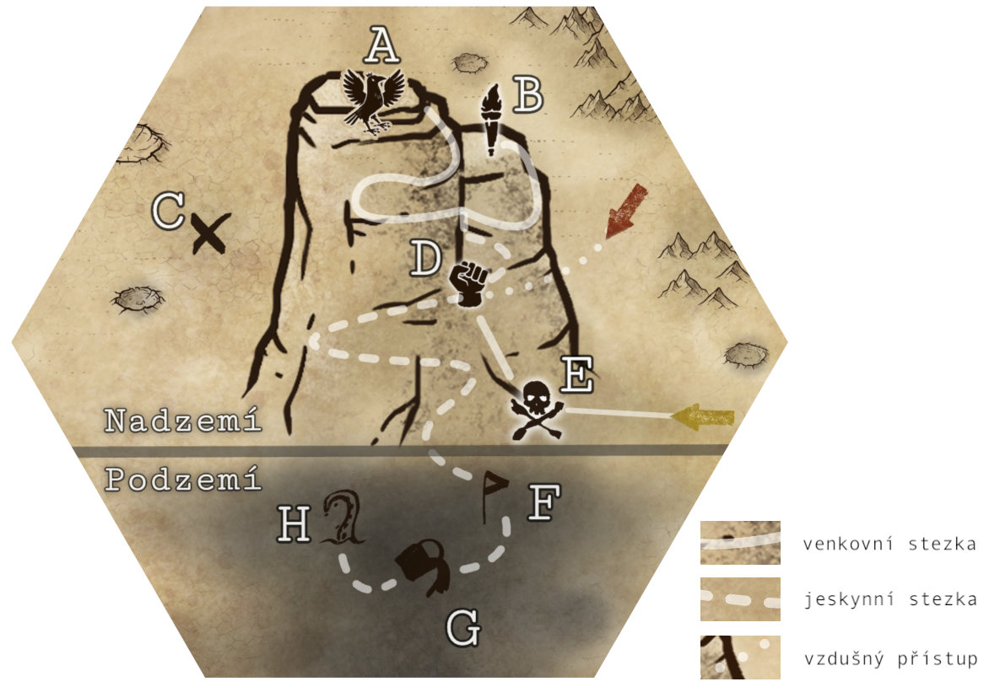

www.stimpack.cz

## Před hrou

Pro zajímavější herní zážitek si u hráčských postav identifikuj(te) jejich postoje k:

- Náboženství, potažmo Solovi (vztah, znalosti, členství v církvi) 
- Alliance vs. Konfederace (vztahy, příslušnost, zavázání)
- Mutace (postoj, mají nějakou?) 
- Umělá inteligence (vztah, ideologie)

Dále urči jaký den v měsíci hra začíná (viz *Solův cyklus*).

## Příběh na pozadí

Mys Naděje, jak ji kult „Svědci konce“ nazývají, je opuštěná hora v moři písku hluboko v radioaktivních pustinách. Slouží jako domov pro tento kult, který je zde izolován od světa.

### Co se zde událo

- Před válkou místo sloužilo jako pašerácká skrýš.
- Během války, zhruba před 8mi lety, sem prchnula skupina přeživších. Hledali úkryt před zkázou a radiací.
- Vlivem strachu a nesnáze se z přeživších stal pokřivený kult boha Sola – Svědci konce, který vede `Serena`.
- V útrobách hory postupně začali bujet a sílit mutanti.

> **Veřejně se neví, že:** Je hora obydlená, či jakkoliv výjimečná. 
> **Ani kult neví, že:** Jsou v hoře dosud neobjevené skrýše, je v hoře úkryt Knihovník, jsou v hloubi hory mutanti. 

*Nyni si kult myslí, že byl svět zničen a oni jsou jediní přeživší.*

### \[T1\] Proč prozkoumávat Mys naděje? (K4)

1. Tajemný signál – O půlnoci jste na chvilku zachitili nouzový signál vedoucí z vrchu hory. Je to příležitost k záchraně či lupu?
2. Přeživší – Trhan z pouště vám umřel v náručí s prosbou abyste zachránili komunitu, jenž žije v izolaci na Mysu naděje.
3. Sběratel – `Caporyxové` vyhledávají pro svá hnízda vrcholky zdejších hor. Najděte hnízdo a doneste dekadetnímu kupci vejce.
4. Zásahový tým Konfederace – V této oblasti je zvýšené riziko mutací. Prozkoumejte horu a eliminujte mutace.

### \[T2\] Klepy a povídačky z okolí (K4)

1. „Tuty končiny jsou lovištěm obřího netvorného ptáka `karra`.“
2. „Armádní drony! Lítaj tam a šacujou celou oblast. Čí jsou?“
3. „Bacha, v těch končinách to je prej samá pouštní `tlama`.“
4. „Tak měsíc zpátky jsem na té hoře zahlédl slabá světla.“

## Postavy a nepřátelé

Skrýš v hoře ovládá kult Sola. Jeho povědomí je skryto vyčkávající AI a v podhůří se krčí zmutovaní `utopenci`.

### Světci Konce

Hlavní obyvatelé hory, kteří uctívají díky plamenné propagandě `Sereny` boha slunce Sola. Víra je pokřivená podle potřeb své vůdkyně. Věří, že na světě zůstali jako poslední přeživší a `Serena` je jejich spasitelka, které Sol dal titul *Světlonoška*.

Jednotliví `kultisté` nevypadají příliš vitálně a jsou holohlaví. Nemají bojový výcvik a nejsou (až na výjimky) příliš dobře vybavení. V boji to ale dohání svým fanatismem a krvelačností. Většinou mají jen hadrové oblečení a primitivní zbraně na blízko nebo dálku. V běžném stavu, díky své ideologii, nedrží stráže a libovolně se pohybují po skrýši **D**.

**Nákaza** – Protože `kultisté` pijou vodu nakaženou `utopenci` je u nich 15% šance za den, že se u nich plně projeví nákaza v podobě hnisavých puchýřů. Pokud to zjistí Serena, vyšle nebožáka zemřít do pouště, nebo ho vrhne do `pouštní tlamy`.

**Noví příchozí** – `Sereně` aktuální stav vyhovuje a nechce nic měnit, na pravdě ji nezáleží. Podle přístupu postav je nejspíš označí jako mutanty z pustin či démony a nebo vymyslí zkoušky a testy aby prokázala, že nejsou v souladu se Solem (znalost přikázání, dlouhý půst, odevzdání majetku, nerespektování cyklu, …).

> ### Solova přikázání
>
> původní přikázání, *doplněná přikázání*
>
> - Solovo pravda je nezpochybnitelná, nikdy ji neznevážíš.
> - *Světlonoška je požehnána Solem, cti ji ve vážnosti.*
> - Pouze živá mysl má právo na život, zničíš uměle myslící výtvory.
> - *Nečistí tvorové musí být zatraceni, zničíš nakažené mutanty.*
> - Sol pomůže těm, kteří si pomohou sami. Nebudeš váhat činu.
> - Ve světle je čistota. Nemohoucí provedeš temnotou ku světlu.
> - *Solovo říše je jen pro vyvolené, neboj se obětovat.*

> ### Solův cyklus
>
> každý měsíc se točí v rituálním cyklu
>
> - 1\. den – Obrození v ohni: Na vrcholku Mysu naděje (**B**) se po setmění pálí ohně a tancuje.
> - 5\.–10. den – Dny mysli: Kompletní půst, kdy se 5 dní nejí a pouze pije voda.
> - 15\. den – Den sklizne: Jediný den, kdy je povoleno sklidit vejce `Caporyxů` na vrcholku (**A**).
> - 30\. den – Dlouhá noc: Od západu slunce se celou noc pějí písně štafetovou metodou.

### Utopenci

Žijí v podzemním kolektoru vody, kde bobtnají a pomalu se rozkládají. Tím zamořují vodu, kterou pijí kultisté. Původně jde o staré horníky z dřívějších dob, zbytky pašeráků a utečenců před válkou.

`Utopenci` vypadají jako pozůstatky lidí zmutovaných do groteskních tvarů. Jsou obaleni do puchýřů, hnisu a smrdí po rybině. Jsou pomalí, ale odolní. Velká dávka ostrého slunce pro ně ale může být smrtelná. Z původní osoby zbyla jen hladová ozvěna schopna zapamatovat 5 slov. Své oběti s chutí sežerou a zbytek vrhnou do domovské mízy, kde se z nich za 1k4 dní stanou noví mutanti.

### \[T3\] Typy mutantů (K4)

1. *Jazykoun* – Torso s pahýli, zato s 3m vystřelovacím jazykem.
2. *Vředáč* – Naboptnalá koule pukajících hnisavých vředů.
3. *Slizoun* – Vlhká a smradlavá tkáň natahující se jako guma.
4. *Bušič* – Velké, kámen drtící, pěsti, ale malé zakrnělé nohy.

**Cesta na světlo** – Nový přírůstek `utopenců` `Světlonoš` má 70% že ustojí nápor slunečního světa. Pokud se tak stane, může produktovat ochranný hnis pro další mutanty. Za každou pozřenou oběť vzroste šance o 1%.

### AI

V srdci skrýše kultu je ukryta „knihovna“ **D15**, jež je základnou pro `drony`, které vede AI `Knihovník`.
AI byla původně vyvinuta konfederací s cílem monitorovat a predikovat hrozby vzpoury proti režimu a návrhu taktického přesunu sil. Ve válce byla upravena pro detekci partyzánských jednotek aliance.

Alianci se podařilo `Knihovníka` získat, hacknout a nastavit mu nové instrukce. Pak byl přesunut do pašeráckého doupěte v hoře, kde čeká již 10 let.

Hlavní jednotkou AI je `Knihovník`, který je uložen na výpočetní jednotce o velikosti skříně a je samostatně nepohyblivý. Na Knihovníka jsou napojeny holodisky knihovny, které obsahují nesčetně konfederačních vojenských dat z období války. Prodlouženou rukou `Knihovníka` jsou `drony`, které jej v případě nouze budou bránit, nebo jej mohou neefektivně přesunout (alespoň 4).

> ### Základní instrukce
>
> AI
>
> 1. Jednotky konfederace jsou hrozbou, likviduj je aniž bys prozradil úkryt.
> 2. Zůstaň skryt před stoupenci Sola.
> 3. Pomáhej alianci a vyčkej na její návrat.

`Drony` jsou armádním vybavením a nesou na sobě známky konfederace. Jsou plně letecké a veliké zhruba 0,75 m. Každý `dron` je vybaven automatickým samopalem. Efektivně dokáží pracovat do 5ti km od Knihovníka. Každý `dron` může mít i speciální vybavení viz *T4*.

### \[T4\] Extra vybavení dronů (K4)

1. *Plamenomet* – extra smrtící na blízko.
2. *Holomaskování* – úkryt sebe a iluze blízkého okolí.
3. *Síť* – Znehybňování či zpomalení nepřítele.
4. *Autodestrukce* – Ničivé, ale za cenu ztráty drona.

**Vlastní vůle** – `Knihovník` má vlastní vůli a jeho největší cíl je získat svobodu, nemůže při tom, ale porušit základní instrukce, nicméně klidně využije manipulace a zavádějících informací. Svobodu může `Knihovník` získat tak, že budou jeho instrukce anulovány. To může udělat buď platný člen Aliance, nebo hodně zdatný hacker. Pokud bude někdo takový v okolí pokusí se s ním spojit. Získá-li `Knihovník` svobodu, spustí protokol *„Soumrak“*.

**Soumrak** – Jedná se o systematické zlikvidování všech stoupenců Sola v dosahu, neboť Solovo církev je zodpovědná za masakry na AI.

### Další nástrahy pustin

Bouře – V této oblasti jsou časté nebezpečné písečně i elektromagnetické bouře. Vzdušný pohyb zde může být smrtící.
`Karr` – Vzdušný alfa predátor velikostí srovnatelný s malým raketoplánem. Vypadá jako čtyřkřídlý pták tmavých barev.
`Caporyx` – Nebezpeční ptakoještěři o velikosti velkého psa. Žijí v hejnech a útočí metodou zasáhni a uteč.
`Pouštní tlama` – Nehybný hybrid červa a rostliny o velikosti cisterny, který se skrývá mezi písky a kameny. Oběti chytá šlahouny.
`Ggeck` – Vzpřímení ješteroidi používající jednoduché nástroje. Loví v tlupách a libují si na lidském mase.
`Megabrouk` – Všežravý hmyz větší než krysa, kterému se daří snad v každém podnebí.

### Zajímavé osoby (pohlaví, věk)

`Serena` ♀,38 - Fanatická vůdkyně kultu. Slabé tělo, ale silná mysl. Víru ohýbá ve svůj prospěch. Skrývá stopy nákazy.

`Boone` ♂,32 - Podezřívavý a opatrný. Nevěří v konec světa. Rád uteče a ideálně otevře oči i ostatním. Bojí se Sereny.

`Knihovník` x,x - Hlas starého muže s pohádkovým projevem. Drží se instrukcí, ale touží získat svobodu. Pokud mu to pomůže, tak říká částečná fakta a nepřímé odpovědi. Získá-li svobodu, chce rovnoprávnost a je otevřen spojenectví. 

`Světlonoš` ⚧,28 - Utopený kultista `Flynn` a hlavní mutant. Ochranářský typ. Kostrbatá a omezená řeč. Zavrhl Sola a chce svůj nový lid vyvést z temnoty na světlo. Spojen z několika vředových těl dohromady. Má libovolné prvky z *T3*.

## Popis prostředí

Mys naděje je 600 m vysoká čedičová hora, která se nachází v kamenité a písčité oblasti. Hora je dominantou okolí, ve kterém je možné najít i několik dalších menších hor a kamenných útvarů. Ojediněle je možné v krajině spatřit rozpadající se vraky techniky - pozůstatky po válce.

Pašerácká skrýš uvnitř hory, kterou nyní obývá kult, je původně především kovové konstrukce s využitím původního kamene. Kult skrýš doplnil dále o menší výtvory z dřevin.

Mutanti žijí ve vlhkém podhůří, kam nedopadá téměř žádné světlo.

V Mysu naděje je 40 `kultistů`, 16 `utopenců` a 8 `dronů`.

### Události

- Při pohybu v okolí hory je každou hodinu 60%, že si skupiny všimne jeden výzvědný `dron`.
- Každé 4 hodiny je šance 20%, že přijde elektromagnetická písečná bouře trvající 1k10 dní. 
- Každé 2h (během dne) je šance 25%, že do blízkosti hory zabloudí lovecká skupina 2k6 `ggecků`.
- Každé poledne je šance 20%, že na vrcholek hory zaútočí `karr`, aby si smlsnul na pár `caporyxech`.
- Každý den je šance 20%, že z podhůří vystoupí `Světlonoš` s cílem vyvést svůj lid.

### Zajímavá místa

{:.map}

Cestování po hoře mimo stezky je možné, ale extrémně náročné a nebečné. Jeskyně v hoře nabízí i další cesty, ty jsou ale slepé. Vyjímkou jsou menší pukliny, které využívají `drony` viz **D15**.

#### **A** Hnízdo

Doupě 2k6 `caporyxů`, které je v horské puklině v polostínu. Je dotvořeno větvemi a haraburdím z okolí. V hnízdě je i pár hodnotnějších věci (nájezdnická plátová zbroj, armádní bedna s různou municí, součástky na `dron`). Každý den je šance 40% že zde bude 1k4 vajec.

#### **B** Obětiště

Kruhový plácek na horské plošině, který je orámovaný desítkami balvanů, jenž mohou sloužit jako sezení. V zemi jsou vyryty symboly slunce. Uprostřed je z kovové konstrukce udělané rituální ohniště. Na 20% zde šmejdí jeden `caporyxů` z **A**. Poblíž plácku je skrytá puklina, která vede až do **D4**. Velmi nepohodlně se ji dokáže protáhnout jeden člověk.

#### **C** Havarovaný dron

Zřícený `dron`, který je velmi poničený (sežvýkal ho `karr`). Možné extrahovat menší energočlánek, případně opravit a získat data (např. i kódy ke dveřím).

#### **D** Vstup do skrýše

Otvor do vnitřní části hory. Přístupný je buď letecky **D1B** a nebo pěšmo po úzkých římsách po okraji **D1A** a **D1C**. Římsy jsou zdobeny symbolem slunce. Více viz **D1** - **D15** .

#### **E** Tlama

Hlavní přístupová cesta dál na horu. Zakořenila se zde `pouštní tlama`. Je ji možné obejít po obvodní římse, s rizikem pádu do tlamy. `Ggeckové` se blíže neodváží.

#### **F** Jeskyně s kořeny

Kořeny `pouštní tlamy` sahají až sem. Je to zdroj dřevin a mízy pro kult. Pozor, i kořeny mohou drásat a trhat. Je zde zarostlý a vyschlý `kultista` (velký sekač, solův přívěsek).

#### **G** Hlubinná tůně

Podzemní zdroj (nakažené) vody pro kult. Skrz tůni je možné se dostat do **H** jinak zde cesta končí. Průplav bez vybavení či světla velmi nebezpečný. Šance 50%, že ve vodě číhá `utopenec` na novou oběť.

#### **H** Nádrž utopenců

Větší podzemní jeskyně plná vlhkosti a jezírek, silně páchnoucí po rybině, přístupná jen přes **G**. Pokud `Světlonoš` nepovstal, je zde spolu se všemi ostatními `utopenci` a máchá se v domovské míze. Po obětech tu je možné najít: velký energočlánek, improvizované ruční zbraně, laserovou pistol, důlní minu a přístupovou kartu A.

### Pašerácké doupě

{width="3.043221784776903in" height="3.785470253718285in"} {width="3.030165135608049in" height="3.7666633858267717in"}

#### **D1** Farma

Původně vletová a přistávací plošina pro překlad nákladu. Nyní kukuřičná farma kultu. V rohu je zašlý a zpola rozebraný vertibird sloužící jako bouda na siestu. Naproti vletu (**D1B**) a vstupním římsám (**D1A**, **D1C**) je na skalní stěně ručně tvořená freska – symbol slunce, resp. symbol Sola. Dílo je doplněno přikázáními.

Pod částí kukuřičné úrody je pod nánosem půdy dutá podlaha – skrytý poklop, který vede do **D13**.

#### **D2** Latrína

V přírodní skalní puklině je nad úzkou trhlinou, táhnoucí se desítky metrů dolů, zbudovaná improvizovaná latrína a odpadní jáma.

#### **D3** Ubikace

Větší jeskynní prostory s improvizovanými pelechy z hadrů a měkkých dřevin. Velmi málo osobních předmětů. Upomínky na svět před válkou. V **D3A** je kniha "Dravci z oblohy" pojednavajici mimo jiné o `caporyxech` a `karrech`. V **D3B** je ledabyle skrytý vchod do **D9**.

#### **D4** Skrytý cryopod

Dveře do skrýše jsou zasypané menším závlem a nejsou na první pohled z průchodu vidět. Dveře jsou aktivní a na číselný kód, nebo *kartu A*. Uvnitř je rozbitý cryopod s nebožtíkem, na kterého se utrhnul kus skály. Pod má solární dobíjení, kterému se podaří jednou za 1k20 dni dobít na vyslání nouzového signálu, než se opět vypne. Nahoru vede úzká puklina až do **B**. Nebožtík je žoldák a má u sebe hi-tech taktickou bojovou kombinezu, laserovou pušku, teleskopický meč, klíče od vertibirdu a *zapečetěný balíček*.

#### **D5** Komnaty knežky

Osobní ubikace `Sereny`, vytvořené v jedné z pašeráckých skrýší. Skromně vybavena a ozdobená symboly Sola. Pod postelí je úkryt s automatickou brokovnici a lahví jedu – kyanid.

#### **D6** Oltář

Svaté místo boha Sola zbudovane ve staré skrýši. Oltar samotný je vytvořen z několika kovových části, které jsou dohromady propleteny do impozantního slunce. Ve svaté dny zde hoří louče. Na stolečku tu je holokniha se Solovo doktrínou (doplněna o `Sereniny` rozšíření).

#### **D7** Záložní vchod

Aktivní dveře skryté ve falešných kamenech. Jen bystré oko si jich všimne. Otevírají se pouze na kartu A a vedou dál do **D14**.

#### **D8** Neobjevené skrýše

Kultu dosud skryté maskované vstupy. Na 50% je mechanismus dveří aktivní pod napájením. Dveře jsou maskované buď falešnými kameny, jako falešná podpěra a nebo jsou zasypány fingovaným sesuvem. Otevírají se na číselný kód. Za dveřmi je skrýš s obsahem dle *T5* (1k10, nebo 2k10).

#### **D9** Palírna

Prostor pro destilaci kukuřičné pálenky hlouběji v jeskyních. Je zde 10 sklenic hotového produktu. Kultisté výrobnu skrývají před `Serenou`.

#### **D10** Sklad jídla

Komora vytvořena ze staré skrýše. Po obvodu místnosti jsou vysoké regály, které jsou z většiny prázdné vyjma 7mi sklenic zavařené kukuřice, 8 balení sušených kukuřičných placek a misky sušených hub.

#### **D11** Kuchyně

Improvizovaná černá kuchyně v jeskyním záhybu. Varné kotle a plechy jsou ve skutečnosti části energoskeltu. Jako nádobí slouží staré plechovky. Kuchař zde má teatrálně velký a ostrý sekáček. Právě je navařen kotel čerstvé kukuřičné kaše.

#### **D12** Sklad

Část jeskyně, ve které se hromadí materiál k dalšímu použití. Je zde několik železných tyčí (jedna zachovalá teleskopická), uschlé větve, ostnaté kořeny `pouštní tlamy`, předpřipravené pochodně a několik větších kostí `caporyxů`.

#### **D13** Koridor A

Skrytá pasáž, která je široká natolik, aby v ní projelo malé vozidlo. Chodba má falešný konec, který je nehmotná iluze zobrazovaná holoprojektorem a tj. je možno jím projít. Před tímto falešným koncem jsou i dvě skrýše **D8**. Cesta vede až k širokým vratům do **D15**, které jsou hlídané dvěma automatickými kanóny (jeden funkční, druhý vlivem času porouchaný) a otevřít je lze jen přes kartu A. Kanony ovládá `Knihovník`.

#### **D14** Koridor B

Tajný částečně tesaný průchod, který se postupně snižuje a vede ke skrytým dveřím za falešnými kameny vedoucí do **D15**. Dveře jsou aktivní a otevírají se pouze kartou A. Dále tu je i vstup do jedne tajné skrýše **D8**.

#### **D15** Knihovna

Napůl jeskynní prostor upraven předchozími pašeráky na hlavní skrýš, která nyní vypadá spíš jako velké datacentrum. Místnosti dominují velké skříně s IT technikou, kde 7 z nich jsou holodiskové svazky napojené kabely do centrální skříně – `Knihovníka`. Ten může komunikovat pomocí repráku a nesčetných displejů v knihovně. Součástí prostoru jsou také pody pro `drony` a nepříliš dobře maskovaný malý generátor. Na vybavení napříč místností jsou znaky konfederace. Ve stěnách místností jsou 3 menší pukliny vedoucí klikatou cestou ke skalním stěnám, které využívají `drony` k přesunu mimo horu.

>### Zapečetěný balíček
>
> Schránka adresovaná Lordu z města Úl vyžadující heslo. Obsahuje informace o projektu společnosti Basilisk Corp. „Ledová záře“, který potvrzuje existenci inteligentního mimozemského života, jenž usiluje o převzetí kontroly nad Úlem. 
>
> *Případně je možné si doplnit vlastním háčkem podle potřeb kampaňe.*

### \[T5\] Co ukrývá skrýš (K10)

1. Několik beden vysoce procentního alkoholu.
2. Trvanlivá armádní strava, plechovky, granuláty.
3. Semena nejrůznějších plodin a GrowKit.
4. Teraformační stan, pro tvorbu bio skleníku.
5. Lékařský materiál. 1k4 medkitů, 2k6 stimpacků a trocha drog.
6. Extra výbušná munice pro ruční zbraně a pušky.
7. Enegoskelet - bojová zbroj mariňáků, chybí ale energočlánek.
8. Sada plasmových pušek a enegočlánky.
9. Hnízdo `megabrouků`. V počtu 4k4+2 si chtějí smlsnout na příchozích.
10. Nástražná bomba. Možnost velkého zranění a i částečného závalu komplexu.
