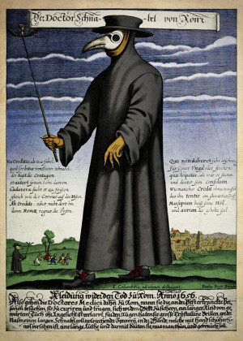

V ulicích města se šíří smrtící nákaza známá jako britijská horečka. Objevila se z ničeho nic a zachvátila brzy celé město, především pak chudinské čtvrti. Je sice pojmenována po britijských hraničních markách, kde nákaza silně udeřila, jméno ale nese neprávem, protože není původcem nemoci, ale do severních království se rozšířila z poledne.

Nákaza se v okolí Ravnburghu se poprvé objevila ve vesnici Myddle, kde zřejmě přistála loď, která se snažila vyhnout placení cel v přístavu. Odsud se nemoc zřejmě rozšířila do okolních vesnic Hordley, Blore Heath, Draytonu a Strettonu, odkud se rychle dostala do města. Narychlo zavedená karanténa nezabránila nákaze a nyní se britijská horečka šíří v městských čtvrtích jako oheň.

## Britijska horečka

Britijská horečka se rozšiřuje vzduchem a projevuje se kašlem, vykašláváním krve, horečkami a deliriem se ztrátami vědomí. Je smrtelná asi v 5-15% případů, přičemž nakažení umírají na vyčerpání organismu (selhání orgánů nebo selhání srdce) nebo se udusí pro sníženou kapacitu plic.

Průběh nemoci:

1.  fáze nákazy -- Nemoc se začne projevovat kašlem, dušností a zvýšenými teplotami asi dva až tři dny po nakažení. Nakažení začnou být infekční a nemoc se dál rozšiřuje kašlem.
2.  fáze nákazy -- Po několika dnech teploty přerostou do horeček a kašel se zhoršuje. Nakažení začínají vykašlávat krev a nedostává se jim dechu. Přidávají se bolesti hlavy, bolesti svalů a světloplachost. Záchvaty kašle vedou často až k pohmoždění žeber. V této fázi je nemoc nejnakažlivější.
3.  fáze nákazy -- Vysoké horečky přerůstají v delirium a ztrátu vědomí. Nemocný může blouznit, má noční můry (ve kterých se zpravidla objevuje temná postava mluvící prastarou řečí) a může chodit jako náměsíčný, aniž by si byl vědom svých akcí. Ti, kteří dosáhnou třetí fáze nákazy, ale přežijí, jsou proti nemocni napříště imunní.

Většina nakažených se nedostane do třetí fáze nákazy a vyléčí se po prodělání fáze druhé. Pokud se nemoc dostane až do třetí fáze, jsou šance na přežití okolo jedna ku jedné.

Podle alchymistů jsou odvary z mloků a vraních očí vhodné k ochraně před infekcí a zvyšují šance lehčího průběhu nemoci. Jako prevence mohou údajně sloužit i vonné byliny a voňavky, které se vkládají do pomanderů a lidé je přikládají k nosu a dýchají provoněný vzduch jako ochranu před miasmou při pohybu v ulicích. Lékem, který dokáže vyléčit i nemocné ve třetí fázi nákazy je údajně srdce divokého gryfa. Elixír z něj prý dokáže během hodiny navrátit nemocného k plnému zdraví.

## Situace ve městě

Alchymisté vaří lektvary, aby pomohli zmírnit nárůst nemoci a léčitelé v morových maskách se snaží zmírnit utrpení nakažených. Kněží přinášejí oběti bohům, aby město chránili, a v ulicích pálí ohně s bylinami, aby zabránili šíření miasmy (zkaženého vzduchu umožňujícího šíření nemoci). Navzdory tomu projíždí ulicemi káry s mrtvými, které zahubila nemoc, aby byli pohřbeni v hromadných hrobech za městem a navyšují se počty domů označených bílým kruhem z vápna, který označuje domácnosti, ve kterých se nemoc objevila.

Pokud nedojde k žádným výrazným zhoršením nebo činy postav neovlivní šíření nemoci, bude nákaza v Ravnburghu trvat asi dva nebo tři měsíce, než pomalu s příchodem letních měsíců pomalu ustoupí. Většina lidí, kteří se už nakazit mohli, se nakazilo a s vyššími teplotami se sníží nakažlivost nemoci.

Na začátku nákazy přijal Ravnburgh karanténu přístavu (připlouvající lodě musí zakotvit na 40 dní, než jim bude umožněno vstoupit do města), po měsíci nákazy pak rozhodne rada města o karanténě celého města, aby zabránila šíření nemoci z něj. Lodě v přístavu musí naopak čekat 40 dní, než jim bude umožněno odplout. Brány budou uzavřeny a hlídány, nikdo bez písemného glejtu nesmí opustit město. V okolí města se rozmístí jednotky pánů okolních lén (kterým velí sir Richard Kynaston, vévoda z Berewich, a Hendry Grey, 2. earl z Hawes), které mají vymoci udržení karantény, a ti z obav před nákazou mají tendence střílet první a teprve pak se ptát na glejt. Námořní blokádu udržují hansovní lodě a řetěz přes vodu, který zabraňuje zakotveným lodím opustit přístav. To samozřejmě nebrání pašerákům vyvádět lidi ven tunely pod městem nebo uniknout za bezměsíčné noci čluny, ale i tak opatření zmírní rozšíření do okolí.

Lidé se během nákazy vyhýbají jeden druhému, chrání se šály a pomandery u nosu, pokud musí vyjít ven z domu. Ulice jsou mnohem nebezpečnější, biřicové chrání jen bohaté a z obavy před nemocí často nevychází do ulic vůbec. Většina movitých měšťanů se víceméně zabarikádovala ve svých domech a odmítá se účastnit veřejného života a setkávat se s lidmi (pokud postavy potřebovaly s někým z nich mluvit, mají smůlu). Domy těch, kteří jsou nakaženi, jsou označeny kruhem z vápna a lidé je nesmí opustit. V chudších oblastech jsou dveře domů a okna často zatlučeny, aby se zabránilo šíření nákazy. Kněží a léčitelé by nakaženým měli nosit jídlo, ale ne vždy to funguje a objevily se případy, kdy se nakažení uzdravili, ale zemřeli hlady, když se na ně zapomnělo. Pro nedostatek jídla (pro omezení pohybu lidí jsou i dodávky jídla vzácnější) se v chudinských čtvrtích objevily i boje o jídlo, rabování, a dokonce i případy kanibalismu.

Lidé jsou vyděšení a často stačí málo, aby reagovali přehnaně a nebezpečně. Místní uliční „domobrany" neváhají sáhnout k násilí proti komukoli, koho neznají a mohl by nemoc potenciálně roznášet. Na úlcích šarlatáni prodávají „zaručené amulety a elixíry k ochraně proti nákaze", které nedělají vůbec nic. Ve městě se objevují případy pronásledování cizinců. Lidi pronásledují a diskriminují především Britijce, protože je považují za přenašeče nemoci. Lidé v britijských hraničních markách mají výrazný přízvuk a často je snadné je v davu poznat pro jejich světlé nebo rusé vlasy, jsou proto snadným cílem perzekuce.

## Možné zápletky

-   Běh okolního světa se pro neštěstí ve městě bohužel nezastaví. Pokud postavy potřebují něco ve městě udělat, někoho kontaktovat nebo zařídit, je nákaza další překážka, kterou musí překonat! Podaří se jim projít městem zachváceným nákazou a dostat se k jejich cíli?
-   Může se stát, že někdo blízký postavám se nakazí (blízký přítel postav, rodinný příslušník, dítě jedné z postav) a jeho nákaza se zhoršuje, přičemž hrozí, že brzy zemře. Postavy by se mohly pokusit ulovit gryfa a přinést zpět jeho srdce, které by nakaženého mohlo uzdravit. Gryfů je v okolních hvozdech a kopcích dost, budou ale muset vyklouznout z města obšacovaného ozbrojenými vojáky, ulovit divoké zvíře a včas se vrátit do hlídaného města. Zvládnou to včas?
-   Mnoho úmrtí způsobených nákazou může ukrýt i mrtvé z jiných příčin? Co když postavy narazí na práci sériového vraha? Co když se ve městě probudí kult zapovězeného Hasura, který začne vraždit lidi, aby prolitá krev dokončila temný rituál? Podaří se postavám vražedné šílence zastavit uprostřed města, které upadlo do chaosu?
-   Jak se postavy zachovají uprostřed města plného zoufalých lidí? Pokusí se zabarikádovat a nebudou se zajímat o nic za svým prahem? Využijí své těžce vydělané groše, aby zmírnili utrpení chudáků na ulicích? Pokusí se nahradit absenci biřiců a nastolit ve své čtvrti pořádek? Budou riskovat nákazu pro ostatní?
-   Nejnižší vrstvy ve městě, doháněné strachem, se staly obětí našeptávání šílence. Tento samozvaný prorok tvrdí, že příčinou nemoci je čarodějnictví. Na jeho příkaz se ulicemi plnými smrti začínají potulovat další a další tlupy, které se vrhají na každého, kdo jen vzdáleně vypadá nepatřičně. Poté se pokusí domnělou čarodějnici nebo čaroděje upálit na hranici, čemuž biřicové ze strachu nedokážou zabránit.

Postavy vědí o významné osobě ve městě, kterou by takový dav v případě nalezení okamžitě začal pronásledovat. Může to být přítel postav, bývalý spojenec, člen rodiny nebo milenec. Ať už je pro skupinu touto osobou kdokoli, musí se nyní rozhodnout, zda se odváží riskovat nákazu při pokusu o její varování. Bude však tato osoba chtít odejít, nebo bude chtít zůstat ve snaze pomoci obyvatelům města bez ohledu na nebezpečí? Postavy mohou svému známému pomoci v útěku, pokud ho přesvědčí, pomoci mu zmírnit utrpení obyvatelstva, a dokonce se mohou vydat na lov šíleného proroka, který důvěřivce bičuje k nepříčetnosti. Pokud bude zahnán do kouta, opravdu se šílenec jednoduše vzdá, nebo už má možná v záloze připraven další strašlivý plán?

## Jaké jsou novinky, brachu?

-   *„Slyšeli jste ty novinky z Redwoodu? Král Rowland VI. byl zraněn na lovu. Někteří říkají, že smrtelně. Zahnali do kouta divočáka, ale zvíře vyrazilo proti nim, roztrhalo několik psů a lovců, krále mezi nimi. Do svého hradu došel ještě po svých, ale pak se zhroutil a říkají, že ho odtamtud vynesou na márách. Černé dny nás čekají, dejte na má slova..."*
-   *„Povídaj, že mezi zlobrama na půlnoci se našel nějakej prorok, kterej je šikuje k nájezdům na naše břehy jako za starejch časů, než je velekrál Humphrey IV. Odvážný porazil a donutil přísahat, že sem už nepáchnou. Nevím, co je na tom pravdy, ale rybáři potkávaj jejich lodě stále častěji mimo fjordy."*
-   *„Slyšeli jste, že našli mladého pana Henry Selwyna mrtvého? Oficiálně umřel na nákazu, ale všichni sluhové tvrdí, že ho někdo v noci udusil polštářem. Slyšel jsem alespoň tři verze, ale buď ho voddělal jeho mladší bratr, Clemence, démoni, se kterýma to táhl, nebo některá z holek, které si bral do postele a přestalo je bavit, že s nima zachází jako s onucema. Však jste slyšeli jakej byl. Vyberte si, co se vám líbí, já už favorita mám."*
-   *„Podle jednoho z mnichů, se kterým jsem mluvil, je tahle nákaza trestem bohů. Někdo prý ukradl zlatou sochu Mániho Mnoha očí z kláštera v Bury Blessed Nicolas a bohy tím urazil. Teď nás trestají britijskou horečkou. Ten mnich říkal, že si myslí, že kdyby někdo tu sochu našel a vrátil, nemoc by se brzy ztratila..."*

## Když-tu-náhle!

Tyto zápletky můžete použít v případě, že se nic zajímavého neděje, hra se rozbředává a hráči se nudí. Pak stačí sáhnout po některé rychlé zápletce níže, která může být buď rychlým rozptýlením nebo začátkem dlouhého dobrodružství.

Postavy procházejí ulicemi během nákazy, když tu náhle...

-   ...zahnou za roh a zahlédnou dav lidí, kteří kamenují nějaké skřetí žoldnéře, o kterých si myslí, že roznášejí nákazu. Skřeti se kryjí židlemi a stoly z nedaleké krčmy, ale začínají toho mít dost a jejich ruce sahají po zbraních. Odhadem tak do minuty bude zřejmě ulice pokrytá mrtvými obou stran.
-   ...musí uhnout chlapíkovi, který táhne káru naloženou mrtvými. Jak je míjí, z vozu vypadne něco lesklého -- zlatý přívěšek s erbem Vawdreyů, delfín na dvou proutěných horizontálních pruzích. Co s tím? Přívěšek má zřejmě nějakou cenu a Vawdreyové určitě zaplatí za jeho navrácení, ale opravdu teď vypadl z *káry plné mrtvých*. Budou to postavy riskovat?
-   ...za rohem najdou mrtvé tělo, které okusují toulaví psi. Vůdce smečky, mohutný pes s mordou od krve k nim zvedne oči a nebezpečně zavrčí. Co budou dělat?
-   ...krámek na rohu, kde si vždy koupí nějakou drobnost k snědku, je právě vykrádán. Lidé odnáší vše, co není přibité a prodavač, starý Walter, kterého někdo praštil přes hlavu a nyní krvácí, se snaží je zastavit a prosebně se dívá na postavy.
-   ...dům, kam zamířili za přáteli, je označen bílým kruhem. Někdo v domě je zřejmě nakažen nemocí. Na volání nikdo neodpovídá, ale zaslechnou zevnitř tiché sténání. Co teď?
-   ...pouliční prodejce jedné z postav strčí pod nos hromadu krystalů, které ochrání před nákazou, pokud je nosí na krku. Teprve po chvíli si postava uvědomí, že zatímco prodavač jí zdržuje, další poberta jí krade věci z batohu!
-   ...postavy procházejí městem plným nákazy a dávají si pozor, aby se nedotkli ničeho, co by na ně mohlo nákazu přenést. V tu chvíli narazí na skupinu pouličních uličníků. Jejich obvyklý úkryt obsadili zločinci, kteří chtějí sami využít polorozpadlý zchátralý dům u městských hradeb. Protože nemají kam jít a v domě zůstaly všechny jejich zásoby \"cenností\" a jídla, mají tyto děti jen malou šanci epidemii přežít. Pomohou jim postavy?
-   Při rozhovoru s prodavačem na ulici se najednou ozvou výkřiky: HOŘÍ! Mladý biřic při dobře míněné snaze omezit zdroje nákazy založil oheň, aby vypálil jeden z označených domů. Oheň se ale rychle rozšířil a vymkl se kontrole. Nyní město čelí nejen smrtelné nákaze, ale také reálné hrozbě divoce se rozšiřujícího požáru. Pokusí se hráči uhasit plameny a zachránit ty, kteří mu stojí v cestě? A co nemocní, kteří nesmí opustit své domovy? Budou muset uhořet zaživa, aby se snížilo riziko dalšího šíření nákazy?

## Využití ve hře

Britijská horečka je zamýšlena jako doplněk pro město, která vytváří nové situace a zajímavé konflikty ve známém prostředí. Hráči nemusí cestovat jinam, i známé prostředí je najednou jiné než obvykle. Nákaza přináší nové hrozby a výzvy. Záměry a plány jdou na chvíli stranou, postavy musí reagovat na situaci a soustředit se především na přežití a záchran holých životů a svých blízkých.

Na místě je ale zmínit zdravotní varování -- teprve nedávno jsme překonali pandemii v našem reálném světě a může jít o citlivé téma pro hráče. Mohli při pandemii přijít o známé nebo příbuzné, stále mají PTSD z izolace, nebo je jim prostě tahle možnost nepříjemná. Proto doporučujeme předtím, než britijskou horečku do hry zavedete, se s hráči domluvit. Samostatně nebo společně (znáte svou skupinu nejlépe) se domluvte, zda nikdo nemá problém s tím toto téma do hry zanést. Důležité je se při hraní bavit a ne stresovat, proto se nebojte komunikovat s hráči.  

Pokud vás zaujal svět Ravnburghu, další materiály pro něj najdete tady.

https://rpgforum.cz/forum/viewtopic.php?t=15608
