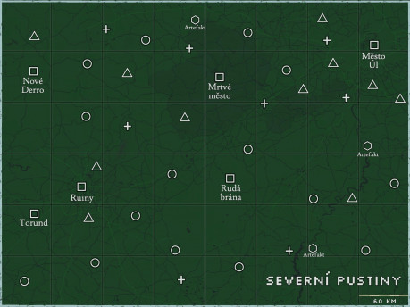

# O Severních pustinách

Generátor je navržen speciálně pro Severní pustiny, které jsou součástí sci-fi postapokalyptického herního settingu Stimpack. S drobnými úpravami jej však můžete snadno přizpůsobit i jiným postapo a sci-fi hrám.

Na území dnešních Severních pustin před přibližně deseti lety vrcholila Válka za sjednocení. Boje probíhaly nejen na povrchu, ale i na orbitě, odkud byly ničeny pozemní cíle. Válku nakonec vyhrála Konfederace, která porazila vzdorující Alianci a sjednotila známou civilizaci pod svou osvícenou vládu. Následky války však planetu zasáhly katastrofálně, především v oblasti Severních pustin. Válka skončila, ale chaos, zkáza a chudoba zde přetrvávají.

## Obyvatele a frakce

V Severních pustinách můžete narazit na několik skupin, jejichž postoje se liší, jdou proti sobě, nebo vás prostě chtějí sežrat. Vzdušná přeprava je v těchto oblastech díky písečným a elektromagnetickým bouřím extrémně nebezpečná, a tak se většina obyvatel pustin přepravuje pozemně.

### Slovník pustin

**Aliance** – Prohrávající strana ve Válce za sjednocení. Oficiálně byla rozpuštěna, ale v pustinách stále existuje několik rebelujících skupin, které myšlenky Aliance a nezávislých zemí nadále podporují a snaží se Konfederaci působit co největší potíže.  
**Konfederace** – Vítězná strana ve Válce za sjednocení, jejímž cílem je sjednotit celou civilizaci pod svou vládu, a zatím se jí to daří. Po Válce a pádu Aliance se Severní pustiny staly neperspektivním regionem, a tak se většina Konfederace stáhla a nechala pustiny svému osudu. Občas lze narazit na malé týmy konfederálních sil, které v pustinách provádějí speciální operace.  
**Korporace MetaTec** – Korporace, která financovala mnoho těžebních středisek, zejména na vespin, a fungovala před Válkou jako dodavatel soukromým investorům. Během Války stáhla většinu své aktivity a i když se v pustinách najde mnoho zařízení od MetaTec, korporátní operativce potkáte jen zřídka.  
**Rangerové** – Zástupci původních vládních složek, kteří fungují podobně jako policie nebo šerifové. Jejich počty jsou malé a autorita nízká, ale svou práci berou i tak vážně.  
**Gangy z pouště –** Nájezdníci z pustin, pankáči na improvizovaných vozidlech, kteří si říkají Děti pouště a dělí se do několika kmenů s vlastními vnitřními neshodami. Největšími kmeny jsou silově zaměření a bezmyšlenkovití Rudé slunce, o něco vypočítavější a mobilnější Černí havrani a nakonec zákeřní a kradmí Pouštní krysy.  
**Pouštní chodci** – Lidé v rozkladu podobní zombie, kterým vliv radiace a vespinu nadělil nový život. Pokud nejsou zcela šílení, jsou fixováni na nějakou představu z původního života, která udává jejich charakter. Mohou být přesvědčeni, že jsou kovbojové z westernu, elitní vojáci neexistující armády nebo úspěšní farmáři na písečné duně.  
**Mutanti** – Původně lidé, dnes však pokroucení do bizarních tvarů různými mutacemi. Tyto mutace mohou mít vředovitou, plazí nebo škorpioní podobu. Někteří se stali pudovými monstry, jiní se stále snaží udržet své původní lidství.  
**Nomad** – Dobře vybavení jedinci, které je možné v pustinách vzácně potkat. Většinou se nevměšují do cizích záležitostí a velmi si cení svého soukromí. Říká se, že jde o elitní vojáky Aliance, kteří se po jejím pádu stáhli do ústraní.  
**Karr** – Vzdušný alfa predátor velikostí srovnatelný s malým raketoplánem. Vypadá jako čtyřkřídlý pták tmavých barev.  
**Karak** – Střední hyenovitá šelma žijící ve smečkách. Jsou to odvážní masožravci, kteří jsou vynikajícími stopaři v pustinách.  
**Ggeck** – Vzpřímení ješteroidi používající jednoduché nástroje. Loví v tlupách a libují si v lidském mase.  
**Vespin** – Nejcennější komodita pustin. Plyn těžený v rafinériích, jeho odpadní splodiny jsou jedovaté. Je to nejrozšířenější palivo.

## Typy míst

Text níže pracuje se třemi základními typy míst:  
OBECNÁ MÍSTA jsou většinou ta, která původně provozovali prostí lidé, snažící se nějak uživit na neúrodné zemi.  
KORPORÁTNÍ ZAŘÍZENÍ jsou objekty vybudované společností MetaTec, která se podílela na nejvýdělečnějších činnostech v současných pustinách, především na těžbě vespinu.  
Poslední VOJENSKÉ OBJEKTY jsou většinou původně v držení Konfederace, pokud není v tabulce uvedeno jinak.

## Využití mapy

Tento nástroj lze (a možná i vhodněji) použít s mapou, na které jsou kromě hlavních a pevných míst vyznačeny také symboly označující typová místa z generátoru. Kolečko může představovat OBECNÁ MÍSTA, trojúhelník KORPORÁTNÍ ZAŘÍZENÍ a křížky VOJENSKÉ OBJEKTY.

Alternativou je mít mapu prázdnou a objekty zakreslovat až po jejich objevení herní skupinou.

Níže je ukázka možné mapy, kterou lze dobře využít s generátorem.

# Generátor

K vygenerování místa zájmu si hoď **5k6.** 

První hod určuje typ místa, který definuje jeho původní účel, původní obyvatele a případně stav před Válkou:

- 1-3: OBECNÁ MÍSTA  
- 3-5: KORPORÁTNÍ ZAŘÍZENÍ  
- 6: VOJENSKÉ OBJEKTY

Další hody určují postupně následující:

- Konkrétní místo dle typu.  
- AKTUÁLNÍ STAV, ve kterém místo nachází po Válce.  
- Stávající OBYVATELÉ místa.  
- ZVRAT, který reflektuje aktuální dění na místě nebo dává místu nový účel.

Volitelně můžeš ještě hodit na tabulku SPECIALITA, pokud chceš místo něčím ozvláštnit. Jednotlivé výsledky tabulek mohou vyžadovat další “podhody” pro upřesnění detailů místa. Alternativně můžeš místo hodu kostkou vybrat bod, který se ti líbí, nebo který se hodí do mapy.

V tabulkách jsou místy uvedena jména a témata případných NPC. Jde pouze o rychlou inspiraci, kterou lze libovolně zaměňovat a přizpůsobit.

#### OBECNÁ MÍSTA | *původní účel a obyvatelé místa*

1. **Vrakoviště pozemních vozidel** – Dříve významný uzel upcyklace a zdroj náhradních dílů široko daleko, vedený svéráznou rodinou McCoyů.  
2. **Opuštěný přepravní kontejner/y** – Jedno nebo více úložišť zapadlých mezi kameny či přikrytých nánosem písku. Mohou obsahovat zbraně nebo technologie (K6 – majitel, obsah):  
   - 1: Neoznačeno: Vespinový odpad \+ 1k4 plné vespinové bomby.  
   - 2-3: Konfederace: Zásoba zbraní a munice.  
   - 4: Aliance: Medikamenty a drogy.  
   - 5: Neoznačeno: Mobilní palírna alkoholu.  
   - 6: Žoldnéři Rudý škorpion: Zánovní bezpečnostní droid.  
3. **Oáza** – Obchodní gilda zde vybudovala obranný systém a řízenou distribuci vody výměnou za kredity a jiné zdroje.  
4. **Farma** – Tvrdohlavý farmář Ozz, který se ujme každého toulavého psa a zbídačeného tuláka, se v nehostinném terénu snaží pěstovat kukuřici, černý meloun nebo kaktus.  
5. **Vesnička** – Kantýna a 3k6 menších stavení tvoří pracovní obydlí pro dělníky z nedalekého korporátního zařízení (K6 – zařízení, stav):  
   - 1-2: Vespinová rafinérie, uzavřeno.  
   - 3: Důl na kovy či minerály, uzavřeno.  
   - 4: Solární elektrárna, v provozu.  
   - 5: Důl na kovy či minerály, v provozu – zbytková těžba.  
   - 6: Vespinová rafinérie, v provozu – zbytková těžba.  
6. **Přírodní úkryt** – Skalní rokle, puklina v kamenném podloží nebo jeskyně sloužící jako (K6 – účel):  
   - 1-2: Doupě líté šelmy.  
   - 3: Oltář temného kultu.  
   - 4: Úkryt aliančních rebelů.  
   - 5: Skrýš osamoceného pouštního nomáda.  
   - 6: Pašerácké doupě na překlad kontrabandu.

#### KORPORÁTNÍ ZAŘÍZENÍ | *původní účel a obyvatelé místa*

1. **Těžební zařízení** – Komplex 1k6+1 budov, jehož centrem je důl nebo rafinérie. Zabezpečeno obrannou věží či automatickými zbraněmi. Mohou se zde nacházet zdroje a technika. (K6 – zařízení, stav):  
   - 1-2: Vespinová rafinérie, uzavřeno.  
   - 3-4: Důl na kovy či minerály, uzavřeno.  
   - 5: Důl na kovy či minerály, v provozu – zbytková těžba.  
   - 6: Vespinová rafinérie, v provozu – zbytková těžba.  
2. **Elektrárna** – 1k6 větrných turbín nebo 3k6 sestav solárních panelů, které akumulují energii do centrální haly, kde se nabíjejí vysokokapacitní energočlánky. Komplex je chráněn opevněním a věžemi. (K6 – zařízení, stav):  
   - 1: Větrná farma, uzavřeno.  
   - 2: Solární farma, uzavřeno.  
   - 3-4: Větrná farma, v provozu.  
   - 5: Solární farma, v provozu.  
   - 6: Solární farma s experimentálním dálkovým přenosem energie pomocí prisma krystalu, v provozu.  
3. **Kolektor vody** – Komplex 1k6+1 menších budov na kamenném podloží s podzemním kontejnerem na vodu. Budovy jsou vybaveny otočnými a skládacími konstrukcemi s plachtami na lapání vlhkosti. Plně automatizovaný provoz.  
4. **Bioskleník** – Komplex 1k6+1 skleníkových domů spojených úzkými chodbami. Pěstují se zde různé plodiny ve vysoké kvalitě, vše pod přísným dohledem dr. Evelyn Mayerové.  
5. **Servisní dílna** – Pracovní hala a 1k6 menších budov v okolí. Opravu důlních robotů a automatizační techniky zde vede milovník byrokracie pan Brown.  
6. **Čichač** – Monumentální terénní vozidlo sloužící jako mobilní prospektorská základna k lokalizaci, analýze a zakládání vespinových vrtů. Strojvedoucím je šedovlasý a bojácný Carson.

#### VOJENSKÉ OBJEKTY | *původní účel a obyvatelé místa*

1. **Věznice** – Opevněný objekt, zpravidla na kamenném podloží, s množstvím podzemních chodeb a cel. Slouží k zadržení kriminálníků a osob nepohodlných Konfederaci, případně k jejich dalšímu využití. Jedno z vězení vede úplatný slizoun Stoud. (K6 – využití):  
   - 1-2: Vězni slouží jako zdroj subjektů pro **VOJENSKÝ OBJEKT 6**.  
   - 3: Pracovní tábor pro blízký důl nebo rafinérii.  
   - 4: Zařízení slouží jako vězeňská opravna pozemní techniky.  
   - 5: V zařízení je ukrytá aréna, kde si vězni mohou údajně vybojovat svobodu.  
   - 6: Utajené hi-tech zařízení pro jediného vězně – mocného psionika Crixuse.  
2. **Pevnost** – Obranný komplex vystavěný na vyvýšeném stabilním místě s alespoň částečně soběstačnými systémy. (K6 – podtyp):  
   - 1: Věž – Menší, avšak vyšší předsunuté pozorovací stanoviště. Konfederace.  
   - 2: Věž – Stejné jako 1, ale pod kontrolou Aliance.  
   - 3: Fort – Robustní pevnost. Centrum sil a výcvikový prostor. Konfederace.  
   - 4: Fort – Stejné jako 3, ale pod kontrolou Aliance.  
   - 5-6: Továrna – Vojenská opevněná výrobna pozemních vozidel. Konfederace.  
3. **Bunkr** – Menší zařízení, které je na rozdíl od pevností skryté v nenápadných zákoutích. Má žádný nebo minimální personál. (K6 – podtyp):  
   - 1: Skrýš – Bezpečné útočiště a záložní palpost s nouzovými zásobami pro stahující se jednotky. Konfederace.  
   - 2: Skrýš – Stejné jako 1, ale pod kontrolou Aliance.  
   - 3: Sklad – Skrytý úkryt záložních materiálů a zdrojů. Konfederace.  
   - 4: Sklad – Stejné jako 3, ale pod kontrolou Aliance.  
   - 5-6: Nemocnice – Skrytý lazaret pro raněné vojáky z fronty. Konfederace.  
4. **Dočasný tábor** – Improvizovaný vojenský kemp sloužící k přeskupení jednotek, nejčastěji k útoku. Je to směs buněk a stanů.  
5. **Vesmírný křižník** – Tato obrovská loď musela během Války nouzově přistát kvůli poškozením. Za koráb i posádku odpovídá namyšlený oportunista Admirál Irving Conrad, chlouba Konfederace.  
6. **Černá buňka** – Oficiálně neexistující konfederační výzkumné centrum skryté v odlehlých oblastech. Malá buňka, ale s výkonnou ostrahou. (K6 – výzkum):  
   - 1-2: Prizmatické solární zbraně.  
   - 3: Odolnost vůči radiaci prostřednictvím genetického křížení s tvory pouště.  
   - 4: Extrakce a digitalizace myšlenek nesvolných aliančních subjektů.  
   - 5: Ovládání mysli tvorů pouště.  
   - 6: Převýchova mladých psioniků a výzkum psi-tech.

#### AKTUÁLNÍ STAV | *jak se podepsala válka a radiace*

1. **Kráter** – Z původního místa zbyly jen trosky a útržky. Dnes je to radiací zamořená líheň mutací.  
2. **Sesuv** – Většina místa se propadla do pozemních puklin, které nejsou stabilní ani dnes. Bezpečně dostupné jsou jen dílčí části.  
3. **Bomba** – Během Války zde padlo několik bomb. 1k6 z nich je stále aktivních a sálá z nich radiace.  
4. **Bejvalo hůř** – Část infrastruktury může být ještě funkční, ale celkový účel místa již zanikl. Minimálně polovina prostor byla zničena, ale i přesto může místo sloužit jako dobrý kryt nebo základna.  
5. **Nová šance** – Místo bylo sice znatelně zničeno, ale někdo ho opravil pomocí improvizovaných součástek. I původní účel mohl být obnoven.  
6. **Zázrak** – Neštěstí a zkáza se tomuto místu vyhnuly obloukem. Funguje téměř jako dřív.

#### OBYVATELÉ | *stávající obyvatelé místa*

1. **Vojenské složky** – Ozbrojené a vycvičené jednotky v počtu 4k6+4 hlav si zde zřídily krátkodobé či dlouhodobé útočiště. (K6 \- příslušnost, poslání):  
   - 1-2: Aliance – Mají v plánu vyplenit nedaleký konfederační sklad (viz VOJENSKÝ OBJEKT 3).  
   - 3-4: Konfederace – Na tajné misi získat ztracený výzkum (viz VOJENSKÝ OBJEKT 6).  
   - 5-6: Rangerové – Mají za úkol najít a zneškodnit nájezdníky, kteří se skrývají někde poblíž.  
2. **Pouštní chodci** – Skupina 3k6+3 mrtvoláků zde zapouští kořeny a oddává se své posedlosti. (K6 \- posedlost, cíl):  
   - 1: Běsnící – Šílení zombie, kteří sežerou vše živé. Z okolí jich brzy přijde dalších 3k6+3.  
   - 2: Farmáři – Rádi pohostí a darují zlené či kukuřičné výrobky. Výměnou chtějí jen večeři plnou historek a výměnu semen.  
   - 3: Roninové – Jsou na válečné stezce a chtějí setnout hlavu vrahovi jejich pána – Kostijedovi z Rudého slunce.  
   - 4: Mafie – Rodina pod vedením rozvážného kmotra Dona Marla přijme ráda pomoc při přepadu konfederačního dostavníku (pozemního transportéru nebo vesmírné lodi), ve kterém se skrývá Donova cennost.  
   - 5: Vikingové – Vyžadují rituální souboj s nejsilnějším ze skupiny. Dle výsledků pak přijde zkáza nebo příval hojnosti.  
   - 6: Učenci – Pokračují v původním účelu místa, možná jde i o původní personál.  
3. **Gangy z** **pouště** – Tlupa 6k6 pouštních nájezdníků si vybrala toto místo jako svou zastávku pro průzkum či doplnění zdrojů. (K6 \- kmen, cíl):  
   - 1-2: Rudé slunce – Vyrabují vše, na co přijdou, a pobijí všechny, kdo neutečou.  
   - 3-4: Černí havrani – Pátrají po posvátném obrovském opeřenci Karrovi.  
   - 5-6: Pouštní krysy – Hledají nevytěžené naleziště vespinu.  
4. **Přeživší** – Uprchlíci před válkou, radiací, souboji gangů a dalšími příkořími z pustin. (K6 \- komunita, cíl):  
   - 1: Kanibalové – Vstřícná komunita dobře živených lidí s ucházející výbavou. Rádi přijmou nové členy do svého kruhu, jen každých 1k6 dní dochází k lidské oběti pro plná břicha.  
   - 2: Komunita – Uzavřená skupina přežívající na mrzkých zdrojích. Myslí si, že civilizace už padla a oni drží její poslední plamen.  
   - 3: Kult – Komunita fanatiků uctívající temné bohy, pána apokalypsy nebo ohnivou královnu shromažďuje zdroje na svůj dosud největší rituál.  
   - 4: Mutanti – Skupina degenerátů se škorpioními mutacemi. Mluví jen obtížně, vypadají hrozivě, ale hledají jen mírové místo.  
   - 5: Stařec – Polopříčetný Ben je už před smrtí, ale rád by zažil ještě pořádnou srandu/akci. Má impozantní sbírku robotických služebníků.  
   - 6: Zběhlý psionik – Skrývá se před Konfederací, je na něj vypsaná odměna.  
5. **Nomád** – Tajemný jedinec Axal se smečkou Karaků, kteří ho poslouchají na slovo. Ostře si brání svůj život v ústraní. Příležitostně je svolný k obchodu s technologií. Ve skutečnosti hledá nějaké zmínky o hexitu (viz SPECIALITA 6).  
6. **Původní** – Původní obyvatelé místa zde vydrželi dodnes.

#### ZVRAT | *nový účel či aktuální dění*

1. **Původní účel** – Místo stále slouží svému původnímu účelu (navzdory svému stavu alespoň částečně).  
2. **Zákopová válka** – Hoď další OBYVATELÉ. Obě skupiny spolu válčí a ani jedna nechce ustoupit.  
3. **Obchodní uzel** – Skrytý obchodní uzel v pustině. Pokud dodržujete pravidla, můžete zde vyměnit zboží. Pokud ne, bude vás to bolet.  
4. **Nová základna** – Bojová základna a výcvikové místo, případně menší úkryt nebo farma poskytující potravu**.**  
5. **Past** – Obyvatelé jsou zde uvězněni a přežívají jen s velkými obtížemi. Buď kvůli radiační pasti, kterou nemohou překročit, nebo kvůli automatickým obranným systémům místa, které se vymkly kontrole a snaží se odstranit vše, co se pohne.  
6. **Aréna smrti** – Obyvatelé sem přivádějí zajatce na gladiátorské zápasy.

#### SPECIALITA | *extra prvek k dokreslení*

1. **Poklop** – V blízkosti místa je skrytý tajný poklop vedoucí do podzemí, kde se nachází VOJENSKÝ OBJEKT 3 nebo 6\.  
2. **Voda** – Nedávno se zde objevil nový zdroj vody.  
3. **Útok** – Na místo někdo plánuje útok, nebo už možná začal. (K6 \- útočníci):  
   - 1: Karr – Na místo si brousí zuby obrovský vzdušný predátor Karr. Možná ho rozčílili obyvatelé, nebo by se zde dalo postavit pěkné nové hnízdo.  
   - 2-3: Tlupa Ggecků – Ješteroidi vyčenichali vůni lidského masa a přišli si pro svůj díl. Nevyčerpají si ale svůj zdroj potravy hned první den.  
   - 4-5: Nájezdníci – Děti pouště zpozorovaly na místě aktivitu a rozhodly se ho vyrabovat. Třeba se jim něco hodí.  
   - 6: Pouštní chodci – Buď šílená horda valící se pouští, nebo promyšlený zásah s cílem získat předmět, který je objektem jejich posedlosti.  
4. **Duchové** – Během Války se zde odehrál velký masakr psioniků, jejichž ozvěny se zde čas od času astrálně zjevují. Touží po stejném masakru na Konfederaci.  
5. **Hexit** – Na místě je tajný kontejner s mimozemskou relikvií, která může probudit spící entity k životu. [Více o hexitu např. zde](https://rpgforum.cz/forum/viewtopic.php?t=17333).  
6. **Xenosliz** – V temném koutě tohoto místa hibernuje xenosliz, čekající na biomasu, která mu dá impuls k životu. [Více o xenoslizu např. zde](https://rpgforum.cz/forum/viewtopic.php?p=689802).

## Příklad interpretace

Cílem tabulek je inspirovat, nikoli vytvořit zcela kompletní dungeon či funkční místo. Pokud vám nějaká kombinace nedává smysl, jednoduše hoďte znovu.

### Stařec ve větrné farmě

**Místo**: KORPORÁTNÍ ZAŘÍZENÍ – Větrná farma v provozu  
**Stav**: Sesuv  
**Obyvatelé**: Přeživší –Stařec  
**Zvrat**: Aréna smrti   
**Specialita**: Voda  
**Popis**:   
Na okraji nehostinné pustiny se nachází zchátralá větrná farma, která kdysi sloužila k nabíjení energočlánků. Věže větrných turbín se tyčí nad okolní krajinou, ale většina z nich je nyní v troskách, protože se část farmy propadla do nestabilních pozemních puklin. Přístupné jsou pouze některé části areálu.

V této zřícené farmě přebývá stařec, na pokraji smrti, obklopený zástupem automatických robotů. Tyto stroje, kdysi určené k údržbě farmy, nyní slouží svému pánovi jako ochránci a vykonavatelé jeho vůle. Stařec, zahořklý a ztracený v šílenství, přeměnil farmu na arénu, kde zajatce nutí k boji na život a na smrt, aby pobavil sebe a své robotické služebníky. 

Ti, kteří bojují udatně, si vyslouží zásobu vody, co unesou. Ti, co ne, padnou. Stařec totiž v puklinách objevil zdroj nekontaminované vody, kterou sám nemůže nikdy vyčerpat.

### Uvěznění uprchlíci

**Místo**: VOJENSKÉ OBJEKTY – Bunkr: Nemocnice  
**Stav**: Nová šance  
**Obyvatelé**: Přeživší – Komunita  
**Zvrat**: Past  
**Popis**:   
Tento bunkr byl původně navržen jako skrytý lazaret pro raněné vojáky z fronty. Nachází se hluboko pod povrchem a jeho přístup je pečlivě ukrytý. I po válce má ještě funkční zdravotnické vybavení, i když značně zastaralé a opotřebované.

Během války místo utrpělo velké poškození, které umožnilo skupině uprchlíků bunkr objevit a opravit do použitelné podoby pomocí improvizovaných součástek. Některé části bunkru jsou stále uzavřené kvůli bezpečnosti, ale ostatní oblasti byly obnoveny a bunkr sloužil jako útočiště pro uprchlíky před válkou a raněné vojáky.

Před nedávnem však vstupní koridor zachvátila exploze, která ho pohřbila a zalila nebezpečnou radiací, proti které obyvatelé nemají ochranu. I když bunkr nabízí řadu lékařských zásob, zásoby potravy a vody se tenčí. Zároveň kdo ví, co dalšího se může najít v uzavřených koridorech bunkru.

### A co vyšlo Vám?

Podařilo se vám vymyslet něco zajímavého? Své vygenerované příklady zasílejte na get@stimpack.cz nebo na [RPG fórum Drakkaru](https://rpgforum.cz/forum/viewforum.php?f=204).
