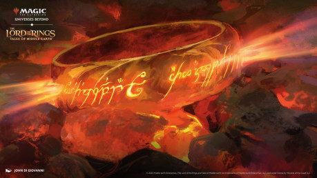
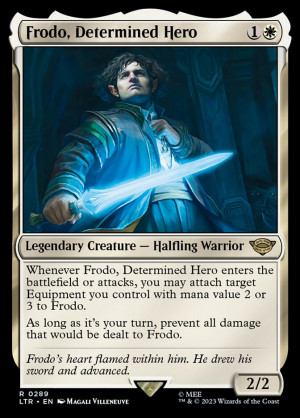
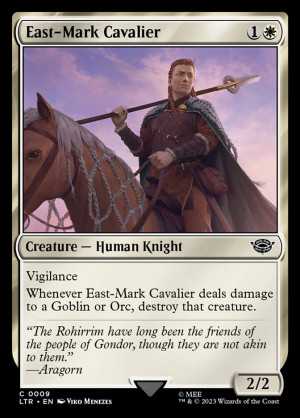
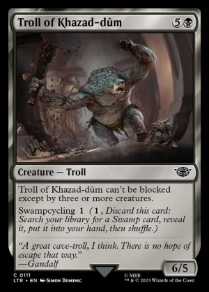
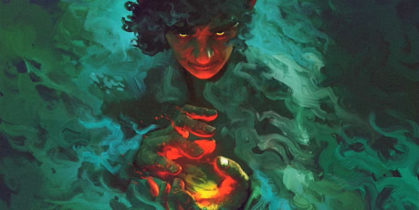

**Cthulhu Dark** je super [jednoduchý elegantný systém na dve stránky](https://pelgranepress.com/2017/06/01/cthulhu-dark/), primárne určený na hranie hororových Cthulhu oneshotov. Zároveň je veľmi ľahké si ho upraviť na akékoľvek iné prostredie premenovaním hlavnej štatistiky.

**Magic the Gathering** snáď netreba predstavovať, kto nemá doma stovky kartičiek, tak ich určite niekde videl. Ak karty nemáte, a zaujal vás ich potenciál ako vizuálneho doplnku, na webe alebo v špecializovaných obchodoch si viete zaobstarať stovky až tisíce *common* kariet doslova za pár korún či eur. Ja som sa k Magicu vrátil takmer po tridsiatich rokoch vydaním setu [Lord of the Rings: Tales of Middle Earth](https://scryfall.com/sets/ltr).

## Krátke zhrnutie pravidiel Cthulhu Dark

Cthulhu Dark má jedinú mechaniku postavenú okolo Šialenstva (*Insanity*, v druhej verzii korektnejšie nazvanej ako *Insight*, Vhľad/Poznanie), a používa obyčajné šesť-stenné kocky. 

Tvorba postavy spočíva v pomenovaní postavy, výberu povolania, a krátkeho popisu. Pripravíte si zelenú kocku Šialenstva. Ak vaša postava zažije, alebo je vystavená niečomu znepokokujúcemu alebo hroznému, hoďte kockou Šialenstva, a ak vám padne VIAC, ako jeho súčasná hodnota, zvýšte Šialenstvo o 1\.

Ak chce vaša postava niečo vykonať, vezmete si niekoľko kociek:

* Jednu kocku, ak je činnosť *v ľudských schopnostiach*  
* Jednu kocku, ak činnosť *v rámci schopností povolania vašej postavy*  
* Kocku Šialenstva, *ak riskujete svoju príčetnosť kvôli úspechu*

Najvyššie číslo, ktoré na kockách padne, ukáže vašu mieru úspechu. Pri 1 uspejete o povestný oný chlp, pri 6 máte obrovský úspech.

Ak najvyššie číslo padne na zelenej kocke Šialenstva, musíte ňou hodiť ešte raz. Ak pade VIAC, ako vaše súčasné Šialenstvo (ktoré začína na 1), zvýšite Šialenstvo o 1\. Ak Šialenstvo dosiahne 6, vaša postava nezniesla tlak, zbláznila sa, a opúšťa hru.

Ak si ktokoľvek zo spoluhráčov myslí, že by bolo zaujímavejšie, ak neuspejete, hodí jednou kockou. Ak hodí viac, vaša postava zlyhá.

Toto sú v podstate všetky pravidlá [Cthulhu Dark](https://pelgranepress.com/2017/06/01/cthulhu-dark/).

## Ako teda hacknúť Cthulhu Dark?

Cthulhu Dark nemá žiadne pravidlá pre boj, je zamerané na vyšetrovanie záhad a unikaním pred hororom. Taktiež nemá žiadne ďalšie pravidlá pre vybavenie, zlepšovanie postavy a podobne. Autor trefne poznamenal vo svojom blogu, že [ak vám dáva brnenie výhodu, každý ho chce mať](https://pelgranepress.com/2011/04/21/hacking-cthulhu-dark/), a nemá teda výzam každému pridať extra kocku. Ďalším “problémom” Cthulhu Dark je, že neráta s rozličnými fantasy rasami a tvormi. Toto všetko sú ale pomerne ľahko opraviteľné veci na účely hrania v Stredozemi bez zbytočného komplikovania pravidiel.

V Temných príbehoch zo Stredozeme sú vaše postavy dobrodruhovia, ktorí tvoria spoločenstvo. (Podobne, ako Frodo a jeho priatelia tvorili Spoločenstvo prsteňa.)

Zavedieme si štyri pojmy do hry \- esencia, výhoda, bremeno a tieň.

**Esencia** reprezentuje vašu postavu, čo dokáže, a aká je. Veselý a bezstarostný hobit, čo sa v mihu oka dokáže ukryť. Statočný hraničiar zo severu, čo vládne mečom a lukom, vystopuje aj vtáka vo vzduchu a nikdy sa v lese nestratí. Tvrdohlavý málovravný trpaslík, čo unesie väčší náklad ako ktokoľvek iný, dokáže pochodovať celé dni a miluje šperky. Esencia v porovnaní s originálnym “v ľudských schopnostiach” lepšie vyjadruje rozdiely medzi ľuďmi, trpaslíkmi, elfami, orkami, goblinmi či trollmi, navyše v sebe obsahuje aj povahové črty postavy.

**Výhoda** zvyšuje šancu vašej postavy prekonať prekážku alebo vyhrať v boji. Je niečo, čo vie lepšie, ako súper, niečo, čo jej uľahčí prekonanie prekážky, má nejakú situačnú výhodu, vhodné vybavenie, presilu a podobne? Je to všeobecnejšie, ako povolanie postavy, zahŕňa aj vybavenie, alebo situáciu, ak táto dáva vašej postave nejakú výhodu v konflikte.

**Bremeno** reprezentuje nahromadenú záťaž postavy: zranenia, stres, strach, hlad a smäd, únavu. Koľko príkorí vaša postava unesie, než sa pod ťarchou bremena zlomí? Je to extra štatistika oproti pôvodným pravidlám Cthulhu Dark, ktorú treba sledovať. Najlepšie ju reprezentuje červená kocka. Začína na hodnote 1\.

**Tieň** reprezentuje vplyv Temného pána. Čím je postava krutejšia, čím častejšie sa kvôli úspechu uchyľuje k temným praktikám služobníkov Tieňa, čím častejšie je vystavená krutosti, zákernosti a podlosti jeho poskokov, tým väčší vplyv má na ňu Tieň, až kým ju úplne neovládne. Vaša postava bola pohltená Tieňom a už ju nemôžete ovládať. Tieň nahradzuje Šialenstvo, najlepšie ho reprezentuje čierna kocka. Začína na hodnote 1\.

Skladanie banku kociek pred hodom bude teda vyzerať takto:

* Zoberte **kocku Esencie**, ak je činnosť *v schopnostiach (ľudských, elfích, trpasličích atď) alebo v povahe vašej postavy*  
* Zoberte **kocku Výhody**, ak *povolanie, vybavenie alebo situácia dáva vašej postave výhodu*  
* Zoberte **kocku Tieňa**, *ak porušujete zvykové alebo morálne pravidlá, robíte niečo nemorálne alebo zakázané, niekomu škodíte, alebo na vás vplýva agent Tieňa*  
* Zoberte **kocku Bremena**, *ak riskujete fyzickú alebo mentálnu ujmu kvôli úspechu*

Nikdy nehádžete viac, ako štyrmi kockami. Kocky Tieňa a Bremena používajte výnimočne, môže sa stať, že veľmi rýchlo narazíte na limity vašej postavy znášať útrapy dobrodružstiev, alebo lákanie Temnoty, pretože fungujú rovnako ako pôvodné Šialenstvo a vedia z jednotky veľmi rýchlo narásť do vysokých hodnôt. 

## Rastúce bremeno a vplyv tieňa

Vždy, keď pri nejakej činnosti použijete kocku Bremena, alebo Tieňa, a padne na nej (alebo na oboch) vyššie číslo, ako na kockách Esencie a Výhody, hoďte ňou ešte raz. Ak padne číslo VÄČŠIE, ako vaše súčasné Bremeno, respektíve Tieň, zvýšte ich o 1\.

Keď bremeno dosiahne 6, vaša postava sa pod váhou okolností zlomí. Ako sa to v hre prejaví, záleží na okolnositach. Upadne do bezvedomia po zranení alebo umrie, psychicky sa zrúti pod tlakom.

Keď Tieň dosiahne 6, postava úplne prepadla vplyvu Tieňa, a hráč ju prestáva ovládať. Ostatné postavy sa s ňou v budúcnosti môžu stretnúť na opačnej strane meča, stáva sa z nej NPC.

V oboch prípadoch venujte jednu krátku scénu, v ktorej popíšete odchod postavy zo spoločenstva. Po tejto scéne si vytvorte novú postavu, a čo najskôr ju uveďte do príbehu.

## Znižovanie bremena a vplyvu tieňa

Podobne, ako v pôvodných pravidlách Cthulhu Dark, aj Bremeno alebo Tieň môžete znižovať. Bremeno znížite odpočinkom, jedlom, ošetrením zranenia, rozhovorom s dobrým priateľom. Tieň znížite potláčaním vplyvov alebo prejavov Tieňa \- zmažete znamenie Tieňa z kameňa na rázcestí, vyženiete špióna z dediny, zničíte knihu, v ktorej sa píše o temom umení Tieňa alebo je napísaná v čiernej reči.

Pri pokuse o zníženie Bremena alebo Tieňa hoďte danou kockou, a ak vám padne MENEJ, znížte Bremeno alebo Tieň o 1\.

## Zapojenie magických kartičiek do hry

Ako zapojiť Magic the Gathering kartičky do hry? Môžete ich využiť niekoľkými spôsobmi.

## Generátor scén a stretnutí

Vyberte si karty, ktoré budete chcieť v hre využiť na náhodné stretnutia. Napríklad potenciálnych spojencov [kráľov panoš](https://scryfall.com/card/ltr/13/esquire-of-the-king), [rytier z Východnej marky](https://scryfall.com/card/ltr/9/east-mark-cavalier), [posol z Gondoru](https://scryfall.com/card/ltr/11/errand-rider-of-gondor), [elfí prieskumník](https://scryfall.com/card/ltr/175/lothl%C3%B3rien-lookout), alebo [trpasličí kováč](https://scryfall.com/card/ltr/122/erebor-flamesmith). Alebo protivníkov, služobníkov Tieňa: [orkských lučišníkov](https://scryfall.com/card/ltr/433/orcish-bowmasters), [poručík Morgulu](https://scryfall.com/card/ltr/87/gothmog-morgul-lieutenant) alebo [Nazgûl](https://scryfall.com/card/ltr/100/nazg%C3%BBl).

Vyberte si aspoň 20 kariet, prípadne si ich rozdeľte podľa toho, kde budú vaše postavy putovať. Ľudí na území Gondoru alebo Marky, elfov v Myrkwoode, orkov v bažinách a podobne. Hráč, ktorý vedie hru, si z balíčka vyberie 7 kariet, a vo vhodný čas uvedie spojenca či protivníka do hry. Potom si karty v ruke doplní tak, aby mal vždy na výber zo 7 kariet. 

Udalosťami, ktoré sa v hre môžu odohrať, môžu byť napríklad [nečakaný útok](https://scryfall.com/card/ltr/99/nasty-end), [prepadnutie orkami](https://scryfall.com/card/ltr/73/surrounded-by-orcs), [neprirodzená hmla](https://scryfall.com/card/ltr/16/fog-on-the-barrow-downs), [zrada spojenca](https://scryfall.com/card/ltr/74/treason-of-isengard), alebo priamo [niekoho zo spoločenstva](https://scryfall.com/card/ltr/117/breaking-of-the-fellowship).  

## Ako konvertovať atribúty MtG kartičky v hre

Mtg kartičky majú niekoľko atribútov: Názov, Mana, Typ, Vzácnosť, Schopnosti, Atmosférický text, Silu, Výdrž.

### Názov
Môžete ho využiť priamo, alebo sa ním inšpirovať. Je to názov udalosti, alebo meno bytosti.

### Mana
Koľko many stojí vyvolanie karty v MtG. V našom prípade môžete použiť cenu karty v mane ako návod na obtiažnosť prekážky. 

* Ak je to udalosť, berte cenu v mane ako bank kociek.   
* Ak je to bytosť, súčet many bytostí by nemal prevyšovať trojnásobok počtu hráčov

### Typ
O akú kartu sa jedná. Bytosť, artefakt, očarovanie, kúzlo, …

### Vzácnosť
Symbol MgG setu, vyjadruje vzácnosť karty. Bežné (common) majú čierno-biely symbol, Neobvyklé (uncommon) strieborný, vzácne (rare) zlatý, a mýtické (mythic rare) bronzový. Čím vzácnejšia karta, tým vzácnejší by mal byť jej výskyt v hre. 

Ak chcete dôslednejšie využívať MtG atribúty kartičiek, tak si do balíčka za každú *mythic* alebo *rare* kartičku dajte 3-4 *uncommon*, a 7-10 *common* kartičiek.

Ak ide o predmety alebo artefakty, bežné a neobvyklé sa dajú kúpiť. Vzácne, alebo mýtické postavy získajú len na základe nejakých akcií v hre, alebo ako odmenu od spriatelených mocných NPC, nedajú sa kúpiť.

### Schopnosti
Tu bývajú vypísané zvláštne schopnosti, ak bytosť nejaké má, alebo efekty kúziel atď. Schopnosti spolu s typom bytosti tvoria esenciu bytosti. Nižšie nájdete niekoľko príkladov konverzie MtG schopností.

* **Exile, Destroy** \- toto majú zvyčajne kúzla, alebo silnejší protivníci. Natrvalo vyradia postavu z hry.  
* **Vigilance** \- bytosti majú výhodu, ak niečo hľadajú, strážia, je ťažké ich prekvapiť zo zálohy.  
* **Draw a card, gain life** \- dovolí postave znížiť bremeno.  
* **\+X** \- hráč má výhodu, môže si zobrať X kociek navyše  
* **\-X** hráč má nevýhodu, jeho súper si môže si zobrať X kociek navyše  
* **Scry** \- hráč môže hodiť dva krát a vybrať si lepší hod  
* **First strike** \- hráč hodí kockami ako prvý, ak hodí viac, ako je Sila protivníka, vyhral konflikt, protivník v tomto prípade už kockami nehádže. Ak hodí menej, ako Sila protivníka, protivník hodí kockami, a konflikt sa vyhodnotí podľa pravidiel.  
* **The ring tempts you** \- keď karta s týmto textom vstúpi do hry, hráč urobí hod na Bremeno.  
* **Return from graveyard** \- umožní znížiť bremeno postavy, alebo “oživiť” protivníka, ak bol zabitý v tomto konflikte. Oživenie znamená prebratie sa z bezvedomia, alebo otrasenia sa z ochromenia, šoku atď. Nie je to oživenie mŕtveho protivníka.  
* **Flesh, Instant** \- efekty sa vyhodnotia pred hodom kockami.  
* **Amass orcs** \- nájdi v balíčku kartu nepriateľa, zober si do ruky, zamiešaj balíček.  
* Ward \- postavy musia niečo obetovať, aby mohli poraziť protivníka  
* **Menace** \- NPC má výhodu, ak bojuje proti jednému protivníkovi, svoje kocky môže rozdeliť na útok voči viacerým protivníkom.  
* **Deathtouch** \- na vyradenie protivníka stačí NPC len jedna výhra v konflikte, bez ohľadu na Bremeno  
* **Trample** \- postava dokáže zaútočiť na viacerých protivníkov odrazu  
* Haste  
* **Gain life** \- postave klesne bremeno  
* **Lose life** \- postave stúpne bremeno  
* **Damage** \- postave stúpne bremeno  
* **Defender** \- postava má výhodu pri obrane iných postáv  
* **Reach** \- postava dokáže útočiť na diaľku

### Atmosférický text

Kartičky majú citáty z kníh trilógie Pán prsteňov. Ak kartu používate viac menej doslovne, môžete citáty prečítať hráčom na dokreslenie atmosféry.

### Sila/Výdrž

Dvojica čísiel, ktorá určuje, aká silná je bytosť (prvé číslo), a ako ťažké je ju zabiť (druhé číslo). Pri konverzii do pravidiel Cthulhu Dar je Sila bank kociek, ktoré hráč danej bytosti má k dispozícii, a Výdrž je Bremeno. Bremeno v prípade NPC znamená, koľko krát potrebujú postavy v konflikte proti NPC uspieť, aby vyhrali konflikt.

## Záver

Dúfam, že vás článok zaujal, a že niekdy odohráte temné príbehy v Stredozemi. Tieto pravidlá môžete používať pri hraní predpripravených príbehov z rôznych hier na motívy Stredozeme podobne, ako pôvodné pravidlá Cthulhu Dark využíval autor pri rôznych dobrodružstvách pre Call of Cthulhu, keď sa nechcel zdržovať so zložitými pravidlami.
