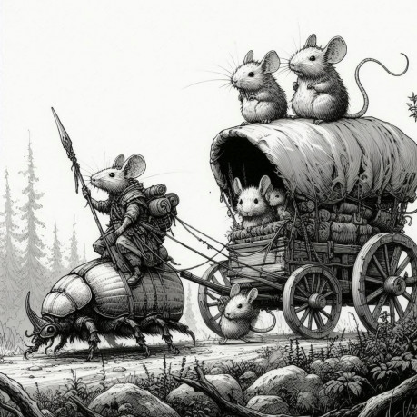
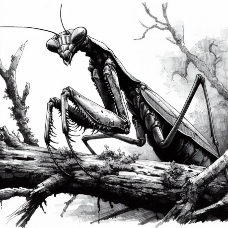
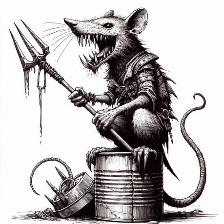
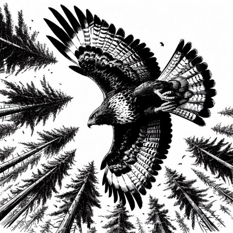
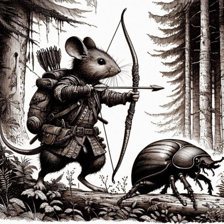

Krysy a Potkani nejvíce ze všech národů využívají lidských vynálezů – technických zázraků a starých strojů, i když často ne tak, jak bylo původně zamýšleno.

Myši, vyhnané nástupem Krys, našly útočiště v lesích a na lukách, kde si vytvořily vlastní města nebo rozšířily menší osady ostatních myších národů (především Hrabošů a Myšic). Ačkoliv jsou zdatné řemeslnice a dokážou vyrobit zbraně i zbroje, železo pro ně zůstává nezpracovatelným kovem. Artefakty z tohoto materiálu proto získávají buď z opuštěných lidských měst, známých jako Pustina, nebo obchodem s Říčními Krysami, které přivážejí zboží ze vzdálených míst. Ostatní myší národy Myší uprchlíky přijali, nic jiného jim také nezbývalo.

## Spojenci a nepřátelé

Společenství tvoří tyto národy a jejich blízcí příbuzní: Myši (míněno myši, hraboši, myšice rypoši), Krysy, Lasičky, Netopýři, Rypoši, Žáby a Ještěrky. Vztahy mezi nimi však zdaleka nejsou mírumilovné. Krysy obývají sušší oblasti a často stojí proti myším, zatímco Potkani – obří a silní tvorové – vládnou ve vlhkých končinách.

Myšožřaví netopýři kolem sebe vytvořili kult uctívačů (Netopýří kult), který láká následovníky vidinou zisku křídel a ovládnutí noci. Ani ostatní netopýři nemají s myšmi úplně dobré vztahy. Lasičky pak proti Hrabošům a Myšicím bojují už po dlouhá staletí a po příchodu Myší se tento stav snad ještě zhoršil. V letních vedrech přicházejí ještěrčí nájezdníci, chránění přirozeným brněním a hovořící vlastními syčivými jazyky.

Nejlepší vztahy mají myší národy se žabími šlechtici, kteří na svých dvorech zaměstnávají schopné myši a stejně tak oni poskytují své služby myším společenstvím. Rypoši žijí v ústraní a jsou nejzáhadnějším národem, přebývajícím především v podzemí.

## Tvorové s duší a hlasem

Nejen příslušníci uvedených národů mají svou inteligenci a jazyk – i další tvorové světa jsou schopni komunikace. Ptáci rozmlouvají v Řeči ranního zpěvu, dravci v sobě nesou ohnivou Řeč krve a plazi mluví tichým a nejednoznačným sykavým Rozeklaným jazykem. Myši, které se dokázaly tyto cizí jazyky naučit, jsou velmi vážené a přináší jim to nesporné výhody (třeba tím, že pobavený dravec myš hned nesežere).

Myši, které ovládají Řeč ranního zpěvu, se občas spřátelí s ptáky, kteří jim poté dovolí létat na svých zádech.

Dokonce i členovci, jako brouci, pavouci či kudlanky, mohou mezi sebou omezeně komunikovat, ale jejich inteligence zůstává blízká (našim, tedy lidským) zvířatům. Přesto existují výjimky (snad způsobené magií) – jedineční tvorové s vyšším vědomím, jako je pavoučí čarodějnice Latroda nebo obávaný kudlančí zabiják zvaný „Kazatel“.

Myši si dokázaly některý hmyz ochočit a chovají jej jako domácí mazlíčky. Například cvičené brouky svižníky na ochranu a hlídání svých obydlí nebo velké brouky roháče jako tažná zvířata. Včely jsou myšmi chovány pro med a vosk, ale i kvůli jejich obranným schopnostem. Cvičení motýli jsou využíváni jako poštovní holubi, zatímco velké krtonožky pomáhají hrabošům orat pole.

## Technologie a obchod

Příchod myší nastartoval technologický pokrok. Myšice a Hraboši žili po dlouhá staletí svým navyklým způsobem, ale exodus Myší přivedl mnoho šikovných řemeslníků a obchodníků, kteří rozhýbali do té doby stojaté vody místnoho hospodářství.

Myši běžně využívají povozy tažené buď jimi samotnými, nebo cvičeným hmyzem. Největší obchodní společnosti pro letní dodávky zboží využívají velké suchozemské i vodní želvy, na jejichž krunýře se poté vejde celá obchodní stanice. Obchod proudí po cestách, které střeží Myší hlídka nebo najaté stráže, ale nejvíce pulzuje na vodních tocích. Velké hryzčí koráby patřící obchodní guildě "Říčních krys", převážejí vzácné zboží z exotických míst.

Pustina, původně lidské město, je nyní z větší části pod vládou Krys a jejich spojenců. Výpravy do Pustiny představují pro myši synonymum pro velké a nebezpečné dobrodružství. Spousta myší se vydalo do Pustiny s vidinou pohádkového zisku, ale jen málo z nich se s poklady vrátilo.

## Magie

Magie je vzácná a nebezpečná. Je spojená s přírodními duchy a živly. Myší národy se ji až na jednotlivce nedokázali naučit. Přesto myši o magii všeobecně vědí, věří, že existuje a ti chytřejší se jí i bojí. Někteří dobrodruzi občas ve starobylých svatyních, či opuštěných hrobkách najdou nějaké starobylé kouzlo, nebo magický předmět. Někteří je dokonce začnou studovat a naučí se je využívat a dobíjet, ale výroba těchto předmětů je v rukou jen několika nejschopnějších kouzelníků a čarodějnic, kteří jsou pro toto umění uctívaní a zároveň obávaní.

Někteří ptáci dokáží kouzlit prostřednictvím svého zpěvu. Srazit své protivníky poryvem Písní větru, či oslnit oslepujícím paprskem slunce Písní úsvitu.

## Podrobněji k myším národům

Myší společnost je pestrá a rozdělená do několika národů: Myši, Myšice, Hraboši, Hryzci a Rypoši. Každý z nich má své specifické vlastnosti, zvyky a životní styl, které dohromady tvoří bohatou a různorodou civilizaci.

Všechny myší národy sdílejí jeden společný rys: rodí se bez srsti a s nevyvinutými ušními boltci, které jim postupně dorůstají během dospívání. Mezi myšími národy se traduje, že mladý myšák, který má „za ušima“, se konečně stal dospělým.

Od příchodu myší do této opuštěné země došlo k výraznému sblížení mezi jednotlivými národy. Převzaly navzájem své zvyky, například slaví stejné hlavní svátky, a dětem dávají jména původně z jiných kultur.

### Myši: Přizpůsobiví přivandrovalci

Myši jsou známé svým špičatým čumáčkem, velkými ušima a dlouhým, často chápavým ocasem. I když nejsou dobrými skokany, jsou zdatnými lezci. Z myších národů jsou nejrychlejší, pohybují se rychlostí až 40 cm za kolo, což odpovídá čtyřem hexům na soubojové mapě.

Původní myší jména často odkazují na lidské výtvory, názvy, nebo slova. Příjmení obvykle reflektují jejich povolání či osobnostní vlastnosti, například Eidam Žvanil, Emil Hrabal, nebo Gouda Veselá.

Myši původně obývaly lidská města a osady, ale byly postupně vyhnány krysami a potkany. Nyní žijí společně s Myšicemi a Hraboši ve velkých společenstvích, která fungují převážně demokraticky. Hlavní slovo však mají samci. Myši jsou činorodé, přizpůsobivé a rychle se adaptují na nové podmínky.

### Hraboši: Usedlí a dobrosrdeční

Hraboši mají kulatější čumáček, menší uši a kratší ocas. Jsou menší a zavalitější než myši a dožívají se přibližně 40 let. Specializují se na život v podzemí a obdělávání polí. Staví si rozsáhlé nory asi 40 cm pod zemí a nad nimi udržují sítě cest vedoucí k jejich políčkům.

Jsou veselí, milují hudbu, zpěv a dobrou společnost. Hraboši jsou výteční tuneláři, kteří dokáží i bez vybavení vykopat až 10 cm tunelu za směnu (10 minut). Jejich strava je čistě rostlinná, což je odlišuje od ostatních myších národů.

Hraboší jména často vycházejí z rostlin a přírody. Příjmení pak odkazují na neživé prvky prostředí, například Hyacint Kamínek, Šípek Sníh nebo Čekanka Suková.

### Myšice: Divoké a přírodní

Myšice jsou tmavě hnědé nebo hnědé, štíhlé a mimořádně pohyblivé. Dokáží skákat až do pětinásobku své výšky a jsou také skvělými plavci. Z celého myšího společenství žijí v největším sepětí s přírodou. Na podzim a v zimě se živí semínky, zatímco na jaře a v létě loví bezobratlé. Jsou vyhlášené sběračky hub a známy svou nevraživostí vůči netopýrům, proti kterým podnikají odvážné výpravy.

Dožívají se až 50 let a jsou přizpůsobeny drsnému životu. Pokud udeří krutá zima, dokáží upadnout do hlubokého transu, který jim pomáhá přežít mrazy. Myšice mají výjimečnou schopnost jednou za život odvrátit smrtelný úder tím, že odhodí svůj ocásek. Ten už jim však nikdy nenaroste.

Žijí v méně organizovaných společenstvích, kterým obvykle velí nejstarší samec. Jména jsou často podle věcí z přírody a přijdou jiným myším národům zvláštní, příjmení pak často mají podle nekvetoucích rostlin, či hub, kupříkladu Dřítek Durman, Ctěn Smrž, Otěch Holubinka.

## Hryzci: Neutrální a podivní

Hryzci jsou vzdálenými bratranci Myší, Myšic a Hrabošů. Jsou většinou neutrální, straní se politiky a dokáží vycházet i s Krysami, což jim myši jen těžko odpouštějí. Hryzci se nejčastěji věnují obchodu a cestování po vodě ve svých lodích.

Jsou o dost větší než myši (někdy i dvakrát), skvělí plavci a dokáží se ponořit do hloubky až 15 metrů. Žijí v blízkosti pomalu tekoucích řek a jejich nory mají často přístup přímo z vody. Jejich lodě jsou považovány za nejlepší v celém myším světě.

Hryzčí jména jsou starodávná, příjmení pak bývají dlouhá a složitá na výslovnost, například: Aapo, Kaj, či Selja. Příjmení je pak tvořené výčtem předků tedy třeba Aapo, syn Jusky a Elly, doplněné místem původu. _(inspirace finština)_

## Rypoši: Tajemní a podivuhodní

Rypoši jsou záhadnými obyvateli podzemních hlubin, kde žijí ve složitých norách řízených královnou. Jejich tělo pokrývá pouze jemná bledá kůže bez srsti. Ostatním myším národům připadají odpudiví, což je často izoluje.

Kvůli špatnému zraku nosí brýle, které umí i vyrábět. Mají však skvělý čich a sluch. Ostatní národy je považují za podivíny. Jsou, ale často velmi vzdělaní a učení. rypoši si velmi váží vzdělání a znalostí. Jsou pro ně nejcennější komoditou.

Rypoší společnost je tvořena několika klany. Mezi nimi vynikají například Glabeři, kteří provozují nejznámější myší banku (cennosti uchovávají ve svých neuvěřitelně hlubokých norách), nebo Fukoši, chudší příbuzní, kteří se občas proslaví objevením cenných nebo nebezpečných předmětů během svého dolování.

Jejich jména jsou dlouhá pro ostatní národy prapodivná Erwin Aschenbach, Herman Theisen, Bardolph Immelmann. _(inspirace středověká němčina) Samotný název_ Mausenheim je rypoší označení pro teritoria obývané myšími národy.
  
> Autor obrázků: AI DALL-E
