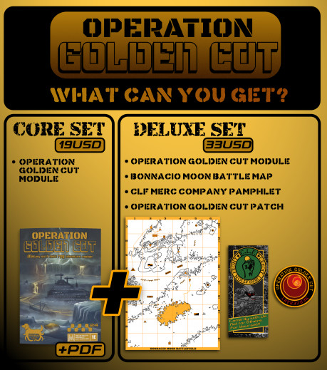

Měl jsem to štěstí připojit se totiž k akci nazvané “Mothership Month 2024” organizovanou na discordu Mothership RPG přímo Seanem McCoye, jedním ze zakladatelů Tuesday Knight Games a tvůrcem onoho rpg.

O co se jedná? Jde o měsíc dlouhou crowdfundingovou kampaň na stránce Backerkit, podporovanou TKG. Součástí bylo 21 projektů od známých i neznámých rpg designérů pro moduly pro zmíněné rpg. Jedním z nich byl i první velký oficiální doplněk od TKG, Wages of Sin. Ale zbytek byla sebranka lidí co mají za sebou několik Crowdfundingových kampaní a vydáváním rpg se živí, ale zároveň i nováčci co mají za sebou buď drobné doplňky vydané zadarmo či za pár babek na platformách otch.io či drivethrurpg a je to pro ně první velký projekt. Pod ně jsem spadal já.

Zároveň to ale byl měsíc, kdy TKG podporovala otevřená veřejná hraní pro seznámení lidí s Mothershipem, vydali soundtrack, vlastní VTT, časopis, spoust u rozhovorů, lets play záznamů, atd. Příští rok to plánují ještě ve větším, kdy by z toho chtěli udělat “virtuální con” kde budou panely s tvůrci, vývojáři, fanoušky apod. a budou pokrývat různá témata vázající se k jejich rpg.

Tak, to bylo na úvod, ale teď se pojďme podívat na to, proč to vlastně píšu. Jelikož to pro mě byla první crowdfundingová kampaň, zároveň první fyzický produkt a měl jsem to štěstí být v kroužku 21 autorů z různými zkušenostmi, tak jsem myslím měl docela dobrou situaci nasát spoustu užitečných informací jak se k něčemu takovému postavit. Tudíž jsem si z toho dělal poznámky a pokusím se Vám je zde předat. Ať už ze zajímavosti, nebo jako možné rady pro Vaši vlastní tvorbu!

### Můj background

> Všechnu mou tvorbu najdete na [webu itch.io](https://krakenhund-studios.itch.io/)

Tohle jsou věci co jsme zatím vydal, prakticky vše jen digitálně, jenom ty pamflety pro Mothership jsou ve 100 kopiích na e-shopu TKG. Všechno tak víceméně na koleni: napsané, ilustrované a vysázené do layoutu mnou. Jenom na editing jsem si občas někoho zaplatil, jelikož angličtina není můj rodný jazyk a i v mém rodném jazyce dělám chyby a překlepy. Tímto se za ně omlouvám i zde :D

Takže nic moc background, ale nějakou drobnou zkušenost s tím už mám. A můj projekt:

### Operation Golden Cut - military scifi horror heist adventure

Původně to začalo jako two-page dungeon pro RPG Kuchyni pro RPG Forum.cz, kterou jsem bohužel nestihl dotáhnout do konce, ale námět se mi líbil, tak jsem na tom pracoval i po ukončení a rozvedl jsem to na více stránek (nejdřív pět a skončil jsem na třiceti). No a když jsme měl většinu (řekněmě tak 70% ?), Sean McCoy napsal výzvu na discord ohledně MoshMo24 a já uviděl svou šanci, když ne teď, tak kdy jindy? Lepší příležitost nedostanu! Přihlásil jsem se a začal jsem na tom víc makat, abych to měl ready.

A tady už přicházíme přímo k jádru pudla, o čem má být článek. Uf, trošku jsem ten úvod přetáhnul. Ale čestný skautský, teď už jdeme přímo k praktickým radám a trikům!

Omlouvám se za občasné použití anglicismů či možná divných pojmů a termitů, překládám si poznámky z angličtiny a občas mi to ujelo.

## 1. Plánování - Příprava produktu

Nepodceňujte život a co Vám může strčit za nástrahy pod nohy po ukončení kampaně. Mějte co nejvíc materiálů připravených dopředu! Zažil jsem kampaně, které ztroskotali na tom, že lidi neměli sepsáno moc pro svůj produkt, měli pouze poznámky a hrubou kostru a nedokázali dodat co slíbili. Nebo to trvalo šíleně dlouho. A to Vám pak podrazí nohy, nic dalšího už úspěšně nebackenete. Lidi si to pamatuju.

### Mějte sepsaný celý manuscript

Jako, 80% je dobrých, ale ti co jste něco psali víme, že posledních 20% sežere stejně času jako těch 80% předtím. Klidně mějte připravené všechno. MInimálně pro Vaší první kampaň, ta bude Vaší velkou vizitkou. To co dodáte a jak to dodáte, Vám buď extra pomůže v dalších kampaních, nebo extra uškodí. Je extrémně důležité, aby jste dodali to co jste slíbili v termínu, který jste slíbili. (Jasně, občas se objeví nějaké nečekané problémy, nikdo nedokáže předvídat budoucnost, ale proto je dobré mít připraveno co nejvíc věcí dopředu).

- A pokud už se nějaké neočekávané problémy objeví, **komunikujte je zavčasu a upřímně s Vašimi backery**. Oni to pochopí, ale pokud budete hrát mrtvou rybu a nebudete zavčasu a pravidelně komunikovat, tak je ztratíte!
- Nepodceňujte svůj nástup na rpg vydavatelskou scénu.

Ale tahle příprava předem je hodně individuální, rozhodně nemusíte tohle brát jako kánon. Vlastně nic z tohohle, jsou to vše jen moje začátečnické pocity - i když mám backnuto přes sto různých kampaní…), ale jsou tam i rady co jsem posbíral od jiných veteránů scény, takže se na tím vážně zamyslete.

### Ale vemte to osobně a upřímně si zodpovězte na tyhle otázky:

Kolik toho chcete mít hotového před začátkem kamapně? Záleží to hodně na:

- Jak jste odolní vůči stresu.
- Jakou máte hladinu tolerance proti rizikům.
- Jaké máte zkušenosti se psaním rpg a vydáváním projektů (a crowdfundingem).
- Jak dobří jste v dotahování věcí do konce (tohle je extra důležité zamyšlení).

Ti, co mají za sebou více kampaní mi řekli:

> “Čím déle to dělám, tím více si uvědomuji a doporučuji, že je důležité mít hotovo co nejvíc, klidně celý projekt, před spuštěním kampaně. Jsou určité věci, které si nemůžete před začátkem dovolit (jedna samozřejmá věc jsou například náklady na tisk), ale pokud je Váš projekt ve fázi “mám nápad a osnovu a dopíšu to až tehdy, pokud uvidím že můj projekt nasbírá dostatek financí (bude “funded”), tak to rozhodně není vhodný postoj.”

### Účastněte se tvůrčích jamů/výzev

Na itch.io jsou často rpg jamy, kde můžete vytvořit krátký pamflet a sdílet ho zdarma. Lidi se o Vás dozví a vy si vyzkoušíte jaké to je něco dotáhnout do konce na malém formátu. Zkušenost k nezaplacení.

### Najděte si spolehlivé parťáky

Je fajn že jste našli umělce, co Vám ilustruje celou knihu za zlomek toho co profík, ale pokud zjistíte že Vám nezvládne dodat art zavčasu a vy se kvůli tomu opozdíte s vydaním, ztratíte víc než kolik jste ušetřili.

### Poznámky k AI artu

Bacha na něj. RPG komunita, obzvlášť indie, nemá moc ráda AI art. Je velká část lidí, kteří jakmile uvidí že používáte AI art, tak pro ně automaticky přestanete existovat. Dost projektů si na své Crowdfunding stránky lepí tag “Human Made”, aby dali jasně najevo že používají pouze obrázky od reálných lidí. Je imho lepší mít horší art od lidí, než dobrý od AI. Chápu že je to otázka financí, ale zkuste najít extra peníze dopředu na ten jeden/dva pěkné obrázky a zbytek pořiďte až uspějete. Jeden z vašich Stretch goal může být extra art pro Váš projekt. To samé se týká psaní produktů pomocí AI. TKG přímo odmítá AI generovaný obsah a jeden autor, co měl na své stránce napsáno že používal AI pro brainstorming byl chvilku docela diskutovaný a několik lidí dalo jasně najevo že kvůli tomu zrušili pledge. Ale i tak měl přes 700 backerů, takže to taková pohroma zase není (ale kdo čte ten malý text na konci, že? Dost lidí to ani netušilo).

## 2. Plánování - Marketing

Ok, máte projekt a jdete do toho. Nepodceňujte přípravu a marketing před kampaní. Já měl to štěstí, že za mě v tomhle obří kus práce odvedlo TKG, které má velkou komunitu a rvalo peníze, které bych si já sám nemohl dovolit, do marketingu.

### Ale pár praktických rad

Vytvořte si **Teaser page**. Měla by mít nějakou “eye-catching” grafiku, silný nadpis který zaujme pozornost a úderný popis toho, co Váš produkt nabízí. Já si zaplatil obálku od profíka a používal jsem tu. Rozhodně se to vyplatí. Pokud nezaujmete potencionálního zákazníka v prvních pár sekundách, ani si nepřečte zbytek.Taková je realita. Trh je nasycený spoustou produktů, lidé stránky jenom přejíždějí očima a teprve to co je zaujme, tomu věnují větší pozornost.

**Sdílejte svůj teaser!** Discord, reddit, facebook, fóra, bluesky, …sdílejte. Pokud o Vašem projektu nikdo nebude vědět, ani ho nikdo nekoupí.

- Teaser začněte klidně sdílet **6-12 měsíců** před samotným startem kampaně.
- Až se budete blížit samotnému zahájení kampaně, vytvořte si **Launch party page.** Bude tam odpočet, můžete naplánovat stream na start kampaně, kde budete mluvit o svém produktu. Můžete odpovídat na otázky, Ukázat nějaký art. Budujte hype. **Protože se brzo dostaneme k tomu, že prvních 48 hodin kampaně je těch nejdůležitějších 48 z celé kampaně.**

**Buďte aktivní v komunitách pro které píšete.** Když Vás lidi znají, je mnohem větší šance že se o vás budou bavit a že Vás backnou a podpoří. Když přijdete s velkým projektem jako blesk z čistého nebe, jsou lidi které to odradí.

- Tzn. bavte se s lidmi na discordu, komentujte jejich tvorbu, pomáhejte jim radami a svými zkušenostmi. Třeba to komentování produktů: vývojáři a spisovatelé milují když někdo okomentuje jejich hru. Zvyšuje to jejich viditelnost a dělá nám to radost. Fakt, velkou, radost. A když Vás pak kvůli tomu backne a zmíní ve svém Newsletteru nějaký významný vydavatel, tak to je sakra dobrá reklama.
- Odveďte Vaši hru na internetu, nabídněte ji na discordu, nahrajte z ní záznam.
- Pokud můžete, přidejte se k nějaké akci. Pro mě to byl MoshMo24, může to být ZineQuest, ZIMO, atd.

**Zkuste nějaké interview,** ať už formou blogpostu či youtube videa s jinými tvůrci, zkuste se nacpat k někomu jinému, musíte být vidět a ukázat lidem, proč by je měl zajímat Váš produkt.

Pokud spouštíte kampaň v době, kdy jede někdo jiný svou a cítíte že máte něco společného (může to být typ produktu, téma či se jenom znáte/je Vám ten druhý produkt sympatický) zkuste si s ním domluvit **Cross-kolaboraci**. Tzn. nabídnete svým a jejich backerům něco za to, že podpoří oba projekty. Může to být digitální věc, může to být fyzická věc, to je jedno, ale zase, zvýší to Vaši viditelnost a vytvoříte si kontakt s někým jiným z branže, s nějakým dalším kreativcem. Více o tom pěkně napsáno zde: [BackerKit Cross-Collab Campaign](https://help.backerkit.com/article/837-backerkit-cross-collab-campaign-projects).

Navíc je docela osvěžující s někým na něčem spolupracovat a jiní lidé mají jiné dovednosti než Vy a můžete si zároveň pomoci, něco se od sebe naučit.

Já během mé kampaně pomohl pár lidem s artem na nášivky a jeden z nich mi za to předělal moje designy do realistického vzhledu - takže to nebyl flat design, ale mělo to textury látky a výšivky!

### Kickstarter (KS) nebo Backerkit (BK)?

KS má mnohem větší dosah a publikum. Což je obojí výhoda i lehká nevýhoda (dosáhnete přirozeně na víc lidí, ale můžete se ztratit v záplavě jiných podobných produktů - občas během větších crowdfundingových kampaní - tady si trochu protiřečím s jednou z předchozích rad: svezte se na bandwagonu velké akce, jako třeba ZIneQuest, je to super, ale zároveň, pokud tam bude 100+ podobných věcí,m, můžete se v té záplavě utopit, proto je __extra důležité__ mít vostrej art a první dojem). 

Zároveň KS je tak velký, že Váš projekt ho vlastně vůbec nezajímá a tak s nějakou podporou od nich ani nemůžete počítat. BK je mnohem menší než KS, takže si Vás na začátku všimne méně lidí, ale za to tam budete víc vidět (aktuálně na něm běží většinou kolem 20 projektů najednou) a zároveň se Vám bude jejich podpora rozhodně více věnovat. Odpoví Vám na emaily s dotazy, mají víc článků s radami atd.

Je na Vás, co je pro Vás zajímavější. Obojí má svoje výhody a nedokážu posoudit, co je lepší.

### Další prezentace

Vytvořte si web, bluesky, email newsletter. Emaily, které nasbíráte během kampaně jsou důležitým a silným nástrojem! Pomohou Vám vytvořit základnu pro další kampaně. **Zkuste zvážit newsletter.** Já sám ho nemám (ani webovky zatím…), ale lidi kteří produkují RPG mi říkali, že email newsletter je jeden z nejsilnějších, ne-li nejsilnější, nástroj pro propagaci.

## 3. Tvorba Crowdfundingové stránky

Jdeme na tvorbu toho, co Váš produkt bude během kampaně reprezentovat. Tohle je stránka, která Vaší hru buď prodá, nebo naopak. Věnujte jí velkou pozornost (jako ostatně všemu co zde zmiňuji, heh) a dejte si dost lásky a péče. Zkuste jí nejdřív na Vašich kamarádech, kolezích z rpg branže, aby Vám řekli jestli na ně funguje.

Zkoukněte si jiné Crowdfunding kampaně, podobné tomu co píšete sami a které byli úspěšné, abyste se mohli inspirovat tím, jak by Vaše teaser, Launch a main stránka měli vypadat. Pojďme se na tvorbu a vzhled vaší stránky podívat blíže:

Tohle jsou slova jednoho z lidí co má za sebou několik úspěšných kampaní a přišlo mi to tak dobré, že jsem to rovnou přeložil:

### Crowdfunding reference/starter pack (napsal “Spicy Tuna RPG”):

[Dying Hard on Hardlight Station](https://www.kickstarter.com/projects/magnumgalaxygames/dying-hard-on-hardlight-station-a-mothership-adventure?ref=discovery&term=dying%20hard%20on%20hardlight&total_hits=2&category_id=34) je stránka, kterou vždy doporučuji sdílet pro ziny. Je jednoduchá a obsahuje vše, co potřebujete k tomu, aby vypadala profesionálně, aniž by byla zahlcena velkým množstvím grafiky nebo mockupů. D. Kenny použil mockup obálky a dva mockupy vnitřních stran spolu s čistými nadpisy a grafikou pro stretch goal cíle.

Podobně i [Abilities Considered Unnatural](https://www.kickstarter.com/projects/joello/abilities-considered-unnatural?ref=discovery&term=abilities%20consider&total_hits=3&category_id=34) a [Oceans are Endless on Meridian](https://www.kickstarter.com/projects/mcfin/the-oceans-are-endless-on-meridian?ref=discovery_most_funded?ref=discovery_most_funded&term=mothership&total_hits=115&category_id=34) nepřekročily rozumnou míru detailů, ale jejich stránky stále vypadají skvěle!

Sdílím svou nejnovější kampaň [Mothership: Outsourced](https://www.kickstarter.com/projects/marcoserrano/outsourced-the-luko-fin-deception-for-mothership-1e?ref=user_menu), protože obsahuje mnoho doporučené grafiky, například grafiku možností hned na začátku stránky, která zahrnuje obálku knihy a balíčky (stretch goal cíle byly přidávány postupně během kampaně). Přesto nedoporučuji vytvářet tak dlouhou stránku kampaně pro menší projekty.

Kampaň **Mothership** obsahuje podobnou grafiku na vrcholu své stránky, kde jasně ukazuje, co dostanete s každým balíčkem. Navíc mají množství propracovanějších mockupů pro jednotlivé úrovně podpory.

Dvě hlavní věci, které doporučuji udělat s těmito nebo jinými stránkami, které považujete za silné:

Vždy doporučuji použít jednu jako šablonu, nebo je zkombinovat dohromady. Jediná nevhodná kampaň pro inspiraci by byla kampaň **Mothership**, protože její struktura se zaměřuje na prodej hry a všech jejích různých částí namísto zaměření na ziny nebo moduly. Přesto obsahuje mnoho skvělých prvků, které lze převzít.

Pokud například použijete **Dying Hard on Hardlight** jako šablonu, můžete ji rozdělit do sekcí, které byste vyplnili takto:

- **Úvod**
- **Mockup**
- **Co obsahuje modul?**
    - Mockup
    - Text
    - Mockup
- **Jak hrát hru**
- **Kdo jsme?**
- **Stretch Goals**
- **Časový plán**
- **Doplňky**
- **Doprava**
- **Rizika a výzvy**

Dávejte pozor na to, jak dobře každá stránka prezentuje modul. Je stránka vzrušující, nebo spíše věcná? Jaká je rovnováha mezi těmito dvěma přístupy? Jaké je pořadí informací? Tyto faktory vám pomohou zlepšit texty na vaší stránce kampaně. Prokládejte text obrázky, čím více tím lépe.

Ve fázi propagace jsou důležitější než samotný text. kvůli textu Váš modul lidé kupují, ale obrázky je přesvědčí jej koupit.

## 4. Stretch Goaly/Achievementy

Hlavní tahák Crowdfunding kampaní, Stretch goaly aka Odměny za nasbírání určité částky. Všichni je známe, všichni (skoro) je milujeme. Nepodceňujte je ale, je to nástroj který donutí lidi podpořit Váš produkt během kampaně, nástroj pro budování hypu a udržení určitého momenta během kampaně. Pár rad k nim:

### Rady k stretch goalům

Nemusí být příliš ambiciózní. Zde je způsob, jak je dobře rozdělit dle typu:

- **Komponenty**: Nové fyzické věci, které zlepšují hru.
- **Merchy**: Produkty, jako jsou nášivky, samolepky nebo trička.
- **Obsahy**: Další kapitoly, nové sekce nebo herní materiály.
- **Zlepšení kvality**: Lepší materiály, například přechod z sešitového na vázané vydání.

Myslím, že stačí mít jeden z každé kategorie, aby byla kampaň vyvážená.

### Příklady vyvážených stretch goalů

- Zdarma 8-stránkový zine.
- Zdarma nášivka.
- Přidání nové kapitoly, například o konkrétním tématu.
- Zlepšení kvality vazby z jednoduché na šitou.

Různí zákazníci preferují různé věci. Například jen málokdo ocení šest různých záložek, ale obsah může být i digitální, například další herní listy. Větší věci použijte jako stretch goaly a například nášivku nabídněte jako odměnu pro podporovatele během prvních 48 hodin.

Zkuste je tedy vyvážit, abyste zapůsobili na co nejvíc různých chutí backerů. Sto lidí, sto chutí. Znáte to.

### O nášivkách

Nášivky jsou velmi jednoduché a dostupné. Můžeme je objednávat například z **24hourwristbands.com** za cenu kolem 1 $/kus. I jednoduchý design může vypadat skvěle.

### Obsahové stretch goaly

Projděte si modul a podívejte se, co můžete odstranit a zařadit jako stretch goal, aniž by tím utrpěl základní produkt. Například v případě APOF bych jako stretch goal zahrnul pravidla pro kybermodifikace nebo generátor stanic.

### Prioritizace stretch goalů (podle Seana)

Na základě jeho zkušeností fungují stretch goaly nejlépe v tomto pořadí:

1.  **Nové komponenty**: Nové miniatury, nové knihy.
2.  **Nový merch**: Nášivky, samolepky, trička.
3.  **Nový obsah**: Nové kapitoly, sekce.
4.  **Zlepšení kvality**: Lepší vazba, větší boxy.

### Doporučení pro rozvržení SG

Aktualizujte stretch goaly umírněně a s rozvahou. Každý nový prvek může způsobit dominový efekt v práci, nákladech a rozsahu, který budete muset řešit po skončení kampaně.

Mějte na paměti, že stretch goaly byste měli rozprostřít po celé kampani, aby neztratila dech. Není ideální otevřít všechny stretch goaly hned na začátku a pak nemít co nabídnout po zbytek kampaně (_nebo vymýšlet nové, což vás může stát spoustu peněz_). Stejně tak není pohodlné, pokud se nepodaří odemknout něco, na co jste se těšili.

Zkuste si najít někoho zkušeného, kdo Vás bude krotit. Já měl pod euforií z úspěchu kampaně tendenci furt přidávat další a další fyzické věci, můj publisher mě musel krotit a něco mi i zakazovat, abych se pak v nákladech sám neutopil. bacha na to.

### Důležité tipy

-   **Buďte připraveni:** Mějte stretch goaly předem připravené a nepřidávejte příliš mnoho slibů, které byste nemuseli být schopni splnit.
-   **Realistická očekávání:** Vyhněte se tomu, abyste se utopili v práci a nebyli schopni dodržet slíbené termíny dodání.
-   **Transparentnost:** Pokud přesto narazíte na problémy, buďte transparentní a komunikujte se svými podporovateli. Tím předejdete frustraci a potenciální antagonizaci některých z nich.

Stretch goaly zkuste naplánovat tak, abyste něco měli po celý průběh kampaně. Ztratíte momentum a lidi se nebudou mít proč na Vaši stránku vracet, když všechno otevřete v prvních 48 hodinách.

Nejlépe ukažte jen pár Stretch goalů a postupně je přidávejte, než tam dát celou mapu hned na startu. Dá Vám to možnost upravit finanční cíle Stretch goalů, abyste měli jistotu že Vám vydrží, dle toho jak vidíte kolik lidí Vás backuje (o odhadu finálního počtu backerů více dál). A zároveň i to, že nějaké, které vážně chcete mít jako součást modulu, nezůstanou zavřené.

A malá finanční rada, započtěte cenu Stretch Goalů do nákladů.

## 5. Finance a rozpočet

Uf, tohle bude těžký. Zároveň jsem svou kampaň sice skončil, ale nedodal, tak nedokážu z vlastní zkušenosti říct kolik a čeho a za kolik. Ale opřeme se o názory veteránů a rady, které jsem nasbíral.

### Kolik by Váš produkt měl stát

Zkuste si zhruba spočítat náklady na jeho vytisknutí a vynásobte je minimálně 5x. někteří dokonce doporučují vynásobit to 10x. V tom jsou ale započteny i všechny bonusy a Stretch Goaly.

**Nezapočítávejte poštovné,** to si nechte pak zaplatit extra po skončení kampaně, těsně před odesláním produktů (poštovné může dost fluktuovat a tak je dobré ho nechat vážně až na ten moment, kdy to budete rozesílat - spousta kampaní na vybírání poštovného dopředu ošklivě doplatila, obzvlášť v Corona letech, kdy se poštovné zvýšilo několikanásobně a je to i zruinovalo).

Pamatujte, že pokud pak zkusíte prodat Vaše extra výtisky (k nim později, dočkejte času), tak je od Vás eshopy a kamenné obchody nakoupí za 30-50% finální ceny (TKG nakupuje za 40% a berou 50-100 výtisků).

Ok, já měl produkt o cca 30+ stránkách a bylo mi doporučeno abych ho nacenil takhle (trochu mi během kampaně narostl, moje chyba že jsem to neočekával, nyní jsem na padesáti stránkách):

### Produkty/Odměny (Reward tiers)

- **PDF**: 11/13 USD.
- **Základní fyzická verze**: 19/20 USD.
- **Deluxe fyzická verze**: 33 USD (obsahuje nášivku, plakátovou mapu a tri-fold brožuru).
- **+ BK odměny:** navíc jsem ke každé fyzické věci dodal odměnu za úspěšné dokončení MoshMo24 kampaní (dvou stránka se samolepkami) a Cross-kolaborativní tri-fold pamflet. Víc fyzických věcí mi bylo “zakázáno”, abych v tom neutopil neočekávaně moc peněz.

Pokud nabízíte deluxe verzi bez brožury, měla by být o 8 USD dražší než základní verze. Nicméně se snažte brožuru do deluxe verze přidat.

Já po konci kampaně plánuji cenu o 1-2 USD navýšit, aby lidi co měl backnuli při kampani měli produkt levněji. Zároveň je pro mě výhodnější když ho koupí teď, jelikož nemám prostředníka, který si bere poměrně velkou část z celkové ceny, takže ve výsledku vydělám víc teď, než z pozdějších prodejů. Tímhle se to pokusím lehce zkompenzovat.

Plus, nezapomeňte že každá platforma si něco od Vás vezme za zprostředkování kampaně. Backerkit si bere 5% a 3-4% dáte navíc za zpracování transakce ze zahraničních karet. Takže počítejet že 10% z celkové částky zmizí na tohle.

### Další cenový rozbor od jiného tvůrce

Vyrábím přibližně 20stránkový booklet:

- **Náklad 500 kusů**: ~900 USD.
- **Nášivky jako odměna**: ~600 USD.
- **Umění/Art**: ~1000 USD.

Celkem tedy **2500 USD**. Zdvojnásobte tuto částku, takže cílový rozpočet (cíl kampaně) je přibližně **5000 USD**.

### Cenové doporučení

U všech cen uvádějte měny **USD/EUR/GBP/AUS/SEK/CAD**, aby si podporovatelé mohli snadno přepočítat cenu podle svého regionu.

## 6. Spuštění kampaně a její průběh

Tak jo, máme za sebou přípravu, plánování a máme vytvořenou naší stránku, jdeme na spuštění! Hip hip hurá!

> „Doporučení pro všechny, zejména pro ty, kteří s tímto vším teprve začínají. Vytvoření, spuštění a vedení crowdfundingové kampaně je obrovský úkol, který většina z nás zvládá metodou pokusů a omylů. Je to samostatný projekt sám o sobě, a proto si zítra, až se vaše kampaň spustí, udělejte čas na oslavu, bez ohledu na to, jak to půjde. Už jen dostat se až sem je obrovský úspěch a oslavný drink, cigareta, snack nebo cokoliv, co vám dělá radost, je rozhodně na místě!
>
> Pravděpodobně strávíte velkou část příštího měsíce sledováním obrazovky a přáním, aby čísla rostla. Nedělejte si proto starosti, pokud nebudete stoprocentně produktivní nebo nebudete postupovat s tvorbou produktu talk jak byste si přáli. Během kampaně Vás čeká administrativa, aktualizace, marketing a spousta dalších věcí, které budete muset zvládnout. V mnoha ohledech je to spíše maraton než závod. Hodně štěstí všem a nezapomeňte oslavit, že jste to dotáhli až sem!“
>
> -- _Sean McCoy, zakladatel TKG a tvůrce Mothership RPG_

**Konečně přišel ten čas a naše kampaň jede.** Tady dochází na lámání chleba a největší emoce pro Vás, jako pro tvůrce. Jdeme rovnou na rady, doporučení a na věci, na které byste neměli zapomenout.

**Kdy spustit kampaň?** Nejlepší je dle průzkumů **úterý či středa**. Nejlepší čas 18:00 UTC nebo 14:00 UTC. Z toho důvodu že pondělky jdou lidi do práce, začíná týden, nemají tolik času koukat na internety. Úterý a Středa jsou takové línější dny, kdy jsou ale stále aktivní a mají čas brouzdat po netu. Čtvrtek a Pátek se začínají soustředit na víkend, plánovat co budou dělat a už jen tak předstírají že pracují.

### Prvních 48 hodin je nejdůležitější na kampani!

Tohle je extra důležité, cca 30-40% lidí co Vás podpoří bude během prvních dvou dní. To, jaké momentum vytvoříte tady na začátku, Vás potáhne zbytek kampaně. Čím víc lidí tady získáte, tím více Vás to nakopne, zviditelní a dodá atmosféru kvalitního produktu. Nepodceňujte je. Mějte Launch party, napište Update email lidem co Vás sledují, spamujte kde se dá. Napište Update email po prvním dni. Mluvte o Vašem produktu.

A nabídněte nějakou odměnu těm, co přijdou na začátku. **Takzvaný “Early bird”.** Já dal nášivku (jako většina Mosh produktů, nášivky jsou v Mosh komunitě super oblíbené). A udělejte ji exkluzivní. Můžete ji pak nabízet během kampaně za peníze, ale Sean doporučuje ať je exkluzivní pro Early birds a nikoho jiného. Zvýšíte tím její exkluzivitu a donutíte víc lidí backnout v první fázi Vaší kampaně, která je, jak už jsme si řekli, ta nejdůležitější.

> Nápady na Early bird: nášivka, plakát, mini-booklet, odznáček, …

### Další backeři?

Dle průzkumů pak získáte 30% backerů během většiny kampaně a posledních 30% ke konci kampaně, v posledních dvou dnech. Tady máte nějaké grafy z mé kampaně.

Tohle jsou grafy z [mojí kampaně](https://www.backerkit.com/projects/krakenhund-studio%2Foperation-golden-cut). Klidně se podívejte na jiné, ale většinou je to takováhle křivka. Doporučuji si pár podobných rozsahem a tématem projet na Kicktraqu/BackerTrackeru. Zároveň se tam můžete kouknout na svůj vlastní projekt už během kampaně, aby jste měli cca odhad, co můžete očekávat.

A nebo si přečtěte ohlédnutí za kampaní od jiných tvůrců, tady máte jeden příklad od MeatCastla, mého editora: [Bloodfields: A Post-Mortem](https://meatcastle.substack.com/p/bloodfields-a-post-mortem).

### Spamování Update emailů?

Nebojte se psát updaty. Jako ne každý den, to je asi příliš, ale rozhodně se nebojte že budete někoho spamovat. Ti, které spam email naštve, těch je minimum. Rozhodně Vám to získá víc lidí než ztratí. Určitě udělejte update při spuštění, po prvním dni, před koncem Early bird odměny. Pak třeba jednou týdně a zase den/dva před koncem kampaně a po konci jako poděkování.

Nechcete je naštvat, ale zároveň nechcete aby na Vaši kampaň během jejího průběhu zapomněli.

Z 5000 lidí se ozve tak 5 že je štvou spam emaily (_a to jsme jich během MoshMo posílali třeba 20 najednou - za každou kampań a Backerkit přidal ještě svoje_). A těch pár haterů? Je tam tlačítko “Refund backer”. Lepší ho poslat do šípku, než s ním ztrácet nervy. Na to nikdo nemá čas a náladu.

### Průběh kampaně

Ok, na rovinu. První dva dny budete kampaň sledovat a aktualizovat každou hodinu. Před spaním, po probuzení. Budete oslavovat každého nového backera a budete nacpaní endorfiny a nahajpovaní až ke stropu.

**A potom to zpomalí a opadne.** Vrátí k normálu. A vy dost možná propadnete depresi, protože se to nehýbe a bude Vám chybět to vzrušení, kterým Vás to nakopávalo na začátku.

**Tohle je sakra důležité a prochází si tím každý! Nenechte se tím zlomit!** 
A ještě jednou se to vrátí, po úplném konci kampaně, protože konec Vás taky dost nabudí a nenechá klidnými.

Při obou těch případech se dá dělat nejlíp jedna věc - zapomeňte na to na chvíli.

Věnujte se následující týden sami sobě. Uvařte si něco dobrého k jídlu. Jděte na výlet. Procházku se psem do parku. Zahrajte si nějakou hru. Zajeďte na návštěvu za rodinou nebo přáteli. Vypněte. Svět, ani Vaše kampaň se během té doby nezboří a upřímně, když na týden vypnete, ani jí to nijak neuškodí. I ostatní si na chvíli potřebují odpočinout, než se jejich pozornost k tomu vrátí.

Navíc, poslední týdny před kampaní jste do toho dávali vše, připravovali, mluvili o tom, vylepšovali hlavní stránku a teaser/launch page. Promovali to… Prostě jste tomu dávali vše. A to Vás mentálně vyčerpá. Potřebujete si odpočinout. Nezdá se to, ale rozjet a udržet crowdfuningovou kampaň je náročné. Není to pro každého, když na to nemáte sami, najděte si pomoc/podporu.

### Zrušení backeři a nezaplacené odměny (Cancelattions)

Další depresivní věc:  lidi budou rušit svoje podpory vašeho projektu a budou lidi, co po skončení kampaně nezaplatí a vycouvají z toho. **Na to je zase jedna rada: Neřešte to.**

Vůbec během kampaně nekoukejte na to, kolik lidí cancelnulo svojí podporu. Nemá to smysl. Nic tím nezměníte.

A nestresujte se tím, že lidi Vám po konci kampaň nezaplatí a zruší svou podporu. Nestojí to za to. Byli tvůrci, kteří spadli do téhle králičí nory a nechali se tím zbytečně ovlivnit a vystresovat. Něčím, co vlastně ani ovlivnit nemohou.

Navíc, lidi jsou lidi. Nedělají Vám to naschvál. Dost možná se nechali unést Vaším projektem, líbil se jim _(proč jinak by ho backli v první moment?!_), ale pak se ukázalo že život je svině a hodil jim překážku pod nohy co nečekali. Mají své vlastní finanční potíže a prostě si to nemohou dovolit. Můžou být nemocní a náklady jsou vyšší než čekali. Auto se pokazí a potřebuje opravit. Přišli o práci. Zapomněli koupit vánoční dárky. Špatně si spočítali své měsíční náklady. To se prostě děje, to je život. **Rozhodně Vám to nedělají naschvál.**

Očekávejte cca 10% lidí že zruší svou podporu už během kampaně a cca 10% nezaplatí po skončení kampaně. To je realita crowdfundingu.

### Moje čísla

> 793 backerů, 106 zručených pledgů během kampaně, 17 nezaplacených po kampani.

Ok, jedna chvíle kdybyste se měli zamyslet. Když Vám během kampaně číslo zrušení naroste třeba k 30%, asi je něco špatně? Nějaká blbá reklama? Blbé rozhodnutí? Zaměřte se na to. Ale to se většinou neděje, tak nemám rady pro to, jak se k tomu postavit…

…ale napište nějaký email, zkuste nové marketingové triky, udělejte nový reddit/discord thread. Hlavně neházejte flintu do žita.

## 6. Fulfillment a Shipping

Ok, k tomuhle budu mít málo co říct protože jsem si na to najal partnera. **A to z několika důvodů:**

- Je to práce, hodně práce. Rozesílat po celém světě, vyznat se jaké jsou kde podmínky, cla, VAT a bůh ví co ještě… nechtělo se mi to studovat. Budu mít až až práce s tím dotáhnout svůj produkt do finální podoby, nechtěl jsem si přidávat starosti ještě s tímhle. Čím mít věcí musím hlídat na svém prvním projektu, tím klidnější budu mít spaní a menší šance že něco poseru (nacenění, tisk, rozesílání) a nebudu na tom tratit a nedodám to pozdě.
- Za druhý, tak 70% backerů bude z USA. Je to tak, většina rpg produktů se prodává tam. Evropa v tomhle dost zaostává. Takže mám partnera v USA a tudíž levnější poštovné pro ně. Posílat to do USA z Evropy, bylo by to výrazně dražší a podpořilo by mě výrazně méně lidí.
- Můj partner má kontakty na tiskárny a dokáže mi sehnat lepší podmínky. Zároveň už má vlastní fanouškovskou základnu a propaguje mě ve svém newsletteru. A má kontakty na rpg shopy v USA a pomůže mi tam dostat můj produkt.
- Pomohl mi s tvorbou BK stránky, procházel se mnou návrhy na pledge levely, stretch goaly a nacenění.
- Spravuje za mě Pledge managera po kampani. Vlastně úplně všechno kromě samotné tvorby modulu. To je jediné na mě.
- Za to si bere 30% z mého čistého zisku. Jasně, není to málo, ale získal jsem tím mnohem víc. Víc backerů, levnější tisk, distribuci do obchodů, rozesílání po celém světě …a klidnější spánek :D
- Samozřejmě se dá sehnat levnější partner, záleží co všechno od něj chcete. Já mám prakticky vše, takže je to víc, dalo by se tu ušetřit, ale mě to za to stojí. Chci vydat svůj produkt, jde mi hlavně o to a chci to dotáhnout do konce. Znám se a vím že tohle by mi podrazilo nohy, kdybych se to pokoušel řešit sám.

Ale něco málo k tomu, kdyby jste chtěli řešit poštovné sami:

### Užitečné webovky

- [Pirate ship](https://www.pirateship.com/) - vlastně jim pošlete svůj produkt, dáte vědět kam to chcete poslat a oni za Vás zbytek zařídí. Takže výrazně méně papírování pro Vás.
- [Studio 2 Publishing (USA)](https://studio2publishing.com/) - naskladní k sobě Váš produkt a budou ho prodávat retailerům. Vezmou si část výdělku, ale můžete toho pak vytisknout víc a mít takl levnější tisk.
- Prý se to hodí i [kódy zemí](https://en.wikipedia.org/wiki/ISO_3166-1_alpha-2), nevím k čemu :D

### Ok, kolik toho vlastně chcete vytisknout?

Záleží jak moc vážně to myslíte s tím, že chcete s tímhle business koníčkem pokračovat a možná, možná i se tomu jednou věnovat naplno. Ale obyčejně se doporučuje **vytisknout 2x tolik**, kolik máte fyzických backerů. Z několika důvodů:

- Čím víc toho tisknete, tím je to levnější, takže zase o tolik dráž Vás to nevyjde.
- Je dražší dotisknout další produkty později, když se ukáže že je o vaši práci zájem.
- Máte potencionální addony pro vaše budoucí kampaně (_já teď neměl co nabídnout i když se mě pár lidí psalo, že by mě rádi podpořili více penězi, tak příště už to budu mít snažší!_)
- Pokud si věříte a chcete to vážně brát jako potencionální full time job, vytiskněte klidně víc.
- Záleží jestli máte dopředu něco domluveno. Já mám jistých 100 kousků pro TKG Mothership store. Můžu tudíž třeba vytisknout o sto kousků víc.

Nějaké užitečné linky na závěr:

### Mockup

Je super mít mockup toho, jak váš modul bude vypadat, tady máte nějaké free návody, tooly, šablony pro jejich tvorbu.

- [https://mockups-design.com/free-us-half-fold-brochure-mockup/](https://mockups-design.com/free-us-half-fold-brochure-mockup/)
- [https://fantasticjean.itch.io/affinity-mockups](https://fantasticjean.itch.io/affinity-mockups)
- [https://fantasticjean.itch.io/trifold-mockups-for-affinity-v2-a4-and-letter](https://fantasticjean.itch.io/trifold-mockups-for-affinity-v2-a4-and-letter)
- [https://alexandrelallemand.gumroad.com/l/zine-mockup](https://alexandrelallemand.gumroad.com/l/zine-mockup)
- [https://squeeeeeze.gumroad.com/l/SQZ_zine_mockup_free](https://squeeeeeze.gumroad.com/l/SQZ_zine_mockup_free)
- [https://www.ls.graphics/assets/free-magazine-mockup-in-plastic-package](https://www.ls.graphics/assets/free-magazine-mockup-in-plastic-package)
- [https://diybookcovers.com/3Dmockups/](https://diybookcovers.com/3Dmockups/)

### Ikony na okrášlení vašeho psaného textu

Najděte si ikony a dejte je na začátku odstavců místo “-” Vypadá to lépe, líp se na to kouká a čte se to. Pamatujte, potřebujete zaujmout vizuálně, každá drobnost se počítá.

- [https://game-icons.net/](https://game-icons.net/)
- [https://thenounproject.com/](https://thenounproject.com/)

Uf, trochu se mi to natáhlo. Ale snad Vám to přišlo zajímavé a třeba to někomu pomůže. Pokud to myslíte vážně, jděte do toho, je to zábava a super zkušenost!

**A neváhejte se mi ozvat!** Velice rád Vám jakkoliv poradím, pomůžu, rozvedu načaté myšlenky. 

**Zlomte vaz!**

> P.S.: až budu mít produkt hotový a odeslaný, udělám ještě krátké ohlédnutí za kampaní i s celkovými náklady.
