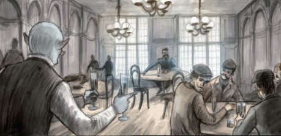

Ne všichni zločinci využívají k vlastnímu obohacení násilí nebo utajení. Někteří si vystačí jen s obratnými řečmi a využíváním důvěry druhých, aby jim ti sami dobrovolně a nezřídka s úsměvem peníze přinesli. Zločinci, kteří se na podfuky specializují, jsou známi jako „**podfukáři“** a jsou (nezřídka sami sebou) považováni za šlechtu mezi kriminálníky.

Cílem všech podfukářů jsou majetní lidé, kteří jsou ideálně nečestní, chamtiví a důvěřiví. Kriminálníci takovým lidem říkají „**kavky**“. Velká část podfuků závisí na ochotě kavky porušit pravidla (jako podvádět při sázení nebo defraudaci), aby získali pro sebe dost peněz a zisku. Obvyklé rčení říká, že „nelze podvést čestného člověka“.

Podfuky jsou také zaměřené na chamtivé lidi, kteří chtějí něco za nic... a výměnou přijdou o to, co mají, a nedostanou nic.

## Známí podfukáři

Přestože podfukáři a švindlíři vyskytovali vždy a všude, v 19. století byla veřejnost přesvědčena, že jde o unikátně americkou záležitost (pravděpodobně pro zprávy o amerických podfukářích, které se objevovaly v britském tisku). Navzdory tomuto předpokladu přímo v Londýně sídlí mnoho zkušených podfukářů, kteří jsou schopni sladkými řečmi přesvědčit královnu, aby jim darovala poslední státní peníze, a ještě jim za to privilegium udělila šlechtický titul.

-   _Sarah Walkerová_ – Mladá dívka, která je ozdobou každého večírku, na kterém se objeví. Rozdává úsměvy na všechny strany, ale ve skutečnosti pracuje, protože Sarah je jednou z nejzkušenějších podfukářů ve městě. Má dobrý morální kompas a bere jen těm, kteří mají příliš mnoho, ale jakmile se jednou zakousne, dovede podfuk do zdárného konce.
    
-   _Wendell Connor_ – Wendell dovedl k dokonalosti unikátní schopnost být absolutně průměrný. Jeho vzhled, gesta, výraz, hlas... všechno na něm je natolik průměrné a zapomenutelné, že žádná z kavek, kterou oškubal, ještě nebyla schopná dát jeho popis policii. Wendell, na rozdíl od ostatních podfukářů, nemá vlastní skupinu. Dává dohromady tým pokaždé specificky na každý dlouhý podfuk.
    
-   _hrabě Rex Black –_ Rex je dokonalý gentleman, elegantní, charismatický a ohleduplný. Jeho dokonalý oblek bez poskvrnky je vždy dle poslední módy a jeho úsměv je snem žen i mužů. Zatímco je veškerá pozornost soustředěna na něj, je pro Minu a Rufuse, další členy jeho podfukářské skupiny, snadné proplížit se tam, kam potřebují, vybrat kapsy nebo něco ukrást. ‚Hrabě‘ je navzdory svým tvrzením stejně obyčejný jako bláto u cesty, dokáže se ale pohybovat v nejvyšší společnosti bez jediné chybičky a padne mu jako ulitá.
    
## Krátký podfuk

Je to rychlý švindl, který často zabere jen několik minut, nebo i jen sekund. Obvykle je zaměřen na krádež peněz, které u sebe cíl má, za pomoci záměny, podvodu nebo klamu. 

### Příklady

#### Housle

Mnoho dobrých podfuků jsou závislé na chamtivosti a ‚Housle‘ jsou toho klasickým příkladem. Vyžadují dvojici podfukářů a odehrává se v restauraci. Jeden z podfukářů představuje staršího muže v ošuntělých šatech, na kterého přišly těžké časy, který jí svou večeři. Když dostane účet, zajde za majitelem podniku a vysvětlí, že si zapomněl peněženku na hotelu a do zástavy dá majiteli své staré housle a vysvětlí, že je cestující hudebník a housle jsou jeho jediný zdroj příjmu.

Poté, co odejde, druhý z podfukářů požádá, aby se mohl na housle podívat, protože je obchodníkem s hudebninami. Poté nadšeně řekne, že jde o vzácný nástroj, za který by byl ochoten zaplatit stovky liber. Protože je ale ve spěchu, nechá svou navštívenku a požádá majitele, aby ji předal starému muži. Ten se po chvíáli vrátí a zaplatí svůj oběd. Pokud byl podfuk představen správně, bude nyní majitel podniku chtít vydělat stovky liber a odkoupí od starého muže za nižší, ale i tak podstatnou sumu. Starý muž se zdráhá, ale nakonec si odnese několik desítek liber, aby se později ukázalo, že navštívenka je falešná a housle nejlevnější na trhu za několik šilinků. Tou dobou jsou už oba podfukáři daleko.

Varianty tohoto podfuku lze odehrát i se starými hodinkami, drahokamovým náhrdelníkem nebo i dalšími předměty, jejichž skutečnou cenu může odhadnout pouze expert (který je příhodně přítomen).

#### Jezevec

Nejčastěji používaná verze podfuku spočívá v tom, že pohledá dívka osloví ženatého, ale očividně zámožného, muže a odvede si jej do pokoje za účelem sexu. Tam se oba obnaží, ale než může k čemukoli dojít... do pokoje vtrhne žárlivý manžel ženy a rozzlobeně požaduje peníze, jinak hrozí buď zveřejněním aféry a zničením mužova dobrého jména, případně fyzickým násilím, pokud záletný manžel nesvolí a nezaplatí mu. Oba poté zmizí a záletný manžel se snaží na všechno zapomenout, přičemž rozhodně nepůjde na policii, protože se bojí skandálu. Ve skutečnosti byl samozřejmě cíleně zatažen do podfuku dvojicí sehraných podfukářů.

Existuje mnoho variant na tento podfuk, většinou zaměřené na soukromé aktivity, které jsou spojeny s legálním postihem (třeba homosexualita, která je v této době stále trestná) nebo sociálním stigmatem (různé sexuální fetiše).

## Dlouhý podfuk

Jde o podfuky, které vyžadují rozsáhlou přípravu, plánování a uskuteční se během delší doby – občas jde o týdny, občas měsíce. Vyžadují nezřídka celý tým podfukářů, rekvizity, lokace, dokonce komparzisty, kostýmy nebo scénáře s připravenými texty. Narozdíl od krátkého podfuku vyžadují pomalé lákání cíle do podfuku a přesvědčování, výsledkem ale mohou být významné sumy peněz. Pokud je podfuk připraven dobře, kavka může vybrat všechny peníze ze svých bankovních účtů a půjčit si peníze od přátel a rodiny... aby o ně vzápětí přišel a obohatil podfukáře.

Vyžadují mnohem více kontaktu s kavkou a hrozí u nich větší riziko prozrazení a neúspěchu, pokud nejsou dobře připravené a provedené. Často jsou považovány za vrchol umění podfukáře a většinou je provádějí spíše starší a zkušenější kriminálníci, zatímco krátké podfuky sedí mladším a nezkušeným podfukářům.

### Role v podfuku

-   **informátor** - Podfukáři potřebují přesné informace a potřebují najít _kavku_, cíl svého podfuku. Potřebují někoho bohatého a nepříliš chytrého, který je chamtivý a hladový po penězích a oni jsou připraveni těchto vlastností využít. Proto podfukářské skupiny mají ve svém okolí často nějakého informátora, který je informuje o možných cílech.
    -   _Raymond Isaac Lewis_ – Tento nudně ale přesto docela příjemně vypadající mužík pracuje jako _concierge_ (zaměstnanec hotelu, který plní přání hostů a obstarává jim co potřebují) pro Langham hotel. Pro hosty ochotně zařídí, co potřebují a sežene vše, o co si jen řeknou... ale stejně ochoten je za úplatu informovat podfukáře, pokud se ve městě objeví nějaká bohatá kavka, zralá na oškubání. Úplatky financuje svoje sázky na dostihy.
    -   _Ethelyn Sweet_ – Tanečnice a profesionální společnice pro bohaté gentlemany, která je vyhlášená po celém nočním Londýně. Má přehled o všech bohatých gentlemanech, kteří se zrovna ve městě pohybují a neváhá za finanční obnos předhodit ty hloupější nebo ty, kteří se k ní nezachovali nejlépe, na pospas podfukářům.
-   **lanař** – Je to člen týmu, který naváže kontakt s kavkou a občas také identifikuje cíle. Vměstná se do života kavky, stane se jeho přítelem a informuje jej o úžasné příležitosti investovat a snadno a rychle vydělat neuvěřitelné bohatství. Lanař je často starší, zdánlivě bohatý muž nebo pohledná dívka – což představuje to, co se kavka snaží dosáhnout. Bohatství a pozornost krásných žen.
-   **muž uvnitř** – Osoba, která naváže kontakt (představena lanařem) a provede podfuk sám.
-   **fixer** - Pro dlouhý podvod je často třeba mnoho rekvizit – falešné dokumenty, falešné peníze, drahé oblečení, domy které podfukáři mohou vydávat za své, páčidla, dynamit, slona ze zoologické zahrady... cokoli je třeba. To vše dokáže zajistit, vyrobit nebo sehnat fixer, případně zná někoho, kdo to dokáže. Občas bývá fixer přímo členem skupiny, ale pokud ne, musí se občas obrátit na externího fixera.
    -   _Harriet O’Neill_ – Zrzavá a pihovatá Irka byla jednou z nejzkušenějších zlodějek a kasařek v celém Londýně, navzdory svému mladistvému vzhledu. Při jedné ze svých odvážných loupeží ji ale srazil splašený kůň a pochroumal jí nohu. Kvůli tomu kulhá a musí se opírat o hůl, stále ale využívá své schopnosti a kontakty jako fixer pro ostatní podfukářské skupiny. Říká se o ní, že dokáže sehnat a zařídit cokoli, včetně pozvánky na královský dvůr.
    -   _Archibald ‚Archie‘ Simmons_ – Archie je buď trpaslík, nebo velice malý člověk. Nikdo se nikdy nezeptal, protože má velice krátký doutnák a exploduje při sebemenší zámince. Občas doslova, protože má doma slušné zásoby černého střelného prachu. Archi je popudlivý a nabroušený, ale schopný fixer, který zajistí, co je potřeba.
-   **muž venku** – Hraje role mimo podfuk a představuje někoho zvenku, kdo může fungovat jako hrozba, falešný policista, další investor a podobně. Občas dubluje jako fixer.
-   **financování podfuku** - Dlouhé podfuky často vyžadují náročnou přípravu, rekvizity a peníze celou věc rozjet. Navíc podfukáři musí něco jíst, než dostanou zaplaceno. Občas to vstupní peníze pokryjí úspory nebo sérií krátkých podfuků, často ale sáhnou i po vnějším financování podfuku.
    -   _Bartholomew Chapman_ – Navzdory otylému vzhledu a e to uznávaný bankéř, jehož specialitou jsou „rizikové investice“ a mezi ně patří i financování nelegálních operací, které mu mohou přinést rychlý zisk. Je ochoten poskytnout podfukářům peníze na přípravu dlouhého podfuku výmenou za třetinový podíl zisku, jedná ale jen s lidmi, které zná, nebo za které se někdo zaručí.
    -   ‚_Žralok‘ Johnson_ – Jde o dost nesympatické a nepříjemné individuum, které se živí lichvou a vymáhá ji nesmyslným násilím. Je ochoten poskytnout krátkodobě peníze na jakoukoli činnost legální i nelegální (tedy i podfuky), ale požaduje 200% návrat do týdne a pokud nedostane své peníze zpět, případně chybí i jen několik pencí, jeho společníci a on jsou známí přerážením nohou, útoky na blízké i podřezáním dlužníkova krku. Podfukáři využívají jeho služeb jen když nemají na výběr.
    
### Příklady

#### Španělský vězeň

Je to klasický dlouhý podfuk, který se v různých obměnách objevuje už od začátku 19. století. V základní podobě podfukář přesvědčí kavku o existenci bohatého šlechtice, který byl pod falešným jménem uvězněn ve Španělsku. Nemá tak přístup ke svým rozsáhlým zdrojům a majetku. Pak kavku přesvědčí, že pokud dá podfukáři peníze, pak on podplatí španělské úřady a až bude šlechtic na svobodě, vše mu troj nebo i vícenásobně splatí. Občas podfukáři přihodí i odměnu v podobě sňatku s šlechticovou krásnou dcerou. Jakmile kavka předá podfukáři peníze, je informován, že nastaly problémy a více peněz je potřeba. Občas může podfukář natahovat celý podfuk i roky, pokud je obratný. Jinak se podfuk většinou zakončí tím, že šlechtic v zajetí zemřel nebo byl podfukář zatčen ve Španělsku pro pokus o uplacení úřadů – tak jako tak si kavka myslí, že investice nevyšla, nikoli, že byl okraden... a podfukář právě zmizel se značnou sumou a nikdo po něm nepátrá.

#### Drát

Tento podfuk zpravidla vyžaduje hodně lidí a zdrojů, aby se povedl, proto se málokdy dělá. Pokud se ale povede, bývá docela lukrativní. Vyžaduje, aby podfukáři otevřeli celou falešnou sázkovou kancelář. Poté je třeba přesvědčit majetnou kavku, že mají informace z dostihů, které se předávají telegramem, mnohem dříve než všichni ostatní (třeba, že mají svého člověka v telegrafním úřadě, který odesílání výsledků zpozdí). Tím pádem kavka uvěří, že jeho sázky nejsou hazard, ale sází na jistotu, protože již zná výsledek dostihu. Podfukáři s ním zkusí několik testovacích sázek ve falešné sázkové kanceláři a vše jede jako na drátkách... což přesvědčí kavku, aby vybral své úspory a vsadil vše na jeden závod. Ve chvíli, kdy mají podfukáři peníze v ruce, zahrají vše na nějaké nedorozumění ohledně vítěze dostihu a závod (který se samozřejmě nikdy neběžel) vyhraje jiný fiktivní kůň. Podfukáři zmizí s penězi, a protože kavka v zásadě podváděla při sázení, nemůže jít na policii.

## Závěr

Svět podfukářů, gentlemanů mezi kriminálníky, je atraktivní a lákavý na hraní – postavy do něj mohou nahlédnout ať již skrze vyzkoušení těchto rolí, případně se podfukáři mohou objevit ve vašich hrách. Podfuky být zaměřené přímo na vaše postavy, případně mohou ovlivnit vaše známé a blízké. Průběh těchto podfuků představuje neustálé balancování na hraně nože, hra na kočku a myš, kde hrozba odhalení je stále přítomná.
