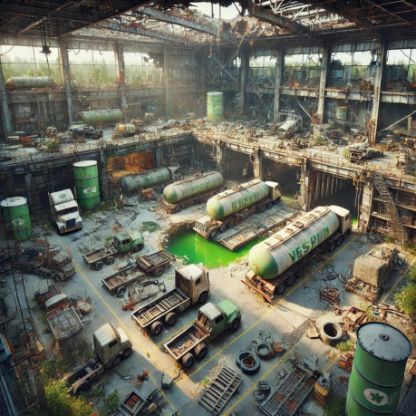

[www.stimpack.cz](http://www.stimpack.cz)

## Příběh na pozadí

Klan úskočných nájezdníků z pustin **Pouštní krysy** naplánovali výměnu zajatce \- dezertéra s militaristickou autoritou **Konfederace** za cenné zdroje. Obě strany si nedůvěřují a chtějí z dané situace získat co nejvíce s co nejmenšími ztrátami. Výměna má proběhnout v troskách opravny nákladních vozů, kde se skrývají ale i další obyvatelé.

#### \[T1\] Jak se postavy o výměně dozvěděli? (K4)

1. Žoldáci: Jedna z frakcí si najala postavy jako prostředníky, support, nebo zálohu. Konfederace slibuje kredity, Pouštní krysy výhodné konexe do pustin.  
2. Průzkum: Postavy objekt prozkoumávají čistě náhodou, nebo za jiným účelem a do výměny se připletou náhodou.  
3. Odměna: Na zajatce je vypsaná odměna, kterou se postavám podařilo dešifrovat z konfederační frekvence, či sítě.  
4. Záchrana: Zajatec je ve skutečnosti zpřátelený známý jedné, nebo více postav. Proto se ho snaží bez úhony získat. 

## Lokace

U staré zničené silnice stojí zchátralá opravna nákladních vozů, které kdysi přepravovaly vysoce toxický a výbušný plyn vespin. Nyní je to nebezpečné místo plné rozpadlých strojů, zrezivělých nádrží, a nestabilních konstrukcí a radiace. Zvenku je hala obklopena rozbitým potrubím, ruinami menších staveb a pustinou porostlou trsy suché trávy která přechází až do písčitých dun.

### Hlavní servisní prostor

Největší část celého komplexu, do kterého vedou čtyři vrata pro vjezd náklaďáků. Dále pak dvoje servisní dveře. Většina průchodů je zablokovaných, ale vnější obal budovy je v tak dezolátním stavu, že nabízí řadu nových průchodů v podobě trhlin.

Uvnitř jsou opravářské stanoviště s rozbitými zvedáky, cisternovými náklaďáky a zbytky náhradních dílů. Část střechy je zřícená, což umožňuje vnikání světla a písku dovnitř.

Úroveň radiace v hale se pohybuje od nulové po střední. Se správným vybavením se snadno pohybovat v čistých oblastech.

Místnost nabízí mnoho trosek a harampádí, které mohou poskytnout taktickou výhodu. Dále například i zvedací háky, úzké podzemní průchody servisních stanovišť, cí uvolněné části konstrukcí.

V jednom z rohů místností je ještě zachovalá bomba vespinu. V této části je střední radiace a pukliny v zemi, které vedou do *Podzemního doupěte*.

Z hlavního servisního prostoru se dá ještě dostat do vedlejších místností v přízemí, na schodiště vedoucí k vedlejším místnostem v patře.

### Vedlejší místnosti \- přízemí

Tři místnosti v přízemí, které dříve sloužily jako sklad dílů, materiálu a vybavení. Většina je nepoužitelná a v rozkladu. Několik dílů se dá využít na menší či improvizované opravy vozidel.

V jednom ze skladů je bordelem zaházený robustní robot sloužící ke zvedání náklaďáků a nakládání objemného nákladu. Na obalu má namalované jméno **RUSTY**. Elektrotechnicky zdatný jedinec jej může uvést za pomocí elektročlánku a pár náhradních dílů do hodiny do provozu.

### Vedlejší místnosti \- první patro

Čtyři menší místnosti, které jsou dostupné z vratkého ochozu v prvním patře.

Jde o převážně zničené kanceláře, které sále nesou stopy původních pracovníků. Místnosti mohou sloužit jako případné úkryty a většinou v nich není nic zajímavého. Jednou výjimkou je zapadlá lékárnička v jedné z místností obsahující *medkit* a *stimpack*. Druhou výjimkou je tajný úkryt v další z místností.

#### Tajný úkryt

V jedné z kanceláří je falešná koncová stěna, za kterou má úkryt **obchodník Kael.** Skrývá se zde a případně pozoruje nenápadně výměnu. Až bude vzduch čistý, půjde obrat mrvé. V úkrytu je trocha z Kaelova zboží \- několik zbrojí či taktických vest, trvanlivý proviant, lehké palné zbraně.

### Podzemní doupě

V puklinách pod úrovní země je doupě **Trhače**, obrovského a smrtelně nebezpečného zmutovaného škorpiona. Pokud není venku na lovu, tak zde spí a odpočívá, pokud ho tedy nevyruší nějaký nezvaný host. Doupě je škorpionovi docela těsné, a tak na větší akce rovnou vyskočí do *hlavního servisního prostoru*. Navíc v doupěti je plošně střední radiace.

V doupěti je mimo hromadu kostí a ostatků možné najít zbytky výbavy nešťastníků, někdy i v docela dobrém stavu. Mezi pozůstatky může být: plazmová puška, krabička se sadou bojových drog, několik velkých sekáčků a mlatů, okovaný kyrys, vespinová bomba.

## Zúčastněné strany

Do haly dorazí dvě znepřátelené frakce s nervama na pochodu. Pouštní krysy chtějí zajatce prodat Konfederaci za zboží. Obě strany ale pochybuju, že druhá frakce dodrží podmínky výměny.

### Konfederační vojáci 

Autokratická militaristická skupina „osvoboditelů“, kteří pod rouškou ochrany zavádějí novodobé otrokářské praktiky a snaží se osvobodit celou pustinu.  
*Tajné zálohy* \- Konfederace nájezdníkům nevěří. Vojáci mají proto nachystanou záložní jednotku nedaleko opravního komplexu. 

#### NPC

#### Kaplan Victor Graves (♂,45)

**Role:** Velitel konfederační jednotky, charismatický, ale brutální.  
**Osobnost:** Bezohledný pragmatik, věří v "řád za každou cenu". Má schopnost manipulovat lidmi, často se snaží přesvědčit ostatní o morálnosti otrokářského systému, který podporuje.  
**Motivace:** Chce zajatce získat a použít ho jako symbolické varování pro další dezertéry.

#### Poručík Mara Feldmanová (♀,29)

**Role:** Druhá ve velení, loajální, ale s jistými pochybnostmi o metodách Konfederace.  
**Osobnost:** Taktická mysl, klidná, preferuje vyjednávání. Může být otevřená diskusi, pokud uvidí zajímavou alternativu.  
**Motivace:** Snaží se minimalizovat ztráty na životech, i když to znamená odporovat Gravesovým rozkazům.

#### Seržant Carl "Čistič" Bryant (♂,31)

**Role:** Tvrdý voják, který se specializuje na likvidaci nepřátel a boj v zamořených oblastech.  
**Osobnost:** Krutý, bez zájmu o morálku. Miluje chaos a je zodpovědný za některé z největších masakrů v oblasti.  
**Motivace:** Chce "čistou operaci", což pro něj znamená zbavit se všech přítomných, zejména Pouštních krys.

#### \[T2\] Zboží na výměnu (K4)

1. Solární generátor: Přenosná souprava pro generování el. energie a nabíjení elektročlánků.   
2. Lékařské zásoby: Bedna s 12ti stimpacky, 4 medikitama a ochranou před radiací.   
3. Munice: 4 bedny projektilové munice do ručních zbraní a pušek.  
4. Zásoby: 4 bedny trvanlivých zásob a 4 kanystry s vodou.

### Pouštní krysy

Kmen nájezdníků, kteří jsou mistři přežití v pustině. Jsou tvrdí, mazaní a proslulí svou schopností rychle vybudovat zákopy a obranné linie.  
*Tajně pasti* \- Nájezdníci konfederaci nevěří. Na místě si proto před střetnutím nachystali skryté zákeřné pasti.   
*Zajatec* \- Nájezdníci se pokusí vyměnit s konfederací zajatce, po kterém vojáci tolik touží. Zajatec jménem **Ethan Rowe** je spoutaný provazy a na hlavě látkový pytel.

#### NPC

#### Náčelnice Kala „Písečná liška“ (♀,39)

**Role:** Velitelka Pouštních krys, známá svou schopností rychle adaptovat taktiku.  
**Osobnost:** Chytrá, vypočítavá, velmi ochranářská vůči svému lidu. Působí jako matka kmene, ale její klidná tvář skrývá nemilosrdné instinkty.  
**Motivace:** Chce obchod dotáhnout do konce, aby zajistila zásoby pro svůj kmen. Je však připravena na zradu.

#### Lovec Torrik „Břit“ (♂,24)

**Role:** Průzkumník a ostrostřelec, který nesnáší Konfederační vojáky.  
**Osobnost:** Impulzivní a agresivní, nedůvěřuje nikomu. S velkým potěšením spustí střelbu, pokud má pocit, že jednání nejdou správným směrem. Libuje si na lidském mase.  
**Motivace:** Chce zabít zajatce a poslat jasné poselství, že Pouštní krysy si nikdo nechce zahrávat.

#### Diva „Železná“ (♀,27)

**Role:** Mechanik a vynálezce, která udržuje Pouštní krysy naživu skrze své improvizace.  
**Osobnost:** Praktická a cynická. Nepouští se do boje, pokud to není nutné, ale ráda vymýšlí pasti a obranné mechanismy. Skrytá sadistka.  
**Motivace:** Chce opravit některé stroje v hale, aby je mohla kmen využít.

#### \[T3\] Zajatec (K4)

1. Pisonik \- Rebelující psionik, který se snaží před Konfederací prchat jak jen to jde. Nutná převýchova v konfederačním zařízení.  
2. Dezertér: Důstojník, který se pokusil zběhnout k nepříteli \- Alianci. Příliš cenný, než aby na něm profitoval nepřítel.  
3. Mutant: Civilista u kterého se vyskytla vzácná mutace, která zvyšuje odolnost na radiaci. V laboratoři by měli radost.  
4. Cenný zdroj: Vědec pracující na biochemickém poli. Takovato kapacita by se pod ochranou konfederace měla dobře.

### Neutrální zúčastnění

Mimo konflikt výměny se v hale vyskytují i další obyvatelé.

#### RUSTY

**Role:** Starý nákladní robot, který stále funguje, i když má poruchy.  
**Osobnost:** Sarkastický a lehce pomatený, má databázi původních zaměstnanců haly a dokáže detekovat radiaci.  
**Motivace:** Chce, aby byla hala opravena a vrátila se do provozu.  
RUSTY je nákladní robot, který má k torsu připevněné dva pohonné pásy. Dále je vybaven dvěma velkýma zdvihacíma pažema a dvěma drobnýma pažema na jemnější úkony, 

#### Obchodník Kael

**Role:** Obchodník, který se ukryl v nadzemním patře haly a snaží se vydělat na situaci.  
**Osobnost:** Zbabělý ale pragmatický, s dobrým smyslem pro byznys. Využívá Trhačovo schopností zlikvidovat nepřátele.  
**Motivace:** Zisk a přežití. Pokud dojde k šarvátce, tak z padlých jedinců získat co nejvíce zásob a vybavení, než se dostanou na jídelníček **Trhače**.   
Kael je jen lehce ozbrojen, má u sebe navíc ale “*Plechovku kostí*” \- kterou když zarachtá, tak je 50% šance že **Trhač** splní jeho příkaz.

#### Trhač

Obrovský radiací a vespinem zmutovaný škorpion, který rád roztrhá vše co se mu připlete do klepet. Jeho jed je smrtící, ale v prvních fázi jen paralyzuje. Jeho klepeta jsou velká i ostrá, že na pár cvaknutí přepůlí náklaďák. 

## Vývoj událostí

Hlavní směr střetnutí je výměna zajatce za zboží. Pokud se nic nezvrtne je opravdu možné, že výměna proběhne hladce.

Pokud postavy nezasáhnou můžete výsledek určit hodem na ověření “klidné hlavy” na obou stranách. V případě komplikací můžete hod opakovat.

Pokud postavy zasáhnou, tak už je na konkrétních situacích, jak to vše může dopadnout. 

#### \[T4\] Možné zvraty (K8) \- hoď jednou, či vícekrát

1. Né tak rychle: Konfederace zboží nevzala na předávku, namísto toho si ho schovala nedaleko v ruinách dokud nebudou mít důkaz o zajatcovi.  
2. Nejdřív prachy: Nájezdníci nevzali zajatce na předávku, namísto toho ho ukryly nedaleko v poušti dokud neuvidí zboží.  
3. Podvod: Zajatec ve skutečnosti není ten koho Konfederace chce, je to bezvýznamný unesený civilista.  
4. Expirace: Zajatec je bohužel už mrtvý. Naštestí u sebe má holodisk s důležitými informacemi.  
5. Přepadení: Jiný kmen nájezdníků se dozvěděl o výměně a podnikl nájezd na komplex.  
6. Cvak-Cvak: Thač byl probuzen probíhajícím jednáním v hlavních prostorách a má hlad\!  
7. Prasklé nevry: Jeden z členů Konfederace nebo Pouštních krys už to nevydržel a vypálil po nepříteli ze své zbraně.  
8. Pád konstrukce: Některá z konstrukcí v hlavním servisním prostoru to nevydržela a řítí se dolů.

#### \[T5\] Příchod postav (K6)

1. Před přípravami: Postavy dorazí na místo před oběma frakcemi. Mohou ho prozkoumat, nastražit pasti, nebo připravit výhodnou pozici pro konflikt či jednání.  
2. Během příprav: Obě frakce se teprve usazují, rozestavují hlídky a kontrolují okolí.   
3. Právě včas: Frakce jsou již na místě a začínají vyjednávat. Postavy přijdou v momentě, kdy je situace napjatá, ale konflikt ještě nezačal.   
4. Uprostřed vyjednávání: Jednání je v plném proudu a obě strany si navzájem nedůvěřují. Jakýkoli zásah postav může situaci buď uklidnit, nebo okamžitě eskalovat.  
5. V momentě zvratu: Jedna z frakcí se snaží podfouknout druhou, nebo jiný zvrat z T4. Postavy mohou využít chaosu.  
6. Po vyostření: Postavy dorazí pozdě, když už se věci vymkly kontrole – výbuchy, toxiny či snad mrtvoly jsou všude kolem? Přeživší z obou frakcí jsou zmatení, zranění. Boji se není možné vyhnout.

## A co dál?

Odehráli jste tento encounter? Máte návrhy na vylepšení? Nebo byste si jej chtěli zahrát? Své nápady a dojmy za­sí­lejte na get@stimpack.cz.
