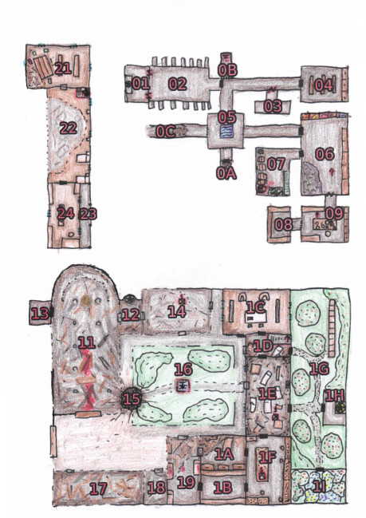

## Čo sa tu skutočne stalo

Píše sa rok 1925 a ruiny kláštora svätého Ambróza stoja nedotknuté na kopci neďaleko Horných Kopaníc. Ešte donedávna boli centrom poznania v tejto oblasti, no v roku 1917 došlo k obrovskej explózií, ktorá tento kláštor zmenila v trosky.

Kláštor bol postavený zhruba v štrnástom storočí a bol zasvätený svätému Ambrózovi z Milána, patrónovi včiel. Jeho zameraním mal byť výzkum agrikultúry, najmä meteorológie a včelárstva. Kláštor bol vytvorený ako opevnený dvorec, schopný odolať prípadným nepriateľským útokom. Aj preto bol v šestnástom a sedemnástom storočí použitý ako pevnosť proti osmanským nájazdom, kde sa mohlo schovať lokálne obyvateľstvo. V tejto dobe bol vytvorený aj veľký gasthaus a špitál.

{:.sticky}

V najbližších rokoch začal kláštor strácať na význame a upadať. Na konci devätnásteho storočia tu žila už iba hrstka postarších mníchov a omše sem chodil slúžiť kňaz z dediny. Počas veľkej vojny Habsburgovia rozhodli, že toto miesto využijú ako poľnú nemocnicu. Rozsiahle podzemné priestory sa začali využívať ako muničný sklad. Materiál sem vozili neďalekou železnicou.

Za explóziou stojí francúzsky špión slovenského pôvodu, ktorému francúzsky prezident prisľúbil pardón v prípade, že sa mu podarí zničiť tento kláštor. Ten sa sem infliltroval ako novic, pripravil v podzemí rozbušky a ušiel. Tou dobou už mu boli jeho bratia mnísi v pätách, avšak explózia zahladila všetky stopy vrátane glejtu o amnestií. Slavo Bubenčík dodnes žije v Kopaniciach a pracuje ako predák na miestnej píle.

Na udalosti si môžu spomínať ľudia z obce. Výbuch otriasol celou dedinou až popraskali niektoré okná a rozozvučal sa zvon v dedinskom kostole. Nasledoval rachot padajúcich budov a kusy kamenia vraj prileteli až do dediny. Ľudia ihneď utekali zachraňovať čo sa dalo. Po explózií odtiaľto odviezli niekoľko preživších (napríklad Ethel Baloghovú), no kňaz potocký zakázal vstupovať na miesto, ak nešlo o záchranu životov. Stále sa ozývali výbuchy z podzemia a rúcali sa steny. O dva dni miesto dorazil inšpektor z prešporka, ktorý spolu so žandármi a ženistami miesto preskúmal. Celá operácia trvala len necelú hodinu. Žandári naložili telá mŕtvych na voz a odviezli na cintorín v Horných Kopaniciach. Neďaleko inšpektora vybuchla bomba až ho hlina zasiahla do tváre. Zamával svojimi lejstrami a uzavrel celú udalosť ako nehodu. Oblasť je už roky pod Habsburgskou plombou so zákazom vstupu. Ženijne oddiely ju už dávno mohli v rámci povojnových opráv vyčistiť a odmínovať, no zdá sa, že sa na kláštor počas zmeny garnitúry jednoducho zabudlo.

## Dispozícia

Dodnes je miesto posypané zmesou sutín a výbušnín, ktoré sú nestabilné a kedykoľvek môžu spôsobiť nehodu a tak sem nikto nechodí.

Kláštor stojí na kopci posiatom lúčnymi bylinami. Všade bzučia zdivočelé včely, ktoré prelietajú z kvetu na kvet vždy pripravené chrániť svoje úle. Zdá sa, že západná časť bola kompletne zrovnaná so zemou. Východné, úžitkové, krídlo odolalo explóziám lepšie, zdá sa, že tu stojí aj časť poschodia. Steny sú poborené, no interiér by možno mohol byť zachovalý.

Na mieste brány je spráchnivená závora na ktorej je nalepený cisársky výnos o zákaze vstupu na toto nebezpečné miesto pod hrozbou újmy na zdraví i živote. Vstúpiť je možné aj priamo cez zdemolované steny stavieb v západnej časti.

Na nádvorí je obrovský kráter a zvlnená zem vypovedá o nenávratne zasypaných podzemných priestoroch, ktoré zničili sekundárne explózie.

## 🐝 Včely:

Väčšina priestorov je zvonka dostupná pre včely. Ak sa postavy niekde zdržia dlhšie ako jednu zmenu (15 min.), hoď d6 a ak padne 1, uštipnú včely náhodnú postavu. Ak sú v skupine postavy, ktoré zabili včelu, vyber náhodne jednu z nich. Kliatba sa dá zrušiť v kaplnke spálením byliniek. Recept ktorý používajú mnísi obsahuje šalviu, levandulu a tymián. Môže sa to javiť ako kliatba, no sú to iba včelie feromóny a prirodzený repelent, čo prekryje ich pach.

## 🐻 Medvedica:

Po areáli sa pohybuje medvedica s dvomi mláďatami. Má prístup do všetkých miestností bez dverí. Pri návšteve takejto lokácie hoď d6 a na 1 sa tam potuluje. Štandardne sa však snaží dostať do pivnice v kuchyni. Medvedici je potrebné utiecť, zahnať ju, alebo odlákať. Ona sa bude snažiť postavy zahnať, avšak ak na ňu nezaútočia a nebudú sa približovať k medvieďatám, nebude agresívna. Medvieďatá sú ešte ťarbavé, dôverčivé a hravé. Ich matka ich však bude chrániť s hrozivou zúrivosťou. Aj ju deti zaženú časom sa vráti a skúsi sa do kláštora dostať z iného smeru. Cíti, že tam je niekde jedlo a med.

Pri stretnutí hoď d6 aby si zistil ktoré medvede sú prítomné:

1.  Medvedica a obe medvieďatá
2.  Medvedica a jedno mláďa
3.  Iba medvedica
4.  Obe mláďatá
5.  Jedno mláďa
6.  Hoď znova, ale niektorý z medveďov potrebuje pomoc

## 💣 Explózia:

Niektoré miestnosti explózia úplne zničila. Sú pokryté sutinami a stále obsahujú roztrúsené výbušniny spolu s fulminátom ortuťnatým, ten sa používal ako rozbuška a časom deterioruje a stáva sa stále viac nestabilným. Ak sa postavy budú prehrabávať sutinami, za každú akciu alebo zmenu práce musia postavy uspieť vo vhodnej skúške, inak hoď d6.

- 0-4: zosun sutín, strata stability, zasyčanie rozbušky je varovaním pred hlúpymi aktivitami.
- 5: Zosun sutín alebo pád spôsobol postave ľahké zranenie.
- 6: Výbuch fulminátu spôsobil postave ťažké zranenie. Napríklad stratu prsta či oka! Prispôsob následky vášmu štýlu hrania, no pamätaj, že v tomto prípade by mali byť dlhodobým mementom pre celú skupinu.

V sutinách po výbuchu je možné nájsť kde tu zavalenú ruku, nohu, či možno aj celého kostlivca. Je dobré občas otestovať aké nervy a žalúdok majú postavy!

## 📖 Dokumenty:

- **Denník mnícha** popisuje posledné dni pred explóziou. Má podozrenie, že je tu špión. Tiež píše, že zabil omylom včelu a tak šiel vymeniť do kaplnky obetiny (levandula, šalvia, tymián) a pomodliť sa k svätcovi. Nachádza sa v nočnom stolíku hore v dormitóriu. Denník spomína nedávnu hlasnú hádky medzi kňazom a vrchnou sestrou Baloghovou, keď sa snažil dať posledné pomazanie pacientovi, ktorého chcela zachrániť. Pretože sa znova vráti až v nedeľu na omšu.
- **Mapa kláštora**, ktorá popisuje aj skryté miestnosti, ale neurčuje ako sa do nich dostať. Nachádza sa skrytá v skriptóriu
- **Životopis sv. Ambróza**, ktorý popisuje život ambróza a jeho aspekty. Nachádza sa v knižnici. (V tomto prípade ušetrime miesto a daj hráčom prečítať jeho stránku na wikipédií: [https://en.m.wikipedia.org/wiki/Ambrose](https://en.m.wikipedia.org/wiki/Ambrose))
- **Záznam vstupov** cudzincov do kláštora. Na zozname sa objavujú mená kňaza Potockého a Ethel Baloghovej, pričom obaja majú v deň výbuchu odchod. Nachádza sa v skriptóriu. (Konflikt kňaza a Ethel je hookom na zbytok hexcrawlu a je možné ho ignorovať)
- **Potvrdenie o podmienečnej amnestií** v prípade úspešného splnenia misie a zadanie úlohy sabotáž muničného skladu. Potvrdenie je vo francúzštine od Deuxième Bureau. Je vydaný na meno Slavomír B., ktorý bol vo francúzku trestaný za pašeráctvo a účasť na organizovanom zločine. Má ho v ruke zevraždené telo mnícha vo vínnej pivnici. (Opäť sa jedná o väzbu do hexcrawlu kde amnestovaný Slavomír Bubenčík pracuje ako predák na kopanickej píle. Tento príbeh však prekresľuje príbeh modulu a je dobré ho tam nechať)
- **Záznamy počasia** v archíve a tabuľky na výpočet predpovede v tejto oblasti, pri zmene počasia vie postava urobiť skúšku s touto knihou a prehodiť výsledné počasie. Druhý výsledok však platí.
- **Chemická kuchárka** v laboratóriu. Obsahuje hromadu nebezpečných receptov, napríklad na lieky (ópiová tinktúra, iódová tinktúra, aktívne uhlie, extrakt brezovej kôry, tinkyúra ľuľkobca zlomocného), hnojivá či výbušniny (pušný prach, fulminát ortuťnatý, dynamit). Väčšina receptov vyžaduje náročné testy a vhodné vybavenie.

## Prízemie:

- **11, Ruiny kostola**: 💣🐻🐝, Sutiny a popadané steny, stropy, niekoľko stĺpov stojí, bronzový zvon, zničený kríž a výzdoba kostola.
- **12, Vedľajší oltár**: 💣🐻🐝, Sutiny a popadané steny, severná stena stojí, nepoškodený oltár
- **13, Sakristia:** 💣🐝, Sakristia ako zázrakom stojí, strop je čiastočne prepadnutý, dvere sú pevné a je možné ich zavrieť. Liturgické knihy, obradné oblečenie, posvätné nádoby a rekvizity, oltárové tkaniny, sväté oleje, zvončeky, padnuté víno. Všetko čiastočne poškodené prachom a vlhkosťou
- **14, Kapitulná sieň:** 💣🐻🐝, zničenê steny spadnutý strop, zvyšky nábytku, v severovýchodnom rohu zachovalá freska svätého ambróza starajúceho sa o včely, zasypaný poklop do podzemia 09,
- **15, Kráter:** 💣🐻🐝, veľký kráter po výbuchu, zasypaný vstup do podzemia na severovýchode krátera (minimálne pár dní práce)
- **16, Átrium:** 💣🐻🐝, ohradené čkastočne zrúcaným múrikom, husto prerastené krovinami, trsy levandule, zle viditeľný otvor do studne 05,
- **17, a 18, Gasthaus:** 💣🐻🐝, Úplne zrúcaná budova
- **19, Špitál:** 💣🐻🐝, Čiastočne zborená budova, kovové postele, lekárske nástroje, lieky
- **1A, Apatika:** 🐻🐝, Prepadnutý strop, poškodená stena, lekárske nástroje, povliečky, obväzy, lieky, chemikálie
- **1B, Sklad:** Zamknuté dvere, náradie, remeselné nástroje, surové materiály
- **1C, Skriptórium:** 📖, Zamknuté dvere, nedotknutá miestnosť. Pôvodne určená na prepisovanie kníh, neskôr používaná ako čitáreň. Kreslá, stoly, stoličky, olejové lampy, písacie potreby, knihy, mapa kláštora je skrytá v jednej z kníh, záznam o vstupe cudzincov do kláštora.
- **1D, Schodište: 🐻🐝**, prepadnutý strop, schody do 22, postel
- **1E, Kuchyňa:** 🐻🐝, ak sa medvede ešte neobjavili, prehrabujú sa tu sutinami, snažia sa odkryť poklop do pivnice. Na zemi sú porozbíjané kusy nádob a nábytku, miestnosť je zasypaná prepadnutým stropom a posteľami. Kachle, kuchynský drez, zasypaný vstup do pivnice 06,.
- **1F, Manufaktórium**: nedotknutá miestnosť, zamknuté dvere okrem 1A, plne vybavená dieľňa, náradie, ponky, materiály, pod stredným ponkom je skrytý vstup do laboratória 08, zamknutý visacím zámkom.
- **1G, Záhrada: 🐝**, ovocné stromy, prerastené krovinami, v severozápadnom rohu je bylinková záhrada (bazalka, oregano, tymián, rozmarín, ligurček, šalvia, petržlen), v severovýchodnom rohu sú včelie úle a malinčie.
- **1H, Kaplnka:** Kaplnka je v nedotknutom stave, na stenách sú fresky, oproti vstupu stojí socha svätého ambróza a oltár a miskou, ktorá obsahuje popol a sadze. Vedľa misky je krabička zápaliek. Miesto vyžaruje ukľudňujúcu auru.
- **1I, Skleník**: Úplne zarastený, exotické plodiny, rajčiny, papriky, mandarinka. Vodu privádza odkvap. Je ním možné vyliezť na balkón 23,

## Poschodie:

- **21, Knižnica: 🐝📖**, prehnitá podlaha, nebezpečie prepadnutia, zrúcaný juhozápadný roh, náboženská, filozofická a vedecká literatúra, veľká časť poškodená vodou. Niekoľko vzácnych a iluminovaných zväzkov. Životopis svätého Ambróza.
- **22, Dormitórium:** 🐝📖, kompletne prepadnutá podlaha, niekoľko postelí, nebezpečie prepadnutia, v jednom z nočných stolíkov je denník mnícha. Schody do 1D,
- **23, Balkón:** 🐝, meteostanica, teleskop, odkvap do skleníka 1I,
- **24, Astroláb: 📖**, zamknuté dvere, nedotknutá miestnosť, meteorologické záznamy, grafy, tabuľky, hviezdna mapa

## Podzemie:

- **01, Relikviár:** Tajná časť krypty za reliéfom, oltár svätého Ambróza, na oltári je krištáľovom boxe zabalzamovaný prst svätého ambróza. Niekoľko ďalších zlatých relikvií (krížik, čaša s textúrou včiel, prsteň s emblémom včely)
- **02, Krypta:** Po stranách sú výklenky v ktorých spočívajú telá mníchov v rôznych štádiách rozkladu. V strede miestnosti je kostnica s elaborovaným geometrickým vzorom pripomínajúcim úľ, kde šesťuholníkové bunky obsahujú lebky
- **03, Pokladnica:** Tajné dvere možno odhaliť iba ak sú cielene hľadané. Pokladnica obsahuje strieborné šperky, pár kusov zlatých a veľký obnos neplatných ríšskych peňazí
- **04, Archív:** Zamknuté dvere, historické záznamy o chode kláštora, astronomické a meteorologické merania za stovky rokov, matričné a genealogické záznamy dedinčanov.
- **05, Studňa:** 🐝, Okolo hlbokej štvorcovej diery je úzky ochoz, na zemi sú sutiny, ktoré popadali zo stropu a z átria.
- **06, Pivnica:** Hnilé zemiaky, múka, koreňová zelenina, možno použiteľné údeniny a syry. Na juhu sú tajné dvere zakryté dreveným obložením, dvere do 07 sú zamknuté.
- **07, Vínna pivnica:📖,** Omšové víno, pivo, medovina, niektoré sú stále pitné. V jednom zo sudov je schovaná i kostra v mníšskej sutane. Pri dôkladnom preskúmaní je zjavné, že bol zabitý niekoľkými bodnými ranami nožom. Má u seba glejt o amnestií špióna.
- **08, Sklad chemikálií:** 💣, za zamknutou mrežou sa skrývajú rôzne aj nestabilné chemikálie určené k výrobe liekov a výbušnín
- **09, Laboratórium:** 📖, Laboratórna aparatúra, chemikálie, kniha chemických receptov
- **0A, Zasypaná chodba:💣**, Južná časť podzemia je kompletne zasypaná a akýkoľvek pokus o kopanie skončí ďalším zásypom
- **0B, Schodisko:** ústi v kapitulnej sieni 14, treba ho najprv odkryť zhora
- **0C, Zasypaná chodba ku kráteru:** 💣 zásyp je dlhý, práca nebezpečná a sú iné lepšie cesty do podzemia.
